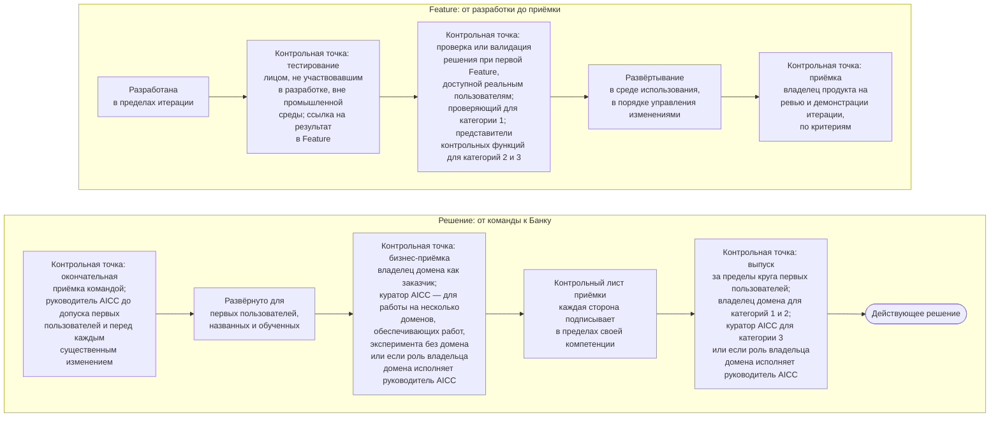

```yaml
source: portal/content/en/delivery/quality-verification-and-release.md
source_sha256: f4638ce7896d8465434e025b8a78c9b69da6c1f33d474e8e4d695a8589ab34ca
translation_status: reviewed
```

# Качество, проверка и выпуск

Качество встраивается в поток поставки, а не контролируется в его конце. Каждую Feature до развёртывания тестирует лицо, не участвовавшее в её разработке; каждое решение до того, как получит доступ к реальным пользователям или данным, проходит проверку или валидацию соразмерно своей категории риска; приёмка проводится на трёх уровнях, каждый раз по записанным критериям; выпуск за пределы круга первых пользователей — отдельное управленческое решение, для которого оформляется подписанный контрольный лист. В этой части контрольные точки описаны по порядку, с объяснением каждой из них.

## 1. Последовательность контрольных точек



Рисунок 1: контрольные точки качества, приёмки и выпуска.

## 2. Контрольные точки: краткое описание

2.1. Каждую Feature, а также MVP, до развёртывания тестирует лицо, не участвовавшее в их разработке, вне промышленной среды; ссылка на результаты тестирования указывается в Feature. Проверка для категории риска 1 и валидация представителями контрольных функций для категорий риска 2 и 3 относятся к решению в целом и проводятся при первой Feature, которая получает доступ к реальным пользователям или данным; для категорий риска 2 и 3 валидация включает тестирование защищённости от атак, характерных для AI. AICC не проводит валидацию собственной работы.

2.2. Приёмка проводится на трёх уровнях, каждый раз по записанным критериям и с указанием, кто и когда её провёл. Владелец продукта принимает каждую Feature и Capability на ревью и демонстрации итерации. Руководитель AICC проводит окончательную приёмку командой до того, как решение будет предоставлено первым пользователям, и перед каждым существенным изменением. Представитель заказчика по приёмке оценивает работающее решение, развёрнутое для первых пользователей: это владелец домена, а для работы на несколько доменов, обеспечивающих работ, эксперимента без домена или если роль владельца домена исполняет руководитель AICC — куратор AICC. На каждый из трёх вопросов отвечает тот, кто вправе на него ответить: делает ли Feature то, что записано; достаточно ли безопасно и полно решение, чтобы предоставить его людям; решает ли оно задачу, с которой обратилось подразделение.

2.3. Развёртывание и выпуск — разные действия. Feature развёртывается в среде использования после тестирования и проверки или валидации в порядке управления изменениями Банка. О выпуске за пределы круга первых пользователей отдельно решает владелец домена для категорий риска 1 и 2, а для категории риска 3 или если роль владельца домена исполняет руководитель AICC — куратор AICC; это управленческое решение принимается после того, как каждая сторона подписала контрольный лист приёмки в пределах своей компетенции. При наличии невыполненного пункта выпуск не допускается. Features движутся в темпе команды, а Банк «включает» ценность в том темпе, в каком принимает управленческие решения.

2.4. Пройти контрольные точки позволяют практики, которые стоят за ними: критерии записываются до начала работы, Features небольшие, интеграция идёт по ходу работы, критерии завершённости включают тестирование, развёртывание и запись, а показатели качества рассматриваются на еженедельном обзоре и на ревью и демонстрации итерации. Неудовлетворительное значение показателя — проблема для Inspect and Adapt, а не повод добавить контрольную точку. Полный состав контрольных точек, а также принятое ограничение, действующее, пока команда невелика, и компенсирующие его контрольные процедуры установлены разделом 7 Модели жизненного цикла решений; кто принимает управленческое решение на каждой контрольной точке, указано в руководстве «Поставка услуг».

## 3. Источник правил

Раздел 7 и пункт 8.3 Модели жизненного цикла решений; раздел 3 Политики применения AI; пункт 4.4 Операционной модели; шаблоны «Контрольный лист приёмки» и «Заключение контрольной функции»; workflow и руководство «Поставка услуг».
