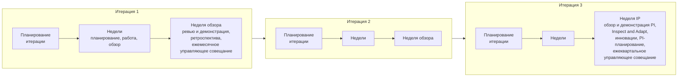

```yaml
source: portal/content/en/delivery/the-cadence.md
source_sha256: 3f521cd63280768280168c99de6dc2b386302f41ff357ba80d1abdf7852587de
translation_status: reviewed
```

# Рабочий цикл: программные инкременты и итерации

Разработка и внедрение идут в фиксированном ритме. Программный инкремент длится один квартал и состоит из трёх итераций, каждая продолжительностью в один календарный месяц; последняя неделя третьей итерации — неделя инноваций и планирования. Каждая неделя начинается с планирования и заканчивается обзором, каждый рабочий день начинается с планёрки. Даты заранее фиксируются в календаре, а квартальный план фиксирует намерения и направление работы, а не обязательство по объёму. В этой части описан рабочий цикл и объяснено, почему фиксированный ритм — противоположность жёсткости.

## 1. Единицы рабочего цикла

| Единица | Продолжительность | Содержание | Обозначение |
| --- | --- | --- | --- |
| Программный инкремент (PI) | Один квартал | Три итерации; неделя IP — последняя неделя третьей итерации | PIQ1–PIQ4 года |
| Итерация | Один календарный месяц из четырёх или пяти полных недель | Недели; последняя — неделя обзора, если её место не занимает неделя IP | I01–I12 |
| Неделя IP | Последняя неделя третьей итерации | Обзор и демонстрация PI, Inspect and Adapt, инновации, PI-планирование, ежеквартальное управляющее совещание | Неделя IP соответствующего PIQn |
| Неделя | С понедельника по воскресенье | Еженедельное планирование в понедельник, работа, еженедельный обзор в пятницу — если в календаре нет нерабочих дней и дней ограниченной доступности | W1–W5 итерации |
| День | Рабочий день | Ежедневная планёрка и работа | |

1.1. Календарь может назначить неделю IP раньше и оставить последнюю неделю года свободной от мероприятий. Мероприятие, выпавшее на нерабочий день или день ограниченной доступности, переносится на предшествующий рабочий день; перенос на более поздний день не допускается. Если перенесённые мероприятия совпадают, день остаётся за более крупным из них. Инновации необязательны и при сокращении числа доступных дней исключаются первыми. Пропущенное мероприятие позднее не проводится; его задачи решаются на следующем мероприятии.

## 2. Последовательность квартала

2.1. На рисунке 1 показан программный инкремент: три итерации, каждая со своим планированием, рабочими неделями и неделей обзора, и неделя IP, которая завершает текущий квартал и открывает следующий.



Рисунок 1: последовательность программного инкремента.

## 3. Назначение фиксированного рабочего цикла

3.1. Фиксированный рабочий цикл синхронизирует всех участников без отдельных встреч для согласования, ограничивает объём партии работы, так что работа делится на части, которые удаётся завершить, и делает обучение регулярным: каждый месяц заканчивается демонстрацией и ретроспективой, каждый квартал — обзором и улучшением. Рабочий цикл постоянен, а содержание работы — нет: цели PI выражают намерения и оцениваются по итогам, а бэклог итерации ежемесячно отбирается из бэклога, который меняется.

## 4. Облегчённый режим

4.1. Пока в команде Центра Компетенций не более трёх человек, Центр Компетенций работает в облегчённом режиме: еженедельное планирование и еженедельный обзор проводятся как одна встреча; ретроспектива итерации и ежемесячное управляющее совещание проводятся в рамках ревью и демонстрации итерации; Inspect and Adapt — в рамках обзора и демонстрации PI; ежедневная планёрка, уточнение бэклога и инновации необязательны; задачи не отслеживаются; владельцем продукта является руководитель Центра Компетенций. Все остальные положения действуют в полном объёме, поэтому при росте команды метод развивается без изменений.

## 5. Рабочий цикл и контроль работы подразделения

5.1. Циклы разработки и внедрения, циклы управления портфелем и контрольные циклы подразделения проводятся на одних и тех же мероприятиях; дополнительные совещания не вводятся, и один календарь обслуживает все три вида циклов. Workflow и руководство «Рабочий цикл» описывают мероприятия по неделям, итерациям и программным инкрементам, с указанием дней и исключений.

## 6. Источник правил

Пункты 6.1, 6.5, 6.6 и 6.7 Модели жизненного цикла решений; workflow и руководство «Рабочий цикл»; календарь.
