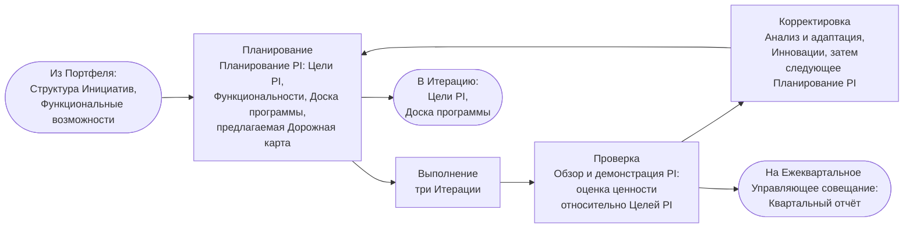
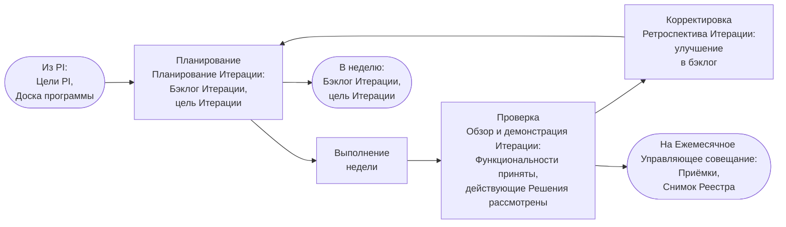
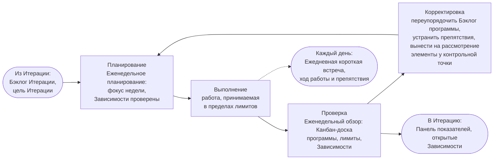
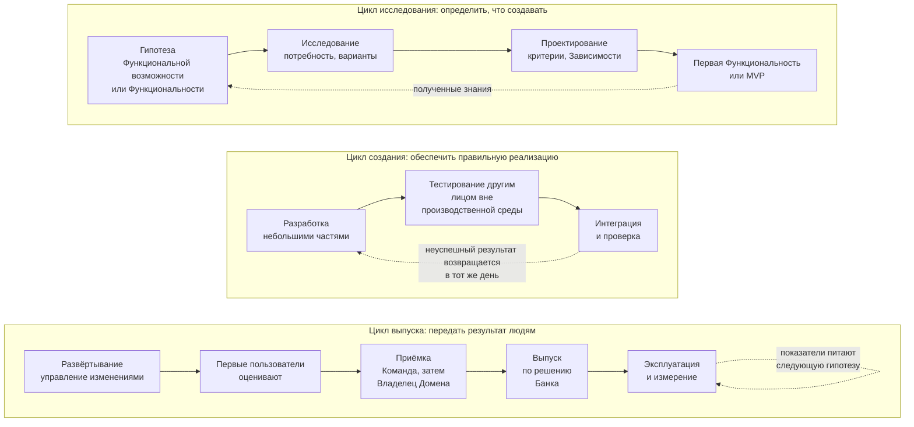
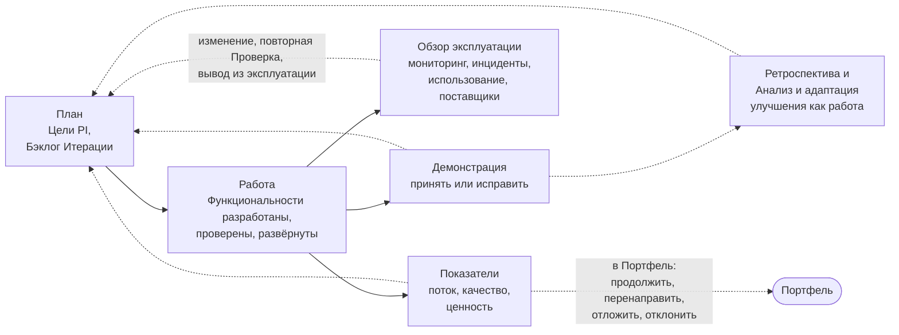

```yaml
source: portal/content/en/delivery/the-loops-of-delivery.md
source_sha256: ef0a0264d97ce82a1e2080e60d56ae1c7692ec9d38f0caefc65f010ba947543e
translation_status: reviewed
```

# Циклы поставки

Поставка представляет собой систему вложенных циклов. На каждом уровне ритма работы действует цикл управления «Планирование — Выполнение — Проверка — Корректировка»; через эти уровни проходят циклы самой работы — исследование, создание, выпуск и эксплуатация; их охватывают циклы обратной связи, возвращающие полученные знания в план. Эта часть показывает их на схемах.

## 1. Цикл управления на каждом уровне

1.1. Каждый уровень ритма работы следует циклу «Планирование — Выполнение — Проверка — Корректировка». Цикл получает рамки от вышестоящего и возвращает ему свидетельства: Программный инкремент передаёт Итерации цели и доску, Итерация передаёт неделе бэклог и цель, неделя передаёт дню фокус; день возвращает препятствия, неделя — Панель показателей и Зависимости, Итерация — Приёмки и Снимок Реестра, Программный инкремент — Квартальный отчёт.



Рисунок 1: цикл Программного инкремента, ежеквартально.



Рисунок 2: цикл Итерации, ежемесячно.



Рисунок 3: недельный цикл и вложенный в него дневной цикл.

## 2. Циклы работы

2.1. Через уровни проходят три цикла самой работы, которые в отрасли называют процессом непрерывной поставки. Цикл исследования определяет, что создавать: гипотеза, изучение потребности и вариантов, проектирование Функциональности с критериями и первая Функциональность или MVP для проверки гипотезы; полученные знания питают следующую гипотезу. Цикл создания реализует результат: разработка небольшими частями, тестирование другим лицом, интеграция, проверка; любой неуспешный результат возвращается разработчику в тот же день. Цикл выпуска передаёт результат людям: развёртывание через управление изменениями, оценка Первыми пользователями, Приёмка, Выпуск за пределы их круга по решению Банка, эксплуатация и измерение; показатели питают следующее исследование.



Рисунок 4: три цикла работы.

2.2. Разделение Развёртывания и Выпуска обеспечивает безопасность этого порядка. Функциональность может быть развёрнута в среде использования, оценена Первыми пользователями и оставаться доступной только им до решения Владельца Домена о Выпуске за пределы их круга. Для Категории риска 3 либо когда Руководитель AICC является Владельцем Домена решение принимает Куратор AICC. Ценность вводится в использование бизнес-решением, а не окончанием разработки.

## 3. Циклы обратной связи

3.1. Четыре цикла обратной связи возвращают полученные знания в план, каждый в своём ритме. Демонстрация на каждом Обзоре и демонстрации Итерации и PI показывает работающее программное обеспечение заказчикам и получает их Приёмку или замечания. Ретроспектива и Анализ и адаптация превращают проблемы месяца и квартала в улучшения, включаемые в бэклог как работа. Обзор эксплуатации на каждом Обзоре и демонстрации Итерации рассматривает мониторинг, инциденты, использование и уведомления поставщиков каждого действующего Решения и инициирует изменение, повторную Проверку или вывод из эксплуатации. Показатели, рассматриваемые в каждом цикле, показывают устойчивость потока и получение ценности и поступают в следующее планирование и Портфель.



Рисунок 5: циклы обратной связи.

## 4. Почему циклы, а не только план

4.1. План предполагает, что известное в начале остаётся верным; цикл позволяет рано обнаружить обратное. Ошибочная гипотеза стоит Итерации, неуспешная сборка — дня, отклоняющееся Решение — одного обзора. Ритм работы делает циклы малозатратными.

## 5. Источник правил

Модель жизненного цикла решений, разделы 2, 6, 7 и 8; Модель управления портфелем, раздел 7; workflows и Руководства по ритму работы и поставке услуг.
