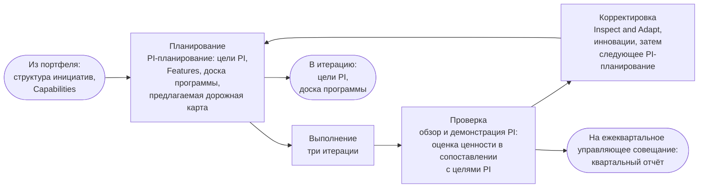
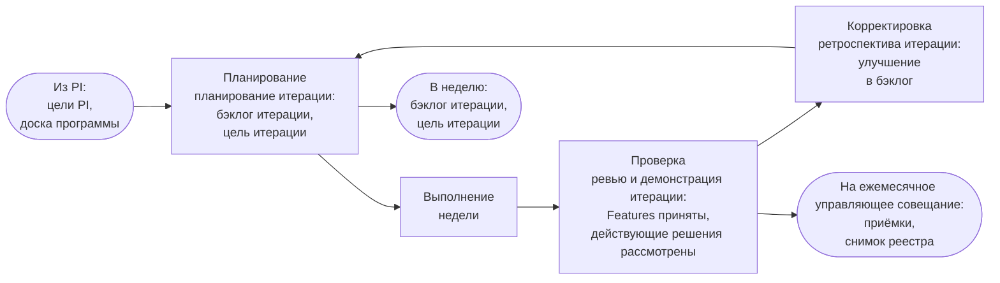
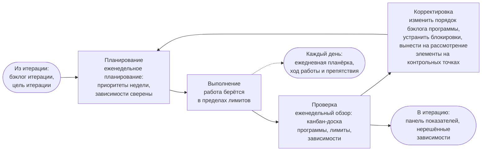
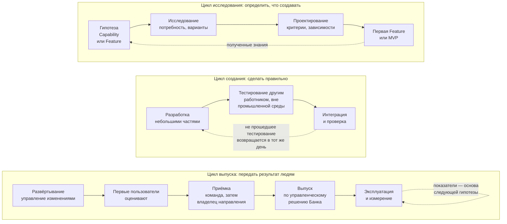
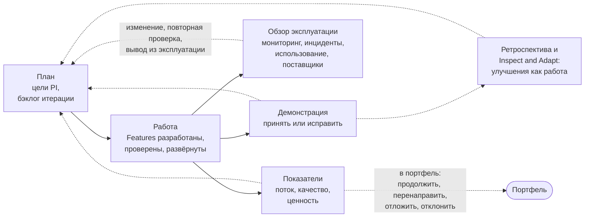

```yaml
source: portal/content/en/delivery/the-loops-of-delivery.md
source_sha256: ef0a0264d97ce82a1e2080e60d56ae1c7692ec9d38f0caefc65f010ba947543e
translation_status: reviewed
```

# Циклы разработки и внедрения

Разработка и внедрение — это система вложенных циклов. На каждом уровне расписания работы действует цикл управления «Планирование — Выполнение — Проверка — Корректировка»; сквозь эти уровни проходят циклы самой работы — исследование, создание, выпуск и эксплуатация; а вокруг них действуют циклы обратной связи, которые возвращают полученные знания в план. В этой части все они показаны на схемах.

## 1. Цикл управления на каждом уровне

1.1. Каждый уровень расписания работы построен как цикл «Планирование — Выполнение — Проверка — Корректировка». Рамки для каждого цикла задаёт вышестоящий цикл, и ему же возвращаются подтверждающие материалы: программный инкремент передаёт итерации цели и доску, итерация передаёт неделе бэклог и цель, неделя передаёт дню приоритеты; в обратную сторону день возвращает препятствия, неделя — панель показателей и зависимости, итерация — приёмки и снимок реестра, программный инкремент — квартальный отчёт.



Рисунок 1: цикл программного инкремента, ежеквартально.



Рисунок 2: цикл итерации, ежемесячно.



Рисунок 3: недельный цикл и вложенный в него дневной цикл.

## 2. Циклы работы

2.1. Сквозь эти уровни проходят три цикла самой работы, которые в отрасли называют конвейером непрерывной доставки. В цикле исследования определяется, что создавать: формулируется гипотеза, изучаются потребность и варианты, проектируется Feature с критериями, а затем первая Feature или MVP проверяет гипотезу; полученные знания служат основой для следующей гипотезы. В цикле создания результат реализуется: разработка ведётся небольшими частями, тестирование выполняет лицо, не участвовавшее в разработке, затем следуют интеграция и проверка; результат, не прошедший тестирование, возвращается разработчику в тот же день. Цикл выпуска передаёт результат людям: развёртывание в порядке управления изменениями, оценка первыми пользователями, приёмка, выпуск за пределы круга первых пользователей по управленческому решению Банка, эксплуатация и измерение; показатели служат основой для следующего исследования.



Рисунок 4: три цикла работы.

2.2. Безопасность этого порядка обеспечивает разделение развёртывания и выпуска. Feature может быть развёрнута в среде использования, оценена первыми пользователями и оставаться доступной только им, пока владелец направления не примет управленческое решение о выпуске за пределы их круга; для категории риска 3, а также если роль владельца направления исполняет руководитель AICC, такое управленческое решение принимает куратор AICC. Ценность «включается» управленческим решением бизнеса, а не завершением разработки.

## 3. Циклы обратной связи

3.1. Четыре цикла обратной связи возвращают полученные знания в план, каждый в своём ритме. Демонстрация на каждом ревью и демонстрации итерации и на каждом обзоре и демонстрации PI показывает работающее программное обеспечение тем, кто его заказал, и по её итогам результат принимается или исправляется. Ретроспектива и Inspect and Adapt превращают проблемы месяца и квартала в элементы улучшений, которые вносятся в бэклог как работа. Обзор эксплуатации на каждом ревью и демонстрации итерации охватывает данные мониторинга, инциденты, использование и уведомления поставщиков по каждому действующему решению; по его итогам предлагается изменение, повторная проверка или вывод из эксплуатации. Наконец, показатели, которые рассматриваются в каждом цикле, показывают, устойчив ли поток и поступает ли ценность, и служат основой для следующего планирования и для управления портфелем.



Рисунок 5: циклы обратной связи.

## 4. Преимущества циклов перед планом

4.1. План исходит из того, что известное в начале останется верным; цикл позволяет как можно раньше обнаружить, что это не так. Ошибочная гипотеза обходится в одну итерацию, неудачная сборка — в один день, решение с дрейфом — в один обзор. Недорогими циклы делает именно расписание работы.

## 5. Источник правил

Разделы 2, 6, 7 и 8 Модели жизненного цикла решений; раздел 7 Модели управления портфелем; workflows и руководства «Расписание работы» и «Оказание услуг».
