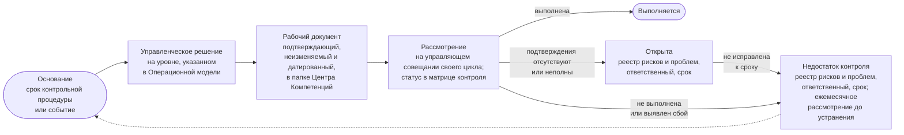

```yaml
source: portal/content/en/governance/controls-and-the-catalogue.md
source_sha256: 998f6d9dd17220931b2cdd4d61e9148ac62aa6fab3808794ce991b7f95d720af
translation_status: reviewed
```

# Контрольные процедуры и их каталог

Контрольная процедура — это правило, которое подразделение и так соблюдает, изложенное так, чтобы аудитор мог его протестировать: цель, правило и пункт, которым оно установлено, ответственный, сроки выполнения, подтверждающий документ и порядок тестирования. В Центре Компетенций тридцать две контрольные процедуры, у каждой есть код. Они выполняются в рамках пяти циклов управления и ведутся в каталоге, а их статус на любую дату отражается в матрице контроля в папке Центра Компетенций. В этой части описаны содержание контрольной процедуры, устройство каталога и жизненный цикл контрольной процедуры.

## 1. Понятие контрольной процедуры

1.1. Каждая контрольная процедура — это правило Операционной модели, Модели жизненного цикла решений, Политики применения AI или Бизнес-модели либо событие в цикле управления; процедура оставляет подтверждающий документ. У процедуры есть код от C-01 до C-32; наименование и цель; правило со ссылкой на пункт, которым оно установлено; ответственный — роль, которая отвечает за процедуру; сроки — когда процедура выполняется; подтверждающий документ и, если применимо, шаблон; тип; порядок тестирования — способ, которым аудитор или руководитель Центра Компетенций подтверждает, что процедура выполнена. Контрольные процедуры не добавляются к работе: это сама работа, получившая название.

## 2. Каталог по циклам

| Цикл | Контрольные процедуры | Краткое содержание |
| --- | --- | --- |
| Определение направления, ежегодно | C-01, C-03, C-04, C-20, C-22; а также C-02 в стратегическом цикле, который также проводится на ежегодном управляющем совещании | Введение в действие и пересмотр документов; Заявление о риск-аппетите в отношении AI; назначения и разделение обязанностей; стратегические приоритеты, инвестиционные бюджеты и инвестиционные ограничения; предложение Банку |
| Подтверждение надлежащего функционирования, ежеквартально | C-06, C-07, C-11, C-16, C-20, C-24, C-25, C-26, C-27, C-28 | Квартальный отчёт и его представление Комитету Совета директоров или Совету директоров, если так решит куратор Центра Компетенций; ежеквартальная проверка рисков; повторная оценка категорий риска; валидация; пересмотр прав доступа и доступ внутреннего аудита; сверка инцидентов AI; снимок папки |
| Контроль, ежемесячно | C-05, C-17, C-29, C-32 | Выборка управленческих решений; недостатки контроля; приёмки; рассмотрение работающих решений |
| Операционный, еженедельно | C-23; панель показателей ведётся в рабочем состоянии | Приём обращений о взаимодействии с заказчиком и WIP-лимит; поток работ, WIP-лимиты, зависимости |
| Событийный | C-01, C-08, C-09, C-10, C-12, C-13, C-14, C-15, C-16, C-17, C-18, C-19, C-21, C-22, C-27, C-28, C-30, C-31, C-32 | Инцидент AI; отступление от требований; остановка или приостановление; риск сверх риск-аппетита; выявленное отклонение; смена исполнителя роли; смена поставщика или изменение регулирования; а также контрольные процедуры, которые запускаются шагом работы: принятие взаимодействия с заказчиком, бизнес-кейс, категория риска, проверка или валидация, выпуск, применение для класса данных, поставщик, развёртывание или изменение, обмен данными, опубликованный результат, вывод из эксплуатации |

2.1. Каждая контрольная процедура выполняется хотя бы в одном цикле и рассматривается на управляющем совещании этого цикла; процедура, которая выполняется только в операционном или событийном цикле, рассматривается на ежемесячном управляющем совещании (п. 6.1 Операционной модели). На странице «Контрольные процедуры» в составе страниц с правилами приведены все тридцать две процедуры с правилом, ответственным, сроками, подтверждающим документом, шаблоном, целью, типом и порядком тестирования, и каждой процедуре посвящена отдельная страница; порядок тестирования каждой процедуры установлен Руководством по контролю работы подразделения. Коды не меняются: по коду на контрольную процедуру ссылаются документы, матрица контроля, выявленные отклонения и этот сайт.

## 3. Жизненный цикл контрольной процедуры

3.1. Каждая контрольная процедура проходит единый цикл: основание — наступление срока или события; управленческое решение на уровне, указанном в Операционной модели; рабочий документ — подтверждающий документ, который оставляет процедура; рассмотрение на управляющем совещании своего цикла. В матрице контроля каждой процедуре на определённую дату присваивается один из пяти статусов: «Выполняется» — процедура выполнена и оставила подтверждающий документ; «Открыта» — срок наступил, а подтверждающие материалы отсутствуют или неполны, при этом в реестр рисков и проблем внесён соответствующий пункт; «Недостаток контроля» — процедура не выполнена, подтверждающие материалы указывают на сбой либо процедура имела статус «Открыта» и не была исправлена к установленному сроку; «Основание ещё не возникло» — событие, запускающее процедуру, ещё не наступило; «Срок ещё не наступил» — первый срок выполнения ещё не наступил.



Рисунок 1: цикл контрольной процедуры, процедура в статусе «Открыта» и недостаток контроля.

## 4. Недостатки контроля и выявленные отклонения

4.1. Контрольная процедура в статусе «Открыта» или «Недостаток контроля», а также каждое выявленное отклонение по результатам аудита или надзорной проверки вносятся в реестр рисков и проблем с указанием ответственного и срока, и ежемесячное управляющее совещание рассматривает их до устранения; по просроченному недостатку контроля управленческое решение принимается немедленно. Недостаток контроля — не провал системы управления, а свидетельство того, что она работает. Провалом был бы недостаток, который никто не зафиксировал.

## 5. Источник правил

П. 6.1 и раздел 8 Операционной модели; матрица контроля в папке Центра Компетенций; раздел 7 Руководства по контролю работы подразделения; шаблоны «Заключение контрольной функции» и «Контрольный лист приёмки».
