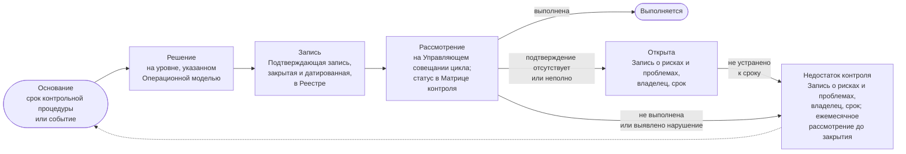

```yaml
source: portal/content/en/governance/controls-and-the-catalogue.md
source_sha256: 605afbb0948967c5a47c81ce263df11e69cc221cc4dab69dccd5ced8cf9392e6
translation_status: reviewed
```

# Контрольные процедуры и их каталог

Контрольная процедура — правило, которое подразделение и так соблюдает, изложенное так, чтобы аудитор мог его проверить: цель, правило и пункт, владелец, срок, Подтверждающая запись и способ проверки. У AICC тридцать две процедуры с идентификаторами; они включены в пять контрольных циклов и ведутся в каталоге. Их статус на любую дату отражается в Матрице контроля Реестра. Эта часть поясняет содержание процедуры, устройство каталога и её жизненный цикл.

## 1. Что такое контрольная процедура

1.1. Каждая процедура представляет собой правило Операционной модели, Модели жизненного цикла решений, Политики применения искусственного интеллекта или Бизнес-модели либо событие контрольного цикла и оставляет Подтверждающую запись. Она имеет идентификатор от C-01 до C-32; название и цель; правило со ссылкой на пункт; владельца — ответственную Роль; срок или момент выполнения; Подтверждающую запись и применимый Шаблон; тип; проверку — способ, которым аудитор или Руководитель AICC подтверждает выполнение. Процедуры не добавляются к работе: это сама работа, получившая обозначение.

## 2. Каталог по циклам

| Цикл | Включённые контрольные процедуры | Краткое содержание |
| --- | --- | --- |
| Определение направления, ежегодно | C-01, C-03, C-04, C-20, C-22; также C-02 в стратегическом цикле Ежегодного Управляющего совещания | Введение в действие и пересмотр документов; Заявление о риск-аппетите в отношении ИИ; назначения и разделение обязанностей; Стратегические приоритеты, Инвестиционные бюджеты и Инвестиционные ограничения; Предложение Банку |
| Подтверждение надлежащего функционирования, ежеквартально | C-06, C-07, C-11, C-16, C-20, C-24, C-25, C-26, C-27, C-28 | Квартальный отчёт и Отчёт Комитету Совета директоров; Ежеквартальная проверка рисков; пересмотры Категории риска; Валидации; пересмотр доступа и доступ внутреннего аудита; сверка Инцидентов ИИ; Снимок Реестра |
| Контроль, ежемесячно | C-05, C-17, C-29, C-32 | Выборка Управленческих решений; Недостатки контроля; Приёмки; обзор текущего состояния Решений |
| Операционный, еженедельно | C-23; Панель показателей является рабочей записью | Приём Взаимодействий с заказчиками и лимит незавершённой работы; поток, лимиты, Зависимости |
| Событийный | C-01, C-08, C-09, C-10, C-12, C-13, C-14, C-15, C-16, C-17, C-18, C-19, C-21, C-22, C-27, C-28, C-30, C-31, C-32 | Инцидент ИИ; Исключение; остановка или приостановление; риск сверх риск-аппетита; Выявленное отклонение; смена Исполнителя Роли; смена Поставщика или регулирования; процедуры, запускаемые шагом работы: приём Взаимодействия с заказчиком, экономическое обоснование, Категория риска, Проверка или Валидация, Выпуск, применение для Класса данных, Поставщик, развёртывание или изменение, обмен данными, публикуемый результат, вывод из эксплуатации |

2.1. Каждая процедура включена как минимум в один цикл и рассматривается на его Управляющем совещании; процедура только операционного или событийного цикла рассматривается на ежемесячном совещании (Операционная модель 6.1). Страница «Контрольные процедуры» в составе нормативного документа перечисляет все тридцать две процедуры с правилом, владельцем, сроком, подтверждением, Шаблоном, целью, типом и проверкой; каждой посвящена отдельная страница, а Руководство по управлению подразделением описывает способ проверки. Идентификаторы неизменны: по ним на процедуру ссылаются документы, Матрица контроля, Выявленное отклонение и сайт.

## 3. Жизненный цикл контрольной процедуры

3.1. Каждая процедура проходит единый цикл: основание — срок или событие; решение на уровне, указанном Операционной моделью; запись как подтверждение; рассмотрение на Управляющем совещании своего цикла. Матрица контроля присваивает на дату один из пяти статусов: «Выполняется» — процедура сработала и оставила подтверждение; «Открыта» — срок наступил, но подтверждение отсутствует или неполно, с записью в Записи о рисках и проблемах; «Недостаток контроля» — процедура не сработала, подтверждение показывает нарушение либо статус «Открыта» не устранён к сроку; «Основание ещё не возникло» — событие не произошло; «Срок ещё не наступил» — первый срок выполнения не наступил.



Рисунок 1: цикл контрольной процедуры, открытой процедуры и Недостатка контроля.

## 4. Недостатки контроля и Выявленные отклонения

4.1. Процедура со статусом «Открыта» или «Недостаток контроля» и каждое замечание аудитора или надзорного органа вносятся в Запись о рисках и проблемах с владельцем и сроком; ежемесячное Управляющее совещание рассматривает их до закрытия. По просроченному Недостатку контроля решение принимается немедленно. Само выявление Недостатка контроля свидетельствует о работающем управлении; нарушением было бы отсутствие его учёта.

## 5. Источник правил

Операционная модель 6.1 и 8; Матрица контроля Реестра; Руководство по управлению подразделением 7; Шаблоны Заключения контрольной функции и Контрольного листа приёмки.
