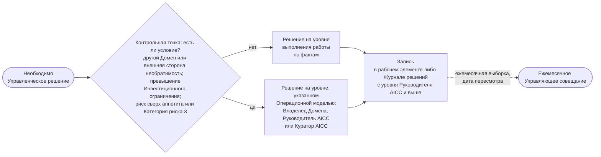

```yaml
source: portal/content/en/governance/decisions-and-escalation.md
source_sha256: c4f7899d1f599e3d8df96a012610931ea5ad3fdab45d247ac645ff1a7ed056d7
translation_status: reviewed
```

# Решения и Эскалация

Управленческое решение принимает выполняющий работу человек на основании фактов в момент необходимости. Оно передаётся на более высокий уровень только при одном из четырёх условий и фиксируется так, чтобы другие могли его найти. Эта часть описывает уровни, условия, право остановки Контрольных функций и порядок записи решения.

## 1. Четыре уровня

| Уровень | Кто решает | Примеры |
| --- | --- | --- |
| Команда | Инженер решений совместно с Экспертом Домена и Владельцем Домена; Владелец продукта — по Приёмке Функциональности или Функциональной возможности | Проектирование, разработка, порядок взятия работы в пределах ранжирования, Приёмка Функциональности или Функциональной возможности |
| Владелец Домена | Владелец Домена | Экономическое обоснование и решение по итогам MVP внутри одного Домена в пределах Инвестиционного ограничения; Описание решения; Приёмка Решения; его вывод из эксплуатации |
| Руководитель AICC | Руководитель AICC | Приём элемента в Проработку, отсрочка или отклонение при первичном рассмотрении; взятие Инициативы в работу и лимит Инициатив в состоянии «В работе»; порядок бэклогов; окончательная Приёмка от имени Команды; Категория риска; необходимость новой Проверки при изменении; стандарты, Шаблоны и междоменные вопросы |
| Куратор AICC | Куратор AICC после консультации с Управляющим комитетом по ИИ | Стратегические приоритеты, финансирование, Структура Инициатив; экономическое обоснование при превышении Инвестиционного ограничения или охвате нескольких Доменов и решение по итогам его MVP; Выпуск Решения Категории риска 3; риск сверх риск-аппетита; вывод из эксплуатации Сервиса нескольких Доменов |

## 2. Когда решение передаётся выше

2.1. Управленческое решение передаётся на более высокий уровень только при выполнении хотя бы одного условия: оно затрагивает другой Домен, внешнюю сторону либо устанавливает стандарт для других; не может быть отменено без существенных затрат или вреда; превышает Инвестиционное ограничение или меняет Стратегический приоритет; принимает риск сверх Заявления о риск-аппетите в отношении ИИ либо относится к Решению Категории риска 3. Тогда применяется уровень, указанный для вопроса Операционной моделью. Остальные вопросы решаются там, где находятся факты, а ежемесячное Управляющее совещание впоследствии рассматривает выборку.



Рисунок 1: движение Управленческого решения.

## 3. Контрольные функции решают в пределах своих полномочий

3.1. Контрольная функция принимает решения в пределах полномочий; её Валидация или остановка окончательны в этих пределах, никто их не отменяет. Разногласие передаётся руководителю этой Контрольной функции; Куратор AICC вправе вынести его на высшее руководство, но не отменяет Валидацию или остановку. Риск сверх Заявления о риск-аппетите в отношении ИИ вправе принять только Куратор AICC с сообщением Комитету Совета директоров. Лицо, приостановившее Решение, снимает приостановление, когда это позволяют факты. Так Контрольные функции Банка участвуют в решениях подразделения.

## 4. Разногласия, конфликты и записи

4.1. При разногласии заинтересованных лиц уполномоченное лицо принимает решение, выслушав их, а остальные поддерживают Управленческое решение; особое мнение может быть зафиксировано в Журнале решений. Лицо с конфликтом интересов заявляет его и не принимает решение; решает следующий уровень. Управленческое решение с уровня Руководителя AICC и выше, а также любое решение, которое другим понадобится найти, вносится одной строкой в Журнал решений: дата, решение, факты, принявшее лицо и срок пересмотра. Труднообратимое решение Куратора AICC и решения, для которых Операционная модель 8 предусматривает Запись о решении, дополнительно имеют такую Запись. Решение Команды фиксируется в рабочем элементе.

## 5. Почему установлен такой порядок

5.1. Письменные полномочия позволяют небольшому подразделению действовать быстро, сохраняя контроль: Команда не ждёт комитета для проектирования, Владелец Домена не ждёт Куратора AICC для одобрения экономического обоснования в пределах ограничения, а Куратор AICC не решает вопросы, уже разрешённые фактами. Четыре условия, право остановки и Журнал решений составляют всю модель Эскалации; она одинакова для Функциональности и Стратегического приоритета.

## 6. Источник правил

Операционная модель 4.2, 4.4 и 5; Модель управления портфелем 6.3; Политика применения искусственного интеллекта 3 и 6; Схема процесса управления подразделением 3 и соответствующее руководство 4.
