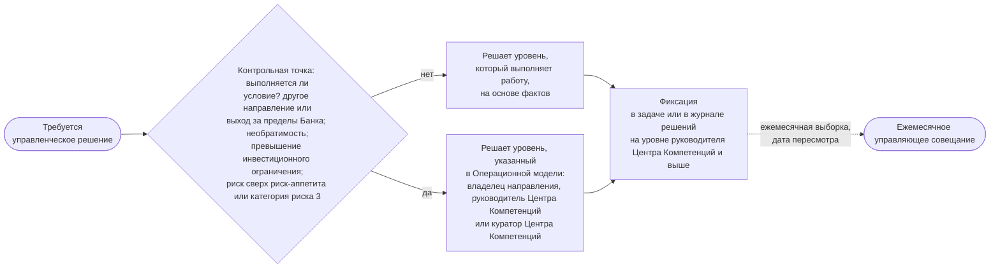

```yaml
source: portal/content/en/governance/decisions-and-escalation.md
source_sha256: 7194e85d25731cf74cf70e5739678edc1a47668224be3f1e924804acecd3dec8
translation_status: reviewed
```

# Управленческие решения и эскалация

Управленческое решение принимает тот, кто выполняет работу, на основе фактических данных и тогда, когда это необходимо. На вышестоящий уровень оно выносится, только если выполняется одно из четырёх условий, и фиксируется так, чтобы другие могли его найти. В этой части описаны уровни принятия решений, условия эскалации, право контрольных функций остановить работу и порядок фиксации управленческих решений.

## 1. Четыре уровня

| Уровень | Принимает решение | Примеры |
| --- | --- | --- |
| Команда | Инженер решений совместно с экспертом направления и владельцем направления; владелец продукта — по приёмке Feature или Capability | Проектирование, разработка, порядок принятия работы в разработку в пределах ранжирования, приёмка Feature или Capability |
| Владелец направления | Владелец направления | Бизнес-кейс и дальнейшие действия по итогам MVP в пределах одного направления ниже инвестиционного ограничения; описание решения; приёмка решения; вывод его из эксплуатации |
| Руководитель Центра Компетенций | Руководитель Центра Компетенций | Принятие элемента в проработку, его отсрочка или отклонение при первичном рассмотрении; принятие инициативы в работу и лимит инициатив в работе; порядок элементов в бэклогах; окончательная приёмка от имени команды; категория риска; необходимость новой проверки при изменении; стандарты, шаблоны и вопросы, затрагивающие несколько направлений |
| Куратор Центра Компетенций | Куратор Центра Компетенций с учётом рекомендаций Управляющего комитета по AI | Стратегические приоритеты, финансирование, структура инициатив; бизнес-кейс, превышающий инвестиционное ограничение или охватывающий несколько направлений, и дальнейшие действия по итогам его MVP; выпуск решения категории риска 3; принятие риска сверх риск-аппетита; вывод из эксплуатации сервиса, охватывающего несколько направлений |

## 2. Условия эскалации

2.1. Управленческое решение выносится на вышестоящий уровень, только если выполняется хотя бы одно из условий: оно затрагивает другое направление, выходит за пределы Банка или устанавливает стандарт для других; его нельзя отменить без существенных затрат или вреда; оно превышает инвестиционное ограничение или изменяет стратегический приоритет; оно предполагает принятие риска сверх Заявления о риск-аппетите в отношении AI или касается решения категории риска 3. В этом случае вопрос решает уровень, который Операционная модель определяет для данного вопроса. Все остальные вопросы решаются там, где известны факты, а ежемесячное управляющее совещание затем рассматривает их выборку.



Рисунок 1: движение управленческого решения.

## 3. Полномочия контрольных функций

3.1. Контрольная функция принимает решения в пределах своей компетенции; её валидация или остановка работы в этих пределах окончательны и отмене не подлежат. Разногласия рассматривает руководитель этой контрольной функции; куратор Центра Компетенций вправе вынести вопрос на рассмотрение Правления Банка, но не вправе отменить валидацию или остановку. Принять риск сверх Заявления о риск-аппетите в отношении AI вправе только куратор Центра Компетенций; он сообщает об этом Комитету Совета директоров, не дожидаясь какого-либо отчёта. Приостановление применения решения снимает принявшее его лицо, когда для этого есть основания. Так контрольные функции Банка участвуют в принятии управленческих решений самого подразделения.

## 4. Разногласия, конфликт интересов и фиксация решений

4.1. Если заинтересованные лица не пришли к согласию, лицо, уполномоченное принять решение, выслушивает их и решает вопрос, а остальные участники исполняют принятое решение; несогласный вправе потребовать внести своё особое мнение в журнал решений. Лицо, у которого есть конфликт интересов, обязано заявить об этом и не участвует в принятии решения; вопрос решает вышестоящий уровень. Управленческое решение уровня руководителя Центра Компетенций и выше, а также любое управленческое решение, которое другим понадобится найти впоследствии, вносится в журнал решений отдельной строкой с указанием даты, содержания решения, фактов, лица, принявшего решение, и срока пересмотра. Для трудно обратимого управленческого решения куратора Центра Компетенций и для управленческих решений, подтверждением которых раздел 8 Операционной модели называет протокол решения, дополнительно оформляется протокол решения. Управленческое решение команды фиксируется в задаче.

## 5. Обоснование порядка

5.1. Закреплённые в документах полномочия по принятию решений позволяют небольшому подразделению действовать быстро, не теряя контроля: команде не нужно ждать комитета, чтобы приступить к проектированию, владельцу направления — куратора Центра Компетенций, чтобы одобрить бизнес-кейс в пределах инвестиционного ограничения, а куратору Центра Компетенций не приходится решать то, что уже ясно из фактов. Четыре условия, право остановки и журнал решений образуют всю модель эскалации, и она одинакова для Feature и для стратегического приоритета.

## 6. Источник правил

Пп. 4.2 и 4.4, раздел 5 Операционной модели; п. 6.3 Модели управления портфелем; разделы 3 и 6 Политики применения AI; раздел 3 workflow «Контроль работы подразделения» и раздел 4 одноимённого руководства.
