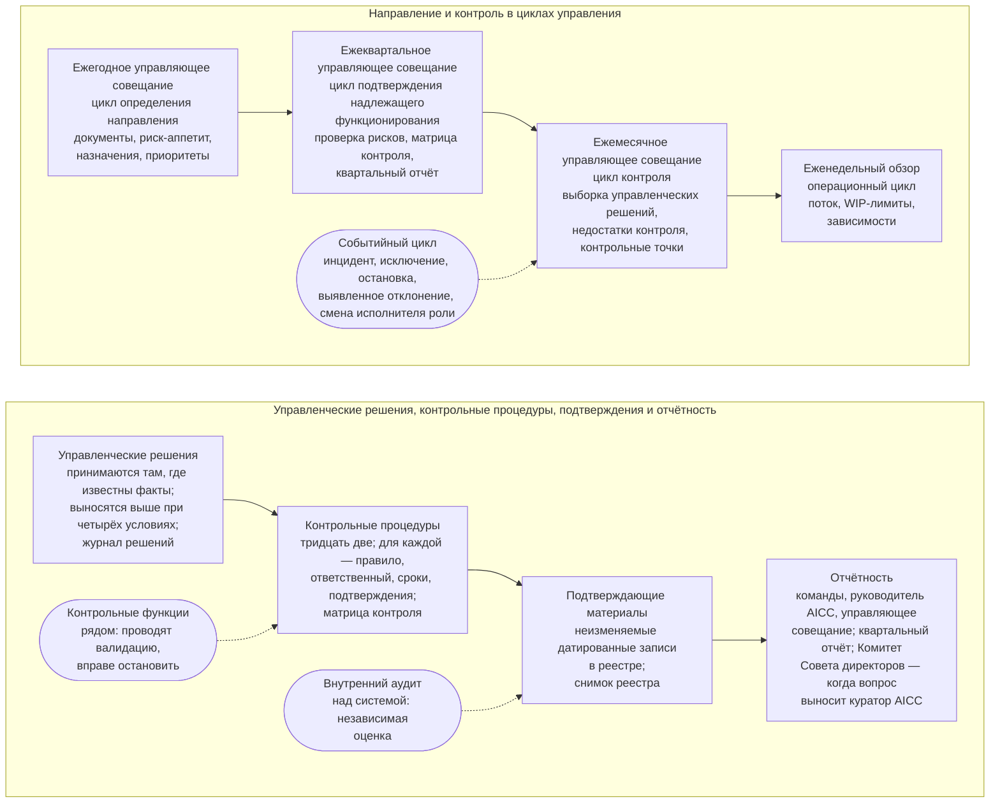

```yaml
source: portal/content/en/governance/overview.md
source_sha256: 0dc2d1a54f14f2a247506a8b568489f1b30b58027814f434ef7b672264d6f752
translation_status: reviewed
```

# Управление

Под управлением понимается то, как AICC как подразделение Банка получает направление работы, контролируется, отчитывается и проходит независимую оценку: кто что решает и когда управленческое решение выносится на вышестоящий уровень; циклы, в которых подразделение планирует, выполняет, проверяет и корректирует свою работу; контрольные процедуры, которые может протестировать аудитор, и подтверждающие материалы каждой из них; цепочка отчётности перед куратором AICC, которая доходит до Совета директоров, когда куратор AICC выносит вопрос на его рассмотрение. Этот курс описывает управление в семи частях. Правила установлены Операционной моделью, и при расхождении применяется она.

## 1. Общая схема

1.1. На рисунке 1 управление показано как единая система: управленческие решения принимаются там, где известны факты, и выносятся на вышестоящий уровень только при установленных условиях; пять циклов управления проводятся на управляющих совещаниях и еженедельном обзоре; контрольные процедуры оставляют подтверждающие материалы в реестре; отчётность представляется от команд через руководителя AICC на управляющее совещание, которое проводит куратор AICC; он вправе вынести вопрос на рассмотрение Комитета Совета директоров или Совета директоров. Контрольные функции действуют рядом с этой системой, а внутренний аудит — над ней.



Рисунок 1: управление подразделением как единая система.

## 2. Назначение управления

2.1. Небольшому подразделению с широким мандатом нужна система управления достаточно лёгкая, чтобы применять её каждую неделю, и достаточно надёжная, чтобы удовлетворить требования надзорного органа и аудитора. Операционная модель решает эту задачу на основе трёх принципов. Первый: управленческие решения принимаются там, где известны факты, — их принимает лицо, ближайшее к работе, на основе фактических данных, а на вышестоящий уровень вопрос выносится только при установленном условии. Второй: по возможности управленческие решения делаются обратимыми, и такие решения принимаются быстро. Третий: сохраняются только те процессы и записи, которыми кто-то пользуется, а остальные упраздняются. Контрольные процедуры — это правила, которые подразделение и так соблюдает, сформулированные так, чтобы их можно было протестировать; подтверждающие материалы — то, что остаётся после работы, в неизменяемом виде и с датой; мероприятиями служат управляющие совещания и еженедельный обзор, которые уже используются для управления портфелем и поставки. Дополнительные совещания и дублирующие записи для целей управления не вводятся. Как принимаются решения по портфелю и как организована поставка, описано в соответствующих курсах; этот курс описывает только контроль за деятельностью подразделения.

## 3. Отраслевая практика

3.1. В общих чертах модель следует распространённой банковской практике внутреннего контроля и независимой оценки. Это модель трёх линий: первая линия отвечает за риски своей работы; независимые контрольные функции устанавливают правила в пределах своей компетенции, проводят валидацию и вправе остановить работу; внутренний аудит проводит независимую оценку. Это также цели контроля с указанием ответственных, сроков и подтверждающих материалов; система менеджмента, которая циклически планирует, выполняет, проверяет и совершенствует работу; документально закреплённые полномочия по принятию решений с эскалацией при установленных условиях; отчётность перед руководством, которая может доходить до совета директоров, с незамедлительным информированием совета о крупных инцидентах и о рисках сверх риск-аппетита. В отношении AI модель следует стандарту системы менеджмента и концепции управления рисками, приведённым на странице «Стандарты и методологии», а также требованиям и рекомендациям органов, устанавливающих стандарты для финансового сектора, в части модельного риска, третьих сторон и операционной устойчивости.

## 4. Структура курса

4.1. Часть 2 описывает полномочия по принятию решений и порядок эскалации, часть 3 — пять циклов управления, часть 4 — управляющие совещания и органы, часть 5 — контрольные процедуры и каталог контрольных процедур, часть 6 — записи, подтверждающие материалы и независимую оценку, часть 7 — показатели управления и отчётность. Далее следует Операционная модель, которая устанавливает правила, в том числе циклы управления, записи и подтверждающие материалы и каталог контрольных процедур. Workflow «Управление подразделением» и одноимённое руководство пошагово показывают циклы, мероприятия и последовательности действий и устанавливают порядок тестирования каждой контрольной процедуры.
