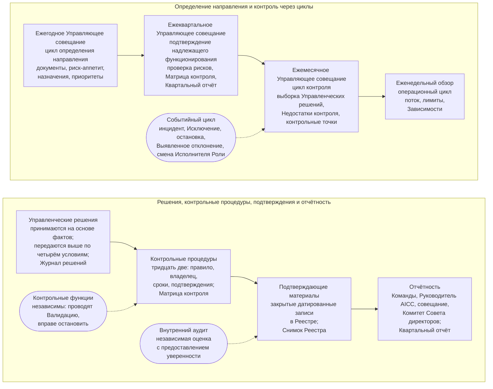

```yaml
source: portal/content/en/governance/overview.md
source_sha256: ce1f6191dbd57f03a889fe3c970c3c6a2da0ba12115c5f7cab8fed58ce6a0773
translation_status: reviewed
```

# Управление

Управление определяет направление, контроль, отчётность и независимую оценку AICC как подразделения Банка: кто что решает и когда решение передаётся выше; циклы планирования, действий, проверки и корректировки; контрольные процедуры, проверяемые аудитором, и их подтверждающие материалы; порядок отчётности до Совета директоров. Курс поясняет это в семи частях; Операционная модель устанавливает правила и имеет приоритет.

## 1. Общая схема

1.1. На рисунке 1 управление показано как единая система: решения принимаются там, где находятся факты, и передаются выше только при установленных условиях; пять контрольных циклов реализуются на Управляющих совещаниях и Еженедельном обзоре; контрольные процедуры оставляют подтверждающие материалы в Реестре; отчётность идёт от Команд через Руководителя AICC и Управляющее совещание к Комитету Совета директоров. Контрольные функции действуют независимо рядом с системой, внутренний аудит даёт ей независимую оценку.



Рисунок 1: управление подразделением как единая система.

## 2. Для чего нужно управление

2.1. Небольшому подразделению с широким мандатом необходимо управление, достаточно простое для еженедельного применения и достаточно надёжное для надзорного органа и аудитора. Операционная модель задаёт три принципа: решать там, где находятся факты, чтобы ближайший к работе человек принимал решение по подтверждающим материалам, а передача выше происходила только при установленном условии; по возможности сохранять обратимость и быстро принимать обратимые решения; оставлять только используемые процессы и записи, удаляя остальные. Контрольные процедуры — уже соблюдаемые подразделением правила, сформулированные для проверки; подтверждающие материалы — закрытые датированные результаты работы; площадки — Управляющие совещания и Еженедельный обзор, уже используемые Портфелем и поставкой. Управление не добавляет встреч и дублирующих записей. Решения Портфеля и порядок поставки изложены в соответствующих курсах; этот курс описывает только контроль подразделения.

## 3. Отраслевая практика

3.1. Модель в общих чертах следует обычной банковской практике внутреннего контроля и независимой оценки: Три линии — исполнители, отвечающие за риски своей работы; независимые Контрольные функции, устанавливающие правила в пределах полномочий, проводящие Валидацию и имеющие право остановки; внутренний аудит, дающий независимую оценку с предоставлением уверенности. Она предусматривает цели контроля с владельцами, сроками и подтверждениями; циклическую систему планирования, работы, проверки и улучшения; письменные полномочия по принятию решений с Эскалацией при установленных условиях; отчётность до Совета директоров с безотлагательным сообщением об инцидентах и рисках сверх риск-аппетита. В отношении AI она следует стандарту системы менеджмента и системе управления рисками, указанным в Отраслевой базе знаний, а также ожиданиям организаций, устанавливающих финансовые стандарты, по модельному риску, третьим лицам и устойчивости.

## 4. Как читать этот курс

4.1. Часть 2 описывает полномочия и Эскалацию решений. Часть 3 — пять контрольных циклов. Часть 4 — Управляющие совещания и органы. Часть 5 — контрольные процедуры и каталог. Часть 6 — записи, подтверждающие материалы и независимую оценку. Часть 7 — Показатели управления и отчётность. Далее следует Операционная модель с правилами, контрольными циклами, записями, подтверждениями и каталогом процедур; Workflow и Руководство по управлению подразделением пошагово показывают циклы, события и последовательности и устанавливают способ проверки каждой контрольной процедуры.
