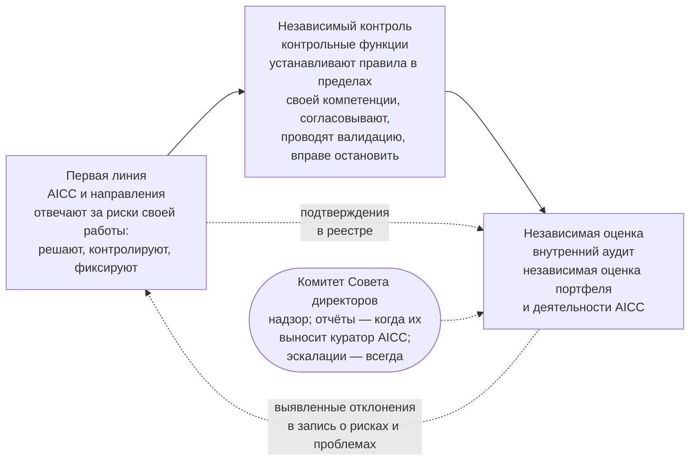

```yaml
source: portal/content/en/governance/records-evidence-and-assurance.md
source_sha256: 3fabeec37f3d75963ce2ac08ab78288af29009327ec1e14819a7da057ea12ee2
translation_status: reviewed
```

# Записи, подтверждающие материалы и независимая оценка

Управление стоит ровно столько, сколько оно может подтвердить. AICC ведёт записи трёх видов, хранит подтверждающие материалы в одном месте, где они не перезаписываются, и предоставляет всё это для независимой оценки. В этой части описано, что и где фиксируется, что делает запись подтверждающей, как ведётся реестр и как модель трёх линий Банка применяется к подразделению.

## 1. Три вида записей

| Вид | Содержание | Примеры | Место хранения |
| --- | --- | --- | --- |
| Рабочее состояние | Текущее состояние работы, которое поддерживается в актуальном виде за счёт использования | Бэклоги, доски, дорожная карта, календарь, доска программы, панель показателей, запись о командах, папка программного инкремента | Реестр до перехода, затем Jira и Confluence |
| Актуализируемые записи | Записи, которые по своей природе отражают текущее положение и поддерживаются в актуальном состоянии | Записи о приоритетах, о стандартах, о рисках и проблемах, реестр AI, запись о назначениях; описания решений в портфеле | Реестр; портфель |
| Подтверждающие записи | Неизменяемая датированная выгрузка, которая оформляется при наступлении события и фиксирует, что произошло, кто принял решение или действовал, на основе каких фактов и где находится актуальный элемент | Записи о решении, заключения контрольных функций, контрольные листы приёмки, отчёты о результатах, итоги управляющих совещаний, квартальные отчёты, разборы инцидентов AI, снимки реестра | Всегда реестр |

1.1. Jira, Confluence и система Service Management не являются хранилищем подтверждающих материалов. Снимок реестра на дату завершения каждой итерации и каждого программного инкремента фиксирует состояние, категорию риска и выпуск каждого решения, поэтому подтверждением описаний решений является снимок.

## 2. Требования к подтверждающей записи

2.1. Запись является подтверждающей, если она закрыта, датирована и позволяет проследить происхождение сведений: в ней указано, что произошло, кто принял решение или действовал, на основе каких фактов и где находится актуальный элемент, и впоследствии она не перезаписывается. Закрытая запись исправляется только новой датированной записью со ссылкой на неё. Числовые данные Банка остаются в системе-источнике, а запись ссылается на них; в реестре не хранятся данные Банка и программный код, а персональные данные хранятся только в пределах, допускаемых правилами хранения и классификации.

## 3. Ведение реестра

3.1. Реестр — это репозиторий с защищённой основной веткой и ограниченным доступом; его история не перезаписывается. Изменения в основную ветку вносят только руководитель AICC и лицо, назначенное замещать его на период отсутствия. Запись ведёт тот, кто выполняет работу, а за все записи отвечает руководитель AICC. Каждая запись хранится в течение срока, установленного правилами хранения Банка для записей этого типа. Закрытые записи переносятся на корпоративный сетевой ресурс, и портал AICC ссылается на них; внутренний аудит имеет доступ на чтение к реестру и доступ только для чтения к Jira, Confluence и системе Service Management. У каждого инструмента есть ответственный за его ведение, указанный в записи о назначениях, а назначение каждого инструмента описано в workflow «Инструменты совместной работы».

## 4. Модель трёх линий применительно к подразделению



Рисунок 1: модель трёх линий и подразделение.

4.1. AICC и направления образуют первую линию: они отвечают за риски своей работы, принимают решения, контролируют и фиксируют. Контрольные функции независимы от AICC: они устанавливают правила в пределах своей компетенции, согласовывают бизнес-кейсы, проводят валидацию решений, решают вопросы об исключениях и вправе остановить работу; AICC не является контрольной функцией и не проводит валидацию собственной работы. Внутренний аудит проводит независимую оценку портфеля и деятельности AICC и имеет доступ на чтение ко всем материалам; выявленные им отклонения вносятся в запись о рисках и проблемах так же, как любой недостаток контроля. Комитет Совета директоров осуществляет надзор от имени Совета директоров: он рассматривает квартальный отчёт или выявленные отклонения, когда куратор AICC выносит их на его рассмотрение, и в любом случае получает сообщения о крупных инцидентах AI и о рисках, принятых сверх риск-аппетита.

## 5. Сведения, доступные аудитору

5.1. По коду любой контрольной процедуры аудитор находит её правило в документе, подтверждающую запись в реестре, статус в матрице контроля и итоги управляющего совещания, на котором она рассматривалась. По описанию любого решения он находит его категорию риска, проверку или валидацию, приёмки, выпуск и рассмотрения работающего решения. По журналу решений для любого управленческого решения уровня руководителя AICC и выше он находит факты и дату пересмотра. Где хранится каждая запись и какую контрольную процедуру она подтверждает, указано на странице «Записи и системы».

## 6. Источник правил

Пп. 6.10 и 8.2, раздел 7 Операционной модели; пп. 7.3 и 12.4 Заявления о намерениях; п. 7.2 Положения об AICC; workflow «Инструменты совместной работы»; разделы 5 и 6 Руководства по управлению подразделением.
