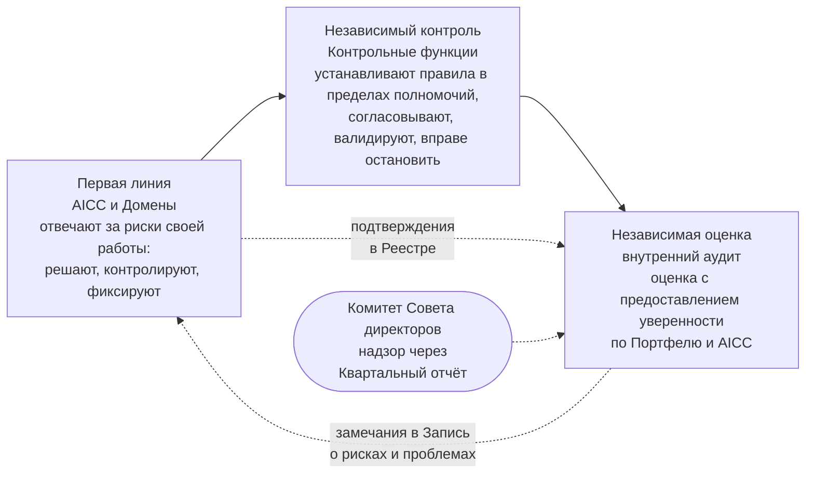

```yaml
source: portal/content/en/governance/records-evidence-and-assurance.md
source_sha256: 1f55a5a6e64fe9d9e866a505656eeb911940730db0c1d1e81afeb21448c2fc14
translation_status: reviewed
```

# Записи, подтверждающие материалы и независимая оценка

Качество управления определяется тем, что оно может подтвердить. AICC ведёт три вида записей, хранит подтверждения в одном месте без переписывания и предоставляет всё для независимой оценки. Эта часть описывает места учёта, признаки Подтверждающей записи, ведение Реестра и применение Трёх линий Банка к подразделению.

## 1. Три вида записей

| Вид | Содержание | Примеры | Где |
| --- | --- | --- | --- |
| Рабочее состояние | Текущее состояние работы, актуализируемое в ходе использования | Бэклоги, доски, Дорожная карта, Календарь, Доска программы, Панель показателей, Команды, папка Программного инкремента | Реестр до Перехода, затем Jira и Confluence |
| Актуализируемые записи | Записи, которые по природе отражают текущее положение и поддерживаются в актуальном состоянии | Записи о приоритетах, стандартах, рисках и проблемах, Реестр ИИ, Запись о назначениях; Описания решений в Портфеле | Реестр; Портфель |
| Подтверждающие записи | Закрытая датированная выписка на момент события: что произошло, кто решил или действовал, на основании каких фактов и где находится текущий элемент | Записи о решениях, Заключения контрольных функций, Контрольные листы приёмки, Отчёты о результатах, Итоги Управляющих совещаний, Квартальные отчёты, Разборы Инцидентов ИИ, Снимки Реестра | Всегда в Реестре |

1.1. Jira, Confluence и Service Management не являются хранилищем подтверждающих материалов. Снимок Реестра при закрытии каждой Итерации и Программного инкремента фиксирует состояние, Категорию риска и Выпуск каждого Решения, тем самым подтверждая Описания решений.

## 2. Что делает запись подтверждающей

2.1. Запись является подтверждающей, когда закрыта, датирована и прослеживаема: указывает, что произошло, кто решил или действовал, на каких фактах и где находится текущий элемент, и впоследствии не переписывается. Закрытая запись исправляется только новой датированной записью со ссылкой на неё. Числовые показатели Банка остаются в исходных системах, запись ссылается на них; Реестр не содержит данных Банка или кода, а персональные данные — только в пределах правил хранения и классификации.

## 3. Как ведётся Реестр

3.1. Реестр — репозиторий с защищённой основной веткой и ограниченной видимостью; история не переписывается. Слияние в основную ветку выполняют только Руководитель AICC и назначенный заместитель. Запись ведёт исполнитель работы; Руководитель AICC отвечает за все Записи. Каждая хранится в течение срока, установленного правилами Банка для её типа. Закрытые записи переносятся на Корпоративный сетевой ресурс, на который ссылается Портал AICC; внутренний аудит имеет доступ на чтение к Реестру и только на чтение к Jira, Confluence и Service Management. У каждого инструмента есть ответственный, указанный в Записи о назначениях; Схема процесса совместной работы описывает назначение каждого инструмента.

## 4. Три линии применительно к подразделению



Рисунок 1: Три линии и подразделение.

4.1. AICC и Домены составляют первую линию: отвечают за риски своей работы, решают, контролируют и фиксируют. Контрольные функции независимы от AICC: устанавливают правила в пределах полномочий, согласовывают экономические обоснования, валидируют Решения, решают вопросы Исключений и вправе остановить работу; AICC не является Контрольной функцией и не валидирует собственную работу. Внутренний аудит даёт независимую оценку с предоставлением уверенности по Портфелю и AICC с доступом на чтение ко всем материалам; его замечания вносятся в Запись о рисках и проблемах, как любой Недостаток контроля. Комитет Совета директоров осуществляет надзор через Квартальный отчёт.

## 5. Что находит аудитор

5.1. Для любой контрольной процедуры идентификатор ведёт к правилу в документе, Подтверждающей записи в Реестре, статусу в Матрице контроля и рассмотревшим её Итогам Управляющего совещания. Для любого Решения Описание решения ведёт к Категории риска, Проверке или Валидации, Приёмкам, Выпуску и обзорам текущего состояния. Для решения с уровня Руководителя AICC и выше Журнал решений ведёт к фактам и дате пересмотра. Страница «Записи и системы» указывает место хранения каждой записи и подтверждаемую ею контрольную процедуру.

## 6. Источник правил

Операционная модель 6.10, 7 и 8.2; Заявление о намерениях 7.3 и 12.4; Положение об AICC 7.2; Схема процесса совместной работы; Руководство по управлению подразделением 5 и 6.
