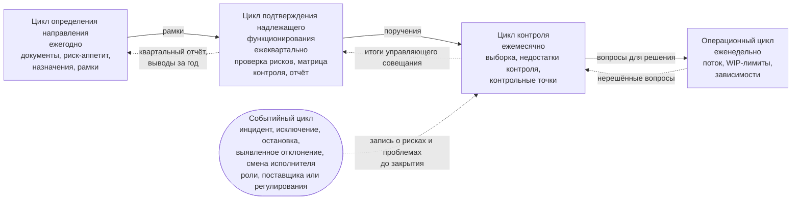

```yaml
source: portal/content/en/governance/the-control-loops.md
source_sha256: 647eadb0eb61eded1d7336ff02fc2d8cfc7d25bef56c982c271c55d7903c0812
translation_status: reviewed
```

# Циклы управления

Контроль за деятельностью AICC как подразделения строится на пяти циклах. Каждый цикл проходит этапы «Планирование — Выполнение — Проверка — Корректировка» со своей периодичностью и на своём мероприятии. Четыре цикла привязаны к календарю — от года до недели; пятый запускается при наступлении события. Рамки каждого цикла устанавливаются в вышестоящем цикле, и туда же возвращаются его подтверждающие материалы; все пять циклов проводятся на мероприятиях, которые уже существуют для управления портфелем и поставки. В этой части циклы описаны и показаны на схеме.

## 1. Пять циклов

| Цикл | Периодичность и мероприятие | Планирование | Проверка | Корректировка | Принимает решение | Записи |
| --- | --- | --- | --- | --- | --- | --- |
| Определение направления | Ежегодно, на ежегодном управляющем совещании в декабре, на следующий год | Рамки года: подтверждение того, что все назначения произведены, Заявление о риск-аппетите в отношении AI и политика, целевые значения показателей уровней зрелости; стратегические приоритеты, инвестиционные бюджеты и инвестиционные ограничения устанавливаются на том же совещании в стратегическом цикле управления портфелем | Выводы и замечания за год, квартальный отчёт за третий квартал, документы в сопоставлении с выводами и замечаниями | Рамки продлеваются или корректируются; руководитель AICC вводит изменения в действие | Куратор AICC; за документы отвечает руководитель AICC | Записи о решении, запись о назначениях, предложение |
| Подтверждение надлежащего функционирования | Ежеквартально, на ежеквартальном управляющем совещании | Собранные подтверждающие материалы: снимок реестра, матрица контроля, запись о рисках и проблемах | Ежеквартальная проверка рисков: открытые риски и проблемы, действующие исключения, наступившие сроки повторной оценки категорий риска, каждое решение категории риска 3, зависимость от поставщиков и владельца платформы, пересмотр прав доступа, сверка инцидентов AI, статус каждой контрольной процедуры и показатели управления, уровень зрелости | Определяются поручения; риск сверх риск-аппетита принимается только с последующим информированием Комитета Совета директоров; квартальный отчёт утверждается и направляется Комитету Совета директоров | Куратор AICC | Квартальный отчёт, снимок реестра |
| Контроль | Ежемесячно, на ежемесячном управляющем совещании | Повестка: ход работы, риски, препятствия, приёмки, события месяца и выборка | Выборка не менее трёх управленческих решений руководителя AICC, отобранных куратором AICC, с указанием доли решений, признанных надлежащими; события месяца и контрольные процедуры, которые они запустили; действующие исключения до истечения их срока; рассмотрения работающих решений за итерацию; недостатки контроля и выявленные отклонения до их устранения | По каждому вопросу — закрытие или эскалация; немедленное управленческое решение по исключению с истёкшим сроком и по просроченному недостатку контроля; фиксация управленческих решений и поручений в итогах управляющего совещания | Куратор AICC; владелец домена — по приёмке решения | Итоги управляющего совещания, журнал решений |
| Операционный | Еженедельно, на еженедельном обзоре | Поток работ, WIP-лимиты, зависимости | Панель показателей и доски | Корректировка работы, обновление реестра, вынесение на вышестоящий уровень вопросов, которые не удаётся решить | Руководитель AICC | Панель показателей, бэклог портфеля |
| Событийный | При наступлении события | Вопрос вносится в запись о рисках и проблемах с указанием ответственного и срока | Рассматривается в порядке, установленном соответствующим разделом; на ежемесячном управляющем совещании — до закрытия | Закрывается с фиксацией выводов по итогам рассмотрения | В соответствии с Операционной моделью для данного события | Запись о рисках и проблемах, запись о решении и подтверждающая запись каждой контрольной процедуры |

## 2. Схема циклов

2.1. На рисунке 1 показаны четыре вложенных календарных цикла: рамки передаются сверху вниз, подтверждающие материалы — снизу вверх, а событийный цикл выходит на ежемесячное управляющее совещание.



Рисунок 1: пять циклов управления.

## 3. События событийного цикла

3.1. Событие вне календаря вносится в запись о рисках и проблемах с указанием ответственного и срока и проходит тот же цикл до закрытия. К таким событиям относятся: инцидент AI и исключение в соответствии с Политикой применения AI; остановка или приостановление и риск сверх риск-аппетита; смена поставщика или изменение регулирования; выявленное отклонение по результатам аудита или надзорной проверки; смена исполнителя роли. Инцидент AI рассматривается в рамках процесса управления инцидентами Банка с участием руководителя AICC как заинтересованного лица, а запись содержит ссылку на соответствующую заявку; вопрос об исключении решает соответствующая контрольная функция; остановка окончательна. Событийный цикл охватывает также контрольные процедуры, которые запускаются шагом работы: принятие взаимодействия с заказчиком, бизнес-кейс, категория риска, проверка или валидация, выпуск, поставщик, развёртывание или вывод из эксплуатации. Каждая такая процедура оставляет свою подтверждающую запись, вносится в запись о рисках и проблемах, только если её статус — «Открыта» или «Недостаток контроля», и рассматривается на ежемесячном управляющем совещании вместе с событиями месяца (п. 6.9 Операционной модели).

## 4. Единый ритм работы и три его аспекта

4.1. Циклы управления подразделением, циклы управления портфелем и циклы поставки проводятся на одних и тех же управляющих совещаниях и еженедельном обзоре; дополнительные совещания не вводятся. Два других аспекта того же календаря описаны в курсах «Портфель» и «Поставка».

## 5. Источник правил

Раздел 6 Операционной модели; раздел 4 Модели управления портфелем; п. 6.7 Модели жизненного цикла решений; раздел 2 рабочего процесса «Управление подразделением» и раздел 3 одноимённого руководства.
