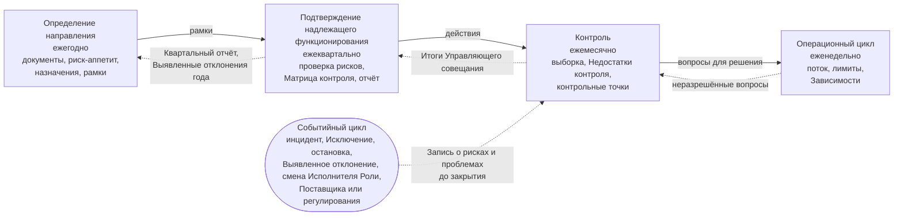

```yaml
source: portal/content/en/governance/the-control-loops.md
source_sha256: 647eadb0eb61eded1d7336ff02fc2d8cfc7d25bef56c982c271c55d7903c0812
translation_status: reviewed
```

# Контрольные циклы

Контроль AICC как подразделения осуществляется через пять циклов, каждый по порядку «Планирование — Выполнение — Проверка — Корректировка» со своим ритмом и площадкой. Четыре следуют Календарю — от года до недели; пятый запускается событием. Цикл получает рамки от вышестоящего и возвращает ему подтверждающие материалы; все пять используют мероприятия, уже проводимые Портфелем и поставкой. Эта часть описывает циклы и показывает их на схеме.

## 1. Пять циклов

| Цикл | Периодичность и площадка | Планирование | Проверка | Корректировка | Кто решает | Записи |
| --- | --- | --- | --- | --- | --- | --- |
| Определение направления | Ежегодно на Ежегодном Управляющем совещании в декабре на следующий год | Рамки года: надлежащее состояние назначений, Заявление о риск-аппетите в отношении ИИ и политика, целевые значения Показателей Уровней зрелости; Стратегические приоритеты, Инвестиционные бюджеты и Инвестиционные ограничения устанавливаются на том же совещании в стратегическом цикле Портфеля | Выявленные отклонения года, Квартальный отчёт третьего квартала, документы относительно отклонений | Продление или корректировка рамок; Руководитель AICC вводит изменения в действие | Куратор AICC; владелец документов — Руководитель AICC | Записи о решениях, Запись о назначениях, Предложение |
| Подтверждение надлежащего функционирования | Ежеквартально на ежеквартальном Управляющем совещании | Собранные подтверждения: Снимок Реестра, Матрица контроля, Запись о рисках и проблемах | Ежеквартальная проверка рисков: открытые риски и проблемы, открытые Исключения, подлежащие пересмотру Категории риска, каждое Решение Категории риска 3, зависимость от Поставщиков и Владельца платформы, пересмотр доступа, сверка Инцидентов ИИ, статус каждой контрольной процедуры и Показатели управления, Уровень зрелости | Определение действий; риск сверх риск-аппетита — только с сообщением Комитету Совета директоров; одобрение Квартального отчёта и его представление Комитету Совета директоров | Куратор AICC | Квартальный отчёт, Снимок Реестра |
| Контроль | Ежемесячно на ежемесячном Управляющем совещании | Повестка: ход работы, риски, препятствия, Приёмки, события месяца и выборка | Выборка не менее трёх Управленческих решений Руководителя AICC, отобранных Куратором AICC, с долей надлежащих решений; события месяца и сработавшие процедуры; открытые Исключения до истечения срока; обзоры текущего состояния за Итерацию; Недостатки контроля и Выявленные отклонения до закрытия | Закрытие или Эскалация каждого вопроса; немедленное решение по истёкшему Исключению и просроченному Недостатку контроля; запись решений и действий в Итогах Управляющего совещания | Куратор AICC; Владелец Домена — по Приёмке Решения | Итоги Управляющего совещания, Журнал решений |
| Операционный | Еженедельно на Еженедельном обзоре | Поток, Лимиты незавершённой работы, Зависимости | Панель показателей и доски | Корректировка работы, обновление Реестра, передача неразрешённых вопросов выше | Руководитель AICC | Панель показателей, Бэклог портфеля |
| Событийный | При возникновении события | Внесение вопроса в Запись о рисках и проблемах с владельцем и сроком | Обработка согласно регулирующему разделу; рассмотрение на ежемесячном Управляющем совещании до закрытия | Закрытие с извлечёнными уроками | Согласно положениям Операционной модели для события | Запись о рисках и проблемах, Запись о решении и Подтверждающая запись каждой контрольной процедуры |

## 2. Схема циклов

2.1. На рисунке 1 показаны четыре вложенных календарных цикла: рамки передаются вниз, подтверждающие материалы — вверх, а событийный цикл поступает на ежемесячное Управляющее совещание.



Рисунок 1: пять контрольных циклов.

## 3. События, обрабатываемые событийным циклом

3.1. Внеплановое событие вносится в Запись о рисках и проблемах с владельцем и сроком и проходит тот же цикл до закрытия: Инцидент ИИ и Исключение по Политике применения искусственного интеллекта; остановка или приостановление и риск сверх риск-аппетита; смена Поставщика или регулирования; замечание аудитора или надзорного органа; смена Исполнителя Роли. Инцидент ИИ обрабатывается в системе управления инцидентами Банка с участием Руководителя AICC как Заинтересованного лица, запись ссылается на заявку; Исключение решает соответствующая Контрольная функция; остановка окончательна. Событийный цикл также охватывает процедуры, запускаемые шагом работы: приём Взаимодействия с заказчиком, экономическое обоснование, Категория риска, Проверка или Валидация, Выпуск, Поставщик, развёртывание или вывод из эксплуатации. Каждая оставляет свою Подтверждающую запись, попадает в Запись о рисках и проблемах только при статусе «Открыта» или «Недостаток контроля» и рассматривается на ежемесячном Управляющем совещании среди событий месяца (Операционная модель 6.9).

## 4. Единый ритм, три аспекта

4.1. Контрольные циклы подразделения, циклы Портфеля и поставки проводятся на одних Управляющих совещаниях и Еженедельном обзоре, не добавляя встреч; курсы «Портфель» и «Поставка» описывают два других аспекта того же Календаря.

## 5. Источник правил

Операционная модель 6; Модель управления портфелем 4; Модель жизненного цикла решений 6.7; Схема процесса управления подразделением 2 и соответствующее руководство 3.
