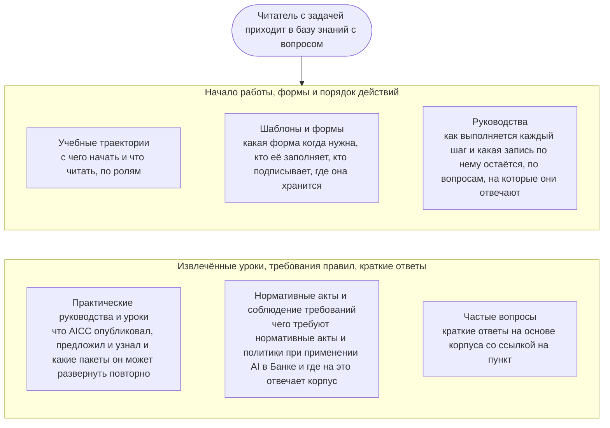

```yaml
source: portal/content/en/knowledge-base/overview.md
source_sha256: 3917b830492282a864e314758b2b7317eec049d3bff8c933ac2097400481e88b
translation_status: reviewed
```

# База знаний

База знаний — это рабочие знания AICC: что читать в первую очередь, какую форму и когда использовать, как выполняется каждый шаг, какие уроки извлечены и чего требуют правила при применении AI в Банке. Она построена вокруг вопросов, с которыми приходит читатель, а материалы — шаблоны, руководства, практические руководства — служат ответами на эти вопросы. Правил здесь нет: правила установлены документами корпуса нормативных документов, а текущие записи хранятся в реестре.

## 1. Навигация по базе знаний



Рисунок 1: разделы базы знаний.

## 2. Где что найти

| Что нужно | Куда перейти |
| --- | --- |
| Узнать, что такое AICC и как он работает, в порядке, подходящем для вашей роли | Учебные траектории |
| Найти форму бизнес-кейса, обязательства, управленческого решения, приёмки или отчёта | Шаблоны и формы |
| Узнать, как проводится взаимодействие с заказчиком, шаг поставки, мероприятие или контрольная процедура и какая запись по ним остаётся | Руководства |
| Узнать, что AICC опубликовал, предложил и узнал и какие пакеты он может развернуть повторно | Практические руководства и уроки |
| Узнать, чего требует нормативный акт или политика Банка при применении AI и где на это отвечает корпус | Нормативные акты и соблюдение требований |
| Быстро получить ответ на распространённый вопрос | Частые вопросы |
| Узнать значение термина | «Терминология и стиль» в разделе «Справочник» |
| Узнать, где хранится запись | «Записи и системы» в разделе «Справочник» |

## 3. Ведение базы знаний

3.1. Шаблоны входят в корпус нормативных документов; каждый шаблон и каждое изменение в нём вводятся в действие записью в журнале решений (п. 4.1 Каталога документов). Руководства размещены рядом с соответствующими рабочими процессами и ведутся вместе с ними. Учебные траектории, практические руководства, страница о нормативных актах и частые вопросы подготовлены для сайта и правил не устанавливают; их ведёт руководитель AICC, а страницу о нормативных актах — вместе с представителями контрольных функций по комплаенсу и правовым вопросам. На каждой странице указана её версия; страница, которая перестала быть полезной читателю, удаляется (п. 5.4 Каталога документов).
