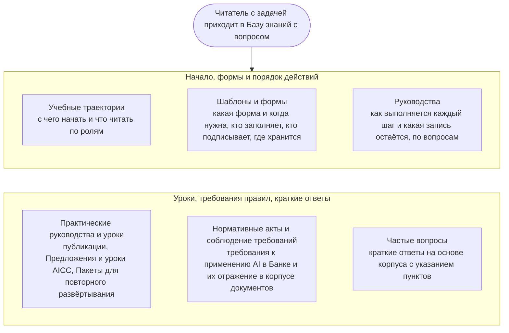

```yaml
source: portal/content/en/knowledge-base/overview.md
source_sha256: 3917b830492282a864e314758b2b7317eec049d3bff8c933ac2097400481e88b
translation_status: reviewed
```

# База знаний

База знаний содержит рабочие знания AICC: что читать сначала, какую форму и когда использовать, как выполняется каждый шаг, какие уроки извлечены и чего требуют правила при применении AI в Банке. Она организована по вопросам читателя; артефакты, шаблоны, руководства и практические материалы служат ответами на них. Здесь не устанавливаются правила: они содержатся в корпусе нормативных документов, а текущие записи — в Реестре.

## 1. Как пользоваться Базой знаний



Рисунок 1: разделы Базы знаний.

## 2. Если необходимо

| Если необходимо | Перейти к |
| --- | --- |
| Узнать, что такое AICC и как он работает, в порядке, подходящем для вашей роли | Учебные траектории |
| Найти форму business case, обязательства, решения, Приёмки, отчёта | Шаблоны и формы |
| Узнать, как проводится Взаимодействие с заказчиком, шаг поставки, мероприятие или контрольная процедура и какая запись остаётся | Руководства |
| Узнать, что AICC опубликовал, предложил и изучил и какие Пакеты может повторно развернуть | Практические руководства и уроки |
| Узнать требования нормативного акта или политики Банка к применению AI и их отражение в корпусе документов | Нормативные акты и соблюдение требований |
| Быстро получить ответ на распространённый вопрос | Частые вопросы |
| Узнать значение термина | «Терминология и стиль» в Справочнике |
| Узнать место хранения записи | «Записи и системы» в Справочнике |

## 3. Как ведётся База знаний

3.1. Шаблоны входят в корпус нормативных документов; каждый Шаблон и каждое изменение к нему вводятся в действие записью в Журнале решений (Каталог документов 4.1). Руководства размещены рядом со workflows и поддерживаются вместе с ними. Учебные траектории, практические материалы, страница нормативных актов и вопросы подготовлены для сайта, не устанавливают правил и ведутся Руководителем AICC; страница нормативных актов — совместно с Представителями контрольных функций комплаенса и юридической функции. Каждая страница указывает свою редакцию; страница, утратившая пользу для читателя, удаляется (Каталог документов 5.4).
