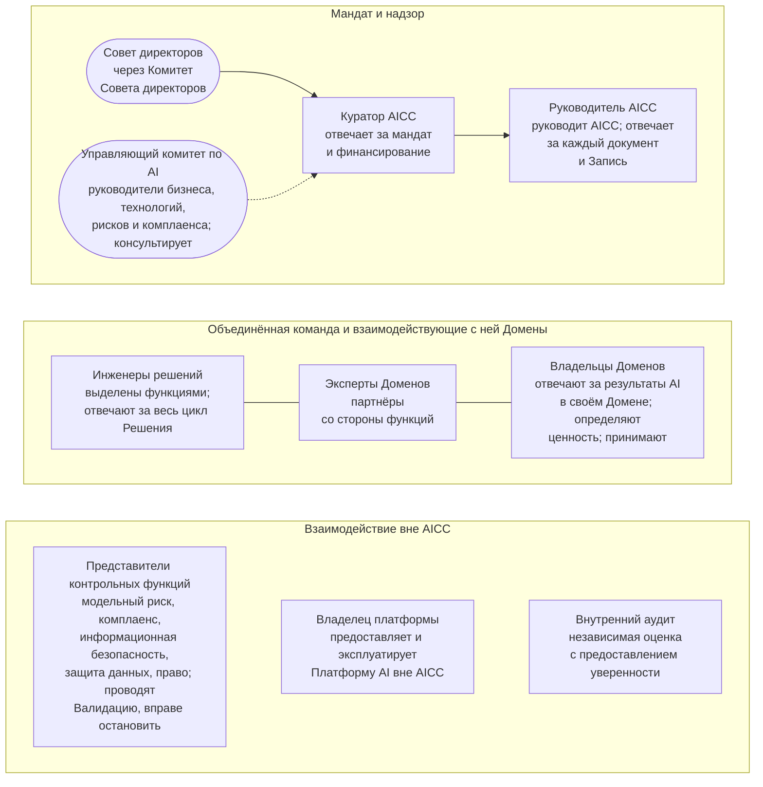

```yaml
source: portal/content/en/organization/overview.md
source_sha256: ed430153024a969ed920cf4aca21db4eb2c1be8b0446e17ee4ef0e82b5425683
translation_status: reviewed
```

# Организация

AICC — объединённая команда под руководством Руководителя AICC, сформированная из сотрудников, выделенных функциями Банка. Она работает совместно с Доменами по мандату Куратора AICC, взаимодействует с Контрольными функциями и Владельцем платформы и находится под надзором Комитета Совета директоров. Организация строится по Ролям: корпус документов определяет действия и решения каждой Роли, а Запись о назначениях указывает её Исполнителя. Этот курс поясняет организацию в шести частях; правила установлены Операционной моделью, которая имеет приоритет.

## 1. Общая схема



Рисунок 1: организация AICC.

## 2. Для чего нужна такая организация

2.1. Организация одновременно учитывает три ограничения. AICC невелик, поэтому один человек может исполнять несколько Ролей в пределах письменных правил разделения обязанностей; метод не меняется при росте Команды. AICC не имеет административных полномочий над выделенными сотрудниками и партнёрами функций, поэтому действует на основании мандата, договорённостей и показанной ценности. AICC не является Контрольной функцией, поэтому лица, проводящие Валидацию, останавливающие работу и дающие независимую оценку, находятся вне него и сохраняют собственную ответственность. Устойчивость обеспечивает определение Ролей: при смене человека корпус документов остаётся прежним, а изменение отражается в Записи о назначениях.

## 3. Отраслевая практика

3.1. Модель следует обычной практике небольшого внутреннего подразделения регулируемой организации: руководитель высшего уровня с мандатом и бюджетом; руководитель подразделения, отвечающий за метод и записи; сотрудники поставки, выделенные функциями с согласия непосредственного руководства; бизнес-владельцы функций, определяющие ценность и принимающие результат; независимые Контрольные функции; платформа, эксплуатируемая вне подразделения; Роли, определённые по ответственности, с учётом Исполнителей, заместителей и заявленных конфликтов. Матрица ответственности Руководства по организации использует общепринятую форму.

## 4. Как читать этот курс

4.1. Часть 2 описывает место AICC в Банке. Часть 3 — семь Ролей. Часть 4 — распределение работы. Часть 5 — назначения, изменения и освобождение от Ролей. Часть 6 — развитие организации из Облегчённого режима. Далее следует Операционная модель с правилами, Ролями и Управленческими решениями; Руководство по организации содержит профили, полную матрицу ответственности и кадровые записи; страницы Ролей подробно описывают каждую Роль.
