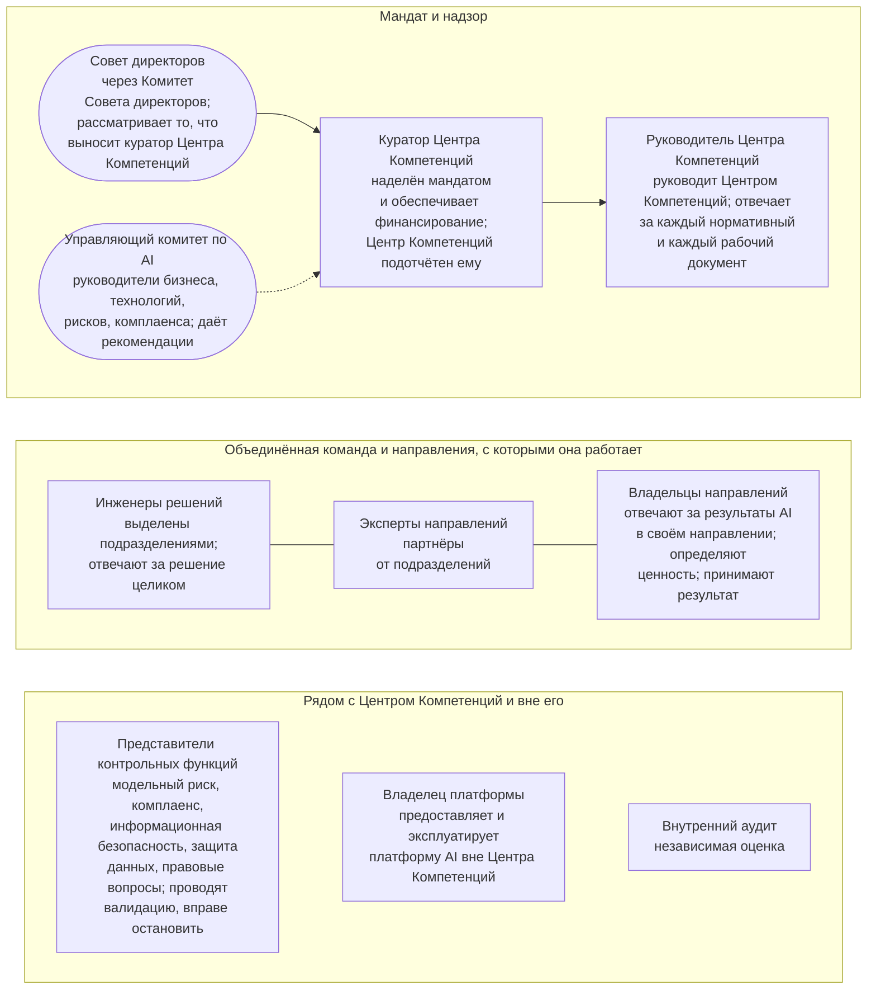

```yaml
source: portal/content/en/organization/overview.md
source_sha256: 46f65835532697eab3298bd7b40bd60884c82a282927312c88e0093de11d404e
translation_status: reviewed
```

# Организация

Центр Компетенций — объединённая команда. Ею руководит руководитель Центра Компетенций, в неё входят работники, которых выделяют подразделения Банка. Команда работает совместно с направлениями по мандату куратора Центра Компетенций, наряду с контрольными функциями и владельцем платформы, под надзором Комитета Совета директоров. Организация строится по ролям, а не по конкретным лицам: корпус документов определяет, что делает и что решает каждая роль, а реестр назначений указывает, кто её исполняет. Этот курс описывает организацию в шести частях. Правила установлены Операционной моделью, и при расхождении применяется она.

## 1. Общая схема



Рисунок 1: организация Центра Компетенций.

## 2. Назначение организационной модели

2.1. Организационная модель одновременно учитывает три ограничения. Во-первых, Центр Компетенций невелик, поэтому один работник может исполнять несколько ролей в пределах письменно установленных правил разделения обязанностей, а метод работы не меняется по мере роста команды. Во-вторых, ни выделенные в Центр Компетенций работники, ни партнёры от подразделений не находятся в его административном подчинении, поэтому Центр Компетенций действует на основании мандата, договорённостей и демонстрируемой ценности, а не распоряжений. В-третьих, Центр Компетенций не является контрольной функцией, поэтому те, кто проводит валидацию, вправе остановить работу и проводит независимую оценку, находятся вне Центра Компетенций и сохраняют собственную ответственность. Устойчивость модели обеспечивает то, что она построена на ролях, а не на конкретных лицах: при смене работника корпус документов не меняется, а изменение отражается в реестре назначений.

## 3. Отраслевая практика

3.1. Модель соответствует распространённой практике небольшого внутреннего подразделения в регулируемой организации: руководитель высшего звена, наделённый мандатом и распоряжающийся бюджетом; руководитель подразделения, отвечающий за метод и рабочие документы; исполнители, выделенные подразделениями с согласия их непосредственных руководителей; бизнес-владельцы в подразделениях, которые определяют ценность и принимают результат; независимые контрольные функции рядом с подразделением; платформа, эксплуатируемая вне подразделения; роли, определённые по ответственности, с учётом их исполнителей, лиц, замещающих исполнителей на период отсутствия, и заявленных конфликтов интересов. Матрица ответственности в Руководстве по организации составлена в общепринятой форме.

## 4. Структура курса

4.1. Часть 2 описывает место Центра Компетенций в Банке, часть 3 — семь ролей, часть 4 — распределение обязанностей по ходу работы, часть 5 — порядок назначения, замены и освобождения работников, часть 6 — развитие организации начиная с облегчённого режима. Далее следует Операционная модель, которая устанавливает правила, роли и полномочия по принятию решений. Руководство по организации содержит профили ролей, полную матрицу ответственности и кадровый учёт; на страницах ролей каждая роль описана полностью.
