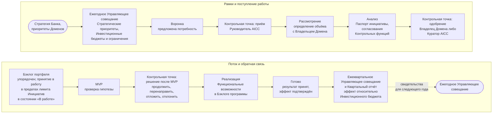

```yaml
source: portal/content/en/portfolio/overview.md
source_sha256: e44e61cbe7afdc549f12bac6ab4f034a7d0d1d462299aa40a2cd7a8c97bb9437
translation_status: reviewed
```

# Портфель

Портфель — место, где Банк определяет работу AICC. Он выполняет две функции: принятие бизнес-решений — получение бизнес-потребностей, их финансирование в соответствии со Стратегическими приоритетами, продолжение, перенаправление, отсрочка или отклонение на основании свидетельств; и цикл управления — работа в фиксированном ритме, ограничение WIP и возвращение полученных знаний в определяющую его стратегию. Курс объясняет работу Портфеля в восьми частях; Модель управления портфелем устанавливает правила и имеет приоритет.

## 1. Общая схема

1.1. Рисунок 1 показывает Портфель от начала до конца: ежегодно устанавливаемые рамки, движение Инициативы по Канбан-доске портфеля и свидетельства, возвращаемые для пересмотра рамок.



Рисунок 1: Портфель от начала до конца.

## 2. Для чего нужен Портфель

2.1. У банка больше полезных идей применения AI, чем людей для их реализации, и риск каждой выше, чем можно предположить по её размеру. Портфель нужен для выбора: направлять работу небольшого подразделения туда, где стратегия видит ценность, проверять гипотезу через MVP до масштабирования, останавливать неработающее и показывать Совету директоров, куда направлены средства и какой результат получен. Это механизм превращения Заявления о намерениях в упорядоченный перечень работы и учёта результатов при формировании рамок следующего года.

2.2. Из Модели управления портфелем следуют три принципа. Финансирование направляется Стратегическим приоритетам и Командам, а не отдельным Инициативам, поэтому решение о начале касается приоритета и места в пределах лимита, а не переговоров о средствах. Каждая Инициатива — гипотеза с business case, проверяемая через MVP до решения о продолжении, чтобы Банк инвестировал в работающие подходы и учился на неработающих. Число Инициатив в состоянии «В работе» ограничено, чтобы поток оставался устойчивым, а немногочисленные начатые работы завершались.

## 3. Отраслевая практика

3.1. Модель следует бережливому управлению портфелем в трёх взаимосвязанных направлениях. Стратегия и финансирование инвестиций: стратегические темы, бюджеты по темам и ограничения, позволяющие принимать решения на местах в согласованных пределах. Операционное управление портфелем: Канбан-доска портфеля с WIP limits, регулярная синхронизация и поток крупных элементов от идеи до завершения. Управление: непрерывное, с небольшой административной нагрузкой, через business case, контрольные точки, показатели и обзор, а не только через комитет в начале и аудит в конце. В модели Банка стратегический цикл с Инвестиционными бюджетами и ограничениями соответствует первому направлению; синхронизация портфеля и ведение бэклога с Канбаном — второму; обзор портфеля с согласованиями Контрольных функций и показателями — третьему. Практика описана в [Отраслевой базе знаний](../reference/industry-body-of-knowledge.md) и на отдельной [справочной странице](../reference/regulations/lean-portfolio-management.md).

## 4. Как читать курс

4.1. Часть 2 устанавливает рамки: Стратегические приоритеты, Инвестиционные бюджеты и Инвестиционные ограничения, а также полномочия по решениям. Часть 3 прослеживает Инициативу по Канбан-доске портфеля. Часть 4 описывает два Режима и единый вход. Часть 5 раскрывает business case и MVP. Часть 6 описывает четыре цикла и управление. Часть 7 объясняет измерение и отслеживание Портфеля: гипотезу и Опережающие индикаторы каждой Инициативы, показатели потока бережливой практики и данные каждого цикла. Часть 8 описывает роли и записи. Далее приведена Модель управления портфелем как источник правил.
