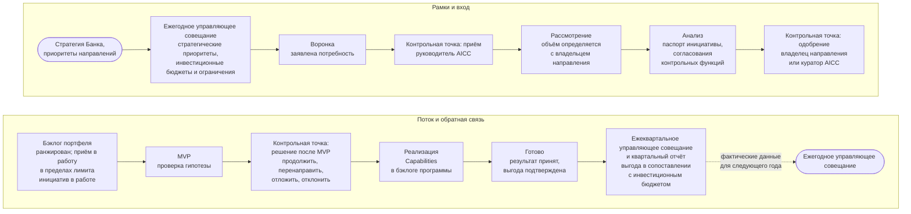

```yaml
source: portal/content/en/portfolio/overview.md
source_sha256: 23bd8feb6dc1c0df09069b28f110bb9e9ba10388d84a5637b8f8e9f5ea67f43b
translation_status: reviewed
```

# Портфель решений

В портфеле Банк определяет, над чем работает AICC. Портфель служит двум целям. Как механизм принятия коммерческих решений он принимает бизнес-потребности, финансирует их в соответствии со стратегическими приоритетами и на основе фактических данных решает, продолжить работу, перенаправить её, отложить или отклонить. Как контур управления он работает в постоянном ритме, удерживает объём незавершённой работы на низком уровне и возвращает полученные выводы в стратегию, которая задала его рамки. Этот курс из восьми частей объясняет, как работает портфель; правила устанавливает Модель управления портфелем, и она имеет приоритет.

## 1. Общая схема

1.1. На рисунке 1 портфель показан целиком: рамки, которые устанавливаются один раз в год, движение инициативы по канбан-доске портфеля и фактические данные, которые возвращаются для пересмотра рамок.



Рисунок 1. Портфель целиком.

## 2. Назначение портфеля

2.1. У банка больше хороших идей применения AI, чем работников, способных их реализовать, а риск каждой идеи выше, чем можно судить по её масштабу. Портфель нужен, чтобы делать выбор: сосредоточить работу небольшого подразделения там, где, согласно стратегии, находится ценность; проверить гипотезу на MVP до масштабирования; остановить то, что не работает; показать куратору AICC, куда направлены средства и что получено взамен, чтобы куратор AICC мог при необходимости представить эти данные Совету директоров. Портфель превращает Заявление о намерениях в ранжированный перечень работ, а результаты этих работ использует для изменения рамок следующего года.

2.2. Из Модели управления портфелем следуют три принципа. Финансирование направляется на стратегические приоритеты и команды, а не на отдельные инициативы, поэтому вопрос о начале работы решается исходя из приоритета и загрузки в пределах лимита, а не путём переговоров о средствах. Каждая инициатива — это гипотеза, подкреплённая бизнес-кейсом; до того как будет решено, продолжать ли её, она проверяется на MVP. Так Банк вкладывает средства в то, что работает, и делает выводы из того, что не работает. Число инициатив в работе ограничено, чтобы поток оставался равномерным, а немногие начатые работы доводились до конца.

## 3. Применяемая отраслевая практика

3.1. Модель следует практике эффективного управления портфелем в том виде, в каком её определяет отрасль, и охватывает три взаимосвязанных направления. Стратегия и инвестиционное финансирование: стратегические темы, бюджеты по каждой теме и ограничения, в согласованных пределах которых вопросы решаются на местах. Операционное управление портфелем: канбан-доска портфеля с WIP-лимитами, регулярная синхронизация и движение крупных элементов от идеи до завершения. Управление: облегчённое и непрерывное — через бизнес-кейс, контрольные точки, показатели и обзор, а не через комитет в начале и аудит в конце. В модели Банка первому направлению соответствует стратегический цикл с инвестиционными бюджетами и инвестиционными ограничениями, второму — синхронизация портфеля и ведение бэклога на канбан-доске, третьему — обзор портфеля с согласованиями контрольных функций и показателями. Практика описана на странице [«Стандарты и методологии»](../reference/industry-body-of-knowledge.md) и на справочной странице [этой практики](../reference/regulations/lean-portfolio-management.md).

## 4. Структура курса

4.1. В части 2 изложены рамки: стратегические приоритеты, инвестиционные бюджеты и инвестиционные ограничения, а также то, кто какие вопросы решает. Часть 3 прослеживает путь инициативы по канбан-доске портфеля. В части 4 описаны два режима и единый вход. В части 5 разъясняются бизнес-кейс и MVP. В части 6 описаны четыре цикла и порядок управления. Часть 7 посвящена измерению и отслеживанию показателей портфеля: гипотезе и опережающим индикаторам каждой инициативы, показателям потока, принятым в бережливой практике, и тому, какие данные использует каждый цикл. В части 8 описаны роли и записи. Далее следует Модель управления портфелем, которая устанавливает правила.
