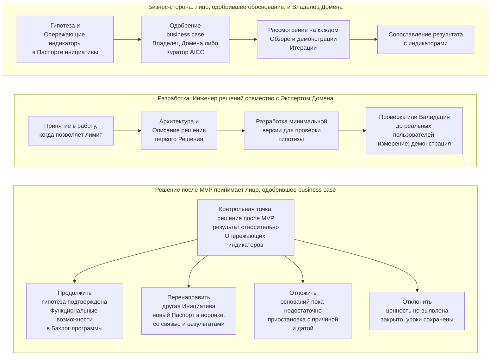

```yaml
source: portal/content/en/portfolio/the-business-case-and-the-mvp.md
source_sha256: 7d66995c8e02238ac0228c1c94f3a0249ed5e7631fcb3609b0f5acff0f83325b
translation_status: reviewed
```

# Business case и MVP

Бизнес-оценку Портфеля обеспечивают два инструмента: одностраничный business case, объясняющее целесообразность Инициативы и способ её подтверждения Банком, и MVP, проверяющий её с минимальными затратами до принятия обязательств. Эта часть объясняет оба инструмента и ранжирование, определяющее очерёдность одобренных Инициатив.

## 1. Паспорт инициативы — краткий business case

1.1. Каждая Инициатива описывается в одностраничном Паспорте инициативы: гипотеза, бизнес-результаты с Опережающими индикаторами, объём и минимально жизнеспособный продукт, затраты и ценность, риски и ожидаемая Категория риска, решение. Числовой показатель Банка остаётся в системе-источнике, на которую ссылается Паспорт. Одна страница требует дисциплины: вопрос, показатель и затраты становятся явными до начала разработки.

1.2. Паспорт одобряется, когда отвечает на пять вопросов.

| Вопрос | Что должен показывать Паспорт |
| --- | --- |
| Зачем нужно изменение? | Соответствие Стратегическому приоритету; гипотеза определяет ценность для указанной функции |
| Какой вариант наилучший? | Для результатов определены от двух до четырёх Опережающих индикаторов с системой-источником, базовым и целевым значениями; MVP проверяет гипотезу с минимальными затратами |
| Доступно ли финансирование? | Затраты находятся в пределах Инвестиционного бюджета Стратегического приоритета |
| Можно ли приобрести и поставить? | Зависимости и поставщики указаны, ожидаемая Категория риска определена, Представители контрольных функций согласовали |
| Можно ли обеспечить надлежащую эксплуатацию? | Владелец Домена, а для Обеспечивающих работ — Куратор AICC, указан и принимает обязательства; Приёмка при поставке определена |

1.3. Эти пять вопросов задаёт финансовый комитет при любых инвестициях; здесь они сведены к одной странице. Их же впоследствии задаёт аудитор, поэтому Паспорт и согласования сохраняются.

## 2. Согласование Контрольных функций

2.1. Для Инициативы с ожидаемой Категорией риска 2 или 3 соответствующие Представители контрольных функций согласовывают business case в пределах полномочий до его одобрения; Представитель, не согласовавший его, вправе остановить работу. Согласование оформляется Заключением контрольной функции со ссылкой в Паспорте. Если впоследствии назначена Категория риска выше согласованной, Паспорт возвращается им. Раннее согласование предусмотрено намеренно: дешевле всего выявить недопустимость применения AI до его создания.

## 3. Ранжирование

3.1. Одобренные Инициативы Бэклога портфеля ранжируются по методу «WSJF»: сумма оценок ценности, срочности и снижения риска или возможности, каждой от одного до пяти, делится на оценку трудоёмкости от одного до пяти. Владелец Домена определяет ценность; Руководитель AICC оценивает остальные составляющие и ранжирует; он вправе отступить от порядка с указанием и фиксацией причины. Метод отдаёт предпочтение небольшим, ценным и срочным работам, которые малому подразделению следует выполнять первыми, и делает порядок бэклога обоснованной записью.

## 4. MVP и решение по его итогам

4.1. MVP имеет две одновременно выполняемые стороны. Бизнес-сторона принадлежит лицу, одобрившему business case, и Владельцу Домена: они отвечают за гипотезу, Опережающие индикаторы и итоговую оценку. Сторона разработки принадлежит Инженеру решений и Эксперту Домена: они определяют архитектуру и Описание решения первого Решения и создают минимальную версию для проверки гипотезы в пределах WIP limits с ограниченным по правилу объёмом. Обе стороны встречаются на каждом Обзоре и демонстрации Итерации и при принятии решения. Рисунок 1 показывает их.



Рисунок 1: MVP, его бизнес-сторона и разработка, четыре последующих пути.

4.2. По завершении MVP лицо, одобрившее business case, сопоставляет результат с Опережающими индикаторами Паспорта и принимает одно из четырёх решений.

| Решение | Когда | Что следует |
| --- | --- | --- |
| Продолжить | Гипотеза подтверждена: индикаторы изменяются согласно Паспорту, Владелец Домена видит ценность | Функциональные возможности Инициативы определяются и вносятся в Бэклог программы в её составе; Инициатива переходит в Реализацию; ежеквартальный обзор продолжает задавать тот же вопрос |
| Перенаправить | Полученные знания требуют другой Инициативы: потребность реальна, подход или объём были неверны | Инициатива закрывается как «Перенаправлено»; новая с полным Паспортом поступает в воронку со связью с первой и результатами MVP и повторно проходит весь цикл |
| Отложить | Оснований для продолжения пока недостаточно: сроки, Зависимость, более высокий приоритет другой работы | Инициатива приостанавливается в состоянии «Отложено» с причиной и датой повторного рассмотрения и возвращается в воронку при возобновлении |
| Отклонить | Ценность не выявлена: индикаторы не изменились либо затраты или риск превышают эффект | Инициатива получает состояние «Отклонено», уроки сохраняются в Бэклоге портфеля; место в лимите Инициатив в состоянии «В работе» получает следующая по порядку Инициатива |

4.3. Решение вносится в Журнал решений с Записью о решении; результат испытания остаётся с Описанием решения. После решения «Продолжить» ежеквартальный обзор задаёт тот же вопрос каждой Инициативе в состоянии «В работе» по её индикаторам и подтверждённому эффекту; Инициатива, индикаторы которой не подтверждают гипотезу, откладывается или отклоняется. Поэтому MVP — первая в серии контрольных точек: Портфель постоянно проверяет целесообразность дальнейшего финансирования.

4.4. Два правила обеспечивают достоверность испытания. Объём первого Решения ограничен по правилу, чтобы MVP проверял гипотезу и не превращался в полную поставку под другим названием. Проверка или Валидация до доступа любых реальных пользователей применяется к MVP как к любому Решению соразмерно Категории риска, поэтому испытание не достигает реальных пользователей без Проверки другим лицом либо Валидации Представителями контрольных функций.

## 5. Источник правил

Модель управления портфелем, разделы 6 и 7; шаблоны Паспорта инициативы и Записи о решении; Политика применения AI 3.2.
