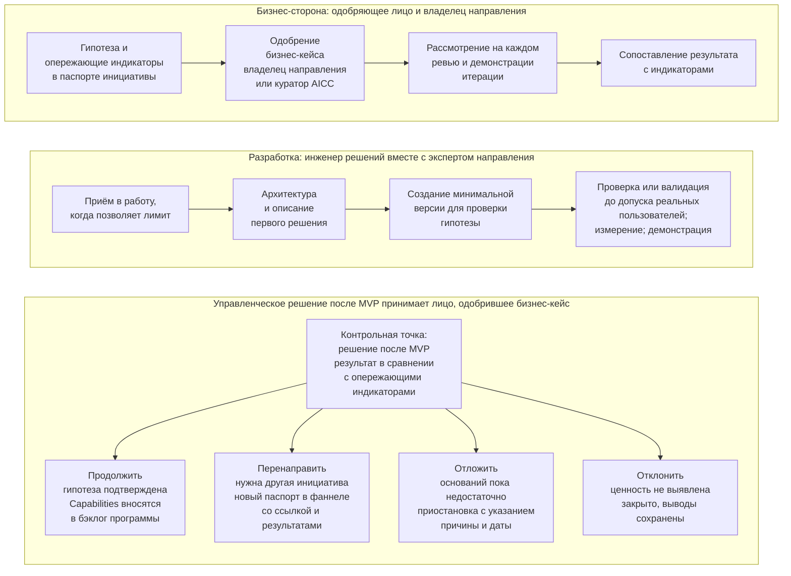

```yaml
source: portal/content/en/portfolio/the-business-case-and-the-mvp.md
source_sha256: 7d66995c8e02238ac0228c1c94f3a0249ed5e7631fcb3609b0f5acff0f83325b
translation_status: reviewed
```

# Бизнес-кейс и MVP

Коммерческую оценку в портфеле обеспечивают два инструмента: одностраничный бизнес-кейс, который объясняет, почему инициативу стоит выполнять и как Банк поймёт, что она удалась, и MVP, на котором она проверяется с наименьшими затратами до того, как Банк примет на себя обязательства. В этой части разъясняются оба инструмента, а также ранжирование, которое определяет, какая из одобренных инициатив начинается первой.

## 1. Паспорт инициативы — облегчённый бизнес-кейс

1.1. Каждая инициатива описывается в одностраничном паспорте инициативы: гипотеза, бизнес-результаты и их опережающие индикаторы, объём и минимально жизнеспособный продукт (MVP), затраты и ценность, риски и ожидаемая категория риска, а также управленческое решение. Числовые показатели Банка хранятся в системах-источниках, а паспорт содержит ссылки на них. Ограничение в одну страницу — это дисциплина, а не упрощение: оно заставляет сформулировать вопрос, показатель и затраты до начала разработки.

1.2. Паспорт одобряется, если он отвечает на пять вопросов, приведённых в следующей таблице.

| Вопрос | Что должен показывать паспорт |
| --- | --- |
| Зачем нужно изменение? | Инициатива соответствует стратегическому приоритету, а гипотеза указывает ценность для названного подразделения |
| Какой вариант лучший? | Для результатов определены от двух до четырёх опережающих индикаторов с указанием системы-источника, базового и целевого значений, а MVP проверяет гипотезу с наименьшими затратами |
| Доступно ли финансирование? | Затраты не превышают инвестиционного бюджета стратегического приоритета |
| Можно ли закупить и внедрить? | Указаны зависимости и поставщики, определена ожидаемая категория риска, получено согласование представителей контрольных функций |
| Можно ли обеспечить надлежащую эксплуатацию? | Указан владелец направления (для обеспечивающих работ — куратор AICC) и подтверждено его согласие принять на себя обязательства; определён порядок приёмки при внедрении |

1.3. Это те же пять вопросов, которые финансовый комитет задаёт при рассмотрении любой инвестиции, только сведённые к одной странице. Их же впоследствии задаёт аудитор, поэтому паспорт и согласования к нему хранятся.

## 2. Согласование контрольных функций

2.1. Если для инициативы ожидается категория риска 2 или 3, соответствующие представители контрольных функций до её одобрения согласовывают бизнес-кейс в пределах своей компетенции; представитель, не согласовавший его, вправе остановить работу. Согласование оформляется заключением контрольной функции, ссылка на которое приводится в паспорте. Если впоследствии присвоена категория риска выше согласованной, паспорт возвращается к ним. Согласование намеренно проводится на раннем этапе: дешевле всего выяснить, что применение AI недопустимо, до того как решение создано.

## 3. Ранжирование

3.1. Одобренные инициативы в бэклоге портфеля ранжируются по методу WSJF: сумма оценок ценности, срочности и снижения риска или открывающейся возможности (каждая — от одного до пяти) делится на оценку трудоёмкости (от одного до пяти). Ценность определяет владелец направления; остальные составляющие оценивает и ранжирует инициативы руководитель AICC. Он вправе отступить от ранжирования, указав причину, и фиксирует её. Метод отдаёт предпочтение небольшим, ценным и срочным работам — именно их небольшому подразделению следует выполнять в первую очередь — и превращает порядок бэклога в обоснованную запись, а не в выражение предпочтений.

## 4. MVP и управленческое решение по его итогам

4.1. У MVP две стороны, которые работают параллельно. Бизнес-сторона — лицо, одобрившее бизнес-кейс, и владелец направления: они отвечают за гипотезу, опережающие индикаторы и итоговую оценку. Сторона разработки — инженер решений вместе с экспертом направления: они определяют архитектуру первого решения, составляют его описание и создают минимальную версию, на которой можно проверить гипотезу, в пределах WIP-лимитов и с объёмом, ограниченным правилом. Обе стороны встречаются на каждом ревью и демонстрации итерации и при принятии управленческого решения. Они показаны на рисунке 1.



Рисунок 1. MVP: бизнес-сторона, сторона разработки и четыре пути после MVP.

4.2. По завершении MVP лицо, одобрившее бизнес-кейс, сопоставляет результат с опережающими индикаторами паспорта и выбирает один из четырёх вариантов, приведённых в следующей таблице.

| Вариант | Условие | Последствия |
| --- | --- | --- |
| Продолжить | Гипотеза подтверждается: индикаторы меняются так, как предполагалось в паспорте, владелец направления видит ценность | Capabilities инициативы определяются и вносятся в бэклог программы в её составе, а инициатива переходит на стадию «Реализация»; на ежеквартальном обзоре этот вопрос задаётся снова |
| Перенаправить | Полученные выводы требуют другой инициативы: потребность реальна, но подход или объём выбраны неверно | Инициатива закрывается в состоянии «Перенаправлено»; новая инициатива с полным паспортом вносится в фаннел со ссылкой на первую и с результатами MVP и заново проходит весь цикл |
| Отложить | Оснований для продолжения пока недостаточно: сроки, зависимость, более высокий приоритет другой работы | Инициатива приостанавливается в состоянии «Отложено» с указанием причины и даты повторного рассмотрения и возвращается в фаннел, когда к ней возвращаются |
| Отклонить | Ценность не выявлена: индикаторы не изменились либо затраты или риск превышают выгоду | Инициатива переводится в состояние «Отклонено», выводы по ней сохраняются в бэклоге портфеля; её место в лимите инициатив в работе переходит к следующей по рангу инициативе |

4.3. Управленческое решение вносится в журнал решений с оформлением протокола решения, а результат MVP хранится вместе с описанием решения. После того как принято решение продолжить работу, на ежеквартальном обзоре тот же вопрос задаётся по каждой инициативе в работе — по её индикаторам и подтверждённой выгоде; инициатива, индикаторы которой не подтверждают гипотезу, откладывается или отклоняется. Поэтому MVP — не разовая контрольная точка, а первая в серии: портфель постоянно возвращается к вопросу, следует ли продолжать финансирование.

4.4. Два правила не позволяют MVP перестать быть честной проверкой гипотезы. Объём первого решения ограничен правилом, чтобы MVP проверял гипотезу, а не превращался во внедрение под другим названием. Кроме того, проверка или валидация до допуска любых реальных пользователей применяется к MVP так же, как к любому решению, соразмерно его категории риска, поэтому MVP не попадает к реальным пользователям без проверки лицом, не участвовавшим в его разработке, или валидации представителями контрольных функций.

## 5. Источник правил

Разделы 6 и 7 Модели управления портфелем; шаблоны «Паспорт инициативы» и «Протокол решения»; пункт 3.2 Политики применения AI.
