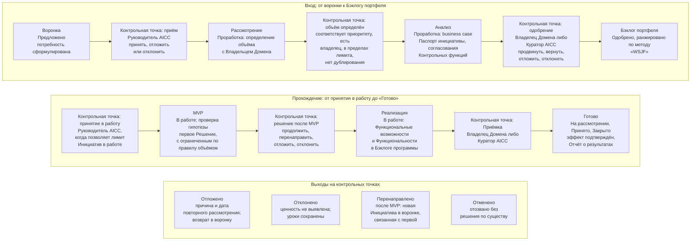

```yaml
source: portal/content/en/portfolio/the-flow.md
source_sha256: a71f8df1cdc3b2b8419932799238a97e7f7f760fee2044917bc893fab8a1974d
translation_status: reviewed
```

# Поток: Канбан-доска портфеля

Инициатива — бизнес-программа, поставляющая одно или несколько Решений. Её жизнь в Портфеле проходит семь шагов с решением на каждом. Поток изображён как Канбан слева направо; каждая стрелка — контрольная точка с уполномоченным лицом и записью. На любой точке Инициатива может выйти из потока через отсрочку, отклонение или перенаправление. Эта часть прослеживает её путь.

## 1. Семь шагов

1.1. Рисунок 1 показывает Канбан-доску портфеля: семь шагов, контрольные точки и пути выхода из потока.



Рисунок 1: Канбан-доска портфеля с контрольными точками и выходами.

| Шаг | Что происходит | Краткий критерий выхода | Кто принимает решение | Запись |
| --- | --- | --- | --- | --- |
| Воронка | Функция, работы по выявлению потребностей или AICC предлагают идею или потребность | Указаны проблема, стратегическая значимость и заявитель | Руководитель AICC принимает, откладывает или отклоняет | Элемент Бэклога портфеля |
| Рассмотрение | Объём потребности определяется с Владельцем Домена | Соответствует Стратегическому приоритету, есть Владелец Домена, лимит допускает, нет дублирования Решения или Пакета каталога | Руководитель AICC совместно с Владельцем Домена | Объём в Паспорте инициативы |
| Анализ | business case подготовлен и согласовано | Паспорт инициативы заполнен, соответствует пяти критериям и согласован Представителями контрольных функций при ожидаемой Категории риска 2 или 3 | Владелец Домена или Куратор AICC | Паспорт инициативы, согласования, Запись о решении |
| Бэклог портфеля | Одобренная Инициатива ранжирована и ожидает места в пределах лимита | Ранжирована по методу «WSJF» и принимается в работу, когда позволяет лимит Инициатив в состоянии «В работе» | Руководитель AICC принимает наиболее приоритетную подходящую Инициативу | Порядок и оценки |
| MVP | Первое Решение проходит пробную реализацию | Гипотеза проверена относительно Опережающих индикаторов | Лицо, одобрившее обоснование, решает продолжить, перенаправить, отложить или отклонить | Описание решения, результат, Журнал решений |
| Реализация | Создаются Функциональные возможности и поставляются Решения | Функциональные возможности внесены в Бэклог программы, Решения поставлены | Владелец Домена или Куратор AICC осуществляет Приёмку | Функциональные возможности в составе Инициативы |
| Готово | Результат рассмотрен и принят | Рассмотрен относительно Опережающих индикаторов и принят | Владелец Домена или Куратор AICC | Приёмка; Отчёт о результатах Взаимодействия с заказчиком |

## 2. Четыре исхода на контрольной точке

2.1. Руководитель AICC представляет Инициативу на контрольной точке с надлежащим образом оформленной записью, а уполномоченное лицо проверяет критерий выхода. Возможны четыре исхода. Продвинуть: переход к следующему шагу. Вернуть: возврат с указанием недостающего и повторением шага. Отложить: оснований для продолжения пока недостаточно; Инициатива остаётся в воронке с причиной и датой повторного рассмотрения. Отклонить: ценность не выявлена, уроки сохраняются. После MVP доступен пятый путь — перенаправление: Инициатива закрывается как «Перенаправлено», новая поступает в воронку со связью с прежней и полученными знаниями. Каждое решение вносится в Журнал решений.

2.2. «Отклонено» и «Отменено» различаются. Отклонение — бизнес-решение по существу. Отмена — отзыв без такого решения: ошибка, дублирование, исчезнувшая потребность либо остановка Контрольной функцией; она доступна в любом состоянии.

## 3. Проработка — исследование, MVP — проверка гипотезы

3.1. Рассмотрение и Анализ вместе составляют Проработку. Проработка изучает потребность и требования, ничего не создаёт и формирует Паспорт инициативы; её затраты — время Руководителя AICC и Владельца Домена. MVP — минимальная версия первого Решения, способная проверить гипотезу, создаваемая Инженером решений с Экспертом Домена в пределах WIP limits. Различие защищает Банк от двух типичных ошибок портфельной работы: разработки до понимания потребности и принятия обязательств до подтверждения идеи.

## 4. Лимит Инициатив в состоянии «В работе»

4.1. Лимит ограничивает число одновременно выполняемых Инициатив, поддерживая небольшой объём WIP Портфеля и устойчивость потока. Руководитель AICC устанавливает его в пределах состава, определённого Куратором AICC на Ежеквартальном Управляющем совещании, и пересматривает на Ежемесячном Управляющем совещании. Именно поэтому существует Бэклог портфеля: одобренная Инициатива ожидает в установленном порядке освобождения места, а Соглашение о взаимодействии не выпускается сверх лимита. Для Команды из трёх человек это важнейшая контрольная мера Портфеля, позволяющая завершать начатое.

## 5. Состояния за Канбаном

5.1. За семью шагами стоят состояния Модели жизненного цикла решений: Предложено, Проработка, Одобрено, В работе, На рассмотрении, Принято и Закрыто; другие пути — Ожидание, Отложено, Перенаправлено, Отклонено и Отменено. Канбан представляет эти состояния для Портфеля; только состояния определяют переходы. В Облегчённом режиме, пока в Команде не более трёх человек, набор сокращён и Инициатива переходит из «В работе» в «На рассмотрении» без промежуточного состояния.

## 6. Источник правил

Модель управления портфелем, раздел 5; Модель жизненного цикла решений, раздел 5; Бизнес-модель 7.2.
