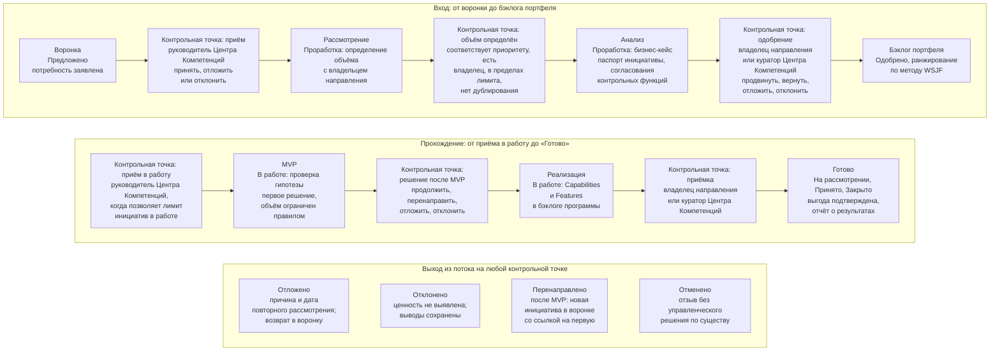

```yaml
source: portal/content/en/portfolio/the-flow.md
source_sha256: 4bd340a5b1a3ebf6096e8602a4c49b48aa9f534ca0ce90d7a92b4f5ed4fdb878
translation_status: reviewed
```

# Поток: канбан портфеля

Инициатива — бизнес-программа, в результате которой создаётся одно или несколько решений. В портфеле она проходит семь шагов, и на каждом принимается управленческое решение. Поток изображается в виде канбана и читается слева направо: каждая стрелка — контрольная точка, у каждой контрольной точки есть уполномоченное лицо и рабочий документ, и на любой из них инициатива может выйти из потока в результате переноса, отклонения или перенаправления. В этой части прослеживается путь инициативы по потоку.

## 1. Семь шагов

1.1. На рисунке 1 показан канбан портфеля: семь шагов, контрольная точка на каждом из них и пути выхода из потока.



Рисунок 1. Канбан портфеля, его контрольные точки и пути выхода из потока.

| Шаг | Содержание | Критерий выхода (кратко) | Уполномоченное лицо | Рабочий документ |
| --- | --- | --- | --- | --- |
| Воронка | Подразделение или Центр Компетенций предлагает идею либо заявляет потребность, или она выявляется в ходе исследовательской работы | Указаны проблема, её стратегическая значимость и заявитель | Руководитель Центра Компетенций принимает элемент, откладывает или отклоняет его | Элемент бэклога портфеля |
| Рассмотрение | Объём потребности определяется вместе с владельцем направления | Потребность соответствует стратегическому приоритету, у неё есть владелец направления, лимит позволяет принять её, она не дублирует решение или пакет каталога | Руководитель Центра Компетенций вместе с владельцем направления | Объём в паспорте инициативы |
| Анализ | Бизнес-кейс подготовлен и согласован | Паспорт инициативы заполнен, соответствует пяти критериям и, если ожидается категория риска 2 или 3, согласован представителями контрольных функций | Владелец направления или куратор Центра Компетенций | Паспорт инициативы, согласования, протокол решения |
| Бэклог портфеля | Одобренная инициатива ранжируется и ожидает места в пределах лимита | Инициатива ранжирована по методу WSJF и принимается в работу, когда позволяет лимит инициатив в работе | Руководитель Центра Компетенций принимает в работу инициативу с наивысшим рангом, которая помещается в лимит | Ранг и оценки |
| MVP | На первом решении проверяется гипотеза | Гипотеза проверена по опережающим индикаторам | Лицо, одобрившее инициативу, решает, продолжить её, перенаправить, отложить или отклонить | Описание решения, результат, журнал решений |
| Реализация | Создаются Capabilities, решения внедряются | Capabilities внесены в бэклог программы, решения внедрены | Приёмку проводит владелец направления или куратор Центра Компетенций | Capabilities в составе инициативы |
| Готово | Результат рассмотрен и принят | Результат рассмотрен по опережающим индикаторам и принят | Владелец направления или куратор Центра Компетенций | Приёмка; отчёт о результатах взаимодействия с заказчиком |

## 2. Четыре исхода на контрольной точке

2.1. Руководитель Центра Компетенций выносит инициативу на контрольную точку с надлежащим образом оформленным элементом бэклога, а уполномоченное лицо оценивает, выполнен ли критерий выхода. Возможен один из четырёх исходов. Продвинуть: инициатива переходит на следующий шаг. Вернуть: инициатива возвращается на доработку с перечнем замечаний, и шаг повторяется. Отложить: оснований для продолжения пока недостаточно; инициатива остаётся в воронке с указанием причины и даты повторного рассмотрения. Отклонить: ценность не выявлена, выводы сохраняются. После MVP есть и пятый путь — перенаправление: инициатива закрывается в состоянии «Перенаправлено», а в воронку вносится новая инициатива со ссылкой на прежнюю, в которой учтены полученные выводы. Каждое управленческое решение вносится в журнал решений.

2.2. Состояния «Отклонено» и «Отменено» различаются. Отклонение — управленческое решение по существу. Отмена — отзыв без такого решения: из-за ошибки, дублирования, отпавшей потребности или остановки работы контрольной функцией; отменить инициативу можно в любом состоянии.

## 3. Проработка как исследование и MVP как проверка гипотезы

3.1. Рассмотрение и анализ вместе составляют проработку. В ходе проработки изучаются потребность и требования, ничего не создаётся, а результатом становится паспорт инициативы, а затраты на проработку — это время руководителя Центра Компетенций и владельца направления. MVP — минимальная версия первого решения, на которой можно проверить гипотезу; его создаёт инженер решений вместе с экспертом направления в пределах WIP-лимитов. Такое разграничение защищает Банк от двух типичных ошибок управления портфелем: начинать разработку, не поняв потребность, и принимать обязательства, не подтвердив идею.

## 4. Лимит инициатив в работе

4.1. Лимит ограничивает число инициатив, одновременно находящихся в работе, чтобы объём незавершённой работы портфеля оставался небольшим, а поток — равномерным. Руководитель Центра Компетенций устанавливает лимит в пределах структуры инициатив, которую куратор Центра Компетенций определяет на ежеквартальном управляющем совещании, и пересматривает его на ежемесячном управляющем совещании. Именно из-за лимита существует бэклог портфеля: одобренная инициатива ожидает в порядке ранжирования, пока не освободится место, а соглашение о взаимодействии сверх лимита не оформляется. Для команды из трёх человек лимит — самая важная мера контроля портфеля: именно он заставляет небольшое подразделение доводить работу до конца.

## 5. Состояния, на которых основан канбан

5.1. За семью шагами стоят состояния Модели жизненного цикла решений: «Предложено», «Проработка», «Одобрено», «В работе», «На рассмотрении», «Принято» и «Закрыто», а также другие пути — «Ожидание», «Отложено», «Перенаправлено», «Отклонено» и «Отменено». Канбан отображает эти состояния для портфеля; элементы перемещаются только при смене состояния. В облегчённом режиме, пока в команде не более трёх человек, набор состояний меньше, и инициатива переходит из состояния «В работе» в состояние «На рассмотрении» без промежуточного состояния.

## 6. Источник правил

Раздел 5 Модели управления портфелем; раздел 5 Модели жизненного цикла решений; пункт 7.2 Бизнес-модели.
