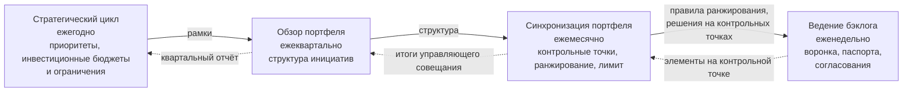
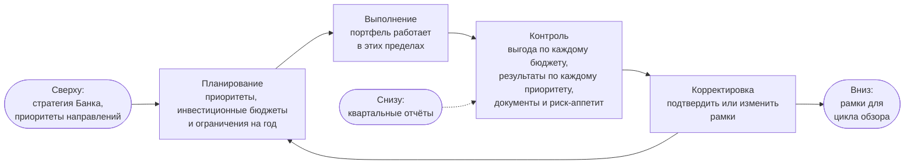
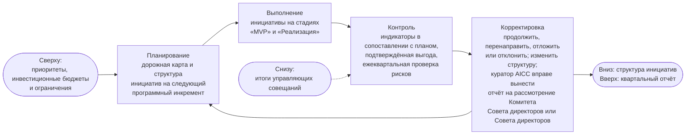
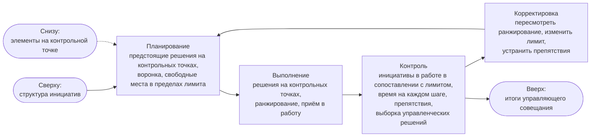
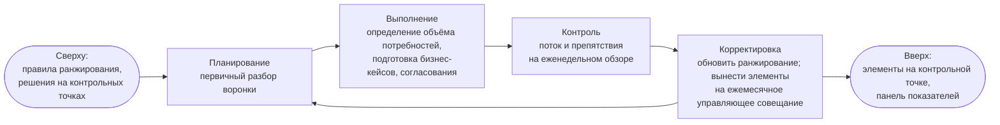

```yaml
source: portal/content/en/portfolio/the-loops-and-governance.md
source_sha256: 77b370f88c3f2a09e9a9efc8707f8350b1d9e6995f4c5ba381dd3ecc978b3b1f
translation_status: reviewed
```

# Циклы и управление

Портфелем управляют посредством четырёх циклов; каждый из них построен по схеме «планирование — выполнение — контроль — корректировка» и имеет свою периодичность и своё мероприятие. Рамки каждого цикла задаёт вышестоящий цикл, и ему же возвращаются фактические данные, поэтому стратегия, которую куратор AICC определяет по согласованию с Советом директоров, доходит до работы недели за три шага, а фактические данные недели за те же три шага доходят до куратора AICC на ежегодном управляющем совещании. Оттуда куратор AICC вправе вынести их на рассмотрение Комитета Совета директоров или Совета директоров. Циклы проводятся на существующих мероприятиях; дополнительные совещания не вводятся. В этой части разъясняются циклы и управление, которое на них основано.

## 1. Четыре цикла

| Цикл | Периодичность и мероприятие | Предмет планирования | Предмет контроля | Действия | Уполномоченное лицо | Рабочий документ |
| --- | --- | --- | --- | --- | --- | --- |
| Стратегический | Ежегодно, на ежегодном управляющем совещании в декабре | Стратегические приоритеты, инвестиционные бюджеты, инвестиционные ограничения | Выгода в сопоставлении с каждым инвестиционным бюджетом, результаты по каждому приоритету, документы и риск-аппетит | Подтверждает или корректирует рамки | Куратор AICC с учётом рекомендаций Управляющего комитета по AI | Список приоритетов, протоколы решений |
| Обзор портфеля | Ежеквартально, на ежеквартальном управляющем совещании | Дорожная карта и структура инициатив на следующий программный инкремент в пределах инвестиционных бюджетов | По каждой инициативе в работе — опережающие индикаторы в сопоставлении с планом, выгода, подтверждённая владельцем направления, ежеквартальная проверка рисков | По каждой инициативе решает, продолжить её, перенаправить, отложить или отклонить; корректирует структуру инициатив; куратор AICC утверждает квартальный отчёт и вправе вынести его на рассмотрение Комитета Совета директоров или Совета директоров | Лицо, одобрившее соответствующую инициативу (владелец направления или куратор AICC); по структуре инициатив — куратор AICC | Квартальный отчёт, снимок папки, журнал решений |
| Синхронизация портфеля | Ежемесячно, на ежемесячном управляющем совещании | Повестка: управленческие решения, которые предстоит принять на контрольных точках, воронка, свободные места в пределах лимита | Поток: число инициатив в работе в сопоставлении с лимитом, время на каждом шаге, препятствия, выборка управленческих решений руководителя AICC | Принимает управленческие решения на контрольных точках, ранжирует, принимает в работу, пересматривает ранжирование, корректирует лимит, устраняет препятствия | На контрольных точках — лицо, одобрившее соответствующую инициативу; председательствует куратор AICC; руководитель AICC проводит совещание, ранжирует и принимает в работу | Итоги управляющего совещания, бэклог портфеля |
| Ведение бэклога | Еженедельно, на еженедельном обзоре | Первичный разбор воронки | Поток и препятствия | Определяет объём потребностей, готовит бизнес-кейсы, получает согласования, обновляет ранжирование, выносит элементы, достигшие контрольной точки, на ежемесячное управляющее совещание | Руководитель AICC | Панель показателей, паспорта инициатив |

## 2. Вложенность циклов

2.1. На рисунке 1 показано, как рамки передаются вниз, а фактические данные — вверх.



Рисунок 1. Четыре цикла: рамки передаются вниз, фактические данные — вверх.

## 3. Схема каждого цикла

3.1. Каждый цикл построен по схеме «планирование — выполнение — контроль — корректировка». На рисунках 2–5 циклы показаны в одной форме: что поступает сверху, четыре шага и что передаётся вниз и вверх.



Рисунок 2. Стратегический цикл: ежегодно, на ежегодном управляющем совещании.



Рисунок 3. Цикл обзора портфеля: ежеквартально, на ежеквартальном управляющем совещании.



Рисунок 4. Цикл синхронизации портфеля: ежемесячно, на ежемесячном управляющем совещании; проводит руководитель AICC.



Рисунок 5. Цикл ведения бэклога: еженедельно, на еженедельном обзоре; проводит руководитель AICC.

## 4. Портфель как контур управления

4.1. Эти циклы проводятся на тех же мероприятиях, что и циклы управления Операционной модели: те управляют подразделением, а эти — инициативами. Стратегический цикл проводится на ежегодном управляющем совещании наряду с циклом определения направления, обзор портфеля — на ежеквартальном управляющем совещании наряду с циклом подтверждения надлежащего функционирования, синхронизация портфеля — на ежемесячном управляющем совещании наряду с циклом контроля, ведение бэклога — на еженедельном обзоре наряду с операционным циклом (п. 6.1 Операционной модели). Они используют один и тот же журнал решений и один и тот же снимок папки. Именно поэтому небольшое подразделение способно управлять портфелем: один рабочий цикл, один набор мероприятий и один набор рабочих документов, которые используются для двух целей.

4.2. Управление, которое обеспечивает портфель, непрерывно и не создаёт лишней нагрузки. Бизнес-кейс и согласования к нему — контроль на входе; контрольные точки и журнал решений — контроль в ходе потока; ежеквартальный обзор с проверкой рисков и подтверждённой выгодой — контроль при продолжении работы; квартальный отчёт, который утверждает куратор AICC и вправе вынести на рассмотрение Комитета Совета директоров или Совета директоров, — контроль портфеля в целом. Чтобы остановить работу, не нужно ждать ежегодного обзора, и никакая работа не начинается лишь по указанию комитета, без бизнес-кейса и проверки гипотезы на MVP.

## 5. Мероприятия

5.1. На ежемесячном управляющем совещании ведётся текущая работа портфеля: рассматриваются предстоящие управленческие решения на контрольных точках, воронка, свободные места в пределах лимита и выборка не менее чем из трёх управленческих решений руководителя AICC, отобранных куратором AICC. Ежеквартальное управляющее совещание посвящено обзору: по очереди рассматривается каждая инициатива в работе, руководитель AICC представляет её индикаторы, владелец направления подтверждает выгоду, одобрившее лицо принимает управленческое решение, а результат включается в квартальный отчёт, который куратор AICC утверждает и вправе вынести на рассмотрение Комитета Совета директоров или Совета директоров. Ежегодное управляющее совещание, проводимое в декабре, посвящено стратегии. Управляющий комитет по AI, в который входят назначенные куратором AICC руководители бизнес-подразделений, а также подразделений по технологиям, рискам и комплаенсу, даёт рекомендации на каждом из этих совещаний и управленческих решений не принимает.

## 6. Источник правил

Раздел 4 Модели управления портфелем; раздел 6 Операционной модели; раздел 6 Модели жизненного цикла решений; workflow и руководства «Контроль работы подразделения» и «Рабочий цикл».
