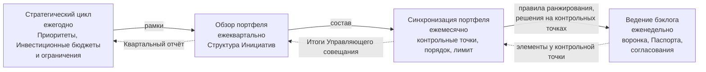
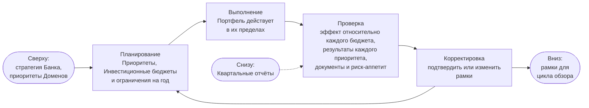
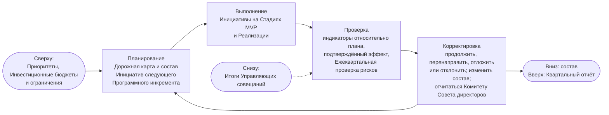
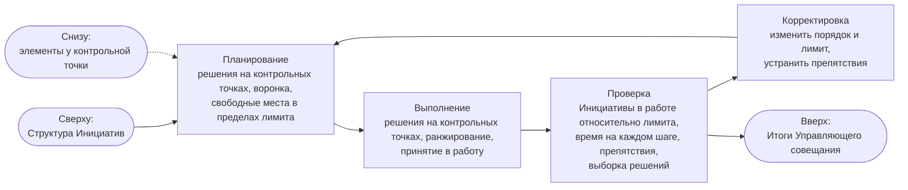
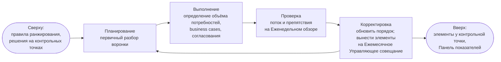

```yaml
source: portal/content/en/portfolio/the-loops-and-governance.md
source_sha256: be68c1c6f3d5c4fd4aadfdf780b3f34b2ba3f35d198bee6b78d5bb2d5a757ee3
translation_status: reviewed
```

# Циклы и управление

Портфель управляется четырьмя циклами, каждый следует порядку «Планирование — Выполнение — Проверка — Корректировка» со своим ритмом и органом рассмотрения. Цикл получает рамки от вышестоящего и возвращает ему свидетельства: стратегическое решение Совета директоров доходит до недельной работы за три шага, а свидетельства недели — до Совета директоров за три. Циклы используют существующие мероприятия и не добавляют встреч. Эта часть объясняет циклы и осуществляемое через них управление.

## 1. Четыре цикла

| Цикл | Ритм и мероприятие | Планирует | Проверяет | Корректирует | Кто принимает решение | Запись |
| --- | --- | --- | --- | --- | --- | --- |
| Стратегический | Ежегодно, на Ежегодном Управляющем совещании в декабре | Стратегические приоритеты, Инвестиционные бюджеты, Инвестиционные ограничения | Эффект относительно каждого бюджета, результаты каждого приоритета, документы и риск-аппетит | Подтверждает или корректирует рамки | Куратор AICC при консультации Управляющего комитета по AI | Запись о приоритетах, Записи о решениях |
| Обзор портфеля | Ежеквартально, на Ежеквартальном Управляющем совещании | Дорожную карту и Структуру Инициатив следующего Программного инкремента в пределах бюджетов | Для каждой Инициативы в состоянии «В работе» — Опережающие индикаторы относительно плана, эффект, подтверждаемый Владельцем Домена, Ежеквартальную проверку рисков | Продолжает, перенаправляет, откладывает или отклоняет каждую; корректирует состав; отчитывается Комитету Совета директоров | Лицо, одобрившее каждую Инициативу (Владелец Домена или Куратор AICC); по составу — Куратор AICC | Квартальный отчёт, Снимок Реестра, Журнал решений |
| Синхронизация портфеля | Ежемесячно, на Ежемесячном Управляющем совещании | Повестку: подлежащие принятию решения на контрольных точках, воронку, свободные места в пределах лимита | Поток: Инициативы в работе относительно лимита, время на каждом шаге, препятствия, выборку решений Руководителя AICC | Принимает решения на контрольных точках, ранжирует, принимает в работу, меняет порядок и лимит, устраняет препятствия | На контрольных точках — лицо, одобряющее Инициативу; председательствует Куратор AICC; Руководитель AICC проводит, ранжирует и принимает в работу | Итоги Управляющего совещания, Бэклог портфеля |
| Ведение бэклога | Еженедельно, на Еженедельном обзоре | Первичный разбор воронки | Поток и препятствия | Определяет объём потребностей, готовит business cases, получает согласования, обновляет порядок, выносит элементы у контрольной точки на Ежемесячное Управляющее совещание | Руководитель AICC | Панель показателей, Паспорта инициатив |

## 2. Вложенность циклов

2.1. Рисунок 1 показывает передачу рамок вниз и свидетельств вверх.



Рисунок 1: четыре цикла, рамки вниз и свидетельства вверх.

## 3. Схемы каждого цикла

3.1. Каждый цикл следует порядку «Планирование — Выполнение — Проверка — Корректировка». Рисунки 2–5 используют одну форму: вход сверху, четыре шага, выходы вниз и вверх.



Рисунок 2: стратегический цикл, ежегодно на Ежегодном Управляющем совещании.



Рисунок 3: цикл обзора портфеля, ежеквартально на Ежеквартальном Управляющем совещании.



Рисунок 4: цикл синхронизации портфеля, ежемесячно на Ежемесячном Управляющем совещании, проводит Руководитель AICC.



Рисунок 5: цикл ведения бэклога, еженедельно на Еженедельном обзоре, проводит Руководитель AICC.

## 4. Портфель как цикл управления

4.1. Эти циклы используют те же мероприятия, что и циклы управления Операционной модели, управляющие подразделением, тогда как портфельные управляют Инициативами: стратегический цикл действует на Ежегодном Управляющем совещании вместе с циклом определения направления; обзор портфеля — на Ежеквартальном Управляющем совещании вместе с циклом подтверждения надлежащего функционирования; синхронизация портфеля — на Ежемесячном Управляющем совещании вместе с циклом контроля; ведение бэклога — на Еженедельном обзоре вместе с операционным циклом (Операционная модель 6.1). Они используют один Журнал решений и один Снимок Реестра. Это позволяет небольшому подразделению управлять Портфелем: один ритм, одни органы рассмотрения, одни записи для двух целей.

4.2. Управление непрерывно и не создаёт избыточной нагрузки. business case и согласования обеспечивают контроль в начале; контрольные точки и Журнал решений — в ходе потока; ежеквартальный обзор с проверкой рисков и подтверждённым эффектом — при продолжении; Квартальный отчёт Комитету Совета директоров — для целого. Для остановки не требуется ждать ежегодного обзора; работа не начинается только по указанию комитета без обоснования и проверки гипотезы.

## 5. Органы рассмотрения

5.1. Ежемесячное Управляющее совещание — рабочий орган Портфеля: подлежащие принятию решения на контрольных точках, воронка, свободные места в пределах лимита и выборка не менее трёх Управленческих решений Руководителя AICC, отобранных Куратором AICC. Ежеквартальное Управляющее совещание — орган обзора: каждая Инициатива в состоянии «В работе» рассматривается по очереди; Руководитель AICC показывает индикаторы, Владелец Домена подтверждает эффект, уполномоченное лицо принимает решение, результат включается в Квартальный отчёт, направляемый Куратором AICC Комитету Совета директоров. Ежегодное Управляющее совещание в декабре — стратегический орган. Управляющий комитет по AI, включающий назначенных Куратором AICC руководителей бизнес-, технологической, риск- и комплаенс-функций, консультирует на каждом совещании и не принимает решений.

## 6. Источник правил

Модель управления портфелем, раздел 4; Операционная модель, раздел 6; Модель жизненного цикла решений, раздел 6; workflows и Руководства по управлению подразделением и ритму работы.
