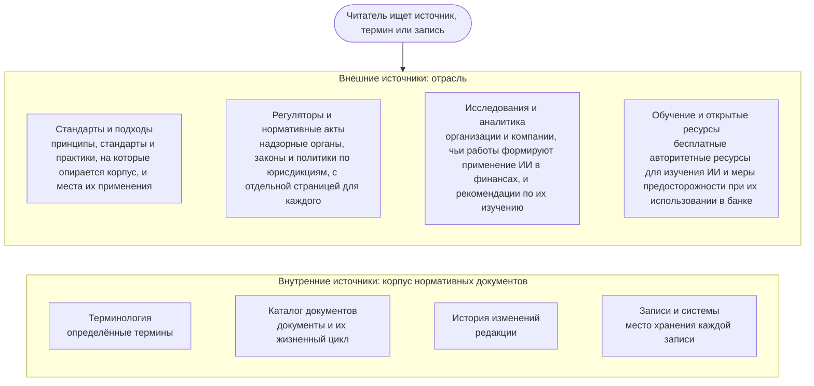

```yaml
source: portal/content/en/reference/overview.md
source_sha256: 18959ce4244ff1717995f14ba499635b637bc96a8f9384d64e08940e36a20cd0
translation_status: reviewed
```

# Справочные материалы

Раздел справочных материалов направляет читателя к внешним и внутренним источникам: к органам, регулирующим ИИ, стандартам и подходам, на которые опирается корпус нормативных документов, исследованиям, формирующим отрасль, и открытым учебным ресурсам; к терминологии, каталогу, истории и записям самого корпуса. Это отобранная карта источников, а не поисковая система: каждая запись объясняет, что представляет собой источник, почему он важен для Банка, как и для чего его использовать. Само включение сюда не налагает обязательств на Банк; правила устанавливают документы корпуса, а Представители контрольных функций подтверждают применимость.

## 1. Как пользоваться справочными материалами



Рисунок 1: разделы справочных материалов.

## 2. Как работать с внешним источником

2.1. Четыре правила применяются к каждому приведённому источнику. Учитывайте его природу: закон обязывает, стандарт задаёт критерий, методологическая система предлагает метод, консалтинговая компания продаёт, поставщик продвигает, исследователь выдвигает предположение. Предпочитайте первоисточник: страницу самого регулятора — её пересказу, стандарт — статье о нём. Проверяйте дату: область меняется каждый квартал, а двухлетняя статья о генеративном ИИ уже относится к истории. Прежде чем принимать рекомендацию источника, выясните, что устанавливают собственные правила Банка; при расхождении действует корпус нормативных документов до его изменения Управленческим решением.

## 3. Безопасное использование внешних ресурсов

3.1. Перечисленные ресурсы общедоступны и авторитетны; их используют в рамках правил Банка по работе с его системами и информацией. Никакие данные Банка, клиентов или сотрудников и никакие внутренние документы не вводятся на внешние сайты, в инструменты, формы или модели независимо от ресурса; чтение разрешено, передача информации — нет. Регистрация с рабочим адресом допускается только в случаях, разрешённых правилами Банка. Материалы поставщика или консалтинговой компании рассматриваются как позиция соответствующей стороны. Платный источник включается для осведомлённости, а доступ приобретается только по правилам закупок Банка. Включение в перечень не означает одобрения; модель или сервис, найденные через ресурс, допускаются в Банк только после проверки поставщика по Политике применения искусственного интеллекта. Руководитель AICC ведёт перечни и удаляет устаревшие записи.

## 4. Категории

| Категория | Содержание | Переход |
| --- | --- | --- |
| Стандарты и подходы | Согласованные правительствами принципы, стандарты управления и риска, перечень угроз безопасности, практики портфеля, поставки, обслуживания и контроля, лежащие в основе корпуса | Стандарты и подходы |
| Регуляторы и нормативные акты | Надзорные органы и законы Кыргызской Республики, Казахстана, Российской Федерации, Европейского союза, США и международные организации | Регуляторы и нормативные акты |
| Исследования и аналитика | Организации, чьи доклады формируют применение ИИ в финансах, консалтинговые компании, академические обсерватории, пресса о финансовых технологиях | Исследования и аналитика |
| Обучение и открытые ресурсы | Курсы, рассылки, репозитории открытых моделей и статей, базы знаний по безопасности и инцидентам с мерами предосторожности для банка | Обучение и открытые ресурсы |
| Собственные справочные материалы корпуса | Терминология, Каталог документов, История изменений, Записи и системы | Страницы ниже в этом разделе |
