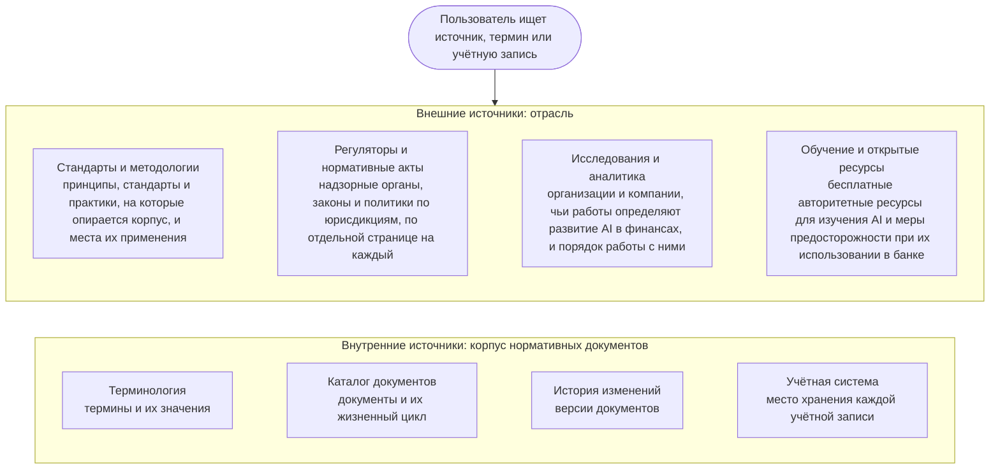

```yaml
source: portal/content/en/reference/overview.md
source_sha256: 18959ce4244ff1717995f14ba499635b637bc96a8f9384d64e08940e36a20cd0
translation_status: reviewed
```

# Справочник

Раздел «Справочник» ведёт к внешним и внутренним источникам. Внешние источники — органы, регулирующие AI, стандарты и методологии, на которые опирается корпус нормативных документов, исследования, определяющие развитие отрасли, и открытые учебные ресурсы. Внутренние — терминология, Каталог документов, история изменений и учётные записи самого корпуса. Раздел представляет собой отобранную карту источников, а не поисковую систему: по каждому источнику указано, что он собой представляет, чем он важен для Банка, как и для чего его использовать. Материалы раздела не создают обязательств для Банка: правила устанавливают документы корпуса, а требования, применимые к Банку, определяют представители контрольных функций.

## 1. Навигация по справочнику



Рисунок 1: разделы справочника.

## 2. Работа с внешними источниками

2.1. К каждому источнику из этого раздела применяются четыре правила. Первое — учитывать, что представляет собой источник: закон обязывает, стандарт служит мерилом, методология предлагает метод, консалтинговая компания продаёт свои услуги, поставщик продвигает свой продукт, исследователь выдвигает гипотезу. Второе — обращаться к первоисточнику: к странице самого регулирующего органа, а не к её пересказу, к тексту стандарта, а не к статье в блоге о нём. Третье — смотреть на дату: отрасль меняется каждый квартал, и статья о генеративном AI двухлетней давности уже относится к истории. Четвёртое — прежде чем применять рекомендацию источника, выяснить, что предусматривают собственные правила Банка. При расхождении действует корпус нормативных документов, пока он не изменён управленческим решением.

## 3. Безопасное использование внешних ресурсов

3.1. Перечисленные ресурсы общедоступны и пользуются авторитетом. Их используют с соблюдением правил Банка об использовании его систем и информации. Данные Банка, данные клиентов и работников, а также внутренние документы не вводятся ни на внешние сайты, ни во внешние инструменты, формы или модели, каким бы ни был ресурс: читать можно свободно, передавать — нельзя. Регистрироваться с рабочим адресом допускается только в случаях, разрешённых правилами Банка. Материалы поставщика или консалтинговой компании воспринимаются как позиция этой стороны. Платный источник указан для сведения; доступ к нему приобретается только в соответствии с правилами закупок Банка. Включение ресурса в перечень не означает его одобрения. Модель или сервис, найденные с помощью ресурса, допускаются в Банк только после проверки поставщика в соответствии с Политикой применения AI. Руководитель AICC ведёт перечни и исключает из них устаревшие материалы.

## 4. Категории

| Категория | Содержание | Страница |
| --- | --- | --- |
| Стандарты и методологии | Принципы, согласованные правительствами; стандарты управления и управления рисками; перечень угроз безопасности; практики управления портфелем, разработки и внедрения, управления услугами и внутреннего контроля, на которых построен корпус | Стандарты и методологии |
| Регуляторы и нормативные акты | Надзорные органы и законодательство Кыргызской Республики, Казахстана, Российской Федерации, Европейского союза и США, а также международные организации | Регуляторы и нормативные акты |
| Исследования и аналитика | Организации, доклады которых определяют развитие AI в финансах; консалтинговые компании; академические обсерватории; пресса о финансовых технологиях | Исследования и аналитика |
| Обучение и открытые ресурсы | Курсы, рассылки, репозитории открытых моделей и научных статей, базы знаний о безопасности AI и инцидентах — с мерами предосторожности, которые соблюдает банк | Обучение и открытые ресурсы |
| Собственные справочные материалы корпуса | Терминология, Каталог документов, История изменений, Учётная система | Страницы ниже в этом разделе |
