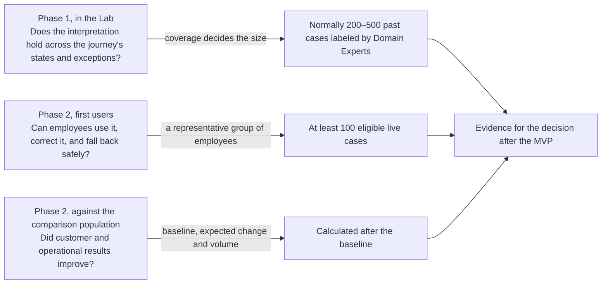

## Charter: Initiative Brief and measurement annex {#charter-initiative-brief}

This page is the project charter in AICC form: the Initiative Brief, which is the one-page business case of an Initiative, followed by the measurement and evidence annex that is approved with it. The Domain Owner and the AICC Lead complete the Brief. The maintained Initiative Brief is kept in the Initiative's folder in the Portfolio. This page preserves the complete supporting business-case draft and measurement annex; it is not a separate authoritative record. Figures of the Bank do not appear here: each figure is a reference to its source, and each estimate is a field with the name of whoever fills it.

Familiar labels and where they now live: **Decision requested** is the paragraph below and the first row of section 6. The **Approval record** is section 6, together with the Control Sign-Offs and the Decision Record. **Ownership to name before signature** is in the Appointments Record, which names the holder of each Role. This page shows Roles, not names.

### Brief header {#charter-header}

| Field | Entry |
| --- | --- |
| Identifier | INI-013 (Proposed; Portfolio Funnel). Registered in the Portfolio Funnel on 2026-10-06; intake screening and business-case approval are not recorded. |
| Title | Customer Intelligence–Enabled Service Resolution |
| State and Stage | Proposed (Funnel). Next: Discovery: Scoping, then Discovery: Business case |
| Strategic Priority | Strategic Priority 1 (PRI-1), customer intelligence. Linked to INI-006, Customer experience intelligence, whose sources this Initiative shares |
| Service area and category | Build and run; Workplace automation (case assistance, done with AI and reviewed by a person) |
| Kind of work | Business |
| Standing Initiative | No |
| Domain Owner (represents the client function) | Head of Customer Service. Customer Service is the only Domain |
| Pivot of | None |
| Solutions expected | Phase 1: an Experiment in the Lab on read-only extracts, which ends in an Outcome Report. Phase 2: the first Solution, a Service run by AICC with a sunset rule, used by one service team as its first users |
| Business acceptor | Domain Owner |
| Service Agreement | AGR-[nnn]. Issued at Scoping for the study phase, then amended at approval to cover the proof, delivery, and support phases |
| Period | [from and to, set at approval from the time-box in section 3] |
| Date of last change | [date] |

Open sections: 2 (baselines and targets, as references to their sources), 3 (time-box), 4 (estimates), 5 (Dependency and risk references), and 6 (all decisions). These are completed during Discovery: Business case.

### Decision requested {#charter-decision-requested}

Approve the business case of this Initiative. The MVP is one employee-assist assistant (expected Risk Tier 2) for one queue of the journey chosen at Scoping, with that queue's service team as first users, built in two phases within [AICC Lead's estimate, Iterations] and ending in the decision after the MVP. The Domain Owner approves, after the Control Function Contacts have cleared the business case. The decision is taken at a monthly Steering. If the MVP needs funding beyond staff time, the Executive Sponsor first settles the Investment Envelope (see section 4).

### 1. Hypothesis {#charter-hypothesis}

Some customers contact the Bank again and again about one unresolved issue. For the Customer Service teams who handle them, the service resolution assistant is a Service that gives the employee one verified view of the customer's issue, with each fact linked to its source record, and a suggested next step from a list the process function has approved. Today the employee rebuilds the history by hand across separate systems. With the assistant, the history comes assembled, the likely blocker is shown, and every decision and action stays with the employee.

### 2. Business outcomes and leading indicators {#charter-outcomes-and-indicators}

| Business outcome | Leading indicator | Where the figures live, and their owner | Date |
| --- | --- | --- | --- |
| Customers do not have to come back about the same need | Repeat contact for the same need within [n] days, on eligible cases | [MI report: repeat contacts by journey], owned by the source owner of the figures | [baseline date] |
| Less effort to investigate and handle a case | Handling or investigation effort per eligible case | [workforce or case-system report: handling time], owned by the source owner of the figures | [baseline date] |
| The service team works with the assistant | Share of eligible cases handled by the first users where the assistant's view was used and the outcome recorded | [workspace records of the pilot], reported by the AICC Lead and checked by the source owner of the figures | [from the first week of live use] |
| The journey's own problem eases | One indicator from the selected journey annex: time to confirmed resolution (payments), avoidable status contacts (disputes), or repeated information requests (onboarding) | [MI report named in the journey annex], owned by the source owner of the figures | [baseline date] |

The source owner of the figures takes the baselines from existing management information (MI), with no use of AI, during Discovery: Business case. The Domain Owner sets the targets. Both stay in the source; this Brief only points to them. If an indicator has no MI yet, the approving Decision Record makes it a condition, and the first MVP Feature measures it before any live use. The formulas, eligibility, and comparison design are in the [annex](#charter-annex).

### 3. Scope and the minimum viable product {#charter-scope-and-mvp}

**In scope.** One journey and one queue chosen at Scoping (see [Journey options](#journeys)). One service team as first users. Recent contact, case, complaint, and status records for that journey, including records in Russian, Kyrgyz, or mixed text. An internal employee view, the workspace.

**Out of scope.** Voice transcription and the content of call recordings. Any output that reaches a customer without the employee's review. Any write or action by the model. Credit, eligibility, pricing, fraud, anti-money-laundering (AML), sanctions, and other regulated decisions. Moving or correcting funds. A general customer 360 view, a customer chatbot, and an enterprise-wide knowledge base. Any use of the pilot's outputs for a purpose other than service resolution and the evaluation of the assistant.

**Non-functional requirements.** The model runs in the Bank. Sources are read only. Each fact the employee sees is traceable to a source record. Missing or conflicting records send the case to manual investigation. Details are in [Controls and evidence](#controls) and [Technical design](#technical-design).

**The MVP plan.** Step 1 happens in Discovery. Steps 2 to 10 are the MVP.

1. Select the journey and the queue. With the process function, define what "repeat" and "unresolved" mean. Confirm that the baseline sources exist.
2. Phase 1, the Experiment: obtain read-only extracts into the Lab, each approved by its source owner and assessed for personal data.
3. Domain Experts reconstruct and label a sample of past cases. Before the build starts, this set is locked as the Evaluation set.
4. With the process function, agree the language for status, blocker, action, and outcome, and the approved action list.
5. Build the context assembly, the assistant, and the workspace in the Lab.
6. On unseen past cases, compare the context-only view with the assistant. The phase ends in the Outcome Report.
7. Phase 2, the Service: validation by the Control Function Contacts, the Team's final acceptance, and the Bank's change management. Then train the first users.
8. Operate with one team. The employee reviews every output and decides every case.
9. Compare the results with the existing process, as the annex describes.
10. The decision after the MVP.

**Time-box.** Phase 1: [AICC Lead's estimate, Iterations]. Phase 2: [AICC Lead's estimate, Iterations, at least the observation period of the annex]. **What may follow.** After a decision to continue: Capabilities such as more queues or the next payment type, and release beyond the first users. Another journey is a new need at the Funnel.

### 4. Cost and value {#charter-cost-and-value}

| Item | Entry |
| --- | --- |
| MVP effort, by Role and phase | [AICC Lead's estimate, Role-Iterations for phase 1 and phase 2: AICC Lead as Solution Engineer, tester, Domain Experts, process function, source owner of the figures, Control Function Contacts, IT function] |
| Capacity of the business team | [Domain Owner and process-function head: availability of Domain Experts and of the first users, per phase]. This is recorded as Assumptions and in Part B of the Service Agreement |
| Run cost of the Service, in-Bank model hosting, and integration | [AICC Lead's estimate with the IT function, by reference to the financial planning of the Bank] |
| Sunset rule of the Service | [Domain Owner with the AICC Lead: the condition under which the Service is retired or handed over] |
| Full scope if the MVP succeeds | [AICC Lead's estimate, by reference] |
| Investment Envelope | PRI-1 has no Envelope yet. If the MVP costs anything beyond staff time, the Executive Sponsor settles the Envelope at a monthly Steering before the approval |
| Who pays | AICC does not charge. The Domain pays the run, licenses, and provider costs from its Envelope |
| Value and where it is tracked | The leading indicators of section 2, reviewed at each Iteration Review and Demo. The Domain Owner confirms the benefit from the named source, in the Outcome Report and the Quarterly Report |

### 5. Risks, dependencies, and Risk Tier {#charter-risks-and-tier}

**Expected Risk Tier: 2.** The data is customer personal data and confidential service records. The output informs the employee's choice, the employee decides each case, and the output reaches the customer only through the employee. The assistant holds no tools: every write, such as recording an outcome or creating a referral, is the employee's action in the workspace. With write rights it would be Tier 3. The AICC Lead assigns the Risk Tier when the Solution is defined. While the AICC Lead builds, the Executive Sponsor assigns it, approves the Solution Definition and the use of the data class, and a person other than the builder tests and checks (Operating Model 4.4). [Controls and evidence](#controls) lists what Tier 2 requires and what would raise the Tier.

**Model hosting and providers.** The model runs in the Bank and is checked as a provider before it processes Bank data. An external model may be used only after the provider check by information security, data protection, and legal, and approval for the data class. Introducing one later is a significant change.

**Control Function Contacts who clear the business case.** All five are required: model risk, information security, data protection, compliance (including conduct and consumer protection, and financial crime for Onboarding/KYC), and legal. Each gives a Control Sign-Off within its remit, and any of them may stop it.

**Dependencies** (on the Program Board, each DEP-[nnn] with an owner, the Iteration it is needed by, and a status):

- The process function of the journey: the approved action list, the outcome definitions, the interpretation of past cases, and Domain Experts.
- The owners of the source systems: customer records, contact history, the case or workflow system, and complaints. Each provides read-only extracts, and later live read access.
- The owners of procedures and knowledge: the approved procedures the assistant cites.
- The IT function: employee access and the service desktop, integration, environments, and change management. The details are in the [IT readiness checklist](#it-readiness).
- The Platform Owner: in-Bank model hosting, the AI gateway, logging, and monitoring.
- The source owner of the figures: baselines and the reports of section 2.
- INI-006: shared sources (DEP-008, DEP-009).
- If the Bank's own project or IT demand intake must also run, for IT capacity or funding outside AICC, it is one Dependency on the IT function and not a separate route.

**Main risks** (in the Risks and Issues Record, each RI-[nnn] with an owner and a due date):

- Source systems may lack read interfaces, a shared customer key, or case timestamps. The scope then narrows, or the pilot works from scheduled extracts.
- Records in Russian, Kyrgyz, and mixed or transliterated text may lower interpretation quality. The Evaluation set covers each language, and the result is reported by language.
- One team's eligible volume may be too small to show a change in customer outcome within the time-box. See the annex.
- The Domain Experts and the first users may not get the time the work needs.
- AICC has one member, so the AICC Lead builds. This is an accepted limit with the compensating controls of Operating Model 4.4: the Executive Sponsor approves, and an engineer named by the AICC Lead tests.

**Local assumptions to confirm at Scoping:** the languages of the records; which system holds the case state and whether it keeps step timestamps; whether a shared customer key links contacts, cases, and complaints; how handling time is measured today; and which system and team supply the comparison population.

### 6. Decision and acceptance {#charter-decision-and-acceptance}

| Decision | By | Date | Record |
| --- | --- | --- | --- |
| Approval of the business case: [approved / returned / deferred / rejected] | Domain Owner (the Executive Sponsor if a guardrail is exceeded) | [date] | DR-[yyyy]-[nnn] |
| Clearance of the Control Function Contacts, Risk Tier 2 expected: [cleared / not cleared] | Model risk, information security, data protection, compliance, legal | [date] | [Control Sign-Off reference for each remit] |
| Service Agreement issued, then amended at approval | AICC Lead | [date] | AGR-[nnn] |
| Decision after the MVP: [continue / pivot / defer / reject], or return with a stated extension | Domain Owner, as approver of the business case | [date] | DR-[yyyy]-[nnn] |
| Acceptance on delivery: [accepted / returned / rejected] | Domain Owner, as Business acceptor | [date] | [release block of the Solution Definition; Outcome Report] |

The project's single acceptance rule is on [Controls and evidence](#controls). It covers the mandatory gates in the Solution Definition, the leading indicators of section 2, and how the evidence maps to each decision above.

### Amendments after approval {#charter-amendments}

A change after approval is entered here with its date and its Decision Record, and the sections above stay as approved. Examples are a different queue or payment type, a narrower scope, or an extension of the MVP.

| Date | Section | Change | Decision Record |
| --- | --- | --- | --- |
|  |  |  | DR-[yyyy]-[nnn] |

### Annex: measurement and evidence plan {#charter-annex}

This annex sets out how the leading indicators are measured and how much evidence each question needs. It is kept with the Brief in the Initiative's folder in the Portfolio and approved with it. The source owner of the figures drafts the formulas and the comparison design, and the Domain Owner approves them. No one who builds the assistant owns this annex. It holds no Bank figures: volumes and rates are references to their sources.

### Measurement of each indicator {#charter-annex-indicators}

| Element | Repeat contact | Handling effort | Use of the assistant | Journey indicator |
| --- | --- | --- | --- | --- |
| Eligible cases | Cases of the selected journey and queue within the scope of the journey annex. Its exclusions apply, and cases already routed to a specialist process are left out. A phone contact counts through its contact record and the employee's note; the call recording is not used. | < | < | < |
| Formula and denominator | Eligible cases with another contact on the same need within [n] days, divided by eligible cases handled. "Same need" is as the process function defines it at Scoping | Total handling or investigation time on eligible cases, divided by eligible cases handled | Eligible cases of the first users where the view was used and an outcome recorded, divided by the eligible cases they handled | As defined in the journey annex |
| Comparison | The first users against a comparison population working the existing process: [chosen at Scoping: another team on the same journey, or the same team in a matching period before the pilot] | < | Trend over the observation period; no comparison | As for repeat contact |
| Observation period | The live period plus the [n]-day repeat window | The live period | The live period | As set in the journey annex |
| Source to confirm | [MI report] | [workforce data, case timestamps, or time sampling: whichever the Bank has] | [workspace records] | [MI report] |

**Special cases.** A reopened case counts as a repeat contact on its original case. A transferred case is counted once, for the team where the contact started, and the transfer is recorded. Abandoned and incomplete cases stay in the denominator and are reported separately; none is removed after the fact. The observation period, together with the time needed to reach the sample sizes below, sets the time-box of phase 2.

### Comparison design {#charter-annex-comparison}

- **Phase 1, in the Lab.** On the same locked past cases, the context-only view (records brought together, no AI) is compared with the assistant, using the Domain Experts' labels as the reference. This separates what bringing the records together adds from what the AI adds, at little cost in volume.
- **Phase 2, in live use.** Only two groups: the first users with the assistant, and the comparison population on the existing process. There is no three-way live trial. The context-only view stays available as the fallback mode.
- Whether the AI adds value beyond the context-only view is an input to the decision after the MVP. It is not a pass or fail test.

### How much evidence each question needs {#charter-annex-evidence-sizes}

| Question | Evidence | Planning size, to confirm after the baseline |
| --- | --- | --- |
| Does the interpretation hold across the journey's states and exceptions? | Past cases labeled by Domain Experts (phase 1) | Normally 200–500 reviewed cases. Coverage decides the size: every common state, blocker, and material exception, and every available case of a rare high-severity exception |
| Can employees use it, correct it, and fall back safely? | Live cases of the first users (phase 2) | At least 100 eligible cases across a representative group of employees |
| Did customer and operational results improve? | The first users against the comparison population (phase 2) | Calculated after the baseline from the baseline rate, the change expected, and the eligible volume [MI report: monthly eligible cases of the queue] |

An illustration, not a figure of the Bank: lowering a repeat-contact rate from 30% to 25.5% means a change of 4.5 percentage points, and showing that reliably takes well over 1,000 eligible cases in each group. One team may not reach that within the observation period. In that case the customer-outcome result is an indication, not proof, and handling effort and the correctness of the suggested next step carry the evidence. How such a result maps to the decision is set by the acceptance rule on [Controls and evidence](#controls).

### Evaluation set coverage {#charter-annex-evaluation-set}

- The Domain Experts label past cases and confirm the correct interpretation and next step with the process function. The set is locked before the build starts.
- The set is split into a part used during the build and an unseen part kept for evaluation.
- It covers every common state, blocker, and material exception of the journey, and every available case of a rare high-severity exception.
- It includes records in Russian, Kyrgyz, and mixed text, with a minimum number of cases for each language [Domain Expert with the source owner of the figures]. Results are reported by language.
- It supports the Tier 2 tests for bias and error, which are described on [Controls and evidence](#controls).
- Its owners are the Domain Experts and the process function. They did not build the assistant.
