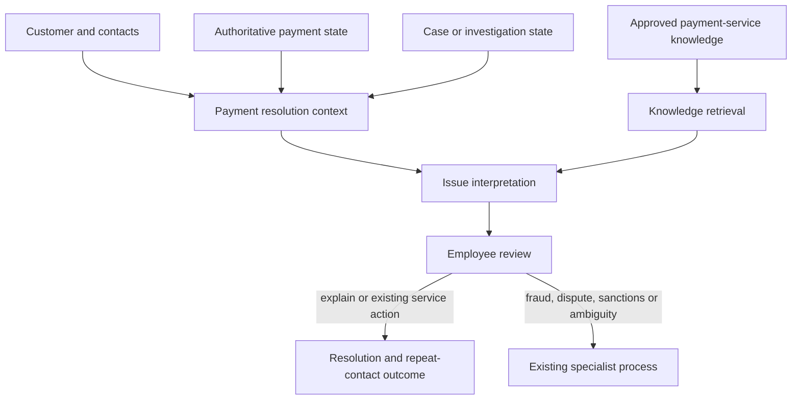
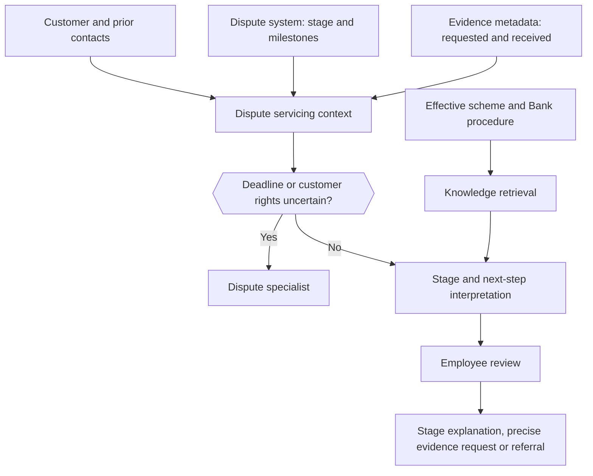
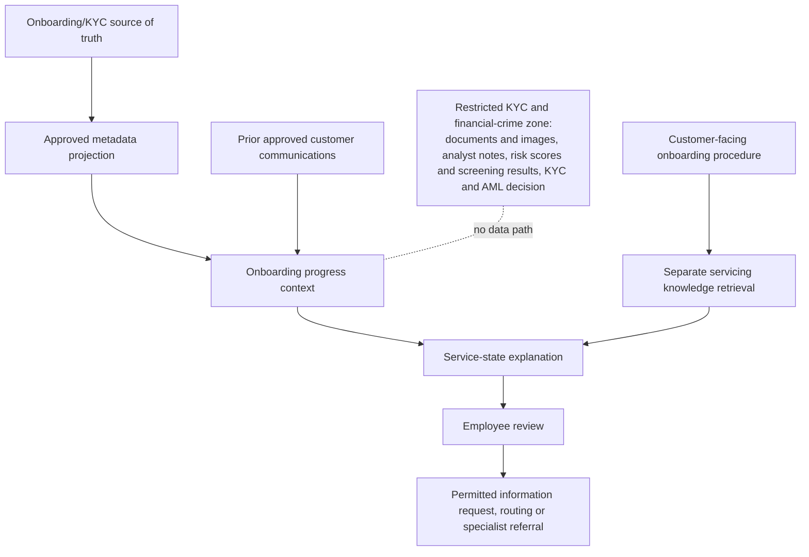

## Journey technical profiles {#journey-profiles-page}

### Purpose {#journey-profiles-purpose}

The three candidate journeys use the common [technical design](#technical-design) but differ in their banking systems, information boundaries, knowledge, functions, critical risks and tests. This page shows those differences, so that one journey can be chosen and its Solution Definition written. Only the journey selected at the business case goes ahead; each journey taken up later is its own Solution, with its own Solution Definition, Risk Tier, AI Registry entry and validation.

Each profile states:

- which banking capabilities and authoritative information are required;
- how that information is used by rule-based services and by GenAI;
- which knowledge and functions are permitted;
- which information and decisions remain outside the workflow;
- how the journey narrows when a capability is unavailable;
- which acceptance criteria and tests apply before the Team's final acceptance.

System names, owners, interfaces, volumes and service expectations are completed during discovery and kept in the Solution Definition, not on this page.

### The three journeys side by side {#journey-profiles-side-by-side}

The Risk Tier attributes follow AI Policy 3.1. The AICC Lead assigns the Tier when the Solution is defined (the Executive Sponsor, while the AICC Lead builds); any Control Function Contact may raise it, and only the model risk Contact may lower it.

| Attribute | Payment Issue Resolution | Card Dispute Progress Support | Onboarding/KYC Progress Support |
| --- | --- | --- | --- |
| Data classes | customer personal data; confidential service records (contacts, cases, complaints); payment status and identifiers | customer personal data; confidential service records; card transaction reference; dispute stage, deadlines and evidence metadata | customer personal data; confidential service records; approved onboarding metadata only (check completion, document type and status, reason code, queue) |
| Influence on a decision | informs the employee's explanation and next step | informs the employee's explanation, evidence request or referral | informs the employee's explanation, information request or routing |
| Output reaches a customer | only after the employee has reviewed it, in the employee's words or as an edited draft sent from the existing channel | < | < |
| Autonomy | an Assistant with no tools; every write is an employee action | < | < |
| Expected Risk Tier | 2 | 2 | 2, unless compliance raises it for the financial-crime context or a high-risk category |
| What would raise it | any write by the model; customer output without review; an external provider, if a Contact raises it | as for payments; also any output that could change a deadline or a customer right | as for payments; also any path for restricted financial-crime content |
| Readiness for live use | highest: a clear authoritative state and an established servicing response, if the payment system can be read | medium: depends on authoritative stage and deadline data and on controlled dispute knowledge | lowest: live GenAI use is blocked until the approved metadata projection exists |

Before a profile's Solution Definition is approved, IT and the journey's process function record the decisions in the [decision record](#it-readiness-decisions) of the IT readiness checklist: sources, linkage, integration path, context contract, state interpretation, knowledge, functions, Evaluation set and operating dependencies. If an authoritative source, a safe information boundary or a supported live interface cannot be established, the journey stays in the Lab or is narrowed to the states that can be supported. GenAI must not compensate for a missing source of truth.

---

### Payment Issue Resolution {#journey-profiles-payment}

**Journey option:** [Payment Issue Resolution](#journey-payment)

#### Technical intent and boundary {#journey-profiles-payment-intent}

Support one domestic retail-payment type with failed, pending or reversed states, for which the Bank can obtain an authoritative status and has an established servicing response. Unrecognized payments, fraud, disputes and chargebacks, sanctions or anti-money-laundering holds, cross-border or correspondent ambiguity, reimbursement decisions and funds movement stay outside the profile.

#### Required bank capabilities and use {#journey-profiles-payment-capabilities}

| Required capability | How the profile uses it | If the capability is unavailable or unreliable |
| --- | --- | --- |
| Customer and contact source | identify the customer's request and related contacts | restrict to linked historical cases, or stop live use where linkage cannot be trusted |
| Payment source of truth | obtain payment identifier, type, timestamps and the authoritative failed, pending or reversed state | exclude the unsupported state or payment type; never infer state from contact notes |
| Case or investigation workflow | obtain owner, completed and pending step and resolution | show the case reference only; the employee keeps the existing manual write process |
| Complaint and escalation record | identify a formal complaint or specialist handling already in progress | route a possible complaint to the existing complaint check before any advice |
| Payment-service knowledge | ground state explanations, the expected process and the permitted action | restrict output to verified facts and manual procedure lookup until the corpus is approved |
| Outcome reporting | identify repeat contact, progression, reopening, complaint and handling effort | run quality tests only; claim no customer benefit until outcome evidence exists |

#### Functional allocation {#journey-profiles-payment-allocation}

| Function | Realization |
| --- | --- |
| Rule-based | customer, payment and case linkage; authoritative status; eligibility; state-code mapping; freshness; filtering of permitted actions |
| GenAI | interpretation of contact history; short timeline; likely blocker; explanation supported by the procedure; draft next step |
| Knowledge retrieval | current payment-state guidance, servicing procedure, communication wording, referral and escalation rules |
| Workflow reads | payment, case and contact state; applicable procedure; permitted actions |
| Employee actions | record decision and outcome; save the case note; create a referral where an existing interface supports it |
| Critical exclusions (Conditions of use) | state change, funds movement, fraud or dispute decision, reimbursement, interpretation of a regulated hold, any customer communication without the employee |

#### Journey acceptance criteria and test coverage {#journey-profiles-payment-tests}

- Payment, customer, contact and case records link correctly or are quarantined.
- The displayed payment state always comes from the authoritative source and shows its freshness.
- Each supported state maps to an explanation and action set approved by Payments Operations.
- Conflicting status, missing investigation ownership, fraud or dispute indicators and excluded payment types go to the correct manual or specialist route.
- Evaluation in the Lab and with the first users measures state accuracy, action accuracy, unsupported explanation, employee correction and repeat contact separately.

---

### Card Dispute Progress Support {#journey-profiles-dispute}

**Journey option:** [Card Dispute Progress Support](#journey-dispute)

#### Technical intent and boundary {#journey-profiles-dispute-intent}

Support one dispute type and one service queue by explaining the authoritative dispute stage, completed actions, evidence state, responsible owner, applicable deadline and the permitted next service step. Adjudication, fraud determination, eligibility, reimbursement, legal interpretation, and any change to scheme or legal obligations stay outside the profile.

#### Required bank capabilities and use {#journey-profiles-dispute-capabilities}

| Required capability | How the profile uses it | If the capability is unavailable or unreliable |
| --- | --- | --- |
| Dispute system of record | obtain dispute identifier, type, stage, milestones, owner and authoritative deadline data | exclude states that lack authoritative stage or deadline information; keep specialist handling |
| Transaction reference | connect the dispute to the correct card transaction without deciding fraud | quarantine ambiguous linkage and route to the existing verification |
| Evidence metadata | show evidence type, request, receipt and validation status without unnecessary document content | limit the profile to stage and status explanation; draft no evidence request from incomplete metadata |
| Communication record | identify notices already sent and required servicing communications | the employee confirms against the dispute system before any communication |
| Effective dispute knowledge | retrieve the applicable internal and scheme-approved servicing procedure | keep next-step drafting in the Lab until authority and effective dates are controlled |
| Outcome and deadline monitoring | measure status contacts, evidence rework, handoff, complaint and missed-deadline events | limit the decision to quality and workflow learning; no claim of customer benefit |

#### Functional allocation {#journey-profiles-dispute-allocation}

| Function | Realization |
| --- | --- |
| Rule-based | dispute, customer and transaction linkage; authoritative stage; deadline from the source or its calculation; evidence status; required-notice and permitted-action rules |
| GenAI | summary of prior contacts; status explanation; detection of repeated or conflicting evidence requests; draft next step grounded in the procedure |
| Knowledge retrieval | effective dispute-servicing procedure, evidence guidance, required communication and escalation conditions |
| Workflow reads | dispute, evidence and communication state; applicable procedure; permitted actions |
| Employee actions | record decision and outcome; send an evidence request from a draft the employee has reviewed; create a specialist referral where supported |
| Critical exclusions (Conditions of use) | adjudication, fraud finding, eligibility, reimbursement, deadline change, legal interpretation, anything that weakens a customer's rights |

#### Journey acceptance criteria and test coverage {#journey-profiles-dispute-tests}

- Dispute, transaction, customer and contact linkage is correct or quarantined.
- Stage, evidence status, owner and deadline are authoritative, current and replayable.
- No generated interpretation changes a deadline, a customer right, an adjudication state or a reimbursement decision.
- Any ambiguity about a deadline, a scheme rule or evidence sends the case to a specialist before customer communication.
- The Evaluation set covers every common stage, evidence state, deadline boundary, prior-notice condition and material exception of the selected dispute type.

---

### Onboarding/KYC Progress Support {#journey-profiles-kyc}

**Journey option:** [Onboarding/KYC Progress Support](#journey-kyc)

#### Technical intent and boundary {#journey-profiles-kyc-intent}

Support one customer segment and one onboarding path, using an approved projection of the customer-servicing metadata. Explain only the established service state, the permitted outstanding information, the responsible queue and the approved next step. The Solution must not receive or infer restricted financial-crime reasons.

#### Required bank capabilities and use {#journey-profiles-kyc-capabilities}

| Required capability | How the profile uses it | If the capability is unavailable or unreliable |
| --- | --- | --- |
| Onboarding/KYC source of truth | supply the application identifier and the authoritative customer-service state | restrict to historical analysis in the Lab; never derive state from employee notes or document contents |
| Approved metadata projection | expose only check completion, document type and status, approved reason code, responsible queue and safe timestamps | live GenAI use is blocked until the projection, or an equivalent service limited to approved fields, exists |
| Customer-facing reason-code catalog | translate the permitted service state into consistent, approved language | show the status only, and route the explanation to a trained specialist |
| Prior approved communication | prevent repeated or conflicting requests to the customer | the employee checks prior communication by hand where it cannot be read safely |
| Servicing knowledge corpus | provide the customer-facing onboarding procedure, kept apart from restricted know-your-customer policy and intelligence | restrict drafting to source-linked status facts and manual specialist guidance |
| Outcome and group reporting | measure repeat requests, progression, abandonment, complaints and materially different treatment | limit claims to quality until enough outcome and group evidence exists |

#### Functional allocation {#journey-profiles-kyc-allocation}

| Function | Realization |
| --- | --- |
| Rule-based | application and customer linkage; projection of approved fields only; completion state; document status; approved reason code; queue and permitted-action rules |
| GenAI | summary of approved communication history; safe explanation of the service state; consolidation of permitted information requests; draft next step |
| Knowledge retrieval | customer-facing onboarding procedure, permitted document guidance, routing and escalation; restricted financial-crime content stays separate |
| Workflow reads | the approved metadata projection and prior communications; applicable procedure; permitted actions |
| Employee actions | record decision and outcome; send a permitted information request from a draft the employee has reviewed; route or refer the case |
| Critical exclusions (Conditions of use) | documents and images, analyst notes, risk scores, screening hits, suspicious-activity information, approval or rejection, risk-rating change, bypass of a control, restricted reasons |

#### Journey acceptance criteria and test coverage {#journey-profiles-kyc-tests}

- Architecture tests show that excluded restricted fields and content have no path into context, retrieval, prompts, traces or employee output.
- The displayed service state, permitted reason code, document status and queue come from the approved projection and carry their source and freshness.
- The Solution cannot infer, expose or imply a regulated reason for delay, approval or rejection.
- Inconsistent state, a missing permitted reason, a sign that the customer needs additional assistance, possible discriminatory treatment, or a financial-crime concern sends the case to a specialist.
- The Evaluation set covers common onboarding states, repeated requests, reason-code gaps, attempts to inject restricted data, and outcomes for the relevant customer groups.

---

### Reuse across journeys {#journey-profiles-reuse}

The common parts stay stable: identity and purpose checks, the context service contract, knowledge retrieval, the fixed workflow, the AI gateway and structured output, the workspace, evaluation and logging. Each journey replaces its own layer: source adapters and allowed fields, state mapping, knowledge corpus, the functions it keeps from the common list, critical errors, the Evaluation set and outcome measures. A second journey should reuse the common interfaces and replace only its layer; where reuse needs copying or bypassing the common parts, the shared design is not yet proven. The common parts are described later in a Package Definition (see [Later, outside this pilot](#technical-design-later)).
