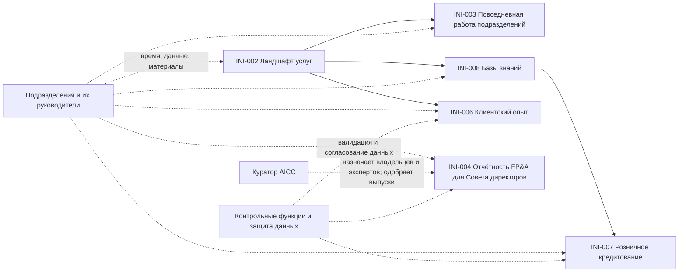

```yaml
source: portfolio/en/dependencies.md
source_sha256: 54b373837734ec28890dcc7baf64be701d1523f8401e7b0e5b4e2983bf7c7bd8
translation_status: reviewed
```

# Борд программы

Борд программы — борд зависимостей программного инкремента (п. 4.3 Модели жизненного цикла решений). Для каждой Capability и Feature на нём указываются итерация, на которую запланирована работа, состояние элемента и то, что ему необходимо от других элементов, команд, подразделений и лиц (в основном за пределами AICC); на борде также отмечаются вехи дорожной карты в тех итерациях, на которые они приходятся. Объём работы каждой итерации определяется на планировании итерации и меняется вместе с зависимостями. Руководитель AICC поддерживает борд программы в актуальном состоянии на еженедельном обзоре. Зависимость имеет статус «Открыта», «Выполнена» или «Под угрозой». Веха получает статус «Под угрозой», если под угрозой находится необходимая для неё Feature или зависимость; всё, что находится под угрозой, выносится на ежемесячное управляющее совещание.

## 1. Capabilities и Features

В следующей таблице каждая Capability и Feature бэклога программы показана по итерациям. Каждая дорожка соответствует одному элементу, а в ячейке указывается состояние, которого элемент достиг в данной итерации. Пустая ячейка означает, что работа не запланирована. У инициатив в состоянии «Проработка» пока нет Capabilities и Features, поэтому они приведены только в разделах 3 и 4.

| Дорожка | Родительский элемент: Capability или постоянная инициатива | Состояние | 2026 I10 (окт.) | 2026 I11 (нояб.) | 2026 I12 (дек.) | Неделя IP | Зависит от | Статус зависимости |
| --- | --- | --- | --- | --- | --- | --- | --- | --- |

## 2. Вехи

В следующей таблице вехи дорожной карты (roadmap.md) распределены по итерациям, на которые они приходятся. Для большинства вех дорожная карта указывает только программный инкремент, без итерации, поэтому пустая ячейка означает, что веха по итерациям не распределена; веха последующего программного инкремента распределяется по итерациям на его PI-планировании. Состояние вехи соответствует дорожной карте, а если под угрозой находится необходимая для вехи зависимость, указывается «Под угрозой».

| Веха | Дорожная карта | Программный инкремент | 2026 I10 (окт.) | 2026 I11 (нояб.) | 2026 I12 (дек.) | Неделя IP | Зависит от | Состояние |
| --- | --- | --- | --- | --- | --- | --- | --- | --- |
| MS-002 | Исполнители ролей назначены не позднее 2026-12-01 | 2026-PIQ4 | | | Срок: 2026-12-01 | | DEP-004 | Запланировано |
| MS-003 | Все известные случаи применения AI внесены в реестр AI-решений с категорией риска | 2026-PIQ4 | | | Срок: 2026-12-31 (п. 2.1 Политики применения AI) | | - | Запланировано |
| MS-006 | Начато взаимодействие с первым направлением, определено первое решение | 2026-PIQ4 | | | | | - | Запланировано |
| MS-009 | Представлена карта ландшафта услуг | 2026-PIQ4 | | | | | DEP-001, DEP-002 | Запланировано |
| MS-010 | Изучение клиентского опыта завершено | 2026-PIQ4 | | | | | DEP-004, DEP-008, DEP-009 | Запланировано |
| MS-011 | Подготовка отчётности FP&A для Совета директоров налажена | 2026-PIQ4 | | | | | DEP-004, DEP-006, DEP-007 | Запланировано |
| MS-012 | Подразделения ознакомлены с AI | 2026-PIQ4 | | | | | DEP-003, DEP-004, DEP-005 | Запланировано |
| MS-013 | Изучение розничного кредитования завершено | 2026-PIQ4 | | | | | DEP-004, DEP-010, DEP-011 | Запланировано |
| MS-014 | Подход к базам знаний согласован, первая база используется | 2026-PIQ4 | | | | | DEP-004, DEP-012, DEP-013 | Запланировано |
| MS-004 | Мероприятия циклов проводятся: итерации, программный инкремент и управляющие совещания | 2027-PIQ1 | | | | | - | Запланировано |
| MS-005 | Достигнут уровень зрелости 1 | 2027-PIQ1 | | | | | - | Запланировано |
| MS-007 | Первое решение развёрнуто в подразделении и выпущено | 2027-PIQ1 | | | | | - | Запланировано |
| MS-008 | Достигнут уровень зрелости 2 по первым стратегическим приоритетам | 2027-PIQ2 | | | | | - | Запланировано |

## 3. Зависимости

| Идентификатор | Элемент | Что необходимо | От кого | Когда необходимо | Статус |
| --- | --- | --- | --- | --- | --- |
| DEP-001 | INI-002 Ландшафт услуг | Время и знания руководителей подразделений и владельцев услуг; имеющиеся у них материалы | Подразделения | ежемесячно, по мере работы с подразделениями | Открыта |
| DEP-002 | INI-002 Ландшафт услуг | Доступ к репозиторию корпоративной архитектуры и порталу и их классификация | Информационная безопасность | до публикации | Открыта |
| DEP-003 | INI-003 Повседневная работа подразделений | Кандидаты на внедрение в порядке приоритета | INI-002 | при начале взаимодействия с подразделением | Открыта |
| DEP-004 | INI-002, INI-003, INI-004, INI-006, INI-007, INI-008 | Назначенные владельцы направлений и эксперты направлений | Куратор AICC и руководители подразделений | до контрольной точки «Определение объёма» по каждой инициативе | Открыта |
| DEP-005 | INI-003 Повседневная работа подразделений | Одобрение классов данных для подразделения | Владелец направления каждого подразделения | до начала применения | Открыта |
| DEP-006 | INI-004 Отчётность FP&A для Совета директоров | Время аналитиков подразделения FP&A; источники финансовых данных; портал Совета директоров | FP&A | для каждого ежемесячного выпуска | Открыта |
| DEP-007 | INI-004 Отчётность FP&A для Совета директоров | Одобрение каждого выпуска | Куратор AICC | для каждого выпуска | Открыта |
| DEP-008 | INI-006 Клиентский опыт | Карта источников информации о клиентах | INI-002 | после составления перечня источников | Открыта |
| DEP-009 | INI-006 Клиентский опыт | Доступ к обращениям в поддержку, проблемам и затруднениям клиентов и их класс данных | Подразделения фронт-офиса, розничного бизнеса и коммерческих продаж; защита данных | до формирования любой выборки | Открыта |
| DEP-010 | INI-007 Розничное кредитование | Общий подход к базам знаний | INI-008 | до начала работ по базе знаний | Открыта |
| DEP-011 | INI-007 Розничное кредитование | Доступ к данным об отказах в ипотечном кредитовании и их класс данных; контрольные процедуры | Розничное кредитование; защита данных; управление модельным риском | до начала любого анализа | Открыта |
| DEP-012 | INI-008 Базы знаний | Перечень подразделений и знаний, которыми они располагают | INI-002 | при выборе первой базы | Открыта |
| DEP-013 | INI-008 Базы знаний | Исходные документы с указанием ответственного и даты пересмотра | Подразделение, отвечающее за соответствующую базу | для каждой базы | Открыта |
| DEP-014 | Каждая инициатива, по которой ожидается категория риска 2 или 3, и её решение | Согласование бизнес-кейса и валидация представителями контрольных функций | Контрольные функции | до одобрения бизнес-кейса и до первого развёртывания | Открыта |
| DEP-015 | INI-009, INI-010, INI-011, INI-012 | Одобрение в составе базовой версии четырёх паспортов постоянных инициатив, а также начальных общих WIP-лимитов команды; внесено в протокол решения DR-2026-063 | Владелец базовой версии (одобрение); последующие управленческие решения — в соответствии с п. 4.9 Бизнес-модели и п. 4.2 Модели жизненного цикла решений | Выполнена 2026-10-03 | Выполнена |

## 4. Объём работы по каждому элементу по месяцам

Объём работы по элементам PIQ4 на каждую итерацию. Он определяется на планировании итерации, а до этого отражает намерения.

| Элемент | 2026 I10 (окт.) | 2026 I11 (нояб.) | 2026 I12 (дек.) |
| --- | --- | --- | --- |
| INI-002 Ландшафт услуг | | | |
| INI-006 Изучение клиентского опыта | | | |
| INI-004 Отчётность FP&A для Совета директоров | | | |
| INI-003 AI в повседневной работе подразделений | | | |
| INI-007 Розничное кредитование | | | |
| INI-008 Базы знаний | | | |

## 5. Схема

На рисунке 1 показаны зависимости между элементами. Пунктирными линиями обозначены зависимости от лиц и подразделений за пределами AICC.



Рисунок 1. Зависимости PIQ4.
