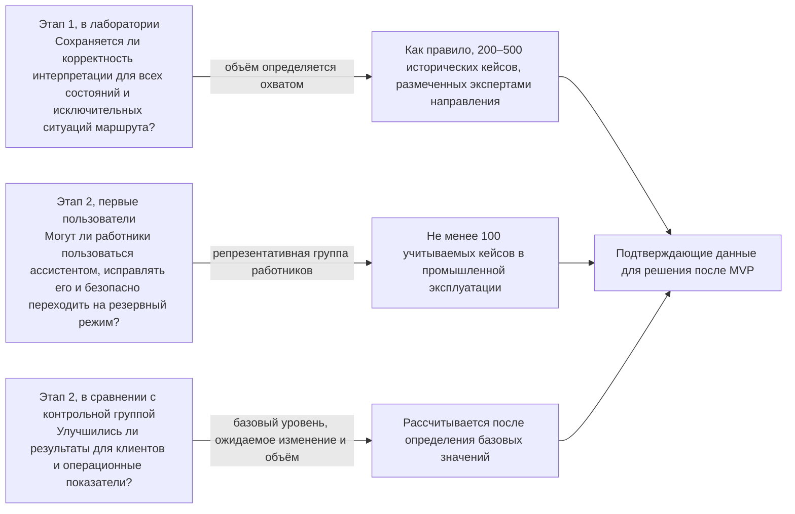

```yaml
source: portfolio/en/projects/service-resolution/charter.md
source_sha256: 75c9ef4ffde25095b586e364004367d31647694e4fe8e99c70098348df801ee8
translation_status: reviewed
```

---
key: "charter"
label: "Паспорт инициативы"
section: "Паспорт инициативы"
---

## Паспорт инициативы и приложение об измерениях {#charter-initiative-brief}

Эта страница — устав проекта в форме, принятой в Центре Компетенций: паспорт инициативы, то есть одностраничный бизнес-кейс инициативы, и приложение об измерениях и подтверждающих данных, которое одобряется вместе с ним. Паспорт заполняют владелец направления и руководитель Центра Компетенций. Рабочий паспорт инициативы хранится в папке инициативы в портфеле. Эта страница сохраняет полный проект бизнес-кейса и приложение по измерению; она не является отдельной авторитетной записью. Числовые показатели Банка здесь не приводятся: вместо каждого показателя указана ссылка на его источник, а вместо каждой оценки — поле с указанием того, кто его заполняет.

Привычные разделы устава проекта и их место в паспорте: **запрашиваемое управленческое решение** — абзац ниже и первая строка раздела 6. **Лист утверждения** — раздел 6 вместе с заключениями контрольных функций и протоколом решения. **Ответственные лица, которых нужно назначить до подписания**, указываются в реестре назначений, где для каждой роли указан её исполнитель. На этой странице приводятся роли, а не фамилии.

### Реквизиты паспорта {#charter-header}

| Поле | Содержание |
| --- | --- |
| Идентификатор | INI-013 (состояние «Предложено»; воронка портфеля). Зарегистрирована в воронке портфеля 2026-10-06; рассмотрение потребности и одобрение бизнес-кейса не записаны. |
| Наименование | Решение клиентских обращений на основе клиентской аналитики |
| Состояние и стадия | «Предложено» («Воронка»). Далее — «Проработка»: «Определение объёма», затем «Проработка»: «Бизнес-кейс» |
| Стратегический приоритет | Стратегический приоритет 1 (PRI-1) «Клиентская аналитика». Инициатива связана с INI-006 «Аналитика клиентского опыта» и использует те же источники |
| Направление и категория услуг | Разработка и эксплуатация; автоматизация рабочего места (помощь в обработке кейсов, выполняемая с применением AI с проверкой результата работником) |
| Вид работ | Бизнес-работы |
| Постоянная инициатива | Нет |
| Владелец направления (представляет подразделение-заказчик) | Руководитель подразделения клиентского обслуживания. Клиентское обслуживание — единственное направление |
| Перенаправлена из | Нет |
| Ожидаемые решения | Этап 1: эксперимент в лабораторной среде на выгрузках с доступом только для чтения, который завершается отчётом о результатах. Этап 2: первое решение — сервис, который эксплуатирует Центр Компетенций, с правилом вывода из эксплуатации; его первые пользователи — одна группа обслуживания |
| Представитель заказчика по приёмке | Владелец направления |
| Соглашение о взаимодействии | AGR-[nnn]. Оформляется при определении объёма на фазу изучения, а при одобрении изменяется и распространяется на фазы подтверждения осуществимости, разработки и поддержки |
| Период | [с — по; устанавливается при одобрении исходя из тайм-бокса, указанного в разделе 3] |
| Дата последнего изменения | [дата] |

Незаполненные разделы: 2 (базовые и целевые значения в виде ссылок на их источники), 3 (тайм-бокс), 4 (оценки), 5 (ссылки на зависимости и риски) и 6 (все управленческие решения). Они заполняются на стадии «Бизнес-кейс».

### Запрашиваемое управленческое решение {#charter-decision-requested}

Одобрить бизнес-кейс настоящей инициативы. MVP — один ассистент для работников (ожидаемая категория риска 2) для одной очереди обращений клиентского маршрута, выбранного при определении объёма; первые пользователи — группа обслуживания этой очереди. MVP создаётся в два этапа в пределах [оценка руководителя Центра Компетенций, итерации] и завершается управленческим решением по итогам MVP. Бизнес-кейс одобряет владелец направления после его согласования представителями контрольных функций. Управленческое решение принимается на ежемесячном управляющем совещании. Если для MVP требуется финансирование сверх рабочего времени работников, куратор Центра Компетенций предварительно определяет инвестиционный бюджет (см. раздел 4).

### 1. Гипотеза {#charter-hypothesis}

Некоторые клиенты снова и снова обращаются в Банк по одному и тому же нерешённому вопросу. Для групп клиентского обслуживания, которые работают с такими обращениями, ассистент по решению вопросов клиентов представляет собой сервис, который даёт работнику единую проверенную картину вопроса клиента, где каждый факт подкреплён ссылкой на запись в системе-источнике, и предлагает следующий шаг из перечня, утверждённого профильным подразделением. Сейчас работник восстанавливает историю вручную по нескольким разрозненным системам. С ассистентом история уже собрана, вероятная причина задержки показана, а все решения по кейсу и все действия остаются за работником.

### 2. Бизнес-результаты и опережающие индикаторы {#charter-outcomes-and-indicators}

| Бизнес-результат | Опережающий индикатор | Источник числовых значений и ответственный | Дата |
| --- | --- | --- | --- |
| Клиентам не приходится повторно обращаться по той же потребности | Повторные обращения по той же потребности в течение [число] дней по учитываемым кейсам | [отчёт MI: повторные обращения по клиентским маршрутам]; ответственный — владелец источника показателей | [дата базового значения] |
| Меньше усилий на расследование и обработку кейса | Трудозатраты на обработку или расследование одного учитываемого кейса | [отчёт системы управления персоналом или системы учёта кейсов: время обработки]; ответственный — владелец источника показателей | [дата базового значения] |
| Группа обслуживания работает с ассистентом | Доля учитываемых кейсов, обработанных первыми пользователями, по которым использовалось представление ассистента и зафиксирован исход | [записи рабочего места за период пилотного применения]; отчитывается руководитель Центра Компетенций, сверку проводит владелец источника показателей | [с первой недели промышленной эксплуатации] |
| Ослабевает проблема, характерная для самого клиентского маршрута | Один индикатор из приложения по выбранному клиентскому маршруту: время до подтверждённого решения вопроса (платежи), число обращений о статусе, которых можно было избежать (споры), или число повторных запросов сведений (оформление) | [отчёт MI, указанный в приложении по клиентскому маршруту]; ответственный — владелец источника показателей | [дата базового значения] |

Владелец источника показателей определяет базовые значения по имеющейся управленческой отчётности (MI), без применения AI, на стадии «Бизнес-кейс». Целевые значения устанавливает владелец направления. И те и другие хранятся в источнике, а паспорт содержит только ссылки на них. Если по индикатору ещё нет данных MI, в протоколе решения об одобрении это фиксируется как условие, и первая Feature MVP обеспечивает его измерение до начала промышленной эксплуатации. Формулы, критерии отнесения кейсов к учитываемым и схема сравнения приведены в [приложении](#charter-annex).

### 3. Объём работ и минимально жизнеспособный продукт {#charter-scope-and-mvp}

**Входит в объём работ.** Один клиентский маршрут и одна очередь обращений, выбранные при определении объёма (см. «[Карта маршрутов](#journeys)»). Одна группа обслуживания в качестве первых пользователей. Актуальные записи об обращениях, кейсах, жалобах и статусах по этому клиентскому маршруту, в том числе на русском и кыргызском языках и в смешанном тексте. Внутренний интерфейс работника — рабочее место.

**Не входит в объём работ.** Расшифровка голосовых обращений и содержание записей звонков. Любой результат, который доходит до клиента без проверки работником. Любые записи в системы и действия со стороны модели. Кредитные решения, решения о соответствии клиента условиям продукта, ценообразование, противодействие мошенничеству, противодействие отмыванию денег и финансированию терроризма (ПОД/ФТ), санкционные ограничения и другие решения, регулируемые законодательством. Перемещение денежных средств и исправление операций. Универсальное представление о клиенте («клиент 360°»), чат-бот для клиентов и база знаний масштаба всего Банка. Любое использование результатов пилотного применения в иных целях, кроме решения вопросов клиентов и оценки ассистента.

**Нефункциональные требования.** Модель работает в контуре Банка. Источники используются только для чтения. Каждый факт, который видит работник, подтверждается ссылкой на запись в системе-источнике. При отсутствии записей или противоречиях между ними кейс передаётся на ручное расследование. Подробности — на страницах «[Контроль и подтверждающие материалы](#controls)» и «[Технический проект](#technical-design)».

**План MVP.** Шаг 1 выполняется на стадии проработки. Шаги 2–10 составляют MVP.

1. Выбрать клиентский маршрут и очередь обращений. Совместно с профильным подразделением определить, что считается «повторным» и «нерешённым». Убедиться, что источники базовых значений существуют.
2. Этап 1, эксперимент: получить в лабораторную среду выгрузки с доступом только для чтения; каждую выгрузку одобряет владелец источника, и каждая проходит оценку на наличие персональных данных.
3. Эксперты направления восстанавливают и размечают выборку исторических кейсов. До начала разработки этот набор фиксируется как оценочный набор.
4. Совместно с профильным подразделением согласовать формулировки статусов, причин задержки, действий и исходов, а также перечень одобренных действий.
5. Создать в лабораторной среде сборку контекста, ассистента и рабочее место.
6. На исторических кейсах, не использованных при разработке, сравнить сводное представление без AI с ассистентом. Этап завершается отчётом о результатах.
7. Этап 2, сервис: валидация представителями контрольных функций, окончательная приёмка командой и прохождение процедуры управления изменениями Банка. Затем обучение первых пользователей.
8. Эксплуатировать сервис в одной группе. Работник проверяет каждый результат и принимает решение по каждому кейсу.
9. Сравнить результаты с действующим процессом в порядке, описанном в приложении.
10. Управленческое решение по итогам MVP.

**Тайм-бокс.** Этап 1: [оценка руководителя Центра Компетенций, итерации]. Этап 2: [оценка руководителя Центра Компетенций, итерации; не менее периода наблюдения, установленного приложением]. **Возможное продолжение.** После управленческого решения о продолжении — Capabilities, например подключение других очередей или следующего типа платежей, и выпуск за пределы круга первых пользователей. Другой клиентский маршрут вносится в воронку как новая потребность.

### 4. Затраты и ценность {#charter-cost-and-value}

| Позиция | Содержание |
| --- | --- |
| Трудозатраты на MVP по ролям и этапам | [оценка руководителя Центра Компетенций в итерациях по каждой роли на этапы 1 и 2: руководитель Центра Компетенций в роли инженера решений, тестировщик, эксперты направления, профильное подразделение, владелец источника показателей, представители контрольных функций, IT-функция] |
| Доступность работников подразделения | [владелец направления и руководитель профильного подразделения: доступность экспертов направления и первых пользователей по этапам]. Фиксируется в допущениях и в части B соглашения о взаимодействии |
| Эксплуатационные затраты сервиса, размещение модели в контуре Банка и интеграция | [оценка руководителя Центра Компетенций совместно с IT-функцией со ссылкой на финансовое планирование Банка] |
| Правило вывода сервиса из эксплуатации | [владелец направления совместно с руководителем Центра Компетенций: условие, при котором сервис выводится из эксплуатации или передаётся] |
| Полный объём работ в случае успеха MVP | [оценка руководителя Центра Компетенций в виде ссылки] |
| Инвестиционный бюджет | Для PRI-1 инвестиционный бюджет пока не установлен. Если MVP требует каких-либо затрат сверх рабочего времени работников, куратор Центра Компетенций определяет инвестиционный бюджет на ежемесячном управляющем совещании до одобрения бизнес-кейса |
| Кто несёт расходы | Центр Компетенций не взимает плату. Расходы на эксплуатацию, лицензии и услуги поставщиков направление несёт за счёт своего инвестиционного бюджета |
| Ценность и место её учёта | Опережающие индикаторы раздела 2, которые рассматриваются на каждом ревью и демонстрации итерации. Владелец направления подтверждает выгоду по указанному источнику в отчёте о результатах и в квартальном отчёте |

### 5. Риски, зависимости и категория риска {#charter-risks-and-tier}

**Ожидаемая категория риска: 2.** Используются персональные данные клиентов и конфиденциальные записи об обслуживании. Результат служит основой для выбора работника: работник принимает решение по каждому кейсу, и до клиента результат доходит только через работника. Ассистент не имеет доступа к инструментам: любую запись в системы, например фиксацию исхода или передачу кейса в другое подразделение, работник выполняет сам на рабочем месте. При наличии прав на запись решению была бы присвоена категория риска 3. Руководитель Центра Компетенций присваивает категорию риска на стадии определения решения. Пока разработку выполняет сам руководитель Центра Компетенций, категорию риска присваивает куратор Центра Компетенций; он же одобряет описание решения и использование класса данных, а тестирование и проверку выполняет лицо, не участвовавшее в разработке (п. 4.4 Операционной модели). На странице «[Контроль и подтверждающие материалы](#controls)» перечислены требования категории риска 2 и обстоятельства, при которых категория риска повышается.

**Размещение модели и поставщики.** Модель работает в контуре Банка и до начала обработки данных Банка проходит проверку как поставщик. Внешнюю модель допускается использовать только после проверки поставщика представителями контрольных функций по информационной безопасности, защите данных и правовым вопросам и после одобрения её использования для соответствующего класса данных. Подключение такой модели на более позднем этапе считается существенным изменением.

**Представители контрольных функций, согласующие бизнес-кейс.** Требуется согласование всех пяти: по управлению модельным риском, информационной безопасности, защите данных, комплаенсу (включая нормы делового поведения и защиту прав потребителей, а для клиентского маршрута «Сопровождение оформления и KYC» — также противодействие финансовым преступлениям) и правовым вопросам. Каждый оформляет заключение контрольной функции в пределах своей компетенции, и каждый вправе остановить работу.

**Зависимости** (ведутся на борде программы; для каждой DEP-[nnn] указываются ответственный, итерация, к которой нужен результат, и статус):

- Профильное подразделение клиентского маршрута: перечень одобренных действий, определения исходов, интерпретация исторических кейсов и эксперты направления.
- Владельцы систем-источников: данные клиентов, история обращений, система учёта кейсов или система маршрутизации обращений, жалобы. Каждый предоставляет выгрузки с доступом только для чтения, а впоследствии — оперативный доступ на чтение.
- Владельцы процедур и знаний: одобренные процедуры, на которые ссылается ассистент.
- IT-функция: доступ работников и фронт-офисное приложение обслуживания, интеграция, среды и управление изменениями. Подробности — в [контрольном листе готовности IT](#it-readiness).
- Владелец платформы: размещение модели в контуре Банка, шлюз доступа к моделям, регистрация событий и мониторинг.
- Владелец источника показателей: базовые значения и отчёты, указанные в разделе 2.
- INI-006: общие источники (DEP-008, DEP-009).
- Если требуется также пройти собственную процедуру Банка по приёму проектов или заявок в IT — для получения ресурсов IT или финансирования вне Центра Компетенций, — это оформляется как одна зависимость от IT-функции, а не как отдельный маршрут.

**Основные риски** (ведутся в реестре рисков и проблем; для каждого RI-[nnn] указываются ответственный и срок):

- В системах-источниках может не быть интерфейсов для чтения, общего ключа клиента или временных отметок по кейсам. В этом случае объём работ сужается или пилотное применение работает на плановых выгрузках.
- Записи на русском и кыргызском языках, смешанный текст и транслитерация могут снизить качество интерпретации. Оценочный набор охватывает каждый язык, а результаты приводятся в разбивке по языкам.
- Число учитываемых кейсов одной группы может оказаться слишком малым, чтобы в пределах тайм-бокса показать изменение результата для клиентов. См. приложение.
- Экспертам направления и первым пользователям может не хватить времени, необходимого для работы.
- В Центре Компетенций один участник, поэтому разработку выполняет руководитель Центра Компетенций. Это принятое ограничение с компенсирующими мерами контроля согласно п. 4.4 Операционной модели: одобряет куратор Центра Компетенций, а тестирует инженер, назначенный руководителем Центра Компетенций.

**Местные допущения, которые подтверждаются при определении объёма:** языки записей; какая система хранит состояние кейса и фиксирует ли она временные отметки по шагам; связывает ли общий ключ клиента обращения, кейсы и жалобы; как сейчас измеряется время обработки; какая система и какая группа предоставляют данные контрольной группы.

### 6. Управленческие решения и приёмка {#charter-decision-and-acceptance}

| Управленческое решение | Кто принимает | Дата | Рабочий документ |
| --- | --- | --- | --- |
| Одобрение бизнес-кейса: [одобрен / возвращён / отложен / отклонён] | Владелец направления (куратор Центра Компетенций — при превышении инвестиционных ограничений) | [дата] | DR-[yyyy]-[nnn] |
| Согласование представителями контрольных функций, ожидается категория риска 2: [согласован / не согласован] | Управление модельным риском, информационная безопасность, защита данных, комплаенс, правовые вопросы | [дата] | [ссылка на заключение контрольной функции по каждой области компетенции] |
| Соглашение о взаимодействии оформлено, при одобрении — изменено | Руководитель Центра Компетенций | [дата] | AGR-[nnn] |
| Управленческое решение по итогам MVP: [продолжить / перенаправить / отложить / отклонить] либо возврат с указанным сроком продления | Владелец направления как лицо, одобрившее бизнес-кейс | [дата] | DR-[yyyy]-[nnn] |
| Приёмка переданного результата: [принято / возвращено / отклонено] | Владелец направления как представитель заказчика по приёмке | [дата] | [раздел о выпуске описания решения; отчёт о результатах] |

Единое правило приёмки проекта приведено на странице «[Контроль и подтверждающие материалы](#controls)». Оно охватывает обязательные контрольные точки, указанные в описании решения, опережающие индикаторы раздела 2 и соотнесение подтверждающих материалов с каждым из перечисленных выше управленческих решений.

### Изменения после одобрения {#charter-amendments}

Изменение, внесённое после одобрения, указывается здесь с датой и ссылкой на протокол решения; разделы выше сохраняются в одобренном виде. Примеры таких изменений: другая очередь обращений или другой тип платежей, сужение объёма работ, продление MVP.

| Дата | Раздел | Изменение | Протокол решения |
| --- | --- | --- | --- |
|  |  |  | DR-[yyyy]-[nnn] |

### Приложение: план измерений и подтверждающих данных {#charter-annex}

В приложении установлено, как измеряются опережающие индикаторы и какой объём подтверждающих данных нужен для ответа на каждый вопрос. Приложение хранится вместе с паспортом в папке инициативы в портфеле и одобряется вместе с ним. Формулы и схему сравнения готовит владелец источника показателей, а утверждает владелец направления. Никто из участников разработки ассистента не отвечает за это приложение. Числовых показателей Банка в приложении нет: объёмы и доли приводятся в виде ссылок на их источники.

### Порядок измерения индикаторов {#charter-annex-indicators}

| Элемент | Повторные обращения | Трудозатраты на обработку | Использование ассистента | Индикатор клиентского маршрута |
| --- | --- | --- | --- | --- |
| Учитываемые кейсы | Кейсы выбранного клиентского маршрута и очереди обращений в пределах объёма, установленного приложением по клиентскому маршруту. Применяются указанные в нём исключения; кейсы, уже переданные в специализированный процесс, не учитываются. Телефонное обращение учитывается по записи об обращении и заметке работника; запись звонка не используется. | < | < | < |
| Формула и знаменатель | Учитываемые кейсы, по которым в течение [число] дней поступило ещё одно обращение по той же потребности, делённые на число обработанных учитываемых кейсов. Что считается «той же потребностью», определяет профильное подразделение при определении объёма | Общее время обработки или расследования учитываемых кейсов, делённое на число обработанных учитываемых кейсов | Учитываемые кейсы первых пользователей, по которым использовалось представление ассистента и зафиксирован исход, делённые на число обработанных ими учитываемых кейсов | Как определено в приложении по клиентскому маршруту |
| Сравнение | Первые пользователи в сравнении с контрольной группой, работающей по действующему процессу: [выбирается при определении объёма: другая группа на том же клиентском маршруте или та же группа в сопоставимый период до начала пилотного применения] | < | Отслеживается динамика за период наблюдения; сравнение не проводится | Как для повторных обращений |
| Период наблюдения | Период промышленной эксплуатации плюс окно повторного обращения [число] дней | Период промышленной эксплуатации | Период промышленной эксплуатации | Как установлено в приложении по клиентскому маршруту |
| Источник, подлежащий подтверждению | [отчёт MI] | [данные системы управления персоналом, временные отметки кейсов или хронометраж — в зависимости от того, что есть в Банке] | [записи рабочего места] | [отчёт MI] |

**Особые случаи.** Повторно открытый кейс учитывается как повторное обращение по исходному кейсу. Переданный кейс учитывается один раз — за группой, в которую поступило первое обращение, а факт передачи фиксируется. Прерванные и незавершённые кейсы остаются в знаменателе и приводятся отдельно; исключать какие-либо кейсы задним числом не допускается. Тайм-бокс этапа 2 определяется периодом наблюдения вместе со временем, необходимым для набора указанных ниже объёмов выборки.

### Схема сравнения {#charter-annex-comparison}

- **Этап 1, в лабораторной среде.** На одних и тех же зафиксированных исторических кейсах сводное представление без AI (записи собраны воедино, AI не применяется) сравнивается с ассистентом; эталоном служит разметка экспертов направления. Так удаётся отделить эффект от сведения записей воедино от эффекта AI, не требуя большого объёма кейсов.
- **Этап 2, в промышленной эксплуатации.** Только две группы: первые пользователи с ассистентом и контрольная группа, работающая по действующему процессу. Трёхстороннее сравнение в промышленной среде не проводится. Сводное представление без AI остаётся доступным как резервный режим.
- Даёт ли AI ценность сверх сводного представления без AI — это исходные данные для управленческого решения по итогам MVP, а не критерий «пройдено / не пройдено».

### Какой объём данных нужен для ответа на каждый вопрос {#charter-annex-evidence-sizes}



| Вопрос | Подтверждающие данные | Плановый объём (уточняется после определения базовых значений) |
| --- | --- | --- |
| Сохраняется ли корректность интерпретации для всех состояний и исключительных ситуаций клиентского маршрута? | Исторические кейсы, размеченные экспертами направления (этап 1) | Как правило, 200–500 проверенных кейсов. Объём определяется требуемым охватом: каждое типичное состояние, каждая причина задержки и каждая существенная исключительная ситуация, а также все имеющиеся кейсы редких исключительных ситуаций высокой степени серьёзности |
| Могут ли работники пользоваться ассистентом, исправлять его результаты и безопасно переходить на резервный режим? | Кейсы первых пользователей в промышленной эксплуатации (этап 2) | Не менее 100 учитываемых кейсов по репрезентативной группе работников |
| Улучшились ли результаты для клиентов и операционные показатели? | Первые пользователи в сравнении с контрольной группой (этап 2) | Рассчитывается после определения базовых значений исходя из базового уровня показателя, ожидаемого изменения и числа учитываемых кейсов [отчёт MI: число учитываемых кейсов очереди в месяц] |

Условный пример, не являющийся показателем Банка: снижение доли повторных обращений с 30% до 25,5% означает изменение на 4,5 процентного пункта, и для его надёжного подтверждения требуется значительно больше 1 000 учитываемых кейсов в каждой группе. Одна группа может не набрать такой объём за период наблюдения. В этом случае результат для клиентов служит лишь указанием на эффект, а не доказательством, и основная доказательная нагрузка ложится на трудозатраты на обработку и корректность предлагаемого следующего шага. Порядок соотнесения такого результата с управленческим решением установлен правилом приёмки на странице «[Контроль и подтверждающие материалы](#controls)».

### Охват оценочного набора {#charter-annex-evaluation-set}

- Эксперты направления размечают исторические кейсы и подтверждают у профильного подразделения корректную интерпретацию и следующий шаг. Набор фиксируется до начала разработки.
- Набор делится на часть, которая используется в ходе разработки, и скрытую часть, которая сохраняется для оценки.
- Набор охватывает каждое типичное состояние, каждую причину задержки и каждую существенную исключительную ситуацию клиентского маршрута, а также все имеющиеся кейсы редких исключительных ситуаций высокой степени серьёзности.
- Набор включает записи на русском и кыргызском языках и в смешанном тексте с минимальным числом кейсов по каждому языку [эксперт направления совместно с владельцем источника показателей]. Результаты приводятся в разбивке по языкам.
- Набор используется для тестирования на предвзятость и ошибки, предусмотренного для категории риска 2; оно описано на странице «[Контроль и подтверждающие материалы](#controls)».
- За набор отвечают эксперты направления и профильное подразделение. В разработке ассистента они не участвовали.
