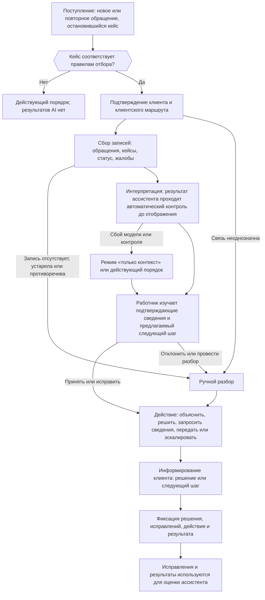

```yaml
source: portfolio/en/projects/service-resolution/how-it-works.md
source_sha256: f7442e6f61c8102e3498c753c11b7e48ee038ed0be5e02a50c86c169b65a9e7a
translation_status: reviewed
```

---
key: "how-it-works"
label: "Порядок пилотного применения"
section: "Решение"
---

## Порядок пилотного применения {#how-it-works-how-the-pilot-works}

На этой странице описано, что получает работник подразделения обслуживания в рамках пилотного применения, как проходит обработка одного кейса клиента, что вправе делать работник и что — ассистент и где проходят границы пилотного применения. Контрольные процедуры, на которых основано каждое ограничение, и подтверждающие материалы, показывающие их действенность, приведены на странице [Контрольные процедуры и подтверждающие материалы](#controls). Устройство системы описано на странице [Технический проект](#technical-design), а управленческие решения, которые предшествуют промышленному использованию, — на странице [Управление инициативой и роли](#governance).

### Проблема {#how-it-works-the-problem}

Клиент несколько раз обращается в Банк по одному и тому же вопросу. Звонки, чаты, кейсы, жалобы и изменения статуса хранятся в разных системах. Работник восстанавливает историю вручную и может не заметить действительную причину задержки, повторно запросить у клиента уже предоставленные сведения или снова перевести клиента к другому специалисту.

В рамках пилотного применения испытывается один подход для одного клиентского маршрута и одной команды обслуживания: работник получает единое подтверждённое представление о нерешённом вопросе клиента и предлагаемый следующий шаг, а принятие решений и выполнение всех действий остаются за ним.

### Создаваемые компоненты {#how-it-works-what-is-built}

В рамках пилотного применения создаются три компонента. Их результаты используются только для решения вопросов по кейсам обслуживания и для оценки ассистента. В дальнейшем повторно использовать можно компоненты и оценочные наборы, но не данные клиентов.

| Компонент | Функции | Ограничения |
| --- | --- | --- |
| Рабочая панель работника | Панель в действующем рабочем месте обслуживания или рядом с ним. Она отображает описанное ниже представление кейса, фиксирует решение работника и выполняет действия, которые работник запускает нажатием кнопки, через действующие системы и с правами доступа самого работника. | В ней нет функции отправки сообщения клиенту и нет свободного чата с моделью. |
| Модуль клиентского контекста | Считывает записи, необходимые для клиентского маршрута, связывает их с клиентом и кейсом и формирует единую хронологию. Для каждого значения указываются запись-источник и время считывания. Для каждого кейса модуль сохраняет снимок показанных сведений. | Он не определяет никаких статусов. Он ничего не записывает в системы Банка. Он считывает только поля, перечисленные в спецификации контекста для клиентского маршрута. |
| Ассистент | Модель AI, которую вызывает workflow, передавая ей снимок кейса и одобренную процедуру. Модель возвращает структурированные выходные данные: краткое изложение произошедшего, вероятную причину задержки, предлагаемый следующий шаг в виде кода из одобренного перечня действий и проект текста для работника. | У него нет инструментов. Он ничего не считывает самостоятельно, ничего не записывает и не выполняет никаких действий. Между кейсами он ничего не сохраняет. |

### Сведения по кейсу на экране работника {#how-it-works-what-the-employee-sees}

- **Запрос клиента:** потребность, которая обрабатывается в данный момент.
- **Что произошло:** краткая хронология предыдущих обращений и действий; для каждой строки указана запись-источник.
- **Подтверждённое текущее состояние:** статус в том виде, в каком он хранится в системе клиентского маршрута, с указанием времени считывания.
- **Шаги:** выполненные, ожидающие выполнения и завершившиеся неудачей шаги по кейсу.
- **Вероятная причина задержки:** отмечена как вывод, с указанием записей, на которых он основан.
- **Применимая процедура:** одобренная процедура и раздел, который применяется в данном случае.
- **Предлагаемый следующий шаг:** одна позиция из одобренного перечня действий для подтверждённого состояния либо отсутствие предложения.
- **Предлагаемое объяснение для клиента:** проект с пометкой «Подготовлено AI», который работник вправе использовать, изменить или не использовать.
- **Записи-источники:** реквизиты каждой исходной записи и ссылка на неё, если система-источник это поддерживает.
- **Решение работника:** принять, исправить, отклонить, провести дополнительный разбор или эскалировать.

### Место в действующем процессе обслуживания {#how-it-works-where-it-fits}

Пилотное применение дополняет действующий процесс обслуживания в фиксированных точках. Оно не заменяет ни одного шага, а правила распределения по очередям и процедуры остаются в ведении ответственных за них подразделений.

| Шаг действующего процесса | Текущая работа | Дополнение пилотного применения | Решение принимает |
| --- | --- | --- | --- |
| Приём обращения | идентифицировать клиента и зафиксировать причину обращения | показывает связанные предыдущие обращения и открытые кейсы | работник |
| Первичная классификация и маршрутизация | классифицировать запрос и выбрать очередь | предлагает клиентский маршрут и вопрос на основе записей | работник в соответствии с правилами распределения по очередям, установленными профильным подразделением |
| Разбор | искать сведения в заметках и сверять данные в нескольких системах | единая хронология со ссылкой на источник в каждой строке | работник |
| Определение причины задержки | установить, почему вопрос до сих пор не решён | выполненные, ожидающие выполнения, завершившиеся неудачей или отсутствующие шаги и вероятная причина задержки с пометкой «вывод» | работник |
| Выбор следующего шага | истолковать процедуру и решить, что делать | процедура и действия, разрешённые для подтверждённого состояния | работник — из перечня, одобренного профильным подразделением |
| Урегулирование или передача | выполнить действие, передать кейс или эскалировать | заявка на передачу, заранее заполненная сведениями о кейсе | работник — нажатием кнопки действия |
| Общение с клиентом | объяснить текущее состояние и дальнейшие шаги | проект объяснения, подготовленный по записям-источникам | работник: он объясняет своими словами либо редактирует и отправляет письменный ответ из действующего канала |
| Закрытие | внести заметки и код урегулирования | проект заметки по кейсу и структурированная запись о результате | работник, который их сохраняет |
| Качество и совершенствование | выборочно анализировать обращения и рассматривать жалобы | закономерности повторных обращений и сбоев на предшествующих этапах процесса | профильное подразделение — в собственном перечне улучшений |

Работа по кейсу в рамках пилотного применения начинается, когда выявлено соответствующее обращение или остановившийся кейс. Она завершается, когда у клиента есть решение вопроса или чётко определённый следующий шаг, а результат зафиксирован. Исправление на предшествующем этапе процесса, необходимость которого выявлена в ходе пилотного применения, вносится в собственный перечень улучшений профильного подразделения, а не в объём пилотного применения.

### Порядок работы с каждым кейсом клиента {#how-it-works-case-workflow}



1. **Поступление.** В очередь пилотного применения поступает новое обращение, повторное обращение или остановившийся кейс. Фиксированные правила отбора (клиентский маршрут, вид, состояние) определяют, включается ли кейс в пилотное применение. Кейс, не входящий в объём, обрабатывается в действующем порядке, и рабочая панель не показывает по нему результатов AI.
2. **Подтверждение клиента и клиентского маршрута.** Модуль контекста связывает клиента, запись клиентского маршрута и открытый кейс по идентификаторам Банка. Если связь неоднозначна, кейс передаётся на ручной разбор.
3. **Сбор записей.** Модуль контекста собирает обращения, кейсы, статус и жалобы. Если обязательная запись отсутствует, старше предельного срока актуальности или противоречит другому источнику, рабочая панель показывает имеющиеся сведения, отмечает пробел и направляет кейс на ручной разбор. Это правило задано в программном коде и не зависит от собственной уверенности модели.
4. **Интерпретация.** Ассистент получает от workflow снимок и процедуру. Выходные данные проходят автоматический контроль до отображения (см. [Допустимые и недопустимые действия ассистента](#how-it-works-assistant-limits)).
5. **Рассмотрение.** Работник изучает подтверждающие сведения и предлагаемый следующий шаг, после чего принимает, исправляет или отклоняет предложение, проводит дополнительный разбор или эскалирует кейс.
6. **Действие.** Работник даёт объяснение, решает вопрос, запрашивает недостающие сведения, передаёт или эскалирует кейс — через действие рабочей панели или в действующей системе.
7. **Информирование клиента.** Работник сообщает клиенту решение вопроса или следующий шаг, который Банк обязуется выполнить.
8. **Фиксация.** Рабочая панель записывает решение, внесённые исправления, действие и результат в собственное хранилище пилотного применения. Исправления и результаты используются для оценки ассистента.

При сбое модели или автоматического контроля рабочая панель показывает связанные записи без сгенерированной части (режим «только контекст») либо работник обрабатывает кейс в действующем порядке. Действующие каналы подачи жалоб, исправления ошибок, эскалации и обслуживания работником остаются доступными на всём протяжении пилотного применения.

### Действия работника {#how-it-works-employee-actions}

Профильное подразделение выбранного клиентского маршрута (подразделение платёжных операций, подразделение по работе со спорами или подразделение оформления клиентов и KYC; KYC — принцип «Знай своего клиента») одобряет краткий перечень действий для каждого состояния кейса. Общий перечень приведён ниже; приложение по клиентскому маршруту вправе исключать из него действия, но не добавлять новые.

| Действие | Вклад ассистента | Действия работника | Место фиксации |
| --- | --- | --- | --- |
| Объяснить текущий статус и причину задержки | проект объяснения по записям-источникам | сообщает объяснение устно либо редактирует его и отправляет из действующего канала | собственная запись канала; решение — в хранилище пилотного применения |
| Выполнить незавершённый внутренний шаг обслуживания | называет шаг и раздел процедуры | выполняет шаг в действующей системе со своими правами доступа | действующая система |
| Однократно запросить конкретные недостающие сведения | проект запроса, в котором перечислено только недостающее | просматривает его и отправляет из действующего канала | собственная запись канала |
| Исправить маршрутизацию или ответственного | предлагает очередь или ответственного | изменяет маршрутизацию в системе учёта кейсов | система учёта кейсов |
| Создать заявку на обратный звонок или передачу специалисту с полным контекстом | заранее заполняет заявку на передачу | просматривает её и нажимает «Создать»; рабочая панель вызывает действующий интерфейс передачи от имени работника | система учёта передач |
| Сообщить следующий шаг, который Банк обязуется выполнить, и ожидаемое состояние обслуживания | проект | сообщает это клиенту | хранилище пилотного применения |
| Эскалировать жалобу, подозрение на мошенничество, обращение клиента, которому требуется особый порядок обслуживания по правилам Банка, или иную ситуацию, требующую участия специалиста | отмечает такую ситуацию, если она следует из записей | эскалирует по действующему каналу | действующий канал эскалации |
| Зафиксировать результат и обратную связь | предлагаемый код результата | подтверждает или изменяет его и нажимает «Записать» | хранилище пилотного применения |

Любая запись в системы — действие работника. Запись выполняется только тогда, когда работник нажимает кнопку действия в рабочей панели или работает в действующей системе. Программный код рабочей панели выполняет выбранное действие от имени работника через действующий интерфейс и с его встроенными мерами контроля. Ассистент только готовит проекты и предлагает.

### Допустимые и недопустимые действия ассистента {#how-it-works-assistant-limits}

| Ассистент | Способ обеспечения |
| --- | --- |
| Вправе сводить обращения и кейсы в хронологию | Каждое утверждение содержит ссылку на запись в снимке кейса. Утверждение без ссылки или со ссылкой на запись, которой нет в снимке, удаляется до отображения. |
| Вправе интерпретировать заметки, чаты, кейсы и жалобы на русском, кыргызском и смешанном языке, в том числе в транслитерации | Оценочный набор охватывает каждое сочетание языков, и качество отражается в отчётности отдельно по каждому из них. Сочетание, качество по которому ниже минимального уровня, исключается правилами отбора, и такие кейсы передаются на ручной разбор. |
| Вправе определять вероятную причину задержки | Она показывается как вывод вместе с подтверждающими сведениями. Она хранится отдельно от фактов, с указанием версии модели, версии запроса к модели и срока действия и никогда не записывается в системы Банка. |
| Вправе предлагать следующий шаг | Предлагаемые действия ограничены кодами одобренного перечня действий для подтверждённого состояния. Любые иные выходные данные отбрасываются, и следующий шаг не предлагается. |
| Вправе готовить проект объяснения, запроса или заметки по кейсу | Проект помечается «Подготовлено AI» и ожидает действий работника. Рабочая панель не может его отправить. |
| Не вправе устанавливать личность, статус, соответствие условиям, сроки, разрешения, суммы или результат операции | В формате выходных данных нет полей для этих сведений. Соответствующие разделы панели заполняет модуль контекста по данным систем-источников. |
| Не вправе обращаться к системам, инструментам или поиску | Модель получает подготовленный снимок и не имеет ни учётных данных, ни сетевого доступа к системам Банка. Все операции чтения выполняет программный код workflow. |
| Не вправе записывать данные, изменять состояние, переводить или возвращать средства | На стороне модели нет функций записи. Запись выполняется только действиями рабочей панели, которые запускает работник. |
| Не вправе принимать или предлагать решения, регулируемые законодательством (кредитование, соответствие условиям, ценообразование, мошенничество, противодействие отмыванию денег и финансированию терроризма, санкции, возмещение или компенсация) | Такие кейсы исключаются правилами отбора и обрабатываются в действующем порядке. В перечне действий таких действий нет. |
| Не вправе использовать данные за пределами спецификации контекста | Модуль контекста удаляет все поля, не включённые в спецификацию, до вызова модели. |
| Не вправе выполнять инструкции, содержащиеся в сообщениях или документах клиента | Текст клиента передаётся как данные, отдельно от инструкций. Поскольку инструментов нет, внедрённая инструкция ничего не может привести в действие. Этот случай охватывается тестированием защищённости при валидации. |
| Не вправе работать без ограничений | Для каждого кейса установлены лимиты времени, числа вызовов модели и затрат. При достижении любого из них выполнение workflow прекращается, и кейс переводится в режим «только контекст». |

### Два этапа {#how-it-works-two-phases}

| Этап | Среда | Данные | Доступ к выходным данным ассистента | Итог |
| --- | --- | --- | --- | --- |
| 1. Эксперимент в лабораторной среде: восстановление и оценка на исторических данных | лабораторная среда на инфраструктуре Банка, изолированная от промышленной среды | выгрузки прошлых кейсов с доступом только для чтения; обратная запись не выполняется | ни у одного работника подразделения обслуживания; эксперты направления размечают зафиксированные кейсы и изучают выходные данные | отчёт о результатах |
| 2. Первое решение: сервис, который эксплуатирует AICC, с правилом вывода из эксплуатации | промышленная среда | чтение текущих данных кейсов пилотной команды в пределах спецификации контекста | у первых пользователей: одной команды обслуживания, прошедшей обучение до начала использования, — после валидации, окончательной приёмки от имени команды и одобрения в порядке управления изменениями Банка | бизнес-приёмка и управленческое решение по итогам минимально жизнеспособного продукта (MVP) |

### Границы объёма {#how-it-works-scope-boundary}

В объём входят: один клиентский маршрут; одна команда обслуживания; недавняя история обращений, кейсов, жалоб и статусов по этому клиентскому маршруту; внутренняя рабочая панель работника; одобрение работником до любого сообщения клиенту и любого операционного действия.

В объём не входят:

- универсальный профиль клиента, общебанковская база знаний или анализ операций для любых иных целей;
- чат-бот для клиентов, самообслуживание клиентов или любое сообщение, которое доходит до клиента без отправки работником;
- любые действия, запись данных или инструменты, доступные ассистенту;
- решения, регулируемые законодательством: они остаются в действующих процессах;
- транскрибирование звонков: звонки учитываются только в виде записей об обращениях и заметок, внесённых работниками;
- передача результатов пилотного применения обратно в системы Банка: об этом впоследствии решают ответственные за источники;
- любое использование результатов пилотного применения для маркетинга, профилирования или иных целей, кроме решения вопросов по обслуживанию и оценки ассистента.

Запись или инструмент, доступные модели, выходные данные для клиента без рассмотрения работником, внешняя модель, поле за пределами спецификации контекста или второй клиентский маршрут — каждое из этих изменений является существенным изменением или требует нового решения (см. [Существенные изменения](#controls-significant-changes)). Использование за пределами круга первых пользователей допускается только после управленческого решения о выпуске.

### Допущения, подлежащие подтверждению в ходе проработки {#how-it-works-assumptions}

Проект исходит из следующих допущений. Каждое из них подтверждается или заменяется резервным вариантом до утверждения описания решения; со стороны IT их выполнение отслеживается в [контрольном перечне готовности IT](#it-readiness).

| Допущение | Резервный вариант, если допущение не подтверждается |
| --- | --- |
| Записи ведутся на русском, кыргызском и смешанном языке, в том числе в транслитерации, в соотношении, которое может оценить ответственный за источник [оценка ответственного за источник] | оценочный набор формируется в соответствии с фактическим соотношением языков; сочетание, с которым ассистент справляется плохо, исключается |
| Содержание звонков доступно только в виде заметок, внесённых работниками | изменений нет: транскрибирование остаётся за рамками пилотного применения |
| У каждого источника есть интерфейс для чтения | регулярная выгрузка с доступом только для чтения; её актуальность отображается на экране |
| Системы обращений, кейсов и клиентского маршрута используют общий ключ клиента | одобренные правила сопоставления; неоднозначные совпадения исключаются |
| Система учёта кейсов хранит отметку времени для каждого шага | хронология показывает имеющиеся отметки времени и отмечает пробелы |
| Запись можно открыть по ссылке | вместо ссылки показываются реквизиты записи |
| Время обработки уже измеряется [управленческий отчёт (MI): время обработки] | измерение этого показателя организуется в качестве первой работы в рамках MVP, до начала использования |
| Рабочее место обслуживания допускает встраивание боковой панели | отдельное окно рабочей панели с той же единой авторизацией |
