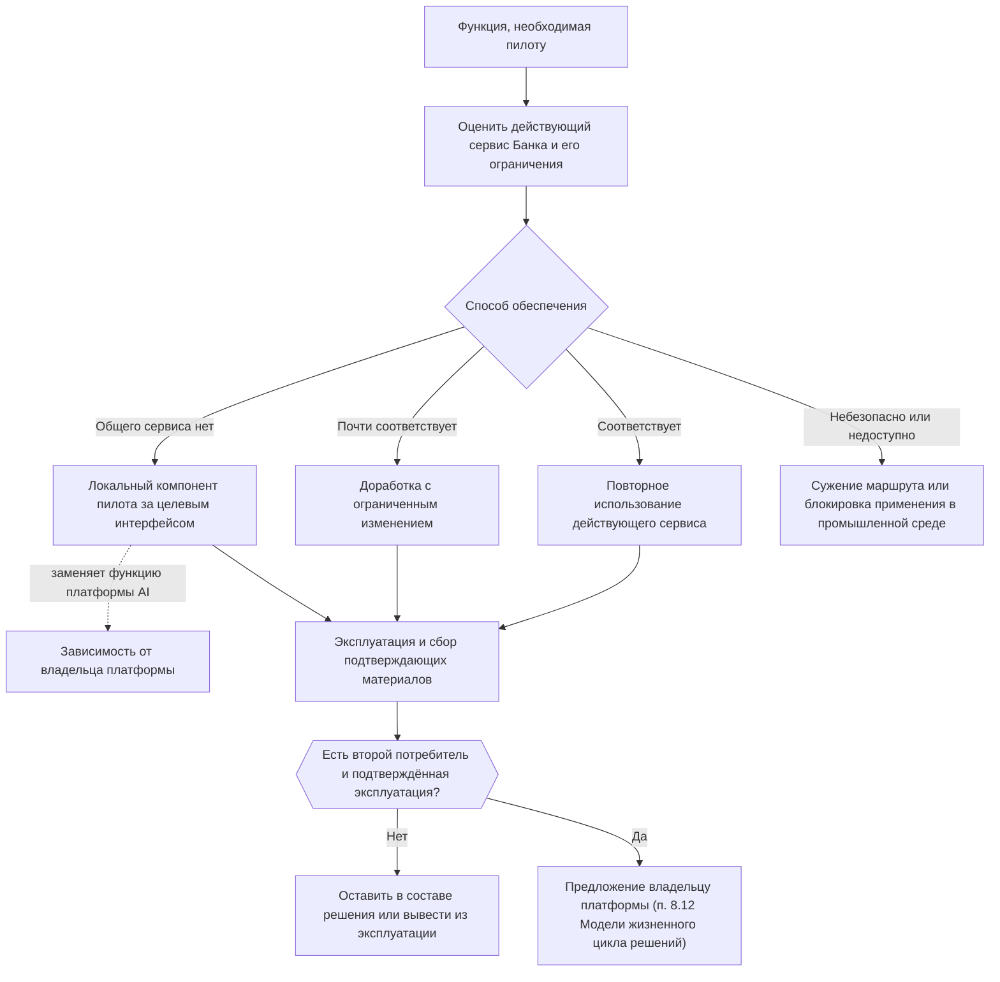

```yaml
source: portfolio/en/projects/service-resolution/it-readiness.md
source_sha256: a2f91beb2d1ba805cf2dc5704f19d1b4079b49648f948bf867c2b9fe0f22ee75
translation_status: reviewed
```

---
key: "it-readiness"
label: "Готовность IT"
section: "Техническая часть"
---

## Контрольный лист готовности IT {#it-readiness-page}

На этой странице в одном месте собрано всё, что пилот требует от IT: необходимые функции и минимальный вариант обеспечения каждой из них, технические решения, которые нужно зафиксировать, зависимости и подтверждающие материалы, которые рассматривают лица, принимающие управленческие решения, до того как первые пользователи увидят какой-либо результат AI. Страница является приложением пилотного проекта; на неё ссылаются разделы 3 и 6 описания решения. Она ничего не утверждает: каждый пункт — подтверждающий материал для управленческого решения, которое корпус документов уже относит к компетенции названной роли. Технический проект, для которого составлен этот контрольный лист, приведён на странице [«Технический проект»](#technical-design).

### Оценка каждой функции {#it-readiness-dispositions}

Действующие продукты, уровень зрелости и интерфейсы Банка заранее не предполагаются. Для каждой функции фиксируется один способ обеспечения:

- **Повторное использование:** потребность удовлетворяет действующий поддерживаемый сервис Банка.
- **Доработка:** потребность удовлетворяет действующий сервис после ограниченного изменения.
- **Локальный компонент пилота:** временный компонент за целевым интерфейсом, зафиксированный в разделе 3 описания решения; если он временно заменяет функцию платформы AI, это оформляется как зависимость от владельца платформы, который принимает такую замену для этого решения.
- **Сужение или блокировка:** клиентский маршрут или применение в промышленной среде ограничивается, потому что безопасную зависимость обеспечить невозможно.



Компонент переводится в общее использование только через предложение владельцу платформы по правилу второго потребителя (п. 8.12 Модели жизненного цикла решений).

### Перечень функций {#it-readiness-capabilities}

Ответственные указываются по роли или подразделению; ФИО указываются в описании решения и на борде программы.

| Функция | Потребность пилота | Минимальный вариант для пилота | Ответственный | В дальнейшем |
| --- | --- | --- | --- | --- |
| Идентификация работников и рабочих нагрузок | авторизация операций чтения и обращений к модели; привязка каждого действия к исполнителю | отдельные идентификаторы и группы пилота в рамках действующих мер управления доступом | подразделение Банка по управлению идентификацией и доступом | архитектура идентификации для рабочих нагрузок AI |
| Доступ на чтение к системам клиентского маршрута | текущее состояние клиента, клиентского маршрута, обращения, контактов и жалоб | интерфейс или адаптер с доступом только для чтения; при отсутствии интерфейса — плановая выгрузка для лабораторной среды | владелец каждой системы-источника; команда интеграции | повторно используемые интерфейсы чтения |
| Связывание клиента и клиентского маршрута | связывание клиента, объекта клиентского маршрута, обращения и контактов | заранее связанная группа данных пилота без неоднозначных совпадений | инженер решений совместно с владельцами источников | общий сервис связывания |
| Сервис клиентского контекста и качество данных | типизированный контекст со ссылками на источники и воспроизводимый снимок; устаревшие или ошибочно связанные данные не пропускаются | сервис для одного клиентского маршрута с контролем качества и карантином | инженер решений | общий интерфейс контекста |
| Запуск моделей | структурированная интерпретация и подготовка черновиков | модель в Банке на действующей внутренней инфраструктуре запуска моделей после проверки поставщика | владелец платформы совместно с подразделением инфраструктуры | масштабированная инфраструктура запуска моделей в Банке, если это обосновано |
| Шлюз AI | аутентификация, ограничение и регистрация каждого обращения к модели; версии модели и запроса к модели | шлюз платформы AI либо, в качестве временной замены, один прокси-сервер с аутентификацией | владелец платформы | общий шлюз |
| Поиск и извлечение знаний | действующая процедура клиентского маршрута и утверждённые формулировки со ссылками на источники | один индекс утверждённых источников; ручной поиск, пока статус источников не определён | инженер решений; за содержание отвечает подразделение — владелец процесса | слой работы со знаниями платформы AI |
| Workflow | фиксированный workflow обработки обращения с ограничениями и резервным вариантом | workflow для одного клиентского маршрута; средство исполнения выбирает команда | инженер решений | общая среда исполнения, если она понадобится второму клиентскому маршруту |
| Рабочее место на рабочем столе системы обслуживания | отображение подтверждений из источников; фиксация решения и действий работника | отдельный экран, если рабочий стол нельзя доработать; идентификаторы записей вместо ссылок | владелец рабочего стола системы обслуживания | повторно используемый компонент поддержки работников |
| Хранилище данных пилота и действующие интерфейсы записи | решения, обратная связь и результаты; направление к специалисту и заметка по обращению, создаваемые работником | собственное хранилище пилота; действующие интерфейсы направлений и обращений либо ручная обработка | инженер решений; владелец системы обращений | передача результатов в системы Банка при согласии владельцев источников |
| Средства оценки | повторный прогон зафиксированного набора обращений при каждом изменении | средства оценки хранятся в репозитории; за оценочный набор отвечают лица, не участвовавшие в разработке | тестировщик, не участвовавший в разработке; эксперты направления | общий сервис оценки |
| Регистрация событий и мониторинг | журналы со сроком хранения, установленным правилами; одна трассировка на обращение; сигнальные значения | телеметрия пилота передаётся в действующие хранилища данных мониторинга и событий безопасности | владелец платформы (PLT-002) | общая наблюдаемость AI |
| Приостановление | остановка генерации или всего сервиса без потери записей | переключатель в workflow, протестированный до начала работы первых пользователей | инженер решений; владелец платформы (PLT-005) | механизм приостановления на уровне платформы |
| Среды, среда выполнения и секреты | лабораторная среда, тестовая (непромышленная) среда, промышленная среда | действующие серверы приложений; управляемые секреты; инфраструктура как код | подразделение инфраструктуры и эксплуатации Банка | поддерживаемые среды платформы |
| Поддержка, инциденты и изменения | эксплуатация сервиса, восстановление ручной обработки, одобрение изменений в промышленной среде | инженер решений в качестве эксплуатирующей стороны; управление инцидентами и изменениями Банка; ограниченное окно поддержки | подразделение Банка по управлению IT-услугами | поддержка получателем после передачи |
| Отчётность о результатах и затратах | значения индикаторов и затраты на одно обращение | отчёт пилота с зафиксированными определениями на основе указанного источника управленческой отчётности | владелец источника управленческой отчётности | регулярная отчётность Банка |

Каждый вклад IT запрашивается с указанием ответственного, согласованного интерфейса или результата, поддерживаемой среды, ожидаемого уровня обслуживания, ограничения и резервного варианта, а не в виде неопределённой «среды для AI» или неограниченного доступа к источникам. Подразделение информационной безопасности помогает в инженерной работе в рамках зависимости; валидацию в области информационной безопасности отдельно проводит соответствующий представитель контрольной функции.

### Перечень технических решений {#it-readiness-decisions}

Перечисленные ниже технические решения фиксируются в указанном порядке до одобрения описания решения. Этот перечень также служит правилом завершения [профиля клиентского маршрута](#journey-profiles).

| № | Решение | Что фиксируется | Где фиксируется и кто решает |
| --- | --- | --- | --- |
| 1 | Класс данных и цель | классы данных каждого источника; цель (решение вопросов клиентов и оценка ассистента); использование в лабораторной среде и с поименно указанными первыми пользователями | описание решения и реестр AI-решений; применение для класса данных одобряет владелец направления (пока решение создаёт руководитель AICC — куратор AICC) после согласования владельцами источников и контрольной функцией по защите данных |
| 2 | Маршрут к модели и проверка поставщика | модель в Банке и инфраструктура её запуска; лицензия; для внешней модели — проверка поставщика и подтверждение EXT-001 и EXT-002 | заключение контрольных функций по информационной безопасности, защите данных и правовым вопросам; реестр AI-решений |
| 3 | Клиентский маршрут и режим | выбранный клиентский маршрут; фаза 1 — в лабораторной среде, фаза 2 — с первыми пользователями; последний режим, входящий в объём работ, — сообщение клиенту, одобренное работником и направленное через действующий канал | паспорт инициативы и описание решения; владелец направления совместно с руководителем AICC |
| 4 | Интеграция по каждому источнику | интерфейс, адаптер, выгрузка или недоступность; ответственный, актуальность и поддерживаемый способ использования | раздел 3 описания решения; зависимость по каждому источнику |
| 5 | Идентификация и связывание | идентификаторы и правила сопоставления; карантин неоднозначных совпадений | раздел 3 описания решения |
| 6 | Граница данных и знаний | разрешённые поля и источники, исключённые поля, сроки хранения и доступ; источники знаний с владельцем и датой пересмотра | раздел 3 описания решения; реестр AI-решений |
| 7 | Интерпретация состояний и перечень действий | распознаваемые состояния, препятствия, нестандартные ситуации, допустимые формулировки для клиента и утверждённый перечень действий | утверждается подразделением — владельцем процесса клиентского маршрута как зависимость; оформляется как критерии приёмки |
| 8 | Функции и полномочия | в рамках workflow — только сервисы чтения; действия работника и их интерфейсы; перечень запрещённых действий | раздел 7 описания решения («Условия применения»); реестр AI-решений, «AI-агенты и права: нет» |
| 9 | Способы обеспечения функций | повторное использование, доработка, локальный компонент пилота либо сужение или блокировка — для каждой строки перечня функций | раздел 3 описания решения; зависимости на борде программы |
| 10 | Среды и условия эксплуатации | среды, сетевая зона, оценка нагрузки, окно поддержки, порядок приостановления | описание решения; владелец платформы и подразделение инфраструктуры — как зависимости |
| 11 | Порядок получения подтверждающих материалов | охват оценочного набора, схема сравнения, выборка для мониторинга, необходимая трассировка | блок «Эксперимент» в описании решения; приложение об измерениях на странице [«Паспорт инициативы»](#charter) |
| 12 | Дальнейшая ответственность | получатель — IT-функция Банка, к которой предстоит обратиться; эксплуатационные затраты и правило вывода сервиса из эксплуатации | заголовочная часть и раздел 7 описания решения |

Средство исполнения workflow, другие продукты и фреймворки выбирает команда; эти управленческие решения вносятся в журнал решений. Выбранные средства соответствуют контрактам технического проекта и остаются заменяемыми.

### Зависимости {#it-readiness-dependencies}

Каждая строка — зависимость на борде программы с указанием ответственного, итерации, в которой она необходима, и статуса («Открыта», «Выполнена», «Под угрозой»). Если у зависимости нет ответственного, подтвердившего свои обязательства, элемент остаётся в состоянии «Ожидание» либо объём работ сужается. Если необходимо также пройти собственный процесс Банка по приёму заявок на IT-работы, это ещё одна зависимость, а не отдельный порядок.

| Зависимость | Что требуется | Ответственный |
| --- | --- | --- |
| Идентификация клиента | идентификатор клиента, общий для выбранных записей, или утверждённое правило сопоставления | владелец единой базы клиентских данных или CRM-системы |
| История контактов | записи письменных контактов (чаты, сообщения, заметки); голосовые обращения не входят в пилот | владелец платформ контактов |
| Система обращений и обработки | вид, статус, ответственный и шаги обращения, отметки времени (если они ведутся) и код итога | владелец системы клиентского маршрута |
| Жалобы | связь с жалобами и состояние эскалации, если применимо | подразделение по работе с жалобами |
| Знания для обслуживания | утверждённая процедура, правила по продуктам, условия маршрутизации и эскалации, перечень действий | подразделение — владелец процесса клиентского маршрута и владельцы знаний |
| Доступ работников | единый вход, ролевые права, аудит, рабочий стол системы обслуживания или отдельный экран | подразделение по управлению идентификацией и доступом; владелец рабочего стола системы обслуживания |
| Сообщения клиентам | действующий канал и учёт сообщений в нём | владелец канала и подразделение обслуживания клиентов |
| Лабораторная среда | сведения о среде, выгрузки с доступом только для чтения, регистрация событий, модель в Банке | руководитель AICC; владелец платформы |
| Размещение модели и проверка поставщика | маршрут к модели в Банке, прошедшей проверку как поставщик; одобрение применения для класса данных | владелец платформы; представители контрольных функций по информационной безопасности, защите данных и правовым вопросам |
| Отчётность о результатах | показатели повторных контактов, решения вопросов, трудозатрат на обработку, передач между исполнителями, жалоб и обратной связи клиентов | владелец источника управленческой отчётности |

### Подтверждающие материалы до начала работы первых пользователей {#it-readiness-evidence}

Подтверждающие материалы по архитектуре, данным, мерам контроля, эксплуатационной готовности и качеству рассматриваются при принятии перечисленных ниже управленческих решений и отдельным одобрением не являются. Каждое управленческое решение принимает указанная роль; на странице лишь перечислено, что рассматривает эта роль.

| Этап | Подтверждающие материалы | Кто принимает решение |
| --- | --- | --- |
| Одобрение описания решения (эксперимент) | профиль выбранного клиентского маршрута заполнен; решения 1–12 зафиксированы; способы обеспечения функций, временные компоненты и ответственные перечислены; логика клиентского маршрута отделена от общих функций; категория риска присвоена; запись в реестр AI-решений внесена; представитель контрольной функции по комплаенсу подтвердил применимое законодательство | владелец направления (пока решение создаёт руководитель AICC — куратор AICC) |
| Данные в лабораторной среде (фаза 1) | применение для класса данных одобрено; сведения о среде (LAB-001, LAB-002); для каждой выгрузки указаны владелец и класс данных (LAB-003); персональные данные минимизированы и оценены (LAB-004); модель в Банке, а также облачная среда, если она используется, прошли проверку как поставщик (LAB-005); лицензии зафиксированы (ARC-006) | владелец направления или куратор AICC; представители контрольных функций по защите данных, информационной безопасности и правовым вопросам |
| Анализ результата фазы 1 | оценочный набор с контролем опоры на источники, дрейфа и предвзятости (LAB-006); тесты выполнены лицом, не участвовавшим в разработке; представление «только контекст» и представление с генеративным AI сравнены на зафиксированном наборе обращений; отчёт о результатах (LAB-007) | готовит руководитель AICC; рассматривает владелец направления |
| Одобрение описания решения (сервис) | эксплуатационные затраты и правило вывода из эксплуатации указаны в бизнес-кейсе; определено, к кому обратиться в качестве получателя; первые пользователи поименно указаны; категория риска, запись в реестре AI-решений и применимое законодательство подтверждены для сервиса | владелец направления (пока решение создаёт руководитель AICC — куратор AICC) |
| Валидация | подтверждены источники, связывание записей и значения статусов; разрешённые поля, исключённые поля и актуальность протестированы; запрещённые данные, решения и функции блокируются; проведено тестирование защищённости (промпт-инъекции, доступ к данным другого клиента, несанкционированная выгрузка данных, компоненты с открытым исходным кодом); проведено тестирование на предвзятость и ошибки; журналы и подтверждающие материалы хранит владелец платформы | представители контрольных функций по модельному риску, информационной безопасности, защите данных, комплаенсу и правовым вопросам — каждый своим заключением |
| Окончательная приёмка командой | критерии приёмки выполнены; в оценочном наборе не выявлено критических ошибок в значении, установленном профилем (выявленная ошибка блокирует начало применения до её исправления и повторного тестирования); workflow, исправление, эскалация и фиксация результата работают от начала до конца; обеспечена эксплуатационная готовность, указанная ниже | руководитель AICC |
| Первое развёртывание в промышленной среде | зависимости в статусе «Выполнена»; заявка на изменение и результаты тестирования; регистрация событий и мониторинг включены (PLT-002), сигнальные значения и ответственные за их отслеживание определены (ARC-008); приостановление протестировано (PLT-005); ручная обработка протестирована; порядок обработки инцидентов встроен в процесс управления инцидентами Банка; инженер решений назначен эксплуатирующей стороной | управление изменениями Банка |
| Первые пользователи видят результат AI | обучение завершено; информирование клиентов об объяснениях, подготовленных AI, организовано в форме, определённой представителем контрольной функции по комплаенсу | владелец направления |

В разделе о выпуске описания решения эксплуатационная готовность для первых пользователей фиксируется одной строкой со ссылкой на этот контрольный лист. Для выпуска за пределы круга первых пользователей необходим контрольный лист приёмки, подписанный в строках IT-функции и владельца платформы; это происходит после управленческого решения по итогам MVP и выходит за рамки настоящего контрольного листа.

### Наблюдения за нагрузкой по итогам пилота {#it-readiness-capacity}

До принятия обязательств по оборудованию для масштабирования пилот передаёт подразделению инфраструктуры и эксплуатации измеренные значения: интенсивность запросов, объём текста на одно обращение, число одновременных обращений, задержку, объём хранилища, сроки хранения и доступность. Необходимая мощность для запуска модели зависит от размера модели и степени её сжатия, длины контекста, объёма генерируемого текста, числа одновременно обрабатываемых обращений, целевой задержки, архитектуры обеспечения доступности и резерва на рост. Для работы в лабораторной среде может быть достаточно одного узла запуска модели; для промышленной эксплуатации, как правило, нужны изоляция отказов и резервная мощность. Высокоскоростные соединения между графическими процессорами нужны, только если выбранная модель или нагрузка распределяется на несколько процессоров.

### После завершения пилота {#it-readiness-after}

Дальнейшая судьба компонентов пилота описана в разделе [«В дальнейшем, за рамками пилота»](#technical-design-later): повторное использование через описание пакета, перевод в общее использование через предложение владельцу платформы по правилу второго потребителя и передача сервиса IT-функции в качестве получателя.
