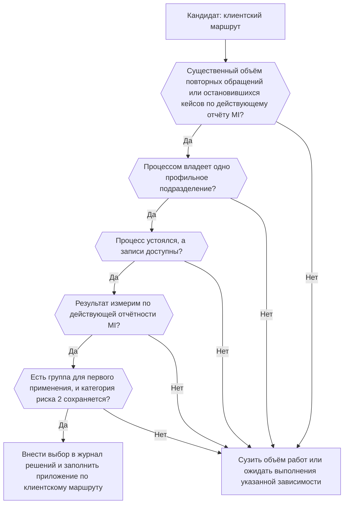

```yaml
source: portfolio/en/projects/service-resolution/journeys.md
source_sha256: bf7169e8571fe4632ff7317be9a14ec560f6a851b63d1713c5b605485f6e1991
translation_status: reviewed
```

---
key: "journeys"
label: "Карта маршрутов"
section: "Карта маршрутов"
---

## Карта маршрутов и порядок выбора {#journeys-journey-options-and-selection}

Пилотное применение охватывает один клиентский маршрут, одну очередь обращений и одну группу обслуживания. Рассматриваются три клиентских маршрута. При определении объёма (шаг «Рассмотрение», «Проработка»: «Определение объёма») руководитель Центра Компетенций и владелец направления — руководитель подразделения клиентского обслуживания — выбирают один из них по приведённому ниже правилу. Для каждого варианта составлено одностраничное приложение, в котором указано только то, что относится именно к нему. Общее для всех трёх (обязательства по разработке и внедрению, распределение ответственности, оформление одобрения, охват рисков) приведено на страницах «[Паспорт инициативы](#charter)», «[Управление проектом и роли](#governance)» и «[Контроль и подтверждающие материалы](#controls)»; техническая сторона — на странице «[Технические профили клиентских маршрутов](#journey-profiles)».

Статус: INI-013 (состояние «Предложено»; воронка портфеля). Клиентский маршрут пока не выбран.

### Три варианта {#journeys-the-three-candidates}

Объёмы здесь не публикуются: для каждого варианта указана ссылка на источник управленческой отчётности (MI), который проверяется при определении объёма.

| Клиентский маршрут | Проблема клиента | Проверяемый результат | Профильное подразделение (зависимость) | Что усложняет работу | Ожидаемый объём |
| --- | --- | --- | --- | --- | --- |
| [Решение вопросов по платежам](#journey-payment) | Клиент снова обращается в Банк, потому что ему неясно, что происходит с неисполненным, находящимся в обработке или возвращённым платежом и кто за него отвечает | Меньше повторных обращений; быстрее подтверждённое решение вопроса | Подразделение платёжных операций | Низкая сложность. Статус должен поступать из платёжной системы по выбранному типу платежей | [отчёт MI: обращения по платежам в месяц по типам платежей]; вероятно, наибольший из трёх |
| [Сопровождение споров по картам](#journey-dispute) | Клиент не видит, как продвигается спор по карте, каких подтверждающих документов ещё не хватает и каков следующий шаг | Меньше обращений о статусе, которых можно было избежать; меньше повторных запросов подтверждающих документов | Подразделение по работе со спорными операциями | Средняя сложность. Правила платёжных систем и нормативные сроки; ошибка в сроке может лишить клиента его права | [отчёт MI: открытые споры и обращения о статусе в месяц по типам споров]; для одной группы, вероятно, небольшой |
| [Сопровождение оформления и KYC](#journey-kyc) | Заявка застревает на этапах приёма документов, верификации и рассмотрения, и у клиента не раз запрашивают одни и те же сведения | Меньше повторных запросов сведений; меньше времени до обоснованного следующего шага | Подразделение оформления клиентов и KYC | Сложность от средней до высокой. Строгое ограничение доступа к сведениям о противодействии финансовым преступлениям; комплаенс может потребовать повышения категории риска | [отчёт MI: приостановленные заявки в месяц по сегментам и каналам оформления]; зависит от канала оформления |

Два других клиентских маршрута для первого пилотного применения не предлагаются. Статус кредитной заявки зависит от кредитного решения, которое исключено из пилотного применения, и от нескольких кредитных подразделений. Урегулирование жалоб подчиняется собственным правилам ответа клиентам и решениям о компенсации, а проблема там — в качестве урегулирования, а не в разрозненной истории кейса. Любой из этих маршрутов может появиться позже как новая потребность в воронке.

### Правило выбора {#journeys-selection-rule}

Выбирается клиентский маршрут, который удовлетворяет всем семи условиям. Если им удовлетворяют два маршрута, предпочтение отдаётся тому, объём которого позволяет подтвердить результат в пределах тайм-бокса (раздел «Ожидаемый объём» каждого приложения).

1. **Объём:** число повторных обращений или приостановленных кейсов существенно, что подтверждается имеющимся отчётом MI.
2. **Одно профильное подразделение:** за базовый процесс отвечает одно подразделение, которое учитывается как зависимость. Оно утверждает перечень действий, определения исходов и интерпретацию исторических кейсов и выделяет экспертов направления. Если оно также претендует на часть выгоды, у инициативы появляется второе направление (см. «[Управление проектом и роли](#governance)»).
3. **Устоявшийся процесс:** процесс урегулирования уже сложился, поэтому ассистент объясняет существующий процесс, а не определяет новый.
4. **Доступные записи:** состояние кейса, обращения и предшествующие коммуникации можно прочитать через интерфейс для чтения или из одобренной выгрузки; они связаны общим ключом клиента и имеют временные отметки. Каждое из этих условий — допущение, которое подтверждается при определении объёма.
5. **Измеримый результат:** опережающие индикаторы можно измерить по имеющейся отчётности MI без применения AI, чтобы базовые значения были определены на стадии «Бизнес-кейс».
6. **Группа для первого применения:** одна группа подразделения клиентского обслуживания может работать в качестве первых пользователей; её время указывается в части B соглашения о взаимодействии.
7. **Категория риска 2 сохраняется:** клиентский маршрут не добавляет ничего, что повысило бы ожидаемую категорию риска выше 2.



Если ни один вариант не удовлетворяет правилу, объём работ сужается (меньше состояний, один тип платежей или споров) либо инициатива ожидает выполнения указанной зависимости, которая её блокирует.

### Как выбранный клиентский маршрут отражается в паспорте инициативы {#journeys-how-the-selected-journey-enters-the-initiative-brief}

Выбор клиентского маршрута — контрольная точка определения объёма. Руководитель Центра Компетенций совместно с владельцем направления вносит его в журнал решений, а в паспорте выбранный маршрут указывается в объёме работ и в составе ожидаемых решений. Приложение по выбранному маршруту заполняется и хранится вместе с паспортом в папке инициативы в портфеле под названием «Паспорт инициативы: приложение по клиентскому маршруту»; два других остаются вариантами на этой странице. После этого каждый раздел приложения переносится в одно определённое место.

| Раздел приложения | Куда переносится | Кто заполняет или утверждает |
| --- | --- | --- |
| Объём работ и исключения | Раздел 3 паспорта; впоследствии — область применения в описании решения | Руководитель Центра Компетенций совместно с владельцем направления; паспорт одобряет владелец направления |
| Профильное подразделение и что оно утверждает | Раздел 5 паспорта как зависимость, на борде программы с указанием итерации, к которой нужен результат; утверждённое подразделением становится критериями приёмки в описании решения | Утверждает руководитель профильного подразделения; руководитель Центра Компетенций фиксирует каждое утверждение как выполненную зависимость |
| Области компетенции контрольных функций, которые добавляет клиентский маршрут | Раздел 5 паспорта: представители контрольных функций, согласующие бизнес-кейс | Каждый соответствующий представитель контрольной функции — заключением контрольной функции |
| Базовые показатели | Раздел 2 паспорта (индикатор клиентского маршрута) и приложение об измерениях на странице «[Паспорт инициативы](#charter)» | Базовое значение определяет владелец каждого источника; целевые значения устанавливает владелец направления |
| Критерии качества и контрольных пределов | Критерии приёмки и сигнальные значения в описании решения (см. «[Контроль и подтверждающие материалы](#controls)») | Описание решения одобряет владелец направления, а если решение создал руководитель Центра Компетенций — куратор Центра Компетенций |
| Условия остановки | Условия применения и сигнальные значения в описании решения; факты для управленческого решения по итогам MVP | Применение решения приостанавливает руководитель Центра Компетенций или представитель контрольной функции; управленческое решение по итогам MVP принимает лицо, одобрившее паспорт |
| Ожидаемый объём | Приложение об измерениях: устанавливается ли для индикатора повторных обращений целевое значение или он учитывается лишь как указание на направление изменений — согласно протоколу решения об одобрении паспорта | Объём предоставляет владелец источника; лицо, одобрившее паспорт, признаёт вывод, который этот объём позволяет сделать |

После одобрения изменение типа платежей, типа споров, сегмента, канала оформления или очереди обращений оформляется как изменение паспорта с протоколом решения. Другой клиентский маршрут к этому пилотному применению не добавляется: он вносится в воронку как новая потребность и может повторно использовать компоненты и оценочные наборы этого пилотного применения.
