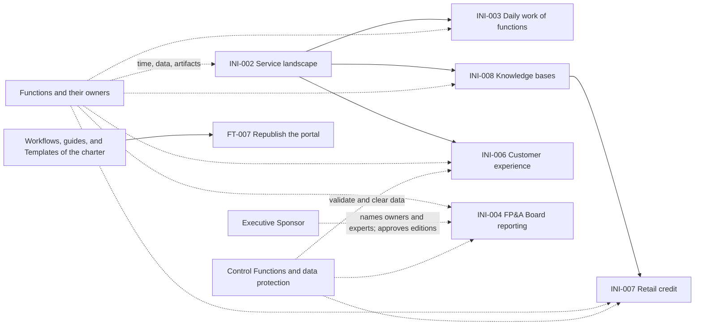

# Program Board

The Program Board is the board of the dependencies of the Program Increment (Solution Lifecycle Model 4.3). It shows, for each Capability and Feature, the Iteration in which it is planned, its state, and what it needs from other items, Teams, functions, and persons (most of it is outside AICC), and it shows the Milestones of the Roadmap at the Iteration in which they fall. The scope of each Iteration is decided at Iteration Planning and changes with the Dependencies. The AICC Lead keeps the Board current at the Weekly Review. Status of a Dependency: Open, Met, or At risk. A Milestone is At risk when a Feature or a Dependency that it needs is At risk, and what is At risk is raised to the monthly Steering.

## 1. Capabilities and Features

The following table shows each Capability and Feature of the Program Backlog by Iteration. A lane is one item, and a cell holds the state that the item has reached in that Iteration. A blank cell is not planned: Iteration Planning of I10 is not held and no record of it exists (pi/2026-PIQ4/I10.md). The Initiatives in discovery have no Capabilities or Features yet, so they appear in sections 3 and 4 only.

| Lane | Capability | State | 2026 I10 (Oct) | 2026 I11 (Nov) | 2026 I12 (Dec) | IP week | Depends on | Dependency status |
| --- | --- | --- | --- | --- | --- | --- | --- | --- |
| CAP-001 Charter readiness | INI-001 | Active | Active | | | | None | |
| FT-001 Decide the open questions | CAP-001 | Closed | Closed | | | | None | |
| FT-002 Mechanical sweep of the first corpus | CAP-001 | Cancelled | Cancelled | | | | None | |
| FT-003 Fix contradictions and carriers in the first corpus | CAP-001 | Cancelled | Cancelled | | | | None | |
| FT-004 Simplify the corpus | CAP-001 | Closed | Closed | | | | None | |
| FT-005 Independent check of the documents | CAP-001 | Deferred | | | | | None | |
| FT-006 Activate the documents | CAP-001 | Closed | Closed | | | | None | |
| FT-007 Republish the portal from the active charter | CAP-001 | Deferred | | | | | DEP-015: the workflows, the guides, and the Templates of the charter complete | Open |

## 2. Milestones

The following table places the Milestones of the Roadmap (roadmap.md) at the Iteration in which they fall. The Roadmap gives most of them by Program Increment and no Iteration, so a blank cell is not yet placed, and a Milestone of a later Program Increment is placed by Iteration at its PI Planning. The state is that of the Roadmap, or At risk where a Dependency that the Milestone needs is At risk.

| Milestone | Roadmap | Program Increment | 2026 I10 (Oct) | 2026 I11 (Nov) | 2026 I12 (Dec) | IP week | Depends on | State |
| --- | --- | --- | --- | --- | --- | --- | --- | --- |
| MS-001 | The documents are active | 2026-PIQ4 | Done (2026-10-01) | | | | None | Done |
| MS-002 | The Holders of the Roles are named, by 2026-11-30 | 2026-PIQ4 | | | Due 2026-11-30 | | DEP-004 | At risk |
| MS-003 | Every known AI use is in the AI Registry with a Risk Tier | 2026-PIQ4 | | | Due 2026-12-30 (AI Policy 2.1) | | None stated | Planned |
| MS-006 | First Domain engaged, with the first Solution | 2026-PIQ4 | | | | | None stated | Planned |
| MS-009 | The service landscape map is presented | 2026-PIQ4 | | | | | DEP-001, DEP-002 | Planned |
| MS-010 | Customer experience discovery is complete | 2026-PIQ4 | | | | | DEP-004, DEP-008, DEP-009 | At risk |
| MS-011 | FP&A Board reporting is running | 2026-PIQ4 | | | | | DEP-004, DEP-006, DEP-007 | At risk |
| MS-012 | Functions are introduced to AI | 2026-PIQ4 | | | | | DEP-003, DEP-004, DEP-005 | At risk |
| MS-013 | Retail credit discovery is complete | 2026-PIQ4 | | | | | DEP-004, DEP-010, DEP-011 | At risk |
| MS-014 | Knowledge base approach is agreed and the first base is in use | 2026-PIQ4 | | | | | DEP-004, DEP-012, DEP-013 | At risk |
| MS-004 | The events of the loops are running: Iterations, the Program Increment, and the Steering | 2027-PIQ1 | | | | | None stated | Planned |
| MS-005 | Maturity Level 1 reached | 2027-PIQ1 | | | | | None stated | Planned |
| MS-007 | First Solution deployed to a function and released | 2027-PIQ1 | | | | | None stated | Planned |
| MS-008 | Maturity Level 2 reached for the first Strategic Priorities | 2027-PIQ2 | | | | | None stated | Planned |

## 3. Dependencies

| Identifier | Item | Needs | From | Needed by | Status |
| --- | --- | --- | --- | --- | --- |
| DEP-001 | INI-002 Service landscape | Time and knowledge of the function heads and service owners; their existing artifacts | The functions | each month, as the functions are visited | Open |
| DEP-002 | INI-002 Service landscape | Access to and classification of the EA repository and the portal | Information security (RI-018) | before publication | Open |
| DEP-003 | INI-003 Daily work of functions | The ranked candidates for adoption | INI-002 | when the function is engaged | Open |
| DEP-004 | INI-003, INI-004, INI-006, INI-007, INI-008 | Named Domain Owners and Domain Experts | Executive Sponsor and the heads of function (RI-016) | before the item is selected into an Iteration | At risk |
| DEP-005 | INI-003 Daily work of functions | Approval of the data classes for the function | The Domain Owner of each function | before first use | Open |
| DEP-006 | INI-004 FP&A Board reporting | The time of the FP&A analytics function; the financial data sources; the Board portal | FP&A | each monthly edition | Open |
| DEP-007 | INI-004 FP&A Board reporting | The approval of each edition | Executive Sponsor (DR-2026-014) | each issue | Open |
| DEP-008 | INI-006 Customer experience | The map of the sources of customer information | INI-002 | when the sources are listed | Open |
| DEP-009 | INI-006 Customer experience | Access to support requests, issues, and challenges, and their data class | The front office, retail, and commercial sales functions; data protection | before any sample | Open |
| DEP-010 | INI-007 Retail credit | The common approach for knowledge bases | INI-008 | before the knowledge base work | Open |
| DEP-011 | INI-007 Retail credit | Access to mortgage rejection data and its data class; the controls | Retail credit; data protection; model risk (RI-014) | before any analysis | Open |
| DEP-012 | INI-008 Knowledge bases | The list of functions and the knowledge they hold | INI-002 | when the first base is chosen | Open |
| DEP-013 | INI-008 Knowledge bases | Source documents with an owner and a review date | The function that owns each base | for each base | Open |
| DEP-014 | Any Initiative that expects Risk Tier 2 or 3, and its Solution | The clearance of the business case, and the validation by the Control Function Contacts | Control Functions (RI-008, RI-014) | before the business case is approved, and before the first deployment | At risk |
| DEP-015 | INI-001 FT-007 Republish the portal | The workflows, the guides, and the Templates of the charter complete | AICC Lead | before FT-007 starts | Open |

## 4. Scope of each item by month

The scope of the PIQ4 items for each Iteration. It is set at Iteration Planning, and is intent until then. Iteration Planning of I10 is not held and no record of it exists, so the cells of the Initiatives in discovery are blank.

| Item | 2026 I10 (Oct) | 2026 I11 (Nov) | 2026 I12 (Dec) |
| --- | --- | --- | --- |
| INI-001 Charter corpus readiness | CAP-001 Active; FT-001, FT-004, and FT-006 Closed; FT-002 and FT-003 Cancelled; FT-005 and FT-007 Deferred | | |
| INI-002 Service landscape | | | |
| INI-006 Customer experience discovery | | | |
| INI-004 FP&A Board reporting | | | |
| INI-003 AI in the daily work of functions | | | |
| INI-007 Retail credit | | | |
| INI-008 Knowledge bases | | | |

## 5. Map

Figure 1 shows the Dependencies between the items. Dashed lines are Dependencies on persons and functions outside AICC.

Figure 1: the Dependencies of PIQ4.
