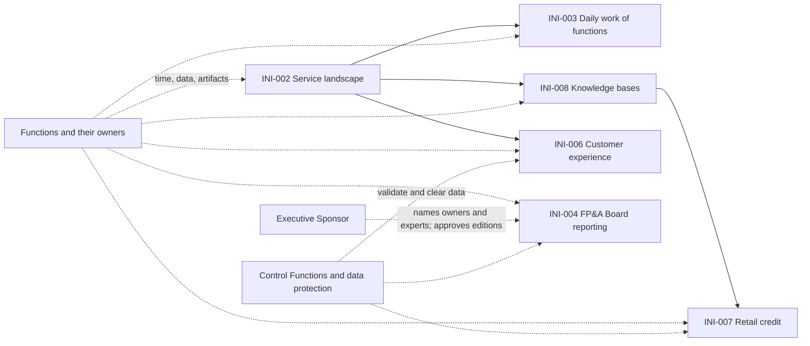

# Dependency Map

For each item of the Program Increment: its intent, what it needs from other items, Teams, functions, and persons (most of it is
outside AICC), and its scope by month. The scope by month is decided at IT Planning and changes with the Dependencies. It is
reviewed in the Weekly Review. Status of a Dependency: Open, Met, or At risk.

## 1. Dependencies

| Identifier | Item | Needs | From | Needed by | Status |
| --- | --- | --- | --- | --- | --- |
| DEP-001 | INI-002 Service landscape | Time and knowledge of the function heads and service owners; their existing artifacts | The functions | each month, as the functions are visited | Open |
| DEP-002 | INI-002 Service landscape | Access to and classification of the EA repository and the portal | Information security (RI-018) | before publication | Open |
| DEP-003 | INI-003 Daily work of functions | The ranked candidates for adoption | INI-002 | when the function is engaged | Open |
| DEP-004 | INI-003, INI-004, INI-006, INI-007, INI-008 | Named Domain Owners and Domain Experts | Executive Sponsor and the heads of function (RI-016) | before the item is selected into an Iteration | Open |
| DEP-005 | INI-003 Daily work of functions | Approval of the data classes for the function | The Domain Owner of each function | before first use | Open |
| DEP-006 | INI-004 FP&A Board reporting | The time of the FP&A analytics function; the financial data sources; the Board portal | FP&A | each monthly edition | Open |
| DEP-007 | INI-004 FP&A Board reporting | The approval of each edition | Executive Sponsor (DR-2026-014) | each issue | Open |
| DEP-008 | INI-006 Customer experience | The map of the sources of customer information | INI-002 | when the sources are listed | Open |
| DEP-009 | INI-006 Customer experience | Access to support requests, issues, and challenges, and their data class | The front office, retail, and commercial sales functions; data protection | before any sample | Open |
| DEP-010 | INI-007 Retail credit | The common approach for knowledge bases | INI-008 | before the knowledge base work | Open |
| DEP-011 | INI-007 Retail credit | Access to mortgage rejection data and its data class; the controls | Retail credit; data protection; model risk (RI-014) | before any analysis | Open |
| DEP-012 | INI-008 Knowledge bases | The list of functions and the knowledge they hold | INI-002 | when the first base is chosen | Open |
| DEP-013 | INI-008 Knowledge bases | Source documents with an owner and a review date | The function that owns each base | for each base | Open |
| DEP-014 | Any Risk Tier 2 or 3 Solution | Validation by the Control Function Contacts | Control Functions (RI-008, RI-014) | before the first deployment | Open |

## 2. Scope of each item by month

The scope of the PIQ4 items for each Iteration. It is set at IT Planning, and is intent until then.

| Item | 2026 IT10 (Oct) | 2026 IT11 (Nov) | 2026 IT12 (Dec) |
| --- | --- | --- | --- |
| INI-002 Service landscape | | | |
| INI-006 Customer experience discovery | | | |
| INI-004 FP&A Board reporting | | | |
| INI-003 AI in the daily work of functions | | | |
| INI-007 Retail credit | | | |
| INI-008 Knowledge bases | | | |

## 3. Map

Figure 1 shows the Dependencies between the items. Dashed lines are Dependencies on persons and functions outside AICC.

Figure 1: the Dependencies of PIQ4.
