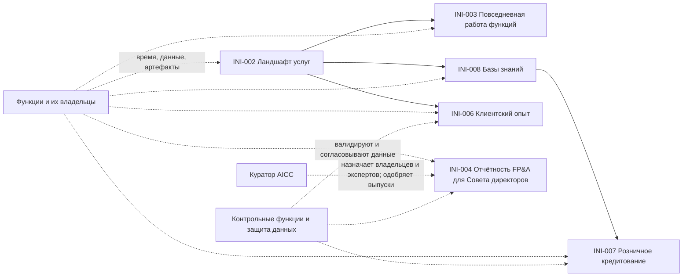

```yaml
source: registry/en/dependencies.md
source_sha256: 3614bdd175ee4eb89ee0d16a94bd321b18a88c7a282cfdd37702c0ff3bdf86a3
translation_status: reviewed
```

# Доска программы

Доска программы — доска Зависимостей Программного инкремента (Модель жизненного цикла решений 4.3). Для каждой Функциональной возможности и Функциональности она показывает запланированную Итерацию, состояние и потребности в других элементах, Командах, функциях и людях (большинство находится вне AICC), а также Вехи Дорожной карты в соответствующей Итерации. Объём каждой Итерации определяется на Планировании Итерации и меняется вместе с Зависимостями. Руководитель AICC поддерживает актуальность Доски на Еженедельном обзоре. Статус Зависимости: «Открыто», «Выполнено» или «Под угрозой». Веха имеет статус «Под угрозой», когда этот статус имеет необходимая ей Функциональность или Зависимость; такие вопросы выносятся на ежемесячное Управляющее совещание.

## 1. Функциональные возможности и Функциональности

Таблица ниже показывает каждую Функциональную возможность и Функциональность Бэклога программы по Итерациям. Одна Дорожка соответствует одному элементу; ячейка содержит достигнутое им в этой Итерации состояние. Пустая ячейка означает отсутствие плана. Инициативы в Проработке пока не имеют Функциональных возможностей или Функциональностей, поэтому представлены только в разделах 3 и 4.

| Дорожка | Родитель: Функциональная возможность или Постоянная инициатива | Состояние | 2026 I10 (окт.) | 2026 I11 (нояб.) | 2026 I12 (дек.) | Неделя инноваций и планирования | Зависит от | Статус Зависимости |
| --- | --- | --- | --- | --- | --- | --- | --- | --- |

## 2. Вехаs

Таблица ниже размещает Вехи Дорожной карты (roadmap.md) по Итерациям. Большинство Вех в Дорожной карте отнесены только к Программному инкременту, без Итерации, поэтому пустая ячейка означает, что размещение не определено. Веха последующего Программного инкремента размещается по Итерациям на его Планировании PI. Состояние берётся из Дорожной карты либо становится «Под угрозой», если необходимая Вехе Зависимость находится под угрозой.

| Веха | Roadmap | Программный инкремент | 2026 I10 (окт.) | 2026 I11 (нояб.) | 2026 I12 (дек.) | Неделя инноваций и планирования | Зависит от | Состояние |
| --- | --- | --- | --- | --- | --- | --- | --- | --- |
| MS-002 | Исполнители Ролей назначены до 2026-12-01 | 2026-PIQ4 | | | Срок 2026-12-01 | | DEP-004 | Запланировано |
| MS-003 | Каждое известное применение AI внесено в Реестр AI с Категорией риска | 2026-PIQ4 | | | Срок 2026-12-31 (Политика применения AI 2.1) | | - | Запланировано |
| MS-006 | Начато взаимодействие с первым Доменом и определено первое Решение | 2026-PIQ4 | | | | | - | Запланировано |
| MS-009 | Представлена карта ландшафта услуг | 2026-PIQ4 | | | | | DEP-001, DEP-002 | Запланировано |
| MS-010 | Исследование клиентского опыта завершено | 2026-PIQ4 | | | | | DEP-004, DEP-008, DEP-009 | Запланировано |
| MS-011 | Подготовка отчётности FP&A для Совета директоров работает | 2026-PIQ4 | | | | | DEP-004, DEP-006, DEP-007 | Запланировано |
| MS-012 | Функции ознакомлены с AI | 2026-PIQ4 | | | | | DEP-003, DEP-004, DEP-005 | Запланировано |
| MS-013 | Исследование розничного кредитования завершено | 2026-PIQ4 | | | | | DEP-004, DEP-010, DEP-011 | Запланировано |
| MS-014 | Подход к базам знаний согласован и первая база используется | 2026-PIQ4 | | | | | DEP-004, DEP-012, DEP-013 | Запланировано |
| MS-004 | Мероприятия циклов проводятся: Итерации, Программный инкремент и Управляющее совещание | 2027-PIQ1 | | | | | - | Запланировано |
| MS-005 | Достигнут Уровень зрелости 1 | 2027-PIQ1 | | | | | - | Запланировано |
| MS-007 | Первое Решение развёрнуто в функции и Выпущено | 2027-PIQ1 | | | | | - | Запланировано |
| MS-008 | Достигнут Уровень зрелости 2 для первых Стратегических приоритетов | 2027-PIQ2 | | | | | - | Запланировано |

## 3. Зависимости

| Идентификатор | Элемент | Потребность | От кого | Когда требуется | Статус |
| --- | --- | --- | --- | --- | --- |
| DEP-001 | INI-002 Ландшафт услуг | Время и знания руководителей функций и владельцев услуг; существующие артефакты | Функции | ежемесячно, по мере работы с функциями | Открыто |
| DEP-002 | INI-002 Ландшафт услуг | Доступ к репозиторию корпоративной архитектуры и порталу, их классификация | Информационная безопасность | до публикации | Открыто |
| DEP-003 | INI-003 Повседневная работа функций | Упорядоченные кандидаты на внедрение | INI-002 | при начале взаимодействия с функцией | Открыто |
| DEP-004 | INI-002, INI-003, INI-004, INI-006, INI-007, INI-008 | Назначенные Владельцы и Эксперты Доменов | Куратор AICC и руководители функций | до включения элемента в Итерацию | Открыто |
| DEP-005 | INI-003 Повседневная работа функций | Одобрение Классов данных для функции | Владелец Домена каждой функции | до первого использования | Открыто |
| DEP-006 | INI-004 Отчётность FP&A для Совета директоров | Время аналитической функции FP&A; источники финансовых данных; портал Совета директоров | FP&A | каждый ежемесячный выпуск | Открыто |
| DEP-007 | INI-004 Отчётность FP&A для Совета директоров | Одобрение каждого выпуска | Куратор AICC | каждый выпуск | Открыто |
| DEP-008 | INI-006 Клиентский опыт | Карта источников клиентской информации | INI-002 | при составлении перечня источников | Открыто |
| DEP-009 | INI-006 Клиентский опыт | Доступ к обращениям в поддержку, проблемам и затруднениям, их Класс данных | Функции фронт-офиса, розничного направления и коммерческих продаж; защита данных | до любой выборки | Открыто |
| DEP-010 | INI-007 Розничное кредитование | Общий подход к базам знаний | INI-008 | до начала работ по базе знаний | Открыто |
| DEP-011 | INI-007 Розничное кредитование | Доступ к данным об отказах по ипотеке и их Класс данных; контрольные процедуры | Розничное кредитование; защита данных; модельный риск | до любого анализа | Открыто |
| DEP-012 | INI-008 Базы знаний | Перечень функций и имеющихся у них знаний | INI-002 | при выборе первой базы | Открыто |
| DEP-013 | INI-008 Базы знаний | Исходные документы с владельцем и датой пересмотра | Функция — владелец каждой базы | для каждой базы | Открыто |
| DEP-014 | Любая Инициатива с ожидаемой Категорией риска 2 или 3 и её Решение | Согласование business case и Валидация Представителями контрольных функций | Контрольные функции | до одобрения business case и до первого развёртывания | Открыто |
| DEP-015 | INI-009, INI-010, INI-011, INI-012 | Одобрение четырёх Паспортов постоянных инициатив и начальных общих лимитов мощности и Команды при установлении базовой редакции по DR-2026-063 | Одобрение владельца базовой редакции; последующие решения — по Бизнес-модели 4.9 и Модели жизненного цикла решений 4.2 | Выполнено 2026-10-03 | Выполнено |

## 4. Объём каждого элемента по месяцам

Объём элементов PIQ4 для каждой Итерации. Устанавливается на Планировании Итерации; до этого является намерением.

| Элемент | 2026 I10 (окт.) | 2026 I11 (нояб.) | 2026 I12 (дек.) |
| --- | --- | --- | --- |
| INI-002 Ландшафт услуг | | | |
| INI-006 Исследование клиентского опыта | | | |
| INI-004 Отчётность FP&A для Совета директоров | | | |
| INI-003 AI в повседневной работе функций | | | |
| INI-007 Розничное кредитование | | | |
| INI-008 Базы знаний | | | |

## 5. Схема

Рисунок 1 показывает Зависимости между элементами. Пунктирные линии — Зависимости от людей и функций вне AICC.



Рисунок 1: Зависимости PIQ4.
