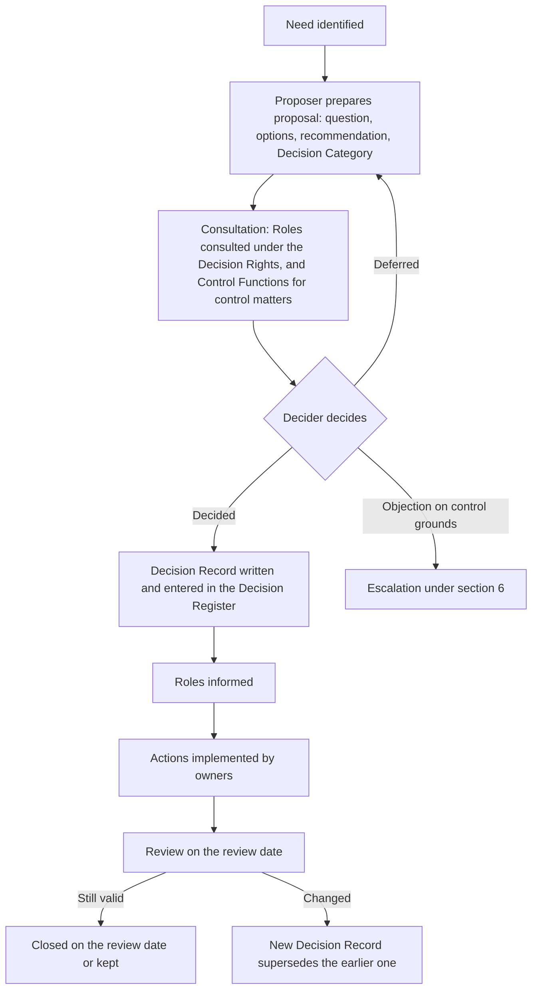

```yaml
id: AICC-GOV-02-EN
title: Decision Management
status: draft
revision: 0.5
created: 2026-09-30
revised: 2026-09-30
```

# Decision Management

## 1. Purpose and scope

1.1. This document defines the Decision Categories, the authority for each, the workflow by which a Decision is prepared,
taken, and recorded, and the Decision Register.

1.2. It applies to every Decision taken in the adoption of AI under the Decision Rights, by an individual Role or by a
Forum.

1.3. The Decision Rights allocate responsibility and accountability. This document states how a Decision is taken and
recorded. Where this document and the Decision Rights differ, the Decision Rights prevail.

## 2. Decision Categories

2.1. Each Decision belongs to one Decision Category.

| Decision Category | Subject | Decider | Forum or means | Recorded in |
| --- | --- | --- | --- | --- |
| Strategic | The Strategic Priorities, the Investment Envelopes, the Investment Guardrails, the AI Risk Appetite Statement, the acceptance of the readiness of the Corpus, and the activation of each document that the Document Catalog assigns to the Executive Sponsor | Executive Sponsor | AI Steering Committee, or by Written procedure | Decision Record |
| Portfolio | Approval of an Initiative above the threshold of the Investment Guardrails, confirmation of the priorities of the Portfolio, retirement of an Initiative, and release of a Risk Tier 4 Use Case | AI Steering Committee | AI Steering Committee | Decision Record |
| Delivery | Intake, ranking of the backlogs, Replenishment, participation of a Domain, and acceptance and rollout of a Solution | As the Decision Rights state | Replenishment, or individual decision | Portfolio Backlog or Delivery Backlog, or Decision Record where section 3.2 applies |
| Control | The Risk Tier, validation of a Solution, and the stopping of a Use Case | Control Function Contact | Control Review, or individual decision | Assessment or sign-off Record, and Decision Record for a stop |
| Standards | Architecture, technical standards, technical guardrails, the Templates, and the activation of each document that the Document Catalog assigns to the AICC Lead | As the Decision Rights state | Design Review, or individual decision | Decision Record where the Decision affects more than one Domain |
| Group Arrangement | Sharing of data or decisions between Entities | Executive Sponsor, after consultation with the data protection, legal, and information security Control Functions | Written procedure, or AI Steering Committee | Decision Record |
| Exception | A departure from a policy or standard | The Control Function Contact for the remit concerned, and the AICC Lead where the requirement is set by AICC | Individual decision | Decision Record and Exception Register |

2.2. The Decider is the Role that the Decision Rights show as accountable for the activity concerned.

2.3. The Executive Sponsor decides the Strategic Priorities, the Investment Envelopes, and the Investment Guardrails on the
recommendation of the AI Steering Committee.

## 3. Recording

3.1. A Decision is recorded when it changes scope, funding, a Risk Tier, ownership, a policy, an architecture standard, or a
commitment to a customer, or when it accepts a risk, or when it postpones or rejects an option and that choice constrains
later work.

3.2. A Decision of the Delivery category is recorded in the Delivery Backlog unless it commits funding above
the Investment Guardrails, changes a Risk Tier, or accepts a risk. In those cases it is also recorded in a Decision Record.

3.3. The cost of recording is proportionate to the cost of forgetting. A Decision Record is short and follows the Template.

## 4. Workflow

4.1. Figure 1 shows the workflow of a Decision.



4.2. Figure 1: workflow of a Decision.

4.3. **Proposal.** The Proposer states the question to be decided, the options considered, the recommendation, the Decision
Category, the Decider, and the Roles to be consulted. The Proposer states the criteria for the Decision.

4.4. **Consultation.** The Roles that the Decision Rights show as consulted are consulted before the Decision. Where the
Decision has a control aspect, the Control Function Contact concerned is consulted.

4.5. **Decision.** The Decider decides. Where the Decider is a Forum, the rules of that Forum in the Governance Forums
apply. The Decider may accept, reject, amend, or defer the proposal.

4.6. **Record.** The Secretary of the Forum, or the Proposer for an individual Decision, writes the Decision Record within
two working days and the Portfolio Manager enters it in the Decision Register.

4.7. **Communication.** The Roles shown as informed receive the Decision Record.

4.8. **Implementation and review.** Each action has an owner and a date. Each Decision Record states a review date, at
which the Decision is confirmed, changed, or closed.

## 5. Timing

5.1. A Decision is taken within the following periods of receipt of a complete proposal.

| Decision Category | Period |
| --- | --- |
| Strategic and Portfolio | At the next AI Steering Committee, or within five working days by Written procedure |
| Delivery | At the next Replenishment, or within two working days for an individual Decision |
| Control | Within ten working days |
| Standards | At the next Design Review, or within five working days for an individual Decision |
| Group Arrangement | Within ten working days |
| Exception | Within five working days |

5.2. A proposal that is incomplete is returned to the Proposer, with the missing items stated, within two working days.

## 6. Escalation

6.1. A Decider who is unable to decide, or a Role that disagrees with a Decision on grounds other than control, escalates
it in the following order: the Portfolio Manager, the AICC Lead, the AI Steering Committee, and the Executive Sponsor.

6.2. An objection on control grounds is raised with the Control Function Contact concerned. If it is not resolved, the head of
the Control Function decides. The Decisions of a Control Function are not escalated within AICC. The Executive Sponsor may
raise a disagreement with the executive management of the Bank.

6.3. Escalation and its outcome are recorded in the Decision Record.

## 7. Delegation

7.1. A Decider may delegate a Decision to a named deputy for a defined period. The delegation is made in a Decision Record
that states the scope, the start, and the end, and is entered in the Delegations block of the Register of Appointments.

7.2. A delegate does not delegate further, and the Decider remains accountable.

## 8. Exceptions

8.1. An Exception is requested with the Exception Request Template. The request states the requirement, the reason, the
risk and the compensating controls, and the period.

8.2. An Exception is granted for a defined period that ends no later than the next review of the policy or standard.

8.3. An Exception to a control requirement is decided by the Control Function Contact for the remit concerned. AICC does not
grant an Exception to a requirement of a Control Function.

8.4. Each Exception is entered in the Exception Register, and its owner reports on it at expiry.

## 9. Group Arrangements

9.1. A Group Arrangement is made in writing and states the purpose, the Entities, the categories of data or decisions shared,
the legal basis, the controls, the duration, and the review date.

9.2. The Control Function Contacts of data protection, legal, and information security for each Entity concerned are consulted
before the Executive Sponsor decides.

9.3. A Group Arrangement is recorded in a Decision Record of the Group Arrangement category, made with the Decision Record
Template. The content stated in 9.1 is entered in the Context section of the Decision Record.

## 10. Decision Record

10.1. A Decision Record is made with the Decision Record Template, and contains the fields of that Template.

10.2. A Decision Record that has the status Decided is not altered. A change is made by a new Decision Record that supersedes
it.

## 11. Decision Register

11.1. The Decision Register is the Register of all Decision Records. It states, for each, the identifier, title, Decision
Category, date, Decider, status, and review date.

11.2. The Portfolio Manager maintains the Decision Register. The AI Steering Committee reviews it each quarter.

11.3. The Decision Register and the Decision Records are kept in the Records of the Portfolio, in accordance with the Artifact
Standards.

## Change log

| Revision | Date | Change | Decision |
| --- | --- | --- | --- |
| 0.1 | 2026-09-30 | Drafted. | none |
| 0.2 | 2026-09-30 | Strategic and Standards categories cover the activation of documents. | none |
| 0.3 | 2026-09-30 | Iteration 2 of INI-001: F-003, F-015, F-016. | none |
| 0.4 | 2026-09-30 | Iteration 2 of INI-001: F-052. | none |
| 0.5 | 2026-09-30 | Iteration 3 of INI-001: F-009, F-011, F-041, F-042, F-050, F-074, F-008, F-006. | DR-2026-001, DR-2026-002, DR-2026-004 |
