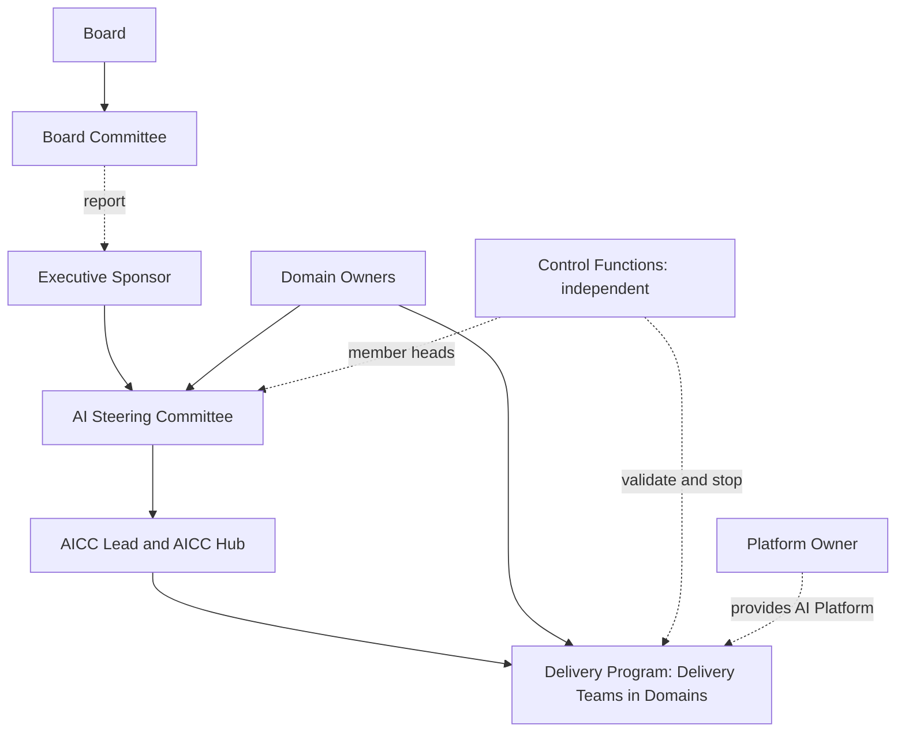
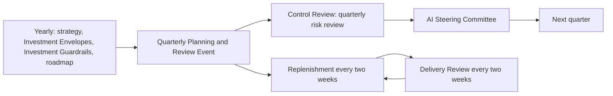

```yaml
id: AICC-GOV-01-EN
title: Governance Forums
status: draft
revision: 0.5
created: 2026-09-30
revised: 2026-09-30
```

# Governance Forums

## 1. Purpose and scope

1.1. This document defines the Forums through which AICC directs the Portfolio, plans and reviews delivery, and takes
Decisions. It sets the Terms of Reference of each Forum and the rules that apply to all Forums.

1.2. It applies to AICC, to the Domains, and to the Control Functions when they take part in a Forum.

## 2. Structure

2.1. Figure 1 shows the structure of governance. The Board Committee oversees AI on behalf of the Board. The Executive
Sponsor holds the mandate. The AI Steering Committee directs the Portfolio. The AICC Hub and the Delivery Program carry
out the work. The Control Functions are independent and report through their own lines.



2.2. Figure 1: structure of governance for the adoption of AI.

## 3. Forums

3.1. AICC operates the Forums in the following table. Each Forum is defined in section 4 or 5.

| Forum | Purpose | Chair | Frequency |
| --- | --- | --- | --- |
| AI Steering Committee | Directs the Portfolio and takes Strategic, Portfolio, and Group Arrangement Decisions | Executive Sponsor | Quarterly, and on demand |
| Quarterly Planning and Review Event | Aligns Delivery Teams on Objectives, scores value achieved, and agrees improvements | Delivery Lead | Quarterly |
| Replenishment | Chooses the items that enter delivery, within the Limits on Work in Progress | Delivery Lead | Every two weeks |
| Delivery Review | Demonstrates working Solutions and gathers feedback | Delivery Lead | Every two weeks |
| Design Review | Approves the design of Solutions against the Standards Record | Lead Architect | As required |
| Control Review | Reviews Solutions of higher Risk Tiers and the risks of the Portfolio | A Control Function Contact designated by the Control Functions | Quarterly, and as required |
| Community of Practice | Shares practice across Domains | Enablement Coach | Regularly |
| Stand-up | Clears blockers | Delivery Lead | Daily |

3.2. Figure 2 shows the yearly and quarterly cycle of the Forums.



3.3. Figure 2: cycle of the Forums.

## 4. AI Steering Committee

4.1. **Purpose.** The AI Steering Committee directs the Portfolio. The Executive Sponsor decides the Strategic Priorities, the Investment Envelopes, and the Investment Guardrails on the
recommendation of the AI Steering Committee. The AI Steering Committee approves the Initiatives that the Investment Guardrails
require it to approve, confirms the priorities of the Portfolio each quarter, resolves conflicts between Domains and between
Entities, reviews benefits, decides the retirement of an Initiative, and decides the release of a Risk Tier 4 Use Case.

4.2. **Chair and Secretary.** The Executive Sponsor chairs the AI Steering Committee. The Portfolio Manager acts as
Secretary.

4.3. **Members.** The members are the heads of the business, technology, risk, and compliance functions of the Bank and of
the Participating Entities. The AICC Lead presents the Portfolio and attends without a vote. The Lead Architect, the
Platform Owner, and the Control Function Contacts attend when the agenda requires. The Control Function Contact of
Internal audit may attend as an observer.

4.4. **Quorum.** A Decision may be taken when the Chair and at least half of the members are present, including at least one
member from the risk function and one from the compliance function.

4.5. **Decision rule.** The AI Steering Committee decides by consensus. Where consensus is not reached, the Chair decides
after recording each dissent in the Decision Record. A member of the risk or compliance function may record an objection
on control grounds. The AI Steering Committee does not override a validation or a stop decision of a Control Function. An
objection on control grounds is escalated under the Decision Management.

4.6. **Written procedure.** A time-critical Decision may be taken by Written procedure. The Secretary circulates the
proposal, and the Decision is taken when the members required for a quorum have replied, including the risk and compliance
members. The Decision Record states that the Written procedure was used.

4.7. **Inputs.** The inputs are the Quarterly Report; the Portfolio Backlog and the Portfolio Roadmap; the Initiative Briefs
that require approval; the summary of the Control Review; the Benefits Register; and proposals to change a Strategic
Priority, an Investment Envelope, or the Investment Guardrails.

4.8. **Outputs.** The outputs are Decision Records for each Decision; the minutes; the updated Strategic Priorities and
priorities of the Portfolio; and the list of actions with owners and dates.

4.9. **Records.** The agenda and minutes use the AI Steering Committee Agenda Template and the AI Steering Committee
Minutes Template. The Secretary issues the agenda two working days before the meeting and the minutes and Decision Records within five working days after it.

4.10. **Yearly session.** In the first quarter of each year the AI Steering Committee holds a yearly session. It reviews the
strategy, the Investment Envelopes, the Investment Guardrails, the roadmap, the Operating Model, the Evolution Plan, the AI Risk
Appetite Statement, and the Corpus with its latest Assessment. The session is recorded in a Decision Record of the Strategic
category.

## 5. Other Forums

### 5.1. Quarterly Planning and Review Event

5.1.1. **Purpose.** The Quarterly Planning and Review Event aligns the Delivery Teams of all Domains for the coming quarter
and reviews the quarter that has ended.

5.1.2. **Chair and Secretary.** The Delivery Lead chairs and facilitates. The Delivery Lead records the outputs.

5.1.3. **Participants.** The Domain Owners, the Domain Experts, the AI Solution Engineers, the Lead Architect, the Portfolio
Manager, and the AICC Lead take part. The Control Function Contacts take part in the risk review.

5.1.4. **Quorum.** The event proceeds when the Delivery Lead, the Lead Architect, the Portfolio Manager, and the Domain
Owners of at least half of the Domains with active Use Cases are present.

5.1.5. **Inputs.** The Portfolio Roadmap, the Delivery Backlog, the Strategic Priorities, and the capacity of the Delivery
Teams.

5.1.6. **Outputs.** The Objectives of each Delivery Team with a confidence rating; the updated Program Roadmap; the value
achieved against the Objectives of the quarter, scored by the Domain Owners; the risks raised; and the improvement items
that enter the Delivery Backlog.

### 5.2. Replenishment

5.2.1. **Purpose.** Replenishment chooses the items that enter delivery, according to ranking and to the capacity that the
Limits on Work in Progress allow.

5.2.2. **Chair, Secretary, and members.** The Delivery Lead chairs and acts as Secretary. The Portfolio Manager, the Lead
Architect, and the Domain Owners or their delegates take part, and the AI Solution Engineers take part for their items.

5.2.3. **Quorum.** A Decision on an item may be taken when the Chair, the Portfolio Manager, and the Domain Owner or delegate
concerned are present.

5.2.4. **Outputs.** The list of items pulled into delivery, and the list of items deferred, with reasons.

### 5.3. Delivery Review

5.3.1. **Purpose.** The Delivery Review demonstrates working Solutions to the Domain Owners and Domain Experts and gathers
feedback.

5.3.2. **Chair and members.** The Delivery Lead chairs. The Delivery Teams present. Domain Owners and Domain Experts attend,
and Control Function Contacts may attend.

5.3.3. The Delivery Review takes no Decisions. It needs no quorum and has no Secretary. The Chair keeps the notes.

5.3.4. **Outputs.** The notes of the review, the feedback captured, and the items added to the backlog.

### 5.4. Design Review

5.4.1. **Purpose.** The Design Review approves the design of a Solution against the Standards Record, which states its
criteria.

5.4.2. **Chair, Secretary, and members.** The Lead Architect chairs. The Portfolio Manager acts as Secretary. The AI Solution
Engineer presents. The Platform Owner and the Control Function Contact of information security take part as required.

5.4.3. **Quorum.** A Decision may be taken when the Chair, the Secretary, and the AI Solution Engineer who presents are
present, and, where the item requires it, the Platform Owner or the Control Function Contact of information security.

5.4.4. **Outputs.** The notes of the Design Review that approve the design, or state the changes required. A Decision Record of the Standards category is written where the Decision affects more than one Domain.

### 5.5. Control Review

5.5.1. **Purpose.** The Control Review reviews the Solutions of higher Risk Tiers and the risks of the Portfolio, and records
the validation and stop decisions of the Control Functions.

5.5.2. **Chair, Secretary, and members.** A Control Function Contact designated by the Control Functions chairs. The Portfolio
Manager acts as Secretary. The Control Function Contacts of the Control Functions concerned take part. The AICC Lead and the
AI Solution Engineer present. AICC does not vote.

5.5.3. **Quorum.** A Decision on an item may be taken when the Chair and the Control Function Contact of each Control Function
concerned with the item are present.

5.5.4. **Outputs.** The validation sign-offs, the confirmed Risk Tiers, the stop decisions, and the risk summary that is
provided to the AI Steering Committee.

### 5.6. Community of Practice

5.6.1. **Purpose.** The Community of Practice shares practice across Domains.

5.6.2. **Chair and members.** The Enablement Coach facilitates. Domain Experts and AI Solution Engineers take part.

5.6.3. **Outputs.** Shared practices, updates to Templates and training material, and proposals for standards, which are
provided to the Lead Architect. The Community of Practice takes no Decisions. It needs no quorum and has no Secretary.

### 5.7. Stand-up

5.7.1. **Purpose.** The Stand-up clears blockers. The AICC Hub and the AI Solution Engineers take part. It takes no
Decisions, needs no quorum, and has no Secretary. A blocker that needs a Decision is raised in the Forum that has the authority.

## 6. Rules for all Forums

6.1. Each Forum that takes a Decision has a Chair, a Secretary, and a quorum, as stated in this document. The Delivery Review,
the Community of Practice, and the Stand-up take no Decisions and need no quorum.

6.2. The Chair names a deputy from the members of the Forum. The deputy presides in the absence of the Chair. In the absence of
the Chair and the deputy, the Forum does not take a Decision.

6.3. A member declares a conflict of interest before an item is discussed. A member with a conflict on an item does not take
part in the Decision on that item, and the Decision Record states the conflict.

6.4. An item that requires a Decision is prepared as a proposal that states the question, the options, the recommendation,
and the Decision Category.

6.5. Every Decision is recorded in a Decision Record and entered in the Decision Register in accordance with the Decision
Management.

6.6. Minutes state the attendance, the Decisions, the actions, and the risks raised. They are stored in the Records of the
Portfolio.

6.7. The Forums that keep minutes, the Template that each uses, and the place in the Records of the Portfolio where the
minutes are kept are as follows.

| Forum | Template | Kept in |
| --- | --- | --- |
| AI Steering Committee | AI Steering Committee Agenda; AI Steering Committee Minutes | The meetings of the AI Steering Committee |
| Quarterly Planning and Review Event | Meeting Agenda; Meeting Minutes | The meetings of the Quarterly Planning and Review Event |
| Replenishment | Meeting Agenda; Meeting Minutes | The meetings of Replenishment |
| Delivery Review | Delivery Review Notes | The reviews of the Delivery Program |
| Design Review | Meeting Agenda; Meeting Minutes | The meetings of the Design Review |
| Control Review | Meeting Agenda; Meeting Minutes | The meetings of the Control Review |

6.8. The Stand-up and the Community of Practice keep no minutes.

6.9. Attendance at a Forum is not consent to the recording of the meeting. A meeting is recorded only with the consent of
all participants.

6.10. A Forum may be added, changed, or closed by amendment of this document.

## Change log

| Revision | Date | Change | Decision |
| --- | --- | --- | --- |
| 0.1 | 2026-09-30 | Drafted. | none |
| 0.2 | 2026-09-30 | Template names aligned. | none |
| 0.3 | 2026-09-30 | Iteration 2 of INI-001: F-002, F-003, F-016, F-068. | none |
| 0.4 | 2026-09-30 | Iteration 2 of INI-001: F-052. | none |
| 0.5 | 2026-09-30 | Iteration 3 of INI-001: F-029, F-041, F-056, F-065, F-009, F-050. | DR-2026-002 |
