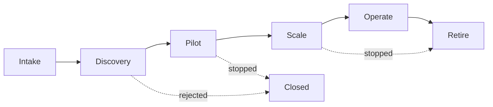

```yaml
id: AICC-OPS-01-EN
title: Portfolio Management
status: draft
revision: 0.4
created: 2026-09-30
revised: 2026-09-30
```

# Portfolio Management

## 1. Purpose and scope

1.1. This document defines the procedure by which AICC manages the Portfolio: the Stages of the Portfolio Flow with their
entry and exit policies, the Portfolio Backlog and the Delivery Backlog, the ranking, the Roadmaps, and the Records that each Stage produces.

1.2. It applies to every Initiative and every Use Case.

## 2. The Portfolio Flow

2.1. Figure 1 shows the Portfolio Flow.



2.2. Figure 1: the Portfolio Flow.

2.3. An item moves to the next Stage only when the exit policy of its Stage is met and the Decider stated in section 4 has
decided. An item may be stopped at any Stage, and a stopped item is recorded with the reason.

## 3. Backlogs

3.1. The Portfolio Backlog is the ranked list of Initiatives. The Delivery Backlog of each Delivery Program is the ranked
list of its Use Cases. Each Delivery Team keeps its Work Items on its own board.

3.2. Each backlog item has an identifier, an owner, a Stage, a Risk Tier, a rank, and the values on which the rank rests.

3.3. The Portfolio Manager keeps the Portfolio Backlog. The Delivery Lead keeps the Delivery Backlog, and the Portfolio
Manager is consulted.

3.4. **Ranking.** Each item of the Portfolio Backlog and of the Delivery Backlog is scored on four criteria, each of which
is a column of the backlog: Value, which is the value to customers, employees, or the Group; Urgency, which includes the
cost of delay; Risk reduction or opportunity, which is the reduction of risk or the opportunity that the item opens; and
Effort.

3.5. Each score is a whole number from 1 to 5. For Value, Urgency, and Risk reduction or opportunity, 5 is the highest
score. For Effort, 5 is the largest effort.

3.6. The rank follows the Value, Urgency, and Risk reduction or opportunity relative to the Effort. The ranking is combined
with the evidence of benefit, capacity, dependencies, and the option to stop. The scores and the reasons are recorded with
the item.

3.7. **Limits on Work in Progress.** Each Stage and each Domain has a Limit on Work in Progress, which is set in the header of
the backlog to which it applies. A new item is pulled into a Stage only when the Limit allows.

## 4. Stage policies

4.1. The entry and exit policies of each Stage and the Records that the Stage produces are as follows. The requirements that
depend on the Risk Tier are stated in the Risk Tier Policy.

| Stage | Entry policy | Exit policy | Records produced |
| --- | --- | --- | --- |
| Intake | A need or idea is stated by a Domain Owner, a Domain Expert, or AICC | The item is described on a Use Case Card; fits a Strategic Priority; has a Risk Tier assigned or confirmed by the Control Function Contacts; is sized; and is entered in the AI Registry with its Risk Tier | Use Case Card; Risk Tier Assessment |
| Discovery | The item has passed Intake and is within the Limit on Work in Progress | Benefits, cost, and risks are assessed; the Impact Assessment is complete where required; an Initiative Brief is approved where the Investment Guardrails require one; a Domain Expert and an AI Solution Engineer are named; and the item is ranked | Impact Assessment; Initiative Brief; Domain Engagement Record |
| Pilot | The item is ready, ranked, and pulled at Replenishment; the Domain Expert is trained | The Pilot Report states the results against the success Measures; the Control Function Contacts have validated the Solution in accordance with the Risk Tier; and, for a Risk Tier 3 or 4 Use Case, the Validation Sign-Off includes the checklist of the requirements in section 4.1 of the Risk Tier Policy (disclosure, contestability, logging, design of human oversight, and testing for bias) and the Design Review has approved the design | Pilot Report; Validation Sign-Off |
| Scale | The Pilot has met its success Measures and the Validation Sign-Off is in place | The Solution is adopted across the Domain and the Delivery Team operates it; for a Risk Tier 4 Use Case, the AI Steering Committee has decided the release | Scale Decision |
| Operate | The Solution is in use | The Solution is monitored and the result is entered in the AI Registry; the Risk Tier is reassessed by the date in the AI Registry; AI Incidents are handled; benefits are reported; the Solution continues until Retire | Benefits Report; AI Incident Report |
| Retire | The Solution is no longer needed, no longer meets its Risk Tier requirements, or is replaced | The Solution is withdrawn; data and access are removed as the policies require; the AI Registry is updated | Retirement Notice |

4.2. A Use Case that changes materially in scope, in data, in the Solution, or in the Risk Tier returns to Discovery.

4.3. The Decision Rights state the Decider of the exit of each Stage. The Decider of the exit of Scale is the Domain Owner, and, for a Risk Tier 4 Use Case, the AI Steering Committee after validation.

## 5. Engagement of a Domain

5.1. The engagement of a Domain follows the sequence in section 13 of the Operating Model.

5.2. The engagement is recorded in a Domain Engagement Record, which states the Domain, the Domain Owner, the Domain Expert,
the arrangement for the AI Solution Engineer, and the first Use Case. It is kept in the domains folder of the Delivery Program.

## 6. Roadmaps

6.1. The Portfolio Roadmap is the time-ordered plan of the Strategic Priorities, the Initiatives, and the Milestones of the
Portfolio. The Portfolio Manager keeps it, and the AI Steering Committee reviews it each quarter.

6.2. A Program Roadmap is the time-ordered plan of the Use Cases and Milestones of one Delivery Program. The Delivery Lead
keeps it, and it is updated at each Quarterly Planning and Review Event.

6.3. A Roadmap shows three horizons: the current quarter, which is committed through the Objectives; the next two quarters,
which are planned; and the period beyond, which is indicative.

6.4. A Milestone has an identifier, a description, the deliverable or Maturity Level that completes it, the main Records that
evidence it, an owner, and a date or quarter. The Roadmap states the Maturity Level that each Strategic Priority intends to
reach and by when.

6.5. Milestones are drawn from the Measures of the Maturity Levels in the Statement of Intent. The Milestones that are needed
to reach Maturity Levels 1 and 2 are set out in the initial Portfolio Roadmap.

## 7. Records of the Portfolio

7.1. The Records of the Portfolio are kept in accordance with the Artifact Standards. The Records include the Strategic
Priorities, the Portfolio Backlog, the Portfolio Roadmap, the Service Portfolio, the Registers, the Decision Records, the
minutes of the Forums, and, for each Delivery Program, the Delivery Backlog, the Program Roadmap, the Roster, the
Objectives, and the Use Case Records.

7.2. When a work tracker is introduced, it holds the backlogs and the boards, and the Records refer to its items by
identifier. The Artifact Standards state the mapping.

## Change log

| Revision | Date | Change | Decision |
| --- | --- | --- | --- |
| 0.1 | 2026-09-30 | Drafted. | none |
| 0.2 | 2026-09-30 | Iteration 2 of INI-001: F-003, F-015, F-025. | none |
| 0.3 | 2026-09-30 | Iteration 2 of INI-001: F-052. | none |
| 0.4 | 2026-09-30 | Iteration 3 of INI-001: F-009, F-053, F-064, F-006. | DR-2026-002 |
