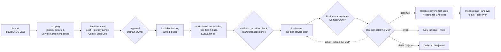

# Refit A: Customer Intelligence–Enabled Service Resolution in the AICC flows (intake, portfolio, engagement, governance)

Scope of this half: how the project enters AICC, is decided, is committed to, and is governed, and how its project-management elements map onto the corpus. The Solution side (Solution Definition content, controls, technical blueprint, evidence of quality) is covered here only where a gate or a record of this half depends on it. Sources: the six project texts en-0 to en-5, review A, and the corpus documents, workflows, guides, templates, and Registry records named in the brief. Clause references are to the English corpus as of 2026-10-06.

## 0. Position in one paragraph, and the design choices it rests on

The project is an Engagement (Business Model 3.1): an ordinary Initiative with Customer Service as its client function, under PRI-1 Customer intelligence, in the service area Build and run and the service category Workplace automation, whose coverage already names "case assistance, done with AI and reviewed by a person" (Business Model 4.5). It is too large for run-rate work (Business Model 4.7), so it runs the full portfolio Kanban: Funnel, Reviewing, Analyzing, approval, Portfolio Backlog, MVP, decision after the MVP, Implementation, Done (Portfolio Management Model 5.1, 5.2). The proposal's "business case plus three charters" becomes one Initiative Brief with three journey annexes, of which one is selected at Scoping. The one-team pilot is the MVP: the first Solution, deployed to its first users (the pilot service team) after validation and the Team's final acceptance, judged by the Domain Owner, and then decided on by the approver against the leading indicators (Portfolio Management Model 7.1, 7.2; Solution Lifecycle Model 7.1, 7.3). Scale within Customer Service is the release beyond the first users with an Acceptance Checklist; scale across the Bank is a Proposal and a Handover to an IT Receiver (Solution Lifecycle Model 7.4, 8.11; Business Model 2.5). The project-management shape survives: a charter, a sponsor, a decision structure, a RACI, a RAID discipline, change control and gates all have corpus homes, and the corpus is short of only a handful of places (section 3).

The refit rests on five choices that the owner should confirm, each with a recommendation.

| Choice | Options | Recommendation and reason |
| --- | --- | --- |
| D1. Relation to INI-006 Customer experience intelligence: discovery | (a) a scenario inside INI-006; (b) a separate Initiative under PRI-1, linked to INI-006 | (b). INI-006 studies aggregate front-office inefficiency for front-office managers and ends in a proposal (its brief, section 3, step 6); this project builds a case-level employee assistant for one service team. Different client view, different Solution, different MVP. The two share sources, so the new Initiative names DEP-008 and DEP-009 of INI-006 as Dependencies, and the intake records that INI-006 bears on it (Portfolio Management Model 5.2, Funnel exit criterion; 2.2) |
| D2. One Domain or two | (a) Customer Service is the only Domain, and the journey process function (Payments Operations, Disputes Operations, or Onboarding/KYC) is a Dependency that supplies approvals and experts; (b) the process function is a second client function and Domain | (a) by default. It keeps the Domain Owner as approver (Portfolio Management Model 6.3) and one Service Agreement. Choose (b) only if the process function claims part of the benefit or will own part of the Solution after delivery; then the Initiative spans Domains, the Executive Sponsor approves it and decides after its MVP, and gives the business acceptance (Portfolio Management Model 6.3; Solution Lifecycle Model 7.3(c)), and each function gets its own Service Agreement (Business Model 3.1) |
| D3. Offering type of the first Solution | Service, Product, or Experiment (Business Model 4.3; Solution Lifecycle Model 8.1) | Service if AICC operates the pilot: the business case then states the run cost and a sunset rule (Business Model 4.2), and the Receiver is an IT function of the Bank (Solution Lifecycle Model 8.11). Product if an IT function operates it from the first deployment. Not an Experiment: an Experiment runs in the Lab on read-only extracts and has no consumer (Solution Lifecycle Model 8.13), so it cannot move the leading indicators, which need live use by the service team. The historical validation can still use Lab-style read-only extracts as the Evaluation set |
| D4. Who builds | AICC Lead, another Solution Engineer, or an IT engineer | If the AICC Lead builds (likely, while AICC has one member, RI-002), the Executive Sponsor approves the Solution Definition, assigns the Risk Tier, and approves the use for the data class, and the AICC Lead may not check, validate, release, or give the business acceptance (Operating Model 4.4(d)); the test by another person is done by an engineer of the IT function or the Domain whom the AICC Lead names (Operating Model 4.4(e)) |
| D5. Name | Keep the title, or rename | Keep it: "Customer intelligence" is the name of PRI-1, so the title places the project in the Bank's own priority. Restate the claim "records the outcome as reusable customer intelligence" as reusable components and Evaluation sets, with pilot outputs used only for service resolution and for evaluating the assistant (AI Policy 2.5); this answers review A M5 without losing the recognizable name |

## 1. The AICC path for this work

### 1.1 Classification at intake

The AICC Lead records these at Contact (Business Model 7.2; Portfolio Management Model 5.5), in this order.

| Item | Entry for this project | Clause |
| --- | --- | --- |
| Problem | Customers repeat contact about one unresolved issue because its history sits in separate records; the employee reconstructs it by hand | Portfolio Management Model 5.5 |
| Size | Larger than one Iteration: an Initiative, not run-rate work | Business Model 4.7, 4.8 |
| Expected Risk Tier | 2: customer and personal data; output informs work and reaches the customer through the employee, under human review; read-only, no rights over systems or funds (any agent right to act would make it 3) | AI Policy 3.1 |
| Catalog check | No Solution or Package answers it yet; INI-006 bears on it (D1) | Business Model 7.2; Portfolio Management Model 2.2 |
| Strategic Priority | PRI-1 Customer intelligence (Priorities Record) | Portfolio Management Model 5.2, Reviewing exit |
| Service area and category, mode | Build and run; Workplace automation (case assistance); Initiative | Business Model 4.5, 4.7 |
| Kind of work | Business | Portfolio Management Model 4.6 |
| Client function, Domain Owner | Customer Service; the Domain Owner is named by the head of the Domain and entered in the Appointments Record | Business Model 3.1; Operating Model 4.6 |
| Engagement | Yes: one Service Agreement for Customer Service (two if D2(b)) | Business Model 3.1, 5.1 |

### 1.2 The path step by step

The table is the path in order. "Event" is where the decision is taken or reviewed; while AICC runs in light mode the monthly Steering is held inside the Iteration Review and Demo, and the Weekly Planning and Weekly Review are one session (Solution Lifecycle Model 6.6). No step adds a meeting or a record (Operating Model 6.1; Solution Lifecycle Model 6.8; Portfolio Management Model 9.4).

| # | Kanban step, state: Stage | What happens for this project | Who decides | Record and template | Event | Clauses |
| --- | --- | --- | --- | --- | --- | --- |
| 1 | Funnel, Proposed | The proposal is entered as a need; the intake classification of 1.1 is recorded | AICC Lead: intake gate (take in, defer, reject) | Portfolio Backlog entry with requester and problem; Decision Log line | Weekly Review (backlog care loop) | Business Model 7.2; Portfolio Management Model 4.5, 5.2, 5.5; Operating Model 4.2 |
| 2 | Reviewing, Discovery: Scoping | The AICC Lead and the Domain Owner select one journey by the selection rule of en-2, decide D2, confirm the fit to PRI-1, name the Domain Owner, check that the indicator sources exist in MI, and confirm that the limit on the Active Initiatives will permit it. The Service Agreement is issued now, covering the study phase, so that C-08 operates (RI-004 records that it did not for the six current studies) | AICC Lead with the Domain Owner: scoped gate | Scope in the Initiative Brief; Service Agreement AGR-nnn (study phase); Decision Log line for the scoped gate | Weekly Review; Service Agreement check-in at each Iteration | Business Model 5.1, 5.2, 7.2; Portfolio Management Model 5.2; Operating Model C-08, C-23 |
| 3 | Analyzing, Discovery: Business case | The Brief is completed in its six sections: hypothesis, two to four leading indicators with source, baseline, and target, MVP scope and time-box, cost references, risks and Dependencies, decision table. The baseline is taken from existing MI by its owner, without AI. The Control Function Contacts concerned (model risk, information security, data protection, compliance, legal; Financial Crime within compliance for KYC) clear it within their remits, each by a Control Sign-Off | The Control Function Contacts: clearance; any of them may stop it | Initiative Brief; Control Sign-Off per remit, referenced in Brief section 6 | Weekly Review; the item is raised to the next monthly Steering when complete | Portfolio Management Model 4.5, 6.1, 6.2, 6.4, 6.7; AI Policy 2.2; Operating Model 5.4 |
| 4 | Approval gate | The approver reads the Brief against the five questions of 6.2 and advances, returns, defers, or rejects it. The Service Agreement is then amended to add the proof, delivery, and support phases | Domain Owner (one Domain, below a guardrail); Executive Sponsor if D2(b), if a guardrail is exceeded, or if funding needs an Envelope decision (none is set for PRI-1) | Decision Record (type: business case approval), Decision Log line, Brief section 6 row; Service Agreement amended | Monthly Steering (portfolio sync: gate decisions due) | Portfolio Management Model 4.4, 5.2, 6.3; Business Model 5.1; Operating Model C-09; AICC Charter 4.1 |
| 5 | Portfolio Backlog, Approved | Ranked by WSJF: the Domain Owner states the value, the AICC Lead scores urgency, risk reduction, and effort. Pulled when the shared Active limit (currently 1, board.md) frees a place; a departure from the rank is recorded with its reason | AICC Lead: pull gate | Rank and scores in the Portfolio Backlog; Decision Log line for the pull | Monthly Steering (places free under the limit); PI Planning, where the Domain Owner scores the business value of the PI Objective | Portfolio Management Model 4.4, 5.4, 6.5; Solution Lifecycle Model 6.2 |
| 6 | MVP, Active: MVP; Solution in Discovery: Definition | The Solution Definition of the first Solution is written: type (D3), Receiver, first users (the pilot service team, by Role), data classes, architecture, acceptance criteria in Given/When/Then, conditions of use and alert levels. The AICC Lead assigns Risk Tier 2 and tells the Domain Owner; the AI Registry entry is made; compliance confirms the applicable law. A higher Tier than cleared returns the Brief to the Contacts | Domain Owner approves the Solution Definition; AICC Lead assigns the Tier; the Executive Sponsor does both if the AICC Lead built it (D4) | Solution Definition; AI Registry entry | Iteration Planning; Iteration Review and Demo | Portfolio Management Model 6.4, 7.1, 7.3; Solution Lifecycle Model 5.2, 8.1; AI Policy 3.2; Operating Model 4.4(d), C-12 |
| 7 | MVP, Solution Active: Delivery | The MVP is built as Features: process artifacts, the historical Evaluation set, the timeline and analysis, the employee view, training. Each Feature is tested by a person other than its builder and accepted by the product owner at the Iteration Review and Demo; the Domain Owner reviews progress against the leading indicators at each Iteration Review and Demo | Team: build; product owner (the AICC Lead while the Team has up to three people): Feature acceptance | Features in the Program Backlog with test references; Dependencies and Milestones on the Program Board | Iteration Planning, Weekly Review, Iteration Review and Demo | Portfolio Management Model 7.1, 7.4; Solution Lifecycle Model 4.5, 7.1, 7.3(a) |
| 8 | MVP: readiness for first use | Before any real user or data: the provider check of the model (on premises or external); validation by the Control Function Contacts, with bias and error testing and the security test; the use for the data class approved and the first users trained; the AICC Lead's final acceptance of the Team; the change raised and approved in the change management of the Bank | Information security, data protection, legal: provider check; Control Function Contacts: validation; Domain Owner (or Executive Sponsor, D4): data-class use; AICC Lead: Team final acceptance; change management: deployment | Control Sign-Offs; AI Registry (approval and training noted); release block of the Solution Definition (Team final acceptance, change ticket, test reference) | Iteration Review and Demo; the monthly Steering reviews these as events of the month | AI Policy 2.1, 3.3, 4.1, 4.4; Solution Lifecycle Model 7.1, 7.2, 7.3(b), 8.3; Operating Model C-13, C-15, C-18, C-30 |
| 9 | MVP: first use (the "controlled live use") | The Solution is deployed to its first users. It runs for the MVP time-box and observation period. The Domain Owner reviews the four signals and the monitoring at each Iteration Review and Demo; a crossed alert level triggers a review by the Domain Owner; the AICC Lead or any Control Function Contact may suspend it; incidents go to the incident management of the Bank | Domain Owner: live review; AICC Lead or a Contact: suspension | Review notes in the Solution Definition; Decision Log for a suspension and its lifting; Risks and Issues for an AI Incident | Iteration Review and Demo; monthly Steering (events of the month) | Solution Lifecycle Model 5.3, 8.4, 8.5; AI Policy 3.5, 3.7, 5.6; Operating Model C-16, C-17, C-29 |
| 10 | MVP: business acceptance of the Solution | The Domain Owner judges the working Solution deployed to its first users against its acceptance criteria: accept, return with what is missing, or reject | Domain Owner (the Executive Sponsor if D2(b)) | Release block: business acceptance, who, date | Iteration Review and Demo | Solution Lifecycle Model 7.3(c), 7.5; Operating Model C-10 |
| 11 | Decision after the MVP | The approver reads the results against the leading indicators of the Brief and decides: continue, pivot, defer, or reject; a return at the gate repeats the step with what is missing (see 1.4) | The approver of step 4 | Decision Record (type: decision after the MVP); Decision Log line; Brief section 6 row; lessons in the Portfolio Backlog | Monthly Steering if the gate falls due there; otherwise the quarterly Steering (portfolio review) | Portfolio Management Model 4.3, 4.4, 5.2, 7.2; Operating Model C-09 |
| 12 | Implementation, Active: Implementation | After continue: the Capabilities (more queues, hardening, the next payment type) are approved by the AICC Lead, each naming the leading indicator it serves, and enter the Program Backlog. Use beyond the first users ("scale within Customer Service") is a release by the Domain Owner, recorded in the release block, with the Acceptance Checklist signed by the Domain Owner, Solution Engineer, Checker where one applies, the Control Functions concerned, and the IT function with the Platform Owner. Each quarterly Steering asks again whether it is worth continuing | AICC Lead: Capability approval; Domain Owner: release (Risk Tier 2); approver: quarterly continuation | Program Backlog; release block; Acceptance Checklist; Quarterly Report | PI Planning; Iteration Review and Demo; quarterly Steering | Portfolio Management Model 4.3, 8.2; Solution Lifecycle Model 3.1, 7.1, 7.4; Operating Model C-14, C-22 |
| 13 | Hand over or reuse | Scale across the Bank is a Proposal that names an IT function as Receiver; the owners and the Executive Sponsor decide; the Solution is Closed as handed off when the Receiver accepts, and AICC oversees it as an Adopted Solution. The reusable core is described in a Package Definition; another journey is a new need at the Funnel, where the catalog check finds the Package | Domain Owners concerned and the Executive Sponsor: Proposal; Receiver: Handover acceptance; AICC Lead: Package | Proposal (PRP-nnn); Decision Record; Solution Definition (Handover row); Package Definition (PKG-nnn) | Quarterly Steering (transition of a Service, review of the Adopted Solutions) | Business Model 2.5, 4.4; Solution Lifecycle Model 8.2, 8.11, 8.12; Operating Model C-20 |
| 14 | Done: Review, Accepted, Closed | The outcome is reviewed against the leading indicators; the Domain Owner accepts it and confirms the benefit against the Brief from the source it names; the AICC Lead issues the Outcome Report; the Quarterly Report shows the benefit confirmed; the Steering checks that every closed Engagement has an accepted Outcome Report | Domain Owner: acceptance and benefit; AICC Lead: Outcome Report; Executive Sponsor: completeness check | Outcome Report; acceptance in the Portfolio Backlog; Quarterly Report; Steering Summary | Quarterly Steering | Business Model 5.5, 7.3, 7.4; Portfolio Management Model 5.2, 9.3; Operating Model C-10, C-11, C-24 |

Exits at any step: Deferred with a reason and a date, Rejected on the merits, Cancelled without a decision on the merits (an error, a duplicate, or a stop by a Control Function), and Waiting while a named Dependency outside AICC blocks it (Portfolio Management Model 5.2; Solution Lifecycle Model 5.1, 5.3). Either side may end or redirect the Engagement at the end of an Iteration, and the Outcome Report records it (Business Model 5.2).

Figure 1: the path of the project through the corpus gates. The figure illustrates the table and states no rule.

### 1.3 Where the corpus is open on the MVP, and the reading adopted

The Engagement workflow (Figure 2) and the Engagement guide (Figure 2) draw the MVP before the continue decision and the first deployment to first users after it. The governing clauses allow the reading adopted here: the MVP may have real users once it is checked or validated (Portfolio Management Model 7.1), and the Team's final acceptance covers a Solution "whether its working prototype or its final version" (Solution Lifecycle Model 7.3(b)). The workflows state no rule of their own (Operating Model 1.3), so the clauses prevail. This reading is required for this project, because its leading indicators (repeat contact, handling effort) move only in live use. A one-sentence clarification in the Engagement workflow that the MVP may itself be the first deployment to first users would remove the ambiguity (gap G9).

### 1.4 The project's acceptance rule mapped to the corpus decisions

The charters' rule has two parts, mandatory quality and control criteria and a benefit test, and four outcomes. The corpus carries the first part in the Solution Definition and the second in the Brief.

| Charter outcome (en-2, en-3/4/5) | Corpus decision | Who | When it applies | What follows |
| --- | --- | --- | --- | --- |
| Mandatory quality and control-limit criteria pass | Business acceptance of the Solution for its first users against Solution Definition section 5 | Domain Owner | Traceability, state quality, control limits, and the process owner's acceptance of the interpretation are met | The decision after the MVP can be taken; a failed criterion returns the Solution or rejects it (Solution Lifecycle Model 7.3(c)) |
| Scale | Continue | Approver of step 4 | The leading indicators move as the Brief expects and the Domain Owner sees the value | Capabilities into the Program Backlog; release beyond the first users with the Acceptance Checklist; later a Proposal and Handover (Portfolio Management Model 7.2; Solution Lifecycle Model 7.4, 8.11) |
| Directional evidence: "a defined extension or further measurement" | Return at the decision gate | Approver | Quality and controls pass; the outcome sample is too small for the claim | The MVP step is repeated with what is missing, for a stated number of Iterations, recorded in a Decision Record and a Brief amendment (Portfolio Management Model 5.2, "Return"); gap G8 |
| Refine | Pivot, or continue with a narrower scope | Approver | The need is confirmed but the approach or scope must change | Pivot: a new linked Initiative with a full Brief; a narrower scope within the same hypothesis is an amendment of the Brief (Portfolio Management Model 7.2) |
| Stop | Reject; or a stop by a Control Function | Approver; a Control Function within its remit | The value is not seen, or state cannot be shown reliably, or a control limit cannot be held | Rejected; the Solution is retired with access removed and data handled (Solution Lifecycle Model 8.7); a Control Function stop is final and cancels the Solution (Operating Model 5.4; Solution Lifecycle Model 5.3) |
| Not now | Defer | Approver | Timing, a Dependency, or a higher priority | Deferred with a reason and a date; the Domain Owner decides whether the first users keep the accepted Solution or it is retired (gap G11) |

### 1.5 Indicative timing on the Cadence

The following shows how the gates fall on the Cadence if the project is taken in now (I10 2026). It is indicative only: the Roadmap and the Program Board hold the real plan, and the pull depends on the rank and on the shared Active limit of 1, which other Initiatives compete for.

| Iterations | Step | Gate and event |
| --- | --- | --- |
| I10–I11 2026 | Funnel, Scoping | Intake at the Weekly Review; Service Agreement issued; scoped gate |
| I11–I12 2026 | Business case | Baseline from MI; Control Sign-Offs; approval at the yearly Steering of December or the monthly Steering of I01 2027 |
| I01 2027 (PIQ1 PI Planning or the first free place) | Pull | PI Objective scored by the Domain Owner |
| I01–I03 2027 | MVP: Definition, build, Evaluation set, validation | Solution Definition approved; Control Sign-Off; Team final acceptance; first deployment in the IP week or at the start of I04 |
| I04–I05 2027 | First use with the pilot team | Live review at each Iteration Review and Demo; business acceptance at the end of I05 |
| I06 2027, IP week | Decision after the MVP | Quarterly Steering of PIQ2 (portfolio review) |

## 2. Refit table

Each project element, its home in the corpus, and what happens to its content. "Keep label" gives the familiar label to show beside the corpus term where it helps the reader. The project texts are cited as en-0 to en-5.

| Project element (keep label) | Where it is in the project | Home in the corpus | Moves unchanged | Reworded | Dropped, and why |
| --- | --- | --- | --- | --- | --- |
| Business case | en-1 (titled "Business case"); en-0 value cards | The Initiative Brief, which is the record of the business case (Vocabulary 4.1, "Business case"; Portfolio Management Model 6.1; Initiative Brief Template) | Problem, intent, pilot scope, expected value, scope boundary, journey candidate table | Use-case intent becomes the hypothesis in the form of Solution Lifecycle Model 3.3 ("For Customer Service teams who…, the … is a [Service] that…; unlike manual reconstruction, ours…"); value becomes Brief sections 2 and 4 | The long delivery, process, and control content leaves the Brief (it is one page) and goes to the "How the pilot works" and Solution Definition pages of the other half; the label "Business case" is kept only for the Brief page, which now holds cost and options |
| Charter, project charter (keep: "Charter (Initiative Brief and journey annex)") | en-2, en-3, en-4, en-5 | One Initiative Brief for the common part, plus one journey annex for the selected journey kept with the Brief in the Initiative's Registry folder; the two unselected annexes stay on the portal as options until Scoping closes | Journey intent, inclusions and exclusions, baseline measures, journey quality thresholds, stop conditions, extra control remits | "Candidate project charter" becomes "Journey option" before Scoping and "Charter: journey annex to INI-nnn" after; "Status: candidate for selection and completion" becomes the state and Stage of the Initiative | The "Common delivery commitments" paragraph (the corpus now carries those commitments); the "Parent proposal version/reference" line (the Brief has "Date of last change" and Amendments) |
| Decision requested | en-3/4/5 "Decision requested" | Brief section 6, first row (approval of the business case), evidenced by a Decision Record of type "business case approval" (Decision Record Template) | The object of the decision: a controlled employee-assist pilot for one payment type, dispute type, or onboarding path and one queue | Example: "Approve the business case of INI-nnn: an MVP of one employee-assist Solution (expected Risk Tier 2) for one [journey] queue, with its service team as first users, for [n] Iterations, ending in the decision after the MVP." The capacity request becomes Assumptions in the Service Agreement | "Authorize the named business team and capacity": the function commits to nothing (Business Model 5.4); what AICC relies on is an Assumption, and the Domain Owner's approval is the commitment that the corpus asks for (Portfolio Management Model 6.2, "Can it be run well?") |
| Sponsor, Business Sponsor (keep: "Business sponsor (Domain Owner)") | en-1 decision structure, RACI; en-3/4/5 ownership | Domain Owner of Customer Service: approves the business case and decides after the MVP within one Domain, approves the Solution Definition, approves the data-class use, accepts, releases Risk Tier 2, confirms the benefit (Operating Model 4.2; Portfolio Management Model 3.1) | The person: Head of Customer Service, if the head of the Domain names them Domain Owner (Operating Model 4.6) | "Sponsor" alone is replaced, because Executive Sponsor is a defined AICC Role (Vocabulary 4.1); the Executive Sponsor appears only where 6.3 requires | "Co-sponsor" (no corpus equivalent; see the next row); "Benefit Owner" (merged into the Domain Owner, who confirms the benefit, Business Model 7.3) |
| Journey Process Owner (keep label) | en-1 definition work, decision structure, RACI; en-3/4/5 co-sponsor | Under D2(a): a named owner of Dependencies (DEP-nnn) whose approvals (action catalog, outcome definitions, interpretation of the historical cases) are inputs, written as acceptance criteria of the Solution Definition and as Dependencies Met with their reference; their specialists act as Domain Experts only if the Domain Owner names them; the action catalog is a knowledge source whose owner is noted in the AI Registry (AI Policy 3.5; Vocabulary "Governed source"). Under D2(b): a second Domain Owner | The ten duties of "Journey Process Owner definition work" as the content of those Dependencies | "Accountable for correctness of diagnosis, actions, routing" becomes "approves the action catalog and the outcome definitions that the Solution uses"; "accept analytical quality" becomes an acceptance criterion that the Domain Owner applies | "Co-sponsor" title; the process owner as decider of the pilot's quality acceptance (in the corpus the requester accepts, Solution Lifecycle Model 7.3(c)) |
| Project Manager (keep: "Project coordination (AICC Lead, with a coordination Hat)") | en-1 workstreams, initiation responsibilities; RACI | The AICC Lead, accountable for the progress of the Initiative through the Kanban, the Brief with the Domain Owner, the Service Agreement, the records, and the Steering (Portfolio Management Model 3.1; Business Model 5.1; Operating Model 4.2). The day-to-day coordination may be a Hat taken by a partner from Customer Service in the AICC team (Operating Model 4.3; Business Model 3.2), named in Service Agreement Part B | The coordination duties: integrated plan, dependency tracking, readiness evidence, preparing the recommendation | "Maintain the project backlog, RAID log, decision log, change control" becomes "keep the Program Board, Risks and Issues, Decision Log, and Brief amendments current"; "convert into the bank's project-initiation form" becomes "complete the Brief and the Service Agreement" | The PM as a decider or as a separate governance layer; a Hat decides nothing (Operating Model 4.3) |
| Measurement Owner (keep: "Measurement owner (owner of the indicator source)") | en-1 benefit baseline; en-3/4/5 ownership and approval record | The owner of the source system named for each leading indicator in Brief section 2 ("Where the figures live"); a Measure has an owner (Vocabulary "Measure"); the Domain Owner confirms the benefit from that source (Business Model 7.3; C-11) | Independence from delivery acceptance, the duty to define formula, denominator, and comparison | The Measurement Owner "confirms that the evidence supports the decision" becomes an input to the approver's decision after the MVP, cited in the Decision Record facts | The Measurement Owner as an approver or signatory; the corpus gives no measurement role a decision (gap G10) |
| Service Operations Manager (keep label) | en-1 process map, workstreams, RACI, suspension | A bank role in Customer Service: runs the pilot team that are the first users; usually the Domain Expert named by the Domain Owner (Operating Model 4.6), who tries the Solution and scales adoption (Operating Model 4.2) | Running the team, fallback, training delivery, feedback | "Suspend live use" becomes "withdraw the team to the existing process and report to the AICC Lead, who suspends or not" (AI Policy 5.6) | Suspension authority (it belongs to the AICC Lead and the Control Function Contacts) |
| RACI (keep label) | en-1 RACI, 11 activities by 8 roles | Organization guide 4, read by Role; project-specific rows only for the bank roles outside the corpus, recorded as Dependencies | The activity list | Rewritten on corpus Roles: Domain Owner, AICC Lead, Solution Engineer, Domain Expert, Control Function Contacts, Platform Owner, Executive Sponsor where 6.3 applies, plus process owner, MI owner, and Service Operations Manager as contributors; no builder is R or A on acceptance (Operating Model 4.4(a); Solution Lifecycle Model 7.5) | Abbreviations (SQL, DO, TDL, JPO, CRC); the Technology/Data Delivery Lead and Service Quality Lead as R in "accept analytical and workflow quality" (separation of duties) |
| Workstreams (keep label) | en-1 four workstreams | No structural level: work is Features under the Solution's Capabilities (after continue) or the MVP (before); a Feature may deliver a document or training (Solution Lifecycle Model 4.5). The workstream is a label on the Features, and its accountable person is listed in Service Agreement Part B | The four names and their artifacts (process map, action catalog, exception map, source map, data contract, Evaluation set, employee view, training, fallback runbook, metric definitions) as Features | "Accountable owner" per workstream becomes the Role that accepts or supplies: Domain Expert and process owner (journey and process), Solution Engineer (data and intelligence), Domain Owner and Domain Expert (adoption), Control Function Contacts and MI owner (controls and measurement) | "One backlog and one project manager" as a separate structure (the Program Backlog is the one backlog) |
| Governance forum (keep: "Governance (AICC events)") | en-1 PM responsibilities: "establish the governance forum, reporting path, escalation route, and decision cadence" | No new forum: the Service Agreement check-in at each Iteration with the Domain Owner and the Domain Expert; the Iteration Review and Demo (progress against the leading indicators, live review); the monthly Steering (gate decisions due, progress, risks, blockers); the quarterly Steering (decision on each Active Initiative) | Decision cadence and escalation intent | Reporting path: Weekly Review → Dashboard → Steering Summary → Quarterly Report (Operating Model 6.10); escalation by the conditions of Operating Model 5.2, written in Service Agreement Part B | A project steering board (Operating Model 6.1; Solution Lifecycle Model 6.8: no other event); the process owner and the Service Operations Manager are invited to the Iteration Review and Demo instead |
| RAID log (keep: "RAID (in the AICC records)") | en-1 PM responsibilities, project controls | Risks and Issues: the Risks and Issues Record (RI-nnn, with owner, severity, due date). Assumptions: the Service Agreement. Dependencies: the Program Board, section 3 (DEP-nnn). Decisions: the Decision Log | The content of each entry | One RAID log becomes four existing records, each cross-referenced by identifier from the Brief section 5 | A separate project RAID log (Portfolio Management Model 9.4: no other record to track the Portfolio; Operating Model 6.1) |
| Decision log (keep label) | en-1 PM responsibilities; project controls "dependency and decision log" | The Decision Log, one line per decision at the AICC Lead level or above or that others need to find; a Decision Record where Operating Model 8 names one (business case approval, decision after the MVP); a Team decision is noted in the work item (Operating Model 5.6) | Source access, policy interpretation, exception, and readiness decisions | Policy interpretation by a Control Function is a Control Sign-Off, not a log line (Operating Model 5.4) | A project-local decision log |
| Change control (keep label) | en-1 PM responsibilities; en-3/4/5 "A material change to customer cohort … requires reassessment and approval" | Before approval: the Brief is edited. After approval: the Brief's "Amendments after approval" with a Decision Record; scope reordering within the intent: the Service Agreement "Changes" table at the check-in. For the Solution: a significant change (model, provider, data class, autonomy, any Risk Tier attribute) under Solution Lifecycle Model 8.6 and AI Policy 3.4 | The list of material changes | Cohort, payment type, user, and channel changes become Brief amendments (scope) or a new release decision (users beyond the first users); data purpose, decision authority, automation level become significant changes of the Solution | A change-control board or form |
| Approval record (keep: "Approvals") | en-3/4/5 approval table, seven signatories | Brief section 6 (approval, clearance, Service Agreement, decision after the MVP, acceptance) with the Decision Record; one Control Sign-Off per Control Function remit; the release block of the Solution Definition; the Acceptance Checklist at release | Privacy/data use, compliance/conduct, AI/operational risk, Financial Crime (KYC) | They become the Control Function Contacts concerned: data protection, compliance (conduct, consumer protection; AML/Financial Crime for KYC), model risk, information security, legal, each required, "where required" removed (AI Policy 3.3) | Benefit Owner and Measurement Owner signatures (the Domain Owner approves and confirms the benefit); names on the portal (Operating Model 7.8: Roles, not persons) |
| Gates, decision structure (keep: "Decision path") | en-1 decision structure (8 decisions); project controls | The gates of section 1.2: intake, scoped, approval, pull, Solution Definition and Risk Tier, validation, Team final acceptance, first deployment, business acceptance, decision after the MVP, release, Proposal and Handover | Their order and inputs | "Select journey and approve pilot scope: Head of Customer Service" becomes the scoped gate (AICC Lead with the Domain Owner) and the approval gate; "confirm risk classification: Head of Customer Service" becomes the AICC Lead's Risk Tier with the Contacts' power to raise (AI Policy 3.2); "approve controlled live use" becomes validation, Team final acceptance, data-class approval, and the change management | "Employee use with full review precedes customer-visible intervention": no customer-visible stage is in scope; one would be a significant change with a new Risk Tier assessment |
| Delivery action workflow, 10 steps (keep: "MVP plan") | en-1 delivery action workflow | Brief section 3 as the plan of the MVP, as INI-006 does in its brief; then Features | Steps 1–10 and their outputs | Step 1 (journey, definitions, baseline) moves to Discovery; steps 2–8 are the MVP; step 9 is the evidence for the decision; step 10 is the decision after the MVP | The "Execution rule" sentence |
| Baseline (keep: "Benefit baseline") | en-1 benefit baseline; en-3/4/5 "Benefit baseline to populate" | Brief section 2: each leading indicator with source, baseline, and target as references to the source (Portfolio Management Model 6.2; Initiative Brief Template) | The measure names, formulas, and sources | "[value]" becomes "[MI report, owner, period]"; the six baseline dimensions shrink to two to four leading indicators; the rest go to the measurement annex (gap G5) or to the Solution's monitoring (override and correction rate, AI Policy 3.7) | Values on the portal (Business Model 6.1; Operating Model 7.8) |
| Success measures (keep label) | en-2 five measure groups; en-3/4/5 proposed success measures | Customer outcome, operational benefit, adoption: leading indicators in Brief section 2 (adoption is a business change in Portfolio Management Model 6.7). Quality, employee acceptance, traceability, control limits: acceptance criteria and conditions of use in the Solution Definition sections 5 and 7 | The measures and the journey-specific thresholds | Relative "planning hypotheses" stated once per journey as hypotheses, with absolute baselines and targets in the source; "no lower than 95%" stated as a floor that can be raised, not replaced; "zero critical errors" as "no critical error in the Evaluation set; any blocks first use until corrected and retested" | Identical 15–20% for every measure, where the journey has no reason for it (review A M6) |
| Acceptance rule (keep label) | en-1 pilot acceptance; en-2 common acceptance logic; en-3/4/5 acceptance rule | Business acceptance of the Solution (Solution Lifecycle Model 7.3(c)) plus the decision after the MVP (Portfolio Management Model 7.2), mapped in 1.4 | The two-part structure and the stop conditions | One rule, stated once in the Brief, with journey values in the annex | The en-1 version that cannot fail, and the three diverging versions |
| Controlled live use (keep: "Controlled live use (first users)") | en-1 decision structure, project controls; en-2 | First deployment to the first users named in the Solution Definition, after validation, provider check, data-class approval, training, Team final acceptance, and change management (step 8) | Readiness content: training, fallback, monitoring, support | "Approve controlled live use: Head of Customer Service" becomes the chain of step 8; the Domain Owner approves the data-class use and names the first users | A single "live-use approval" by the business |
| Scale decision (keep: "Scale decision") | en-1 step 10; en-3/4/5 acceptance rule | Decision after the MVP (continue), then release beyond the first users with the Acceptance Checklist, then a Proposal and Handover for Bank scale (section 1.2 steps 11–13) | The evidence list for the decision | "Scale, revise, reuse, or close" becomes continue, pivot, defer, reject, with return for an extension | "Approve scale or reuse: Business Sponsor" for reuse in another journey (that is a new Initiative) |
| Continuing ownership (keep label) | en-1 continuing ownership table | The Receiver named in the Solution Definition before it is approved (Solution Lifecycle Model 8.1); the Domain Owner owns the results; the IT function operates (Solution Lifecycle Model 8.4); knowledge-source owners in the AI Registry; the Package owner | The seven capability-to-owner rows | "Analysis service and employee view: named Technology Product/Service Owner" becomes the Receiver; "taxonomy, labeled evaluation cases": Evaluation set owned with the Domain; "monitoring": the Domain Owner's live review and the Control Functions at reassessment | None |
| Reuse (keep: "Reuse after validation") | en-1 reuse after validation | Package Definition for the reusable core (Business Model 4.4; Package Definition Template); another journey enters the Funnel as a new need, and a second consumer turns a Product into a Service (Solution Lifecycle Model 8.12) | The six reusable components | "Reusable customer intelligence" becomes reusable components and Evaluation sets, not customer data (AI Policy 2.5) | None |
| Project-initiation form or record | en-1, en-2 | The Initiative Brief and the Service Agreement | None | If the Bank's PMO or IT demand intake must also run (IT integration capacity, funding outside AICC), it is one Dependency on the IT function, not the governing route | "It enters the bank's normal project-initiation process" as the governing path |
| Ownership to name before signature | en-3/4/5 | The Appointments Record names the Holders of Roles; the Brief header names the Domain Owner and Business acceptor; Service Agreement Part B names who works on it | The Role list | Roles only on the portal | "[name]" fields on the portal (Operating Model 7.8) |
| Banking dependencies | en-1 banking dependencies table | Program Board section 3 (DEP-nnn), referenced in Brief section 5; "a dependency with no committed owner remains a blocker" is the Waiting state with its named Dependency | The nine rows with owner and need | Each row gets "Needed by" in Iterations and a status (Open, Met, At risk) | None; add a row for model hosting and the provider check (AI Policy 4.1) |

## 3. Gaps: project-management content with no clear corpus place

Each gap states what is missing, why, and the smallest addition. "Annex" means a project-local table kept with the Brief in the Initiative's Registry folder (the Registry holds "the Initiative package", Engagement workflow 6; any Record without a Template is a table that its keeper adapts, Operating Model 7.7). An annex is part of the Initiative's business case, not a new record to track the Portfolio, so Portfolio Management Model 9.4 is respected.

| # | Gap | Why the corpus has no place | Recommendation | Kind |
| --- | --- | --- | --- | --- |
| G1 | Cost and effort of the MVP | Brief section 4 asks for "the estimate for the full scope if the MVP succeeds" and the cost and Envelope as references; it does not ask for the MVP's own cost and effort. The WSJF effort score (Portfolio Management Model 6.5) is a 1–5 rank input, not an estimate. PRI-1 has no Envelope and no Guardrail is set (Priorities Record), so "the cost is within the Envelope" (Portfolio Management Model 6.2) cannot be shown if any cost arises | Write two lines in Brief section 4: "MVP: effort by Role and Iterations, run and provider cost, by reference to [source]" and "Full scope if continued: [reference]". If the MVP incurs any cost outside staff time (model use, IT integration), take the Envelope question to the Executive Sponsor at the monthly Steering before approval. Optional template addition: add "the cost and the effort of the MVP" to the guidance text of section 4 | Existing section; optional one-phrase template addition |
| G2 | Capacity of the function (the business team) | The function commits to nothing (Business Model 5.4); the corpus records what AICC relies on as Assumptions, and assigned people need their line manager's consent and a time allocation (Operating Model 4.6) | List each contributing Role with its expected availability per phase in Service Agreement Part B ("Who works on it") and as Assumptions; a failed Assumption re-plans and puts the item in Waiting. The Domain Owner's approval of the Brief is the commitment that Portfolio Management Model 6.2 requires. No change | Existing section |
| G3 | Schedule, MVP time-box, observation period | The Roadmap carries Milestones and the Program Board places Features by Iteration (Solution Lifecycle Model 4.3, 4.4), and the Brief has a "Period" field; but a time-box is defined only for an Experiment (Solution Definition "Time-box"; Solution Lifecycle Model 8.1), and nothing asks for the MVP's duration or its observation period | Put the gates of 1.2 as Milestones (MS-nnn) on the Roadmap and Program Board. Add to the guidance of Brief section 3: "the time-box of the MVP in Iterations, and the observation period of the leading indicators" | One-phrase template addition |
| G4 | Workstream plan | No workstream level exists; the levels are Initiative, Capability, Feature (Portfolio Management Model 8.1) | Label each Feature with its workstream; list the accountable Role per workstream in Service Agreement Part B; keep the four-workstream view as an explanatory figure on the governance page. No change | Existing records; portal explanation |
| G5 | Measurement and evidence design: eligibility and exclusions, formula and denominator, comparison design, sample sizing, observation period, treatment of reopened and transferred cases, coverage of states and exceptions | The Brief is one page with four columns per indicator; the Solution Definition has "Evaluation set" and "Benchmark" rows only in its Experiment block | A project annex "Measurement and evidence plan" (one table per leading indicator, plus the Evaluation set coverage rule), referenced from Brief section 2 and approved with the Brief. It reuses en-2 "Minimum evidence expectation" and en-1 "Benefit baseline" and "Pilot acceptance". Optional later template change: make the "Evaluation set" and "Benchmark" rows of the Solution Definition apply to any Solution in its MVP | Project annex; optional template change for the other half |
| G6 | Pre-approval baseline task | Portfolio Management Model 6.2 requires a baseline before approval, and 5.3 says Discovery builds nothing and costs the AICC Lead's and Domain Owner's time; the project's "authorize capacity to establish the baseline" is circular (review A C4) | Do the baseline in Discovery: Business case from existing MI, by the MI owner, under the study phase of the Service Agreement as an Assumption; no AI is used, so AI Policy 2.2 does not bar it. Prefer indicators that existing MI already measures (en-2 selection rule). If one indicator has no MI yet, the approving Decision Record states it as a condition (Decision Record section 3, "its effect and its scope"), the first MVP Feature measures it before first deployment, and a Brief amendment records the reference. No template change | Existing sections |
| G7 | A process owner who approves content but is not the Domain Owner | The corpus deciders are fixed Roles; a head of another function who approves the action catalog and the interpretation has no Role, and the Acceptance Checklist names its parties (Solution Lifecycle Model 7.4) | Under D2(a): record each approval as a Dependency Met with its reference; make it an acceptance criterion in Solution Definition section 5 ("Given the action catalog approved by the process owner (DEP-nnn), when…, then…"); note the process owner as owner of the action-catalog knowledge source in the AI Registry. If the function must sign at release, it signs as "the IT function or party concerned" only if the Acceptance Checklist allows a party outside the list; otherwise use D2(b) | Existing sections; choice D2 |
| G8 | "Defined extension or further measurement" | Portfolio Management Model 7.2 and Brief section 6 list continue, pivot, defer, reject; 5.2 also allows "Return: it goes back with what is missing, and the step is repeated" at any gate | Use Return at the decision after the MVP, with the extension in Iterations and what is missing, in the Decision Record and a Brief amendment. Smallest corpus fix: add "return (MVP extended to [date])" to the options of the decision row of Brief section 6, and one sentence in Portfolio Management Model 7.2 pointing to 5.2 | Template addition and a one-sentence clarification |
| G9 | MVP that reaches real users, and where MVP work is tracked | The workflows draw first users after the continue decision; Solution Lifecycle Model 3.1 says Capabilities enter after continue, while 5.1 lets a Solution become Active when its first Feature is pulled | Follow the clauses (1.3): the MVP's Features enter the Program Backlog under the first Solution when the Initiative is pulled. Smallest fix: one sentence in the Engagement workflow and in Solution Lifecycle Model 3.1 that the MVP's Features enter the Program Backlog when the Initiative is pulled, and that the MVP may be the first deployment to first users | One-sentence clarifications |
| G10 | Independent measurement | The corpus separates building from checking and validating (Operating Model 4.4), but the Domain Owner both states the value and confirms the benefit; there is no independence rule for measurement | Name the source owner in Brief section 2 (column "Where the figures live": "[source], owned by [Role]"), and cite that owner's figures as the facts of the decision after the MVP. Optional template addition: retitle the column "Where the figures live, and their owner" | Existing section; optional column retitle |
| G11 | Defer with a live Solution | Defer puts the Initiative on hold; nothing states what happens to a Solution already accepted for its first users | The decision after the MVP states, in its Decision Record, whether the first users keep the accepted Solution (with live review continuing) or it is retired under Solution Lifecycle Model 8.7. No change | Existing record |
| G12 | Bank PMO or IT demand intake | The corpus is the governing route for AICC work; the Bank's own project or IT intake may still be needed for IT integration or funding outside AICC | Record it as one Dependency on the IT function (DEP-nnn) with "Needed by", not as a parallel route | Existing record |

The three gaps that matter most for an approver are G5 (no home for the evidence design that decides whether the outcome claim can be made), G1 with G2 and G3 (the MVP's cost, effort, capacity, and time-box are not asked for explicitly, and PRI-1 has no Envelope), and G8 (the most likely outcome of a one-team pilot, "extend and measure more", is not among the four named decisions).

## 4. Proposed page set for this half

Rules that shape all pages. The portal is a projection: the Initiative Brief, Service Agreement, Decision Records, and Control Sign-Offs in the Registry are the records, and each page links to them on the corporate share. The pages use the Vocabulary's terms and state no rule of their own (Vocabulary 3.9). They carry no figures of the Bank, no data, and no personal data, and they name Roles, not persons (Operating Model 7.8). The register entry's status changes from "Proposal" (a Proposal is the end of an Experiment, Vocabulary 4.1) to "Proposed (Funnel)" until intake is recorded, then "Discovery: Scoping". The "How the pilot works", "Controls and evidence (Solution Definition draft)", "Technical blueprint", journey technical profiles, and platform map pages belong to the other half.

### Page 1. Overview: /en/projects/service-resolution/

Purpose: tell any reader in one screen what the project is, where it stands in AICC, what decision is sought from whom, and where to read further.

| Order | Section | Content | Reuses |
| --- | --- | --- | --- |
| 1 | Title and lead | The title (D5) and a two-sentence intent: one verified view of a customer's unresolved issue and a suggested next step for a service employee, who decides and speaks | en-0 lead, shortened |
| 2 | Status block | INI-nnn; state and Stage; PRI-1; Build and run, Workplace automation; business work; client function Customer Service; Domain Owner (Role); approver; expected Risk Tier 2; Service Agreement AGR-nnn; MVP time-box; link to the Brief in the Registry | New, from the Brief header |
| 3 | What the assistant does and does not do | Reads authorized records, assembles a timeline, proposes a next step from an approved catalog; does not act, move funds, decide regulated matters, or send anything to a customer | en-1 "What is built", "Scope boundary", "Initial risk position" (first lines) |
| 4 | Expected value | Customer, bank operations, strategic capability | en-0 "Expected value" cards, with "reusable customer intelligence" restated (D5) |
| 5 | Journey options | The three-row comparison table and the link to the selection page | en-2 candidate table |
| 6 | The path | Figure 1 of this document, with the current step marked | New |
| 7 | Pages of this project | Links to pages 2–4 and to the other half's pages | New |

### Page 2. Charter (Initiative Brief): /en/projects/service-resolution/brief/

Purpose: the approver's page; the projection of the Initiative Brief in its template order, plus the measurement annex. Replaces the front of en-1 and the common half of every charter. Label: "Charter (Initiative Brief)"; the existing route /business-case/ redirects here.

| Order | Section | Content | Reuses |
| --- | --- | --- | --- |
| 1 | Header | The Brief fields of the template, with Roles and identifiers | Initiative Brief Template |
| 2 | Decision requested | The one-paragraph request of section 2 ("Decision requested" row), and who decides at which Steering | en-3/4/5 "Decision requested", reworded |
| 3 | 1. Hypothesis | In the form of Solution Lifecycle Model 3.3 | en-1 "Use-case intent" and "Problem" |
| 4 | 2. Business outcomes and leading indicators | Two to four indicators: repeat contact for the same need (customer outcome), investigation or handling effort (operational), use of the assistant on eligible cases (adoption), and one journey-specific indicator from the annex; each with its source and owner by reference | en-2 "Common acceptance logic"; en-1 "Benefit baseline" |
| 5 | 3. Scope and the MVP | Pilot scope; common exclusions; MVP plan as numbered steps; time-box and observation period; the Solutions expected and their type (D3) | en-1 "Pilot scope", "Delivery action workflow" (as MVP plan), "Scope boundary" |
| 6 | 4. Cost and value | MVP effort by Role and phase, run and provider cost by reference, full-scope estimate by reference, the Envelope, value tracked by the indicators | New (G1) |
| 7 | 5. Risks, dependencies, and Risk Tier | Expected Tier 2 with the four attributes; the Control Function Contacts that clear it; the provider and hosting question; Dependencies as DEP references; top risks as RI references | en-1 "Initial risk position" (condensed), "Banking dependencies" (as DEP list) |
| 8 | 6. Decision and acceptance | The decision table of the template, with the acceptance rule of 1.4 in one paragraph | en-2 acceptance logic; en-1 "Pilot acceptance" (rule only) |
| 9 | Annex: measurement and evidence plan | One table per indicator (eligibility, formula, denominator, comparison design, observation period, sample rule, treatment of reopened and transferred cases); the Evaluation set coverage rule; the worked sample-size example in a collapsible note | en-2 "Minimum evidence expectation" and "Control-limit expectation" (measurement part); en-1 "Pilot acceptance" sizing |
| 10 | Amendments | The template's amendment table | Initiative Brief Template |

### Page 3. Journey options and annexes: /en/projects/service-resolution/journeys/ and three child pages

Purpose: let the Domain Owner and the AICC Lead choose one journey at Scoping, then hold only what differs for that journey. Replaces en-2's selection part and en-3/4/5. Label on the index: "Journey options"; on each child before selection "Journey option: Payment Issue Resolution", after selection "Charter: journey annex to INI-nnn".

Index page sections, in order: (1) selection rule (en-2 "Selection rule"); (2) comparison table with best fit, primary outcome, complexity, extra control remit, and an order-of-magnitude volume as an MI reference (en-2 table, extended); (3) why loan status and complaint resolution are not proposed for the first pilot (one sentence each; en-1 journey table); (4) how the selection is recorded: the scoped gate, a Decision Log line, the annex attached to the Brief.

Each child page has the same sections, in this order.

| Order | Section | Content | Reuses |
| --- | --- | --- | --- |
| 1 | Journey intent | One paragraph | en-3/4/5 "Project intent" |
| 2 | Variant of the decision requested | The scope words that differ: payment type, dispute type, or segment and onboarding path, and queue | en-3/4/5 "Decision requested" |
| 3 | Roles for this journey | Domain Owner (Customer Service), process owner (the process function, by D2), first users (the servicing team), Control Function remits concerned, Roles only | en-3/4/5 ownership table, without names and without PM, Benefit Owner, and Measurement Owner rows |
| 4 | Scope and exclusions | One table, same format for all three: excluded matter and reason; the KYC information boundary as a row | en-3 exclusion table; en-4 and en-5 exclusions recast into it |
| 5 | Leading indicators and baseline references | The journey's measures with "[MI report, owner, period]" in place of "[value]" | en-3/4/5 "Benefit baseline to populate" |
| 6 | Journey acceptance criteria and control limits | State quality floor, traceability, journey zero-tolerance events, journey planning hypotheses where the journey has a reason for them | en-3/4/5 "Proposed success measures" (journey rows) |
| 7 | Stop conditions | Journey-specific | en-3/4/5 "Acceptance rule", second paragraph |
| 8 | Journey-specific control remits | Scheme and legal deadlines (disputes); Financial Crime within compliance and the information boundary (KYC); payment-status authority (payments) | en-3/4/5 risk positions, journey-specific bullets only |

Dropped from each child: "Common delivery commitments", the common risk bullets, the "Evidence and control-limit schedule" paragraph (moved to the annex on page 2), and the approval record (it is Brief section 6).

### Page 4. Governance and roles: /en/projects/service-resolution/governance/

Purpose: show the familiar project governance (who decides, who does, how it is controlled) as the AICC flows carry it, so that a reader used to a PM charter finds every element. It explains and cites; the commitments themselves are in the Service Agreement and the Brief.

| Order | Section | Content | Reuses |
| --- | --- | --- | --- |
| 1 | Role map | Table: project label → corpus Role or record, the role rows of section 2 of this document (Business sponsor → Domain Owner; Journey Process Owner → Dependency owner or second Domain Owner; Project coordination → AICC Lead with a Hat; Measurement owner → indicator source owner; Service Operations Manager → Domain Expert; Control approvals → Control Function Contacts) | en-1 RACI role list |
| 2 | Decision path | The gates of 1.2 as a table: gate, decider, record, event | en-1 "Decision structure", rewritten |
| 3 | Who does what | RACI on corpus Roles plus the three bank contributors, about twelve rows; no builder accountable or responsible for acceptance; a pointer to Organization guide 4 | en-1 RACI, rewritten |
| 4 | Workstreams | The four workstreams, the Role accountable, the artifacts as Features, where they are tracked | en-1 "Project workstreams" |
| 5 | Events and reporting | Weekly Review, Iteration Review and Demo with check-in, monthly and quarterly Steering: what this project brings to each, and the reporting path | en-1 PM responsibilities (forum, cadence, escalation), recast |
| 6 | Records (RAID, decisions, change control) | Where each lives: Risks and Issues, Assumptions in the Service Agreement, Dependencies on the Program Board, Decision Log and Decision Records, Brief amendments, Service Agreement changes, significant changes of the Solution | en-1 "Project controls", PM responsibilities |
| 7 | Coordination checklist | The en-1 "Project Manager initiation responsibilities", each line mapped to the record or gate that now carries it | en-1, as a checklist |
| 8 | After the pilot | Continuing ownership (Receiver, Domain Owner, IT function, knowledge-source owners) and reuse (Package Definition, new Initiative per journey) | en-1 "Continuing ownership", "Reuse after validation" |

## 5. Decisions needed from the owner

1. D1: confirm a separate Initiative under PRI-1, linked to INI-006 by shared Dependencies.
2. D2: confirm Customer Service as the only Domain for the first pilot, with the process function as a Dependency, or name the process function a second Domain.
3. D3: Service run by AICC during the pilot, or Product operated by an IT function from the first deployment.
4. Whether to raise the small corpus clarifications of G3, G8, G9, and G10 as one change to the Initiative Brief Template, Portfolio Management Model 7.2, Solution Lifecycle Model 3.1, and the Engagement workflow, or to handle them project-locally as described.
5. Whether the relative planning hypotheses (for example 15–20%) may stay on the portal as hypotheses, given that absolute baselines and targets stay in the MI source.
