# Refit B: the delivery, technical and assurance content of the Service Resolution pilot in the AICC flows

Scope: the solution lifecycle, delivery, AI risk and controls half of the refit of "Customer Intelligence–Enabled Service Resolution". Sources read in full: Solution Lifecycle Model (SLM), AI Policy (AIP), Operating Model (OM) sections 4 to 8, Vocabulary, the workflows Service delivery, AI risk and control, Cadence and Collaboration tooling, the Service delivery guide, the Templates Solution Definition (TPL-01), Control Sign-Off (TPL-03), Acceptance Checklist (TPL-13), Outcome Report (TPL-07) and AI Incident Review (TPL-10), the Standards Record (ARC, PLT, LAB) and the AI Registry. Also read: Portfolio Management Model (PMM) 5 to 7 and Business Model (BM) 4 and 5 where the path touches them. Project sources: start page, business case (pilot scope, governance, risk, acceptance, dependencies), charter guide and Payment charter (acceptance and evidence rules), Technical Pilot Blueprint (TB), Journey Technical Profiles (JP), Platform Capability and Readiness Map (PM). Review B was used as an input. Where this design differs from it, the reason is given.

Nothing in the corpus or the project pages was edited. This file is a design proposal, not a record, and it states no rule.

## 0. Design decisions this refit rests on

D1. One Initiative, one first Solution, one journey. The project is an Engagement whose client function is Customer Service (BM 4.1, 5). The pilot is the MVP of that Initiative: the smallest version of its first Solution, tried as a probe (PMM 7.1). The Solution is defined for the one journey chosen at the business case. Payment Issue Resolution stays a technical recommendation until that choice is made (Review B M9).

D2. The offering type is Experiment. BM 4.3 calls an Experiment "a proof that ends in a Proposal", and BM 4.1 defines the proof phase as "the trial of a Solution with its Outcome Report and Proposal". That matches the project's own ending: "scale, revise, reuse for another journey, or close". The pilot has a Domain (Customer Service) but no committed run owner after delivery, which is the Experiment row of SLM 8.1. The Receiver is entered as "an IT function of the Bank, to be asked" until the Proposal names one. Section 1.5 states the alternative, a Service run by AICC.

D3. The Experiment has two settings, the Lab and production. The historical work runs in the Lab, on the Bank's own infrastructure and isolated from production, using read-only extracts (SLM 8.13; LAB-001 to LAB-007). The live work (a silent run and then the first users) runs in production under SLM 7.1 and 8.3. The corpus does not state this route for an Experiment in so many words. Section 3, gap G1, gives the smallest fix.

D4. The model is an Assistant, not an AI agent. In the Vocabulary, an Assistant drafts for a person and "takes no action beyond its output". The refit keeps it that way. Deterministic workflow code calls the read services and the retrieval, and the model gets context in and returns structured output. Every write happens because the employee clicks a workspace action. On the expected Risk Tier, this one choice decides between Tier 2 and Tier 3 (AIP 3.1: "an AI agent with rights over systems or funds" is Tier 3).

D5. The silent run counts as the first deployment to production. SLM 8.3 assumes that the first deployment to production is the deployment to the first users. The refit reads the silent run as that first deployment, with the output hidden from the first users. Showing the output to them later is a Feature switched on after their training, not a second first deployment. So the silent run comes after the validation (SLM 7.1, "no deployment to real users or data comes before them") and after the Team's final acceptance (SLM 7.3(b)), and its change ticket goes into the release block. This settles Review B C1, where silent evaluation appeared to come before the control decision.

D6. The project gates become evidence, not approvals. The A, D, C, O and Q readiness gates, "controlled live readiness" and the "CTO decision" are not decisions in the AICC flows. Their content becomes the evidence that the corpus deciders read: the Domain Owner, the AICC Lead, the Control Function Contacts, the change management of the Bank, the Platform Owner and the Executive Sponsor.

D7. Model route. The Lab can only use a model that runs inside the Bank, and an in-Bank model is checked as a provider before it processes Bank data (AIP 4.4). An external managed model may serve the live path only after three things: the provider check of information security, data protection and legal (AIP 4.1, 4.3), approval for the data class (AIP 2.2, 2.6), and confirmation by the Contacts of the outsourcing and personal-data instruments EXT-001 and EXT-002. Introducing one later is a significant change (SLM 8.6).

## 1. The AICC delivery path for this pilot

### 1.1 Who is who

The project roles map onto the corpus Roles as the following table states. The project names can stay on the pages, each followed by its corpus Role.

| Project role | Corpus Role or designation | What changes |
| --- | --- | --- |
| Head of Customer Service (Sponsor, Business Sponsor) | Domain Owner of Customer Service | Approves the Solution Definition and the use for the data class, judges the Solution (business acceptance), and releases it beyond the first users (Tier 2). Approves the business case below a guardrail within one Domain (PMM 6.3). |
| Journey Process Owner (e.g. Payments Operations) | Not a Role. Usually a Dependency (another function whose process, action catalogue and knowledge the Solution needs) and the owner of knowledge sources (ARC-001) | Approval of the action catalogue and process interpretation becomes evidence named in the acceptance criteria. If the Executive Sponsor treats the Initiative as spanning Domains, the Executive Sponsor becomes approver and Business acceptor (PMM 6.3; SLM 7.3(c)). This is a partner-half decision. |
| Service Operations Manager | Domain Expert, or the person the Domain Owner names to supervise the first users | Runs the first users and the manual fallback. Cannot suspend the Solution; raises the matter to the AICC Lead (see G8). |
| Technology/Data Delivery Lead, AI/ML engineers | Solution Engineer(s) | Designs, builds, deploys and, during the trial, operates the Solution (AIP 5.3). |
| Project Manager | A Hat (OM 4.3), e.g. keeper of the Program Board and the Dependencies | Has no decision rights. The integrated plan becomes the Program Board and the RAID log becomes the Risks and Issues Record. |
| Service Quality and Measurement Lead, Measurement Owner | Owner of the Evaluation set and of the measures; the tester other than the builder (SLM 7.1, 7.5) | Must not have built what they test. |
| Privacy, Security, Conduct, Compliance, Model/AI Risk (CRC) | Control Function Contacts of data protection, information security, compliance, model risk and legal | Clear the business case and validate the Solution. They contribute no build work (OM 4.4(c)). |
| CTO, Enterprise Architecture | Head of technology (names the Platform Owner, OM 4.6); Platform Owner; member of the AI Steering Committee | The "CTO decision" becomes a Proposal (C-20) decided by the owners and the Executive Sponsor, advised by the AI Steering Committee. |
| IT Service Management and Platform Operations, Infrastructure and SRE | The IT function that operates the Solution (AIP 5.3), the change management and incident management of the Bank | Sign the IT rows of the Acceptance Checklist at release. |
| "Agentic Platform Team" | None | Cut: with D4 there is no tool broker to run. |

### 1.2 Expected Risk Tier: 2

The AICC Lead assigns the Risk Tier when the Solution is defined, from the four attributes of AIP 3.1, and tells the Domain Owner (AIP 3.2; C-12). The Executive Sponsor assigns it instead if the AICC Lead built the Solution (OM 4.4(d)). The Tier of a Solution is the highest Tier that any attribute indicates.

| Attribute (AIP 3.1) | This pilot after the refit | Tier it indicates |
| --- | --- | --- |
| Class of data | Customer personal data and confidential service records: contacts, cases, complaints, payment (or dispute, or onboarding) status | 2 |
| Influence of the AI on a decision | Informs the employee's choice of explanation and next step; the employee decides each case | 2 |
| Output reaches or affects a customer | The suggested explanation reaches the customer only after the employee has reviewed and approved it | 2 |
| Degree of autonomy | An Assistant: it drafts on request, takes no action, and every write is an employee action (D4) | 2 (as drafted, with model-held write tools, it would be an AI agent with rights over systems: 3) |

What Tier 2 requires (AIP 3.3), and so what the pilot must carry:

- Validation by the Contacts of model risk and information security, plus data protection (personal data) and compliance (output reaches a customer), and legal where its remit is concerned. It includes a security test against attacks on AI: prompt injection (the Solution reads customer messages, chats and complaints, which are untrusted content, so ARC-005 applies) and the open components (ARC-006).
- Human oversight: a person reviews each output and decides each case that affects an individual.
- Testing for bias and error before the first deployment to real users or data, and in monitoring, because the output affects customers.
- Logs kept: PLT-002, provided by the Platform Owner (AIP 3.5).
- Disclosure, explanation and contestability wherever the output reaches a customer. The Domain Owner meets these (AIP 3.5), and compliance decides the form at validation.
- Release by the Domain Owner after validation.
- Reassessment of the Tier on every change and every year.

What would raise the Tier, so each item is listed as a significant change or a new Solution: any write or action by the model; any customer-facing output without employee review (self-service, automatic messages); the Onboarding/KYC journey, if compliance raises it for its regulated financial-crime context or places it in a category treated as high risk (AIP 3.2); an external provider, if a Contact raises the Tier for that reason; and use at a scale a Contact judges material. Only the model risk Contact may lower a Tier.

At validation, compliance also confirms whether the Solution falls in a category that the applicable law treats as high risk (AIP 3.2). The external instruments EXT-001 to EXT-003 still read "Applies, to confirm" (RI-006).

### 1.3 The path, step by step

Each step names who does the work, who decides, the record it leaves and the clause or control that governs it. Steps 0 and 17 belong to the portfolio (the partner half) and are shown only so the path reads end to end.

| # | Step | Item, state and Stage | Does the work | Decides | Record | Clause, control |
| --- | --- | --- | --- | --- | --- | --- |
| 0 | Business case: Engagement, Service Agreement, Initiative Brief stating expected Tier 2, the dependencies and the providers; the journey is chosen here | Initiative, Discovery: Business case | AICC Lead with the Domain Owner | Domain Owner approves; the Executive Sponsor does so above a guardrail or across Domains. The Contacts clear the brief for expected Tier 2 | Initiative Brief; Control Sign-Off (business case clearance) for each Contact; Decision Record; Service Agreement | PMM 6.1 to 6.4; BM 5; C-08, C-09 |
| 1 | Pull into the MVP; the Solution is opened | Initiative Active: MVP; Solution Proposed, then Discovery: Definition | AICC Lead | AICC Lead pulls | Portfolio Backlog | PMM 5.2, 7.1; SLM 5.1 |
| 2 | Write the Solution Definition: type Experiment; time-box in Iterations; Receiver "IT function, to be asked"; first users named (one service team); need; scope and exclusions; architecture and data (from the Technical design and the chosen journey profile); acceptance criteria; Conditions of use; licenses; alert levels; Experiment block | Solution, Discovery: Definition | Solution Engineer with the Domain Expert | None yet | Solution Definition (TPL-01) in the Portfolio | SLM 5.2, 8.1; AIP 3.7, 4.4 |
| 3 | Assign the Risk Tier: 2, with the attribute table of 1.2; tell the Domain Owner. If it is higher than the Tier the brief cleared, the business case goes back to the Contacts | Solution, Discovery | AICC Lead | AICC Lead; the Executive Sponsor if the AICC Lead built it | Solution Definition section 4; AI Registry entry with who and when | AIP 3.2; PMM 6.4; C-12 |
| 4 | Compliance confirms the applicable law (Tier 2) | Solution, Discovery | Compliance Contact | Compliance Contact | Solution Definition section 4, with the date; Standards Record EXT entries | SLM 5.2; AIP 1.3 |
| 5 | Make the AI Registry entry: type Solution; Domain; Owner; Engineer; Tier; data classes; model and version; knowledge sources with owner and review date; "AI agents and permissions": "none: Assistant; read services called by the workflow; writes are employee actions"; reassess by | Solution, Discovery | AICC Lead | None | AI Registry | SLM 5.2; ARC-001; PLT-001 |
| 6 | Approve the Solution Definition, and the use for the data class and purpose (Lab processing and the trial with the named first users). The Domain Owner first obtains the approvals the Bank's rules require from the owner of each source and from privacy | Solution Discovery to Approved | Domain Owner, with the source owners | Domain Owner; the Executive Sponsor if the AICC Lead built it | Solution Definition header; AI Registry "Approved for" and "Approved by and date" | SLM 5.2; AIP 2.1, 2.2; C-12, C-15 |
| 7 | Prepare the Lab: environment record; in-Bank model checked as a provider; read-only extracts, each with its source owner and class; personal data minimized and assessed; nothing written back | Solution Active: Delivery; Experiment Trial (steps Establish, Prepare data) | Solution Engineer with the source owners | Information security, data protection and legal Contacts for the model check; data protection Contact for the personal data | Environment record and Data extracts rows of the Experiment block; Control Sign-Off (provider check); Control Sign-Off of the data protection Contact; licenses in the Solution Definition | SLM 8.13(b) to (d); AIP 4.1, 4.4; LAB-001 to LAB-004; ARC-006; C-18 |
| 8 | Build and test in the Lab: SME labelling of the locked cases into the Evaluation set (owned by people who did not build); context service; retrieval; interpretation; workspace in a non-production environment; tests by a person other than the builder; grounding, drift and bias checks; context-only against GenAI on the locked cases | Capabilities and Features: Develop, Verify; Experiment steps Build, Evaluate | Solution Engineer; tester; SMEs | Product owner accepts each Feature at the Iteration Review and Demo. The Domain Owner reviews the MVP against the leading indicators at each one | Test results referenced in each Feature; Evaluation set; Experiment block "Evaluation set" and "Benchmark"; backlog notes of acceptance | SLM 4.5, 7.1, 7.3(a), 7.5; PMM 7.4; LAB-006; C-10 |
| 9 | Validation (Tier 2). Its scope must cover the silent run, the first users, the employee-approved customer explanation, and any fallback model route | Verify of the first Feature that reaches real data | Contacts of model risk, information security (security test: prompt injection, cross-customer access, exfiltration, open components), data protection, compliance (disclosure, conduct, contestability, Tier and high-risk category), and legal where concerned. They rely on the logs and evidence the Platform Owner keeps | Each Contact within their remit; final for that remit (OM 5.4) | One Control Sign-Off per Contact: valid until, the changes that require a new validation, conditions, what it shall not be used for. AI Registry "Last validation, valid until" | AIP 3.3, 3.4, 3.5; SLM 7.1, 7.2; ARC-005, ARC-006; C-13 |
| 10 | Train the first users. The Domain Owner puts the disclosure and contestability arrangement in place | Before the first users see output | AICC Lead sets the training; Domain Expert delivers it | Domain Owner, for the disclosure | AI Registry "Training of the users complete" (no names) | AIP 2.1, 2.4, 3.5; C-15 |
| 11 | Team final acceptance: the acceptance criteria are met on the Lab evidence, the tests are referenced and the validation is in place. Operating readiness is confirmed too (G2) | Solution Active: Delivery | AICC Lead | AICC Lead (allowed even if the AICC Lead built it, SLM 7.3(d)) | Release block: "Team final acceptance", who, date | SLM 7.3(b); C-10 |
| 12 | First deployment to production: the silent run (D5). The workspace reads the live cases of the first users, with output hidden | Feature: Deploy | Solution Engineer, through the access process of the Bank | Change management of the Bank | Change ticket and test result in the Feature; release block "First deployment" | SLM 8.3; C-30; AIP 5.3 |
| 13 | Output shown to the first users: a Feature turned on once training is complete. Each output is reviewed by the employee, who decides the case. The Solution records the AI's contribution and the employee's decision. The manual route stays open | Solution Active; Experiment Trial with the first users | First users; Domain Expert | The employee, case by case | Workspace decision log (ARC-004); Feature acceptance | AIP 2.3, 3.3; ARC-004; SLM 7.3(a) |
| 14 | Monitoring and live review: alert levels for performance, drift, override and correction rate, incidents and cost, each with who watches; bias and error monitoring; the four signals reviewed at each Iteration Review and Demo; AI Incidents through the Bank's incident channel; suspension when needed | Solution Active | Solution Engineer (operating function); Platform Owner (logging and monitoring) | Domain Owner reviews; AICC Lead or any Contact may suspend | Solution Definition "Review of the live Solution"; AI Registry monitoring column; Service Management ticket; Risks and Issues; AI Incident Review; Decision Log for a suspension | AIP 3.5, 3.7, 5; SLM 8.4, 8.5; ARC-008; C-16, C-17, C-29 |
| 15 | Change during the trial. Every change is a Feature. A significant change is one of model, model version, provider, model route, data class (any field beyond the context contract), autonomy (any model-held write or tool), unreviewed customer output, or anything the validation named. The AICC Lead decides whether it needs a new validation; it needs Team final acceptance before deployment and release by the Domain Owner | Feature; for a Tier-raising change, Solution back to Discovery | Solution Engineer | AICC Lead decides on a new validation; change management approves; Domain Owner releases a significant change | Decision Log; Solution Definition "Changes and new-check decisions" and "Significant change"; change ticket | SLM 8.6, 7.3(b); AIP 3.4; C-28, C-30 |
| 16 | Business acceptance: the Domain Owner judges the working Solution with its first users against the acceptance criteria in the Solution Definition | Solution, Review of the trial | Domain Owner with the Domain Expert | Domain Owner: accepted, returned or rejected (the Executive Sponsor if the Initiative spans Domains) | Release block "Business acceptance"; Outcome Report (Engagement; LAB-007) | SLM 7.3(c); BM 5.5; C-10 |
| 17 | End of the time-box: Experiment review, and the decision after the MVP | Experiment: Proposal; Initiative: decision after the MVP | AICC Lead prepares the evidence | Domain Owner: accepted with its lessons and closed, a Proposal, or rejected. The business-case approver: continue, pivot, defer or reject | Decision Log; Decision Record; Solution Definition; Portfolio Backlog lessons | SLM 8.1; PMM 7.2 |
| 18a | Proposal and Handover (the default after a positive result). The Proposal names the Receiver (an IT function) and carries the capability assessment that the Blueprint wrote for the CTO. Before release beyond the first users the AICC Lead completes the Acceptance Checklist, every party signs its own items, and an item Not met stops the release. The Domain Owner then releases beyond the first users; the Receiver accepts the Handover; the Experiment is Closed; AICC oversees the Adopted Solution | Experiment: Proposal, Handover; Closed | AICC Lead prepares; Solution Engineer hands over | Owners and Executive Sponsor decide the Proposal. Signers: Domain Owner, Solution Engineer, AICC Lead, model risk, compliance, information security, data protection, legal, the IT function with the Platform Owner. Domain Owner releases. Receiver accepts | Proposal; Decision Record; Acceptance Checklist (TPL-13); release block; Solution Definition "Adopted Solution"; Quarterly Report review | SLM 7.1, 7.4, 8.1, 8.2; AIP 3.3; C-14, C-20, C-22 |
| 18b | Or AICC runs it as a Service. The Service is a new Solution with its own business case (run cost and sunset rule), Solution Definition, Tier, AI Registry entry and validation, which may rely on the Experiment's evidence. It is released beyond the first users with the Acceptance Checklist, follows the service steps, and is later handed over to an IT function | New Solution | As for steps 2 to 16 | As for steps 2 to 16; Domain Owner releases | As above; Service Agreement; catalog entry; queue | SLM 8.8 to 8.12; Service delivery guide 6 |
| 18c | Next journey: a new Solution under the same Initiative (its own Definition, Tier, entry and validation). The reusable kit becomes a Package. A second consumer triggers SLM 8.12 | New Capability and Solution | AICC Lead with the Domain Owners | As for steps 2 to 16 | Package Definition (TPL-14); new Solution Definition | PMM 7.2; SLM 8.12 |
| 19 | End without adoption (closed or rejected): access removed; data, extracts and logs kept or deleted under the Bank's retention rules; AI Registry entry marked retired | Solution Closed or Cancelled | Solution Engineer | Domain Owner approves | Solution Definition "Retirement or end"; AI Registry | SLM 8.7; C-31 |

The Tier 2 reassessment falls due each year and on every change, by the date in the AI Registry (AIP 3.3; C-28). The provider check is repeated at each reassessment and whenever the provider changes its terms or model (AIP 4.1).

### 1.4 The path in one figure

```mermaid
flowchart LR
  BC["Business case<br/>Initiative Brief, Tier 2 expected<br/>Contacts clear"] --> SD["Solution Definition<br/>Experiment, first users named<br/>Domain Owner approves"]
  SD --> RT["Risk Tier 2 assigned<br/>AI Registry entry<br/>use for the data class approved"]
  RT --> LAB["Lab on read-only extracts<br/>in-Bank model checked<br/>Evaluation set, tests, comparison"]
  LAB --> VAL["Validation<br/>Control Sign-Offs<br/>model risk, infosec, DP, compliance, legal"]
  VAL --> TFA["Team final acceptance<br/>AICC Lead"]
  TFA --> SR["First deployment: silent run<br/>change management of the Bank"]
  SR --> FU["Output shown to trained first users<br/>employee decides each case"]
  FU --> BA["Business acceptance<br/>Domain Owner"]
  BA --> END{"End of time-box<br/>Experiment review<br/>decision after the MVP"}
  END -->|Proposal| ACL["Acceptance Checklist<br/>release beyond first users<br/>Handover to an IT function"]
  END -->|closed or rejected| RET["Retire: access, data, registry"]
  FU -.-> MON["Monitoring, alert levels, four signals,<br/>AI Incidents, significant change"]
```

Figure 1: the pilot's path through the AICC flows (illustrative; the clauses cited in 1.3 govern).

### 1.5 Branches the owner should know

- If the AICC Lead builds, as is likely in light mode, the Executive Sponsor approves the Solution Definition, assigns the Tier and approves the use for the data class. The AICC Lead may still accept Features and give the Team's final acceptance. The Domain Owner still gives the business acceptance and the release (OM 4.4(d); SLM 7.3(d)).
- If the Executive Sponsor decides the Initiative spans Domains (Customer Service plus the journey's operations function), the Executive Sponsor approves the business case and gives the business acceptance. Release of a Tier 2 Solution stays with its Domain Owner (SLM 7.1).
- If no IT function will take the Receiver role, the alternative is 18b. That costs a second Definition and validation, so the Proposal of 18a is the default.
- If the Tier is raised to 3 at any point, the release passes to the Executive Sponsor, the Tier is reassessed every six months and reviewed at the quarterly risk check, and a Decision Record is required (AIP 3.3, 3.4).

### 1.6 Where the steps sit on the cadence

| Step | Event of the Cadence |
| --- | --- |
| Capabilities and Features placed, IT and source Dependencies entered by Iteration | PI Planning (Program Board) |
| Features selected, with acceptance criteria and named Dependencies | Iteration Planning |
| Dependencies tracked; an item that waits on IT is Waiting and names the Dependency | Weekly Review |
| Feature acceptance; review of the MVP against the leading indicators; once live, the four signals | Iteration Review and Demo |
| The month's control events: Tier, validation, deployment, suspension, AI Incident; Dependencies At risk | Monthly Steering |
| Decision on the Active Initiative; the Proposal; the review of the Adopted Solutions | Quarterly Steering |

## 2. Refit table

The table covers every technical and delivery element of the project. Each element gets a corpus home and is sorted into what moves unchanged, what is reworded, and what is cut and why. TB is the Technical Pilot Blueprint, JP the Journey Technical Profiles, PM the Platform Map, BC the business case, CG the charter guide. SD n is section n of the Solution Definition, and "Tech design", "Controls" and "IT readiness" are pages of section 4.

| # | Element (source) | Corpus home | Moves unchanged | Reworded | Cut, and why |
| --- | --- | --- | --- | --- | --- |
| 1 | Technical proposition (TB) | SD 1 and SD 2; Initiative Brief hypothesis (partner half); Tech design 1 | The intent sentence; the split into five responsibilities; one journey first | "The recommended first implementation is a Payment Issue Resolution Workspace" becomes "the technical recommendation, subject to the journey selected at the business case" | The invented capitalized names (Vocabulary 3.8: local names only where the corpus defines the concept) |
| 2 | What the pilot must demonstrate (TB) | Experiment block "Hypothesis and leading indicators"; SD 5 acceptance criteria | Bullets 1, 3 and 5 (source-linked view, constrained workflow, replay), restated as acceptance criteria | Bullet 2 ("more effectively than … a data-only alternative") becomes the Benchmark row and the comparison of the evaluation annex. Bullet 4 (customer-visible benefit) becomes a leading indicator | Bullet 6 (retain reusable components) moves to "after the pilot" (Package, Proposal). It is not an acceptance criterion |
| 3 | Where GenAI adds value (TB) | SD 3 (the influence of the AI on a decision); SD 7 Conditions of use | The whole list. "GenAI does not establish customer identity, payment status, eligibility, deadlines, permissions, or transaction outcome" goes into Conditions of use verbatim | None | None |
| 4 | Target pilot architecture, diagram and five responsibilities (TB) | SD 3 (outline); architecture repository in Confluence (Collaboration tooling); Tech design 3 | The five responsibilities and the diagram | "evidence and outcome path … contributes reusable Customer Intelligence" becomes "records the outcome for measurement" | None |
| 5 | Enterprise placement, capability-layer view, integration principles (TB) | SD 3; Tech design 4 | Integration principles 1, 2, 4, 5 and 6 (versioned contracts, journey logic local, snapshots for evaluation, no direct model access to core systems, source references kept) | "AI and agentic platforms" becomes "the AI Platform, provided by the Platform Owner" | The capability-layer table, which duplicates the map (Review B M5). "Use event streams or CDC" is not needed for one journey (M8). The enterprise-boundary block collapses into one sentence |
| 6 | Banking systems and information required; integration approach with two paths (TB) | SD 3 data classes; Experiment block "Data extracts" (LAB-003); Dependencies (Program Board); the Domain Owner's data-class approval (C-15) | The capability table; the two paths; the rule that missing, stale or conflicting data surfaces as an exception and goes to manual investigation | "Historical evaluation path: governed extracts" becomes "read-only extracts into the Lab, each with its source owner and class". "Live servicing path" becomes "production reads, after the validation". "Deep links" becomes "record reference; a link where the source supports one" | The "segment" field, unless the journey needs it (AIP 2.5; Review B m7) |
| 7 | Purpose-bound Customer Context Service; minimum event structure (TB) | SD 3; ARC-001, ARC-004; AIP 2.5; Tech design 5 | Bullets 1 to 6; the event structure; inferences stored apart with their evidence, model and prompt version and expiry | "Purpose-bound Customer Context Service" becomes "customer context service" | Bullet 7 ("publishes the recorded action and outcome back into the customer-service event history"). The Lab writes nothing back (LAB-001); during the trial the outcome goes to the pilot's own store. Publishing to Bank systems is a later decision of the source owners |
| 8 | Limited-Authority Service Resolution Assistant; software and agentic realization; MCP, A2A (TB) | SD 3; Vocabulary "Assistant"; AIP 3.6 and ARC-007 only if a model-held function is ever added; Tech design 6 | The controller list: fixed sequence and step limit, schemas, time, call and cost limits, citation checks, fact and inference separation, abstention, manual fallback, employee approval | "an allow-listed set of read and write tools" becomes "read services called by the workflow; the model calls none". "Agentic", "AI agent" and "agentic workflow" become "Assistant" or "workflow" | The durable-state-machine and policy-checkpoint paragraph shrinks to one paragraph: the workflow engine is a Team decision (SLM 2.2(f)). MCP and A2A shrink to one sentence ("not used in the pilot"). The software-split table keeps 5 of its 8 rows; the authorization row and the tool-broker and policy-service rows are cut by D4 |
| 9 | Registered tools and authority (TB); journey tool lists (JP) | AI Registry "AI agents and permissions and scope"; SD 7 Conditions of use; Tech design 7 | The six read functions, as workflow calls; draft_case_note (draft only); the prohibited list verbatim | record_employee_feedback and record_service_outcome become workspace writes to the pilot store, made when the employee clicks. create_specialist_referral becomes an employee action through the existing API, which the model may only prefill. The JP extras ("draft evidence request", "draft a permitted request", "employee-approved routing/referral") become a draft plus an employee action in the one catalogue | Model-held "constrained write". It makes the model an AI agent with rights over systems (AIP 3.1, Tier 3) and contradicts the TB's own exclusion (Review B C2). Each profile may only remove items from the catalogue |
| 10 | Service Resolution Workspace (TB) | The human oversight design (AIP 3.3 Tier 2; 3.5); ARC-001, ARC-004; first users and training (C-15); Tech design 8 | All nine panels; "avoid an unconstrained general-chat experience" | "Suggested customer explanation" is marked as AI-drafted, as the disclosure decision requires (AIP 2.4). "Source evidence — deep links" becomes "record references" | None |
| 11 | Minimum Reusable AI and Controlled-Workflow Foundation, ten components (TB) | SD 3 (what the Solution uses from the AI Platform and what it builds itself); PLT-001 to PLT-005; Package later; IT readiness 2 | Model gateway, retrieval, evaluation harness (kept in the repository), observability, suspension control (PLT-005, ARC-002) | "Model and prompt registry" becomes "model and version in the AI Registry; prompts and schemas versioned in the repository and attached to the trace". "AI safety controls" becomes "platform guardrails"; "governed retrieval" becomes "knowledge layer" (Vocabulary). "Service Resolution Workflow" becomes the Solution's workflow | Use-case registry: it duplicates the AI Registry, which PLT-001 feeds. The tool broker, policy service and shared workflow runtime as foundations (Review B M1) wait until a second journey needs them. The label "minimum" |
| 12 | Deployment and infrastructure position; model-serving route (TB, PM) | SD 3; AI Registry "Models, versions, and providers" and "Provider check, valid until"; Control Sign-Off (provider check, C-18); AIP 4.1, 4.3, 4.4; ARC-006; fallback (AIP 3.7); Lab (SLM 8.13); Tech design 10 | The three positions as a neutral table; "agents do not inherently require GPU"; the gateway lets the Bank choose its model later | "Approved managed model … fastest validation" becomes "external managed model: live path only, after the provider check, the data-class approval and confirmation of EXT-001 and EXT-002; never in the Lab". In-Bank serving becomes "checked as a provider under AIP 4.4 before it processes Bank data; license recorded" | The hardware sizing paragraph shrinks to two sentences, and the sizing inputs move to IT readiness 6 (Review B m5) |
| 13 | Operational and SRE expectations (TB) | SLM 8.3, 8.4, 8.6; PLT-002, PLT-003, PLT-005; ARC-002, ARC-008; AIP 5.3; Tech design 12 | Separate environments (the Lab, non-production test, production); infrastructure as code, secrets and workload identity; end-to-end correlation; degraded mode; ownership of every component | "Service-level indicators" become the four signals plus the alert levels. "Progressive release" becomes "first users named in the Solution Definition; widened only by an amendment that the Domain Owner approves, with training, or by the release". "Rollback" becomes "rollback under the change management of the Bank, handled as an incident if harm occurs" (SLM 8.3) | Automatic "model-route failover" is replaced: fallback to manual or context-only mode is always allowed, and a second model route only if it was validated beforehand and named as the fallback in SD 7 (AIP 3.7). Any other switch is a significant change (SLM 8.6). Automatic cohort expansion is cut (Review B M3) |
| 14 | Engineering, CI/CD and test strategy (TB) | Verify (SLM 7.1: tested by another person, result referenced in the Feature); deployment (SLM 8.3: change ticket and test result); the security test of the validation (AIP 3.3); LAB-006; Tech design 11 | Test layers 1 to 8, and versioning of every release input | "Business acceptance: service SMEs validate" becomes "SME review of representative states", as evidence for the Evaluation set; business acceptance belongs to the Domain Owner (SLM 7.3(c)). "Release progression … promotion" becomes "Verify, then deployment". "Charter threshold" becomes "the acceptance criteria in SD 5" | Nothing is cut. One row is added: testing for bias and error, before the first deployment to real users or data and in monitoring (AIP 3.3 Tier 2; Review B M7) |
| 15 | Data and evaluation assets (TB) | Evaluation set (Vocabulary: agreed with the Domain); "Data extracts" (LAB-003); the data protection assessment (LAB-004, Control Sign-Off); monitoring samples under the approved purpose; evaluation annex | The three separate assets; the pseudonymization and date-shift rules; the fields of each case record; the re-identification mapping kept outside the Lab | "The Data and Test Strategy teams provide" becomes "named owners who did not build the Solution (SLM 7.5)". "Live monitoring samples" become "monitoring samples within the purpose approved for the data class" | None |
| 16 | IT contribution and dependency map (TB) | Dependencies on the Program Board, with owner, Iteration and status (SLM 4.3); Assumptions of the Service Agreement for client-side commitments; IT readiness 2 and 4 | Each function's contribution; "a named owner, agreed interface or deliverable, supported environment, service expectation, constraint, and fallback"; "avoid asking for an undefined 'AI environment'" | "CTO and Enterprise Architecture" becomes the head of technology and the Platform Owner. Cybersecurity is split into engineering help (a Dependency) and validation (the information security Contact, kept separate under OM 4.4(c)). "Test Strategy and QE" becomes the tester other than the builder | The "Privacy, Compliance, Conduct and Model/AI Risk" row leaves the IT map: they are Control Function Contacts who clear and validate. The "Agentic Platform Team" row goes (D4). The "retained after the pilot" column moves to the Proposal |
| 17 | AI Policy and Security Enforcement (TB) | The validation scope (AIP 3.3); ARC-005, ARC-007; PLT-002, PLT-004, PLT-005; AIP 4.3; Controls 3 | All nine capability bullets, as rows of the controls table | "Provider terms … preventing training" becomes the provider check plus the contract term (AIP 4.1, 4.3). "Approved residency" becomes the provider check (AIP 4.1). "Policy decision and enforcement points" becomes "enforcement points in the workflow and services" | The central policy-decision service, for the pilot: the rules are configured in the workflow. "This is the pilot realization of the bank's wider AI policy layer": the AI Policy is a document, not a layer |
| 18 | How the pilot isolates GenAI benefit, three modes (TB) | Leading indicators (Initiative Brief); Experiment block "Benchmark"; evaluation annex; decision after the MVP (PMM 7.2) | The three-mode table; the component measures; the interpretation paragraph ("If the context-only workspace produces most of the improvement …") | Context-only against GenAI is run on the locked historical cases and in the silent run. Live, the existing process (a comparison population) runs against GenAI-assisted (the first users). Context-only is also the degraded mode | Three live arms, cut for volume (Review B M2). The measures carry no targets here; targets go to leading indicators or alert levels |
| 19 | Technical validation progression (TB) | The path of 1.3, steps 7 to 18 | The idea of increasing exposure in order | Reordered: SME labelling of locked cases first, with tests built alongside each component (Review B m6); then the Lab build, validation, the silent run as first deployment, then first users. "Employee-approved customer communication through an existing channel" goes into the validated scope from the start; switching it on later is otherwise a significant change, because reaching a customer is a Tier attribute | Steps 9 and 10 (customer self-service; customer actions). Each would be a new Solution with its own Definition and Tier, and customer actions by AI would be Tier 3 (Review B M4) |
| 20 | Technical validation criteria (TB) | SD 5 acceptance criteria (Given, When, Then), used at the Team's final acceptance and the business acceptance; evidence for the validation | Ten of the twelve criteria, rewritten in Given/When/Then | "Validation criteria" becomes "acceptance criteria"; Validation means the Contacts' review (Vocabulary) | "GenAI provides measurable incremental value over context-only" moves to a decision input for the decision after the MVP; it is not pass or fail (Review B M2). "Named continuing owners" moves to the Receiver and the Proposal |
| 21 | Minimum technical readiness gates A, D, C, O, Q (PM) | IT readiness 5: one evidence checklist, each item tied to its corpus decision. A goes to Solution Definition approval (SLM 5.2). D goes to the data-class approval (C-15), LAB-003 and LAB-004, and Dependencies Met. C goes to the validation (C-13) and the provider check (C-18). O goes to the Team's final acceptance (SLM 7.3(b)), the deployment (SLM 8.3), and the IT rows of the Acceptance Checklist at release. Q goes to Verify (SLM 7.1), LAB-006 and SD 5 | Every bullet, as a checklist item | "Gate" becomes "readiness evidence for [corpus decision]". "Controlled live readiness" becomes "Team final acceptance and first deployment". The rule that silent evaluation passes is placed after validation | The gates as approvals in their own right, because they ran parallel to the corpus decisions (Review B C1) |
| 22 | CTO decision on reusable platform capabilities (PM); CTO scale decision, pilot-to-platform evolution, what is adopted, what the future platform covers, reusable outcome (TB) | Proposal (C-20); Package Definition (TPL-14); the second-consumer rule (SLM 8.12); the Platform Owner decides the AI Platform design within the Standards Record (OM 4.2); new PLT requirements set by the AICC Lead; investment by the Executive Sponsor with the AI Steering Committee; Tech design 13 | The capability-assessment evidence list (reused, temporary, journey-specific, shareable, quality and cost evidence, owners), which becomes the content of the Proposal; "it does not assume that every temporary component deserves to become part of the long-term platform" | "CTO" becomes "head of technology and Platform Owner; the Executive Sponsor decides the Proposal". "Committed second/third consumer" becomes "a second consumer" (SLM 8.12; Review B M5) | The five-state evolution table, the future-platform list, the reusable-outcome list, and "Customer Intelligence and Action Platform": a strategy beyond the pilot, reduced to one paragraph. Five of the six places that repeat platform reuse |
| 23 | Journey Technical Profiles (JP) | One Solution per journey, each with SD 1 to 3, SD 5 acceptance criteria, SD 7 Conditions of use (critical exclusions) and Evaluation-set coverage; the profile completion rule becomes the readiness of the Solution Definition (IT readiness 3) | Nearly all of it: intent and boundary, the capability table with its "if the capability is unavailable or unreliable" column, functional allocation, journey checks, the KYC "no data path" boundary and its architecture tests, "GenAI must not compensate for a missing source of truth" | Added: data classes and a Tier-attribute row for each journey. Tools aligned to the one catalogue (removals only). "Journey-specific technical validation" becomes "journey-specific acceptance criteria and test coverage". "What IT must demonstrate before controlled live use" becomes "before the Team's final acceptance" | "Cross-journey reuse and variation", shortened from a table to one paragraph. It now lives with the Package |
| 24 | Platform Capability and Readiness Map: dispositions, capability map, decisions required (PM) | IT readiness 1 to 4; SD 3; Dependencies; Decision Log | The four dispositions; the capability rows; the "acceptable controlled pilot alternative" column | "CIAP" and "L1/L2 model service" are spelled out. "Purpose and policy decision" becomes "rules configured in the workflow". The decisions list is reordered so that data class, model route and provider check come first (Review B C3). The modes stop at "employee-approved communication" | The mode "later limited-authority action". Rows that duplicate the TB are merged |
| 25 | Initial risk position; Risk, Compliance, Conduct and Privacy coverage (BC) | SD 3 and SD 4 (the Tier rationale); the validation scope of each Contact (Controls 4) | All bullets and all ten rows | "Head of Customer Service with control-function concurrence confirms risk classification" becomes "the AICC Lead assigns the Tier; the Contacts confirm it at validation and may raise it" (AIP 3.2) | None |
| 26 | Pilot acceptance (BC); common acceptance logic, minimum evidence and control-limit expectation (CG); acceptance rule (Payment charter) | SD 5 (quality, traceability, recorded corrections); leading indicators (outcome and effort, partner half); SD 7 alert levels (control limits, with who watches); AI Incident triggers (the zero-tolerance events); evaluation annex (sample sizes, comparison design) | The planning ranges (200 to 500 reviewed cases, at least 100 live cases, about 1,000 to 3,000 per population for outcome) and the thresholds (80% useful, 95% status quality), marked as proposals to confirm after the baseline | "The Sponsor may approve scale" becomes the business acceptance (SLM 7.3(c)), then the decision after the MVP, the Proposal and the release with the Acceptance Checklist. A "suspension threshold" becomes an alert level whose crossing triggers the Domain Owner's review and, where the condition says so, the AICC Lead's suspension | None |
| 27 | Banking dependencies; continuing ownership (BC) | Dependencies (Program Board); Receiver in the Solution Definition; Proposal | The table, including "a dependency with no committed owner remains a blocker or triggers a narrower scope" | "Analytics environment" becomes "the Lab, on the Bank's infrastructure, isolated from production". "Named Technology Product/Service Owner" becomes "the Receiver" | None |
| 28 | Decision structure, RACI, project controls (BC; the partner half owns its final form) | The deciders of 1.3 (OM 4.2, 5.3) | "Historical-case validation precedes employee use. Employee use with full review precedes customer-visible intervention" | "Approve controlled live use" becomes the Domain Owner's approval of use with the first users named (C-15) plus the Team's final acceptance. "Suspend live use: SOM" becomes "the SOM switches to the manual route and raises the matter; the AICC Lead or a Contact suspends" (C-17). "Approve scale" becomes the Proposal and the release | The RACI as a decision source: the corpus Roles decide |

## 3. Gaps

The corpus flows carry this pilot with small additions. The table lists each piece of technical-delivery content that has no clear corpus home, what the corpus already has, what is missing, and the smallest addition. Rows G1 to G3 are the three biggest.

| # | Gap | What the corpus has | What is missing | Smallest addition | Kind |
| --- | --- | --- | --- | --- | --- |
| G1 | An Experiment's trial with live data and first users, outside the Lab | SLM 8.13 "An Experiment runs in the Lab"; the Experiment steps (Service delivery workflow) end at Evaluate and Decide in the Lab; SLM 7.1 and 8.3 apply to any Solution; AIP 5.3 mentions "a trial in AICC"; BM 4.1 calls the proof "the trial of a Solution" | An explicit route from Lab extracts to production reads and first users within the same Experiment. Also, SLM 8.3 assumes the first production deployment is the deployment to the first users, which leaves the silent run without a place. And "real users or data" in SLM 7.1 is ambiguous for Lab extracts | One clause added to SLM 8.13: "(g) An Experiment may leave the Lab for a trial within its time-box. Any reading of production data, including a run whose output the users do not yet see, is its first deployment under 8.3: it follows the check or the validation and the final acceptance of the Team, and its first users are named and trained before they see its output. Work on read-only extracts in the Lab under (b) to (d) is not a deployment." Plus one row in the Experiment steps of the Service delivery workflow: "Trial with the first users \| Trial \| … \| Solution Engineer; the change management of the Bank". Until the clause is adopted, record this reading in the Experiment block of the Solution Definition and have the AICC Lead enter it in the Decision Log | Corpus wording, one clause and one workflow row (Document Catalog change; the owner decides) |
| G2 | IT dependency and capacity commitments, and operating readiness before the first users | Dependencies (need, Iteration, Open, Met or At risk) on the Program Board; Assumptions in the Service Agreement; the Team's final acceptance (criteria, tests, validation); SLM 8.3 ("logging and monitoring on"); AIP 3.7 alert levels; AIP 5.3 operating function; the Acceptance Checklist IT rows, but only at release beyond the first users (SLM 7.4: "not used during development or trials") | A place for what each IT function commits (owner, interface, environment, service expectation, capacity, fallback), and a readiness check of the operating items before the first users see output | (a) A project-local annex, the IT readiness checklist (page P5), referenced from SD 3 and SD 6. Each IT contribution is also a Dependency on the Program Board. (b) A small template addition: one release-block row, "Operating readiness for the first users \| [operating function (AI Policy 5.3); incident path in the incident management of the Bank; manual fallback tested; logging and monitoring on, with the alert levels and who watches them (AI Policy 3.7); reference to the readiness checklist]". The row only gathers duties the corpus already states | Annex plus one template row |
| G3 | An evaluation and evidence plan with sample sizes | Evaluation set (agreed with the Domain); Experiment block rows "Evaluation set" and "Benchmark"; leading indicators with source, baseline and target (PMM 6.7); LAB-006; Tier 2 bias and error testing (AIP 3.3); the human override and correction rate measure (SLM 10.3) | Comparison populations and design, observation period, metric formulas and denominators, state and exception coverage, sample sizes and their rationale, treatment of reopened and transferred cases, and the form of the bias and error test evidence | (a) A project-local annex, the evaluation and evidence plan, owned by the Measurement Owner (not a builder) and referenced from the Experiment block. It reuses the "Minimum evidence expectation" of CG and the "Benefit isolation" of TB. (b) Optionally, one template row in the Experiment block: "Evaluation plan \| [reference: comparison design, coverage, sample sizes, bias and error tests]" | Annex; optional template row |
| G4 | A technical design document beyond the Solution Definition | SD 3, "the architecture in outline"; Confluence holds "the architecture repository of the Solutions and Services" (Collaboration tooling); architecture decisions go to the Decision Log at AICC Lead level (OM 5.6) or the work item at Team level | Nothing structural. The project's "architecture decisions after discovery" have a home | The full design lives in the Confluence architecture repository, referenced from SD 3, with no Bank figures, data or code. The portal page Technical design (P3) is the explanatory version. Product and framework choices go to the Decision Log | Existing section |
| G5 | AI Platform functions the pilot must supply locally | The Platform Owner provides the logging and monitoring (AIP 3.5; PLT-002) and keeps the evidence the validation relies on (SLM 7.2); the AI Platform is defined as the model gateway, knowledge layer, tool gateway, guardrails, human oversight and observability | A way to record that a pilot-local component stands in for a Platform function, and that the Platform Owner accepts it as meeting the PLT requirement for this Solution | No rule change. Record each stand-in in SD 3 and as a Dependency on the Platform Owner, and record the Platform Owner's acceptance when the Dependency is Met. If the Platform Owner cannot provide or accept Tier 2 logging, the live scope narrows (PM "Narrow/block") | Existing section |
| G6 | Promotion of pilot components to shared platform capability ("CTO decision") | Package and Package Definition; Proposal (C-20) with a Receiver; second-consumer rule (SLM 8.12); the Platform Owner decides the AI Platform design; the AICC Lead sets PLT requirements | A route by which a Package becomes part of the AI Platform | No rule change. Use a Proposal whose Receiver is the Platform Owner's IT function, and enter any new requirement as a PLT entry | Existing section |
| G7 | Cost limits of an Experiment | AIP 3.7: cost limits and fallback where the Solution relies on a provider; Service run cost (SLM 8.1); cost as one of the four signals; the Domain pays run and provider costs (PMM 6.6) | A field for the trial's cost limits and cost per case | Write them in SD 7 "Conditions of use". Optionally add "Cost limits" to the Experiment block | Existing section; optional template row |
| G8 | Operational suspension by the business | The AICC Lead or any Contact suspends (AIP 3.4, 5.6; C-17); an alert level crossed triggers the Domain Owner's review (AIP 3.7) | The project lets the Service Operations Manager suspend. In the corpus, the Domain Owner and the SOM have no right to suspend | No rule change. The SOM may switch the team to the manual route at any time, which is not a suspension, and must tell the AICC Lead the same day. The validation conditions may name the alert levels whose crossing leads the AICC Lead to suspend. Write this in SD 7 | Existing section |
| G9 | The journey's process owner from another function | Domain Owner, Domain Expert and Dependency; the Executive Sponsor for items that span Domains | A Role for the owner of the underlying process (action catalogue, state language, knowledge) | No rule change. Treat that owner as a Dependency and as the owner of the knowledge sources (ARC-001), and name the approval of the action catalogue in the acceptance criteria. Whether the Initiative spans Domains is decided at the business case (partner half) | Existing section |
| G10 | The project's software delivery pipeline and environments | SLM 7.1 (test by another person, outside production), 8.3 (change management); the Lab; Confluence technical guidance | Nothing the corpus needs: how the Team builds is a Team decision (SLM 2.2(f)) | None. Keep it on the Tech design page and in Confluence | None |

The three biggest are G1, G2 and G3. G1 is the only one that needs corpus wording. G2 and G3 need a project annex each and at most one template row each.

## 4. Proposed page set for this half

Common rules for all five pages. They explain and state no rule (Vocabulary 3.9). They use the Vocabulary terms and keep a project term only beside its corpus equivalent. They name Roles, not persons. They carry no Bank figures, data, code, system names or volumes; those stay in the Solution Definition, the Registry and Confluence, and the pages link to them (OM 7.8). Each fact lives on one page and the other pages link to it, which removes the duplication of Review B M5. The five pages replace TB, JP and PM. Their combined length is about 55% of the three current pages plus the risk and acceptance sections of the BC.

### P1. How the pilot works

Purpose: let a reader see, in one place, how the pilot moves through the AICC flows: who decides each step and which record it leaves. This page replaces every parallel gate.

Sections in order:

1. What the pilot is: one Experiment for one journey, employee-assist, Tier 2 expected. Two paragraphs.
2. Who is who: the role map of 1.1.
3. Expected Risk Tier: the attribute table of 1.2, what Tier 2 requires, what would raise it.
4. The path: the table of 1.3, compressed to columns Step, Who decides, Record, and the figure of 1.4.
5. The stages of exposure: Lab on extracts, validation, silent run, first users, business acceptance, end of time-box. This is the refitted "validation progression".
6. How the pilot ends: the Experiment review and the decision after the MVP; Proposal and Handover, or a Service, or closure; the next journey as a new Solution.
7. Where it runs on the cadence: table 1.6.

Reuses: TB "Technical validation progression" (steps 1 to 8, reordered); BC "Delivery action workflow" (the ten steps mapped onto the path); BC "Decision structure" and "Project controls" (refitted); TB "Pilot-to-platform evolution" (first two rows only). About 60% of the reused text is cut; the RACI and the evolution rows 3 to 5 are dropped.

### P2. Controls and evidence

Purpose: show how each obligation of Tier 2 and of the Standards is met, by which component, and which evidence record proves it. This is the page the Control Function Contacts read before validation.

Sections in order:

1. Risk Tier and its attributes: links to P1 section 3.
2. Tier 2 requirements, how each is met, and the evidence: validation by remit, human oversight, bias and error testing, logging, disclosure and contestability, reassessment.
3. Standards table: ARC-001 to ARC-008, PLT-001 to PLT-005 and LAB-001 to LAB-007, each mapped to its component or step, with the TB "AI Policy and Security Enforcement" bullets as rows.
4. What each Control Function Contact validates: the BC coverage table, one row per area mapped to its Contact.
5. Monitoring: alert levels with who watches them (the CG control limits; the zero-tolerance events as AI Incident triggers), the four signals, the human override and correction rate.
6. AI Incident, suspension and stop: the Bank's incident channel, the AICC Lead notified, who suspends, and the manual route.
7. Significant changes: the list of step 15 in 1.3, and the fallback rule that replaces automatic failover.
8. Records: Solution Definition, AI Registry entry, Control Sign-Offs, release block, Acceptance Checklist, AI Incident Review, Outcome Report, Decision Log.

Reuses: TB "AI Policy and Security Enforcement" (all nine bullets kept as rows); BC "Initial risk position" and "Risk, Compliance, Conduct, and Privacy coverage" (kept); CG "Control-limit expectation" (kept); the PM Control readiness gate (folded in); the Payment charter risk position (folded in). About 35% of the reused text is cut, mostly the policy-service text and repetition.

### P3. Technical design

Purpose: describe what is built, so that IT can estimate it and the Contacts can test it. It is the explanatory form of SD 3 and of the Confluence architecture.

Sections in order:

1. Summary for approvers: what is built, what the AI may and may not do, Tier 2, the model-route options pending the provider check, what is asked of IT (link to P5), effort and time-box, and cost limits. The last two are placeholders until discovery.
2. Where GenAI adds value and what it does not establish (unchanged).
3. Architecture: the five responsibilities and one diagram.
4. Information paths: Lab extracts and live reads; the integration principles without CDC.
5. Customer context service and the minimum event structure.
6. The assistant workflow: the controller list; one paragraph on the engine choice; "MCP and A2A are not used".
7. Functions and authority: the one catalogue. The model calls no tools; the workflow reads; the employee writes. The prohibited list.
8. Workspace: nine panels, with the AI-drafted marker.
9. What the pilot uses from the AI Platform and what it builds itself: replaces the ten-component foundation with about six rows, each with its PLT reference.
10. Model route: three neutral options and their checks; two sentences on hardware.
11. Testing and evaluation: the test layers plus bias and error testing; the comparison design in summary (link to the evaluation annex).
12. Operating expectations: the refitted SRE list.
13. After the pilot: one paragraph on the Package, the Proposal and the second-consumer rule.

Reuses: TB sections "Technical proposition", "Where GenAI adds value", "Target pilot architecture", "Integration principles", "Banking systems and information required", "Integration approach", "Customer Context Service", "Limited-Authority … Assistant" (controller list), "Registered tools", "Workspace", "Deployment and infrastructure position", "Operational and SRE expectations", "Engineering, CI/CD and test strategy", "Data and evaluation assets", "How the pilot isolates GenAI benefit". About 55% of TB is cut: the capability-layer view, the enterprise-boundary block, most of the agentic realization, MCP and A2A, the foundation table, the IT contribution map (moved to P5), the policy-service text, the hardware paragraph, the validation progression and criteria (moved to P1 and SD 5), and the five platform-evolution sections.

### P4. Journey profiles

Purpose: show what differs between the three candidate journeys, so that one can be chosen and its Solution Definition written. Each journey becomes its own Solution when it is taken up.

Sections in order:

1. How the profiles relate to the design: each journey is a Solution with its own Definition, Tier, registry entry and validation; the shared kit is reused.
2. The three journeys side by side: data classes, Tier attributes, expected Tier, raising factors (KYC flagged for compliance), live readiness.
3. Before a profile's Solution Definition is approved: the profile completion rule, as a checklist that links to P5.
4. Payment Issue Resolution: intent and boundary; capabilities with the "if unavailable" column; functional allocation; tools (removals from the catalogue only); critical exclusions, which go to Conditions of use; journey acceptance criteria and test coverage.
5. Card Dispute Progress Support: same structure.
6. Onboarding/KYC Progress Support: same structure, keeping the "no data path" boundary and its architecture tests.
7. Reuse across journeys: one paragraph.

Reuses: nearly all of JP. About 15% is cut: the "Cross-journey reuse" table becomes a paragraph, and the tool lists are aligned.

### P5. IT readiness checklist

Purpose: the single place for what the pilot asks of IT, the disposition of each capability, the Dependencies, and the readiness evidence at each step. It fills gap G2 and replaces the A, D, C, O and Q gates as approvals.

Sections in order:

1. Dispositions: reuse, extend, pilot-local, narrow or block (unchanged).
2. Capability table: capability, pilot need, minimum pilot option, IT function and owner, disposition, later. It merges TB "Capability-layer view", TB "Minimum Reusable … Foundation", TB "IT contribution and dependency map" and PM "Capability map".
3. Decisions to record before the Solution Definition is approved, in this order: data class and purpose; model route and provider check; journey and mode; integration per source; data and knowledge boundary; functions and authority; environments; evidence position; continuing ownership (the Receiver). Each goes to the Decision Log or the Solution Definition. The profile completion rule is folded in.
4. Dependencies: the BC "Banking dependencies" and the IT asks, each with owner, the Iteration in which it is needed, interface, service expectation and fallback, mirrored on the Program Board.
5. Readiness evidence by step, with the A, D, C, O and Q items redistributed. Before Lab data: C-15, LAB-001 to LAB-004, provider check. Before validation: the evidence pack. Before the first deployment (silent run): Dependencies Met, change ticket, monitoring on, operating readiness. Before the first users see output: training, disclosure. Before release beyond the first users: the IT and Platform Owner rows of the Acceptance Checklist.
6. Capacity observations the pilot provides: TB "The pilot therefore supplies Infra and SRE with measured request rate, token profile …" and the TB hardware considerations.
7. After the pilot: link to P3 section 13.

Reuses: PM "How the bank assesses each capability", "Capability map", "Decisions required", "Minimum technical readiness gates"; TB "IT contribution and dependency map" and its capability tables; BC "Banking dependencies". About 40% of the reused text is cut, mostly rows merged across the four capability inventories, and the PM "CTO decision" section (moved to the Proposal in P1 and P3).

### Annex (project-local, not a portal page): evaluation and evidence plan

Purpose: filling gap G3. It is owned by the Measurement Owner and referenced from the Experiment block of the Solution Definition. Contents: eligibility and exclusions; the comparison design (context-only against GenAI on locked cases and in the silent run; existing process against GenAI-assisted live); metric formulas and denominators; state and exception coverage; sample sizes and their rationale (the CG ranges as a starting point); the observation period, which sets the time-box; the bias and error tests and their cohorts; treatment of reopened, transferred, abandoned and incomplete cases. It reuses CG "Minimum evidence expectation", BC "Pilot acceptance" and TB "How the pilot isolates GenAI benefit". It holds no Bank figures: it points to their sources (SLM 10.1).
